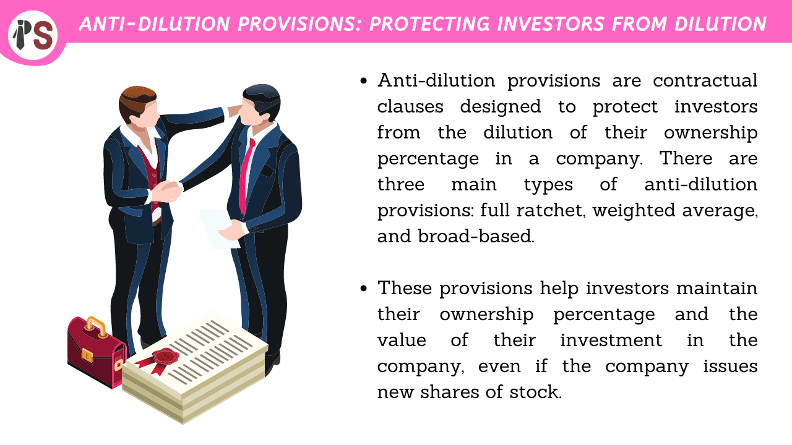

## Table of Contents

## What is an anti-dilution provision?

An anti-dilution provision is a clause in an investment agreement that protects investors from losing the value of their investment if a company issues more shares at a lower price than what the investors originally paid. This can happen when a company needs more money and decides to sell new shares at a cheaper price. The anti-dilution provision helps to keep the value of the original investors' shares higher, even when new shares are sold for less.

There are different types of anti-dilution provisions, but they all work to adjust the price that the original investors paid for their shares. This adjustment makes sure that the original investors get more shares for the same amount of money they initially invested, which helps to maintain their ownership percentage in the company. This is important because it prevents their stake in the company from being diluted, or reduced, when new shares are issued at a lower price.

## Why are anti-dilution provisions important in investments?

Anti-dilution provisions are important in investments because they protect investors from losing money if a company decides to sell more shares at a lower price later on. When someone invests in a company, they buy shares at a certain price. If the company then sells new shares for less money, the value of the original shares goes down. Anti-dilution provisions help keep the value of the original investment higher by giving the first investors more shares or adjusting the price they paid.

This protection is crucial because it keeps the investors' ownership percentage in the company from getting smaller, or "diluted." Without anti-dilution provisions, early investors might see their stake in the company shrink every time new shares are issued at a lower price. This could make them less likely to invest in the first place, which is why these provisions are important for attracting and keeping investors happy.

## What are the common types of anti-dilution provisions?

There are two main types of anti-dilution provisions: full ratchet and weighted average. Full ratchet is the simpler of the two. If a company sells new shares at a lower price, the full ratchet provision lets the original investors buy more shares at this new, lower price. This means their original investment is now worth the same as if they had bought the shares at the lower price from the start. Full ratchet can be very protective for investors, but it can also be tough on the company because it might have to give away a lot more shares.

Weighted average is a bit more complicated but fairer to both investors and the company. It adjusts the price the original investors paid based on how many new shares are sold and at what price. There are two kinds of weighted average provisions: broad-based and narrow-based. Broad-based looks at all the company's shares when calculating the new price, while narrow-based looks at fewer shares. This method doesn't change the original price as much as full ratchet, so it's less harsh on the company but still offers some protection to investors.

## How does a full ratchet anti-dilution provision work?

A full ratchet anti-dilution provision is a way to protect investors when a company sells new shares at a lower price than what the investors originally paid. Imagine you bought shares in a company for $10 each. Later, the company decides to sell new shares for $5 each. With a full ratchet provision, your original shares would be treated as if you had bought them for $5 too. This means you would get more shares for the money you already spent, so your investment stays worth the same as if you had bought at the lower price.

This kind of provision can be really good for investors because it keeps the value of their investment high. But it can be tough on the company. If the company has to give the original investors a lot more shares, it can end up giving away a bigger piece of the company than it planned. That's why full ratchet provisions are strong protection for investors, but they can be hard for the company to handle.

## How does a weighted average anti-dilution provision work?

A weighted average anti-dilution provision is a way to protect investors when a company sells new shares at a lower price. It's a bit more complicated than a full ratchet but tries to be fair to both the investors and the company. Instead of just changing the price the original investors paid to match the new, lower price, the weighted average method looks at how many new shares are being sold and at what price. It then adjusts the price the original investors paid based on this information. This means the original investors get a bit more shares, but not as many as they would with a full ratchet.

There are two types of weighted average provisions: broad-based and narrow-based. Broad-based looks at all the shares the company has when figuring out the new price for the original investors. Narrow-based looks at fewer shares, usually just the ones that can be affected by the new sale. Both methods try to find a middle ground so that the investors are protected, but the company doesn't have to give away too many shares. This makes it easier for the company to raise money without giving up too much ownership.

## What is the difference between broad-based and narrow-based weighted average anti-dilution?

Broad-based and narrow-based weighted average anti-dilution provisions both work to protect investors when a company sells new shares at a lower price, but they do it a bit differently. Broad-based looks at all the shares the company has when figuring out the new price for the original investors. This means it considers all the common stock, preferred stock, and sometimes even stock options and warrants. Because it takes into account a larger number of shares, the adjustment to the price the original investors paid is usually smaller. This makes it easier on the company because it doesn't have to give away as many new shares to the original investors.

Narrow-based, on the other hand, only looks at a smaller group of shares when calculating the new price. Usually, it only considers the shares that can be affected by the new sale, like the common stock and sometimes the preferred stock, but not options or warrants. Because it uses fewer shares in its calculation, the adjustment to the original price can be bigger than with broad-based. This means the original investors might get more shares, which can be tougher on the company. Both methods try to find a fair way to protect investors while letting the company raise money, but broad-based is generally seen as more favorable to the company, and narrow-based more favorable to the investors.

## Can you explain how anti-dilution provisions protect investors?

Anti-dilution provisions help keep the value of an investor's money safe when a company decides to sell more shares at a lower price. Imagine you bought shares in a company for $10 each. If the company later sells new shares for $5 each, the value of your shares would go down. But with an anti-dilution provision, the company adjusts the price you paid or gives you more shares. This means your investment stays worth the same as if you had bought the shares at the lower price from the start. It's like getting a discount after you've already paid, which keeps your investment strong.

There are different types of anti-dilution provisions, but they all work to protect investors in a similar way. Full ratchet is one type that gives you a big adjustment, making your shares worth the same as the new, lower price. Weighted average is another type that's a bit more fair to the company. It looks at how many new shares are sold and at what price, then adjusts your original price a little bit. This way, you still get some protection, but the company doesn't have to give away too many shares. Both methods help make sure your investment doesn't lose value when the company sells more shares at a lower price.

## What are the potential downsides of anti-dilution provisions for founders and existing shareholders?

Anti-dilution provisions can be tough on founders and existing shareholders. When a company has to give more shares to early investors because of these provisions, it means the founders and other shareholders end up owning a smaller piece of the company. This can be a big problem if the company needs to raise more money by selling shares at a lower price. The founders might see their control over the company shrink a lot, which can make it harder for them to make decisions and run the business the way they want.

Also, these provisions can make it harder for the company to attract new investors. If new investors know that the company has strong anti-dilution protections for early investors, they might be less willing to invest. They might worry that their shares will be worth less if the company has to give more shares to the early investors. This can make it harder for the company to raise the money it needs to grow and succeed.

## How are anti-dilution provisions typically structured in term sheets?

Anti-dilution provisions are usually written into the term sheet when someone is thinking about investing in a company. The term sheet is like a summary of the deal, and it says how the company will protect the investor's money if it sells more shares at a lower price later on. There are two main types of anti-dilution provisions that might be in the term sheet: full ratchet and weighted average. Full ratchet is simpler and gives the investor a big adjustment if the price drops, while weighted average is a bit more complicated but tries to be fair to both the investor and the company.

The term sheet will say which type of anti-dilution provision the company is using. If it's a weighted average provision, it will also say if it's broad-based or narrow-based. Broad-based looks at all the shares the company has when figuring out the new price, while narrow-based looks at fewer shares. This part of the term sheet is important because it tells the investor how much protection they will get and helps the company know how much of the business they might have to give away if they sell more shares at a lower price.

## What are some real-world examples of anti-dilution provisions in action?

When a tech startup named "TechGrow" raised money from investors at $5 per share, they promised anti-dilution protection. Later, the company needed more money and sold new shares at $3 each. Because of the full ratchet anti-dilution provision in their agreement, the original investors got more shares for the same money they paid before. This meant their investment was now worth the same as if they had bought shares at $3 each from the start. TechGrow had to give away more shares than they planned, which made the founders' ownership smaller.

Another example is "GreenEnergy," a company that used a weighted average anti-dilution provision. They sold shares to early investors at $10 each. When they sold new shares at $6, the weighted average method adjusted the price the early investors paid to something between $6 and $10. This meant the early investors got a few more shares, but not as many as they would have with a full ratchet. GreenEnergy found it easier to raise money this way because the impact on the company's ownership was less severe than with a full ratchet.

## How can companies negotiate anti-dilution provisions to balance investor and founder interests?

Companies can negotiate anti-dilution provisions to find a middle ground that works for both investors and founders. One way to do this is by choosing a weighted average anti-dilution method instead of a full ratchet. The weighted average method is usually fairer because it doesn't change the price the original investors paid as much. This means the company doesn't have to give away too many shares, which keeps the founders' ownership from shrinking too much. By using a broad-based weighted average, the company can make the impact even smaller, which can help keep everyone happy.

Another way to balance interests is by setting limits on when the anti-dilution provisions kick in. For example, the company and investors can agree that the provisions only apply if the new shares are sold at a price that's a lot lower than what the original investors paid. This can protect investors from big drops in value but still let the company raise money without too much trouble. By talking openly about what each side needs, companies and investors can find a deal that keeps the company strong and the investors feeling safe.

## What are the legal and regulatory considerations when implementing anti-dilution provisions?

When a company decides to use anti-dilution provisions, it has to think about the legal rules that might affect them. Different places have different laws about how companies can protect their investors. For example, some countries might have rules that say companies can't use certain types of anti-dilution provisions because they could be too tough on the company. Companies need to make sure they follow these rules, or they might get in trouble. They might also need to talk to a lawyer who knows about these laws to make sure they're doing everything right.

Another thing to think about is how these provisions are written in the legal agreements between the company and its investors. The agreements need to be clear and easy to understand so everyone knows what will happen if the company sells more shares at a lower price. Sometimes, the company and the investors might need to go back and change the agreement if the laws change or if they find a better way to protect everyone's interests. It's important to keep the agreements up to date and fair so the company can raise money and the investors feel safe.

## What are the types of anti-dilution provisions?

Anti-dilution provisions play a significant role in protecting investors' equity stakes when new shares are issued at prices lower than those paid by previous investors. These provisions can be classified into two principal types: full ratchet and weighted average. Understanding these provisions is crucial for investors looking to safeguard their investments against unfavorable market developments.

Full ratchet anti-dilution provisions offer the highest level of protection for investors. Under this mechanism, the conversion price of an investor’s shares is adjusted to equal the new, lower issuance price of the shares. For example, if an investor originally purchased shares at $10 each and the company subsequently issues new shares at $5, a full ratchet provision ensures that the initial investor’s shares are readjusted as if they, too, were acquired at $5. This adjustment can be particularly advantageous for early investors, as it maintains their percentage ownership in the company despite the new, lower-priced share issuance. However, this provision can lead to substantial dilution for common shareholders and may create challenges for the company during future fundraising rounds.

Weighted average anti-dilution provisions offer a more balanced approach compared to full ratchet provisions. Instead of fully adjusting the conversion price to the new issuance price, weighted average provisions consider a blend of the old and new share prices to determine the level of protection offered. The weighted average provision can be further categorized into broad-based and narrow-based approaches. 

The broad-based weighted average formula is typically expressed as follows:

$$
\text{New Conversion Price} = \left( \frac{(\text{Old Conversion Price} \times \text{Outstanding Shares}) + (\text{New Price} \times \text{New Shares})}{\text{Outstanding Shares} + \text{New Shares}} \right)
$$

In contrast, a narrow-based weighted average formula might consider a narrower scope of shares, often excluding certain categories of shares when calculating the adjusted conversion price.

The broad-based approach generally results in less dilution for existing shareholders and is perceived as more company-friendly, making it attractive to both the company and its potential investors. Weighted average provisions provide a moderate level of protection that balances the interests of investors with a company's growth objectives. 

Understanding these anti-dilution provision types enables investors to make informed decisions when negotiating investment agreements and fosters a symbiotic investment environment that can be beneficial to both investors and companies alike.

## What are Weighted Average Provisions?

Weighted average anti-dilution provisions are designed to provide a more balanced approach to protecting investor equity compared to full ratchet provisions. They adjust the conversion price of convertible securities based on an average calculation that factors in both existing and newly issued shares, consequently mitigating the dilution impact when new shares are sold at a price lower than what earlier investors paid.

These provisions come in two primary types: broad-based and narrow-based. The broad-based weighted average considers a larger pool of shares when recalculating the conversion price. It accounts for all outstanding common stock, including options and warrants, thereby offering a moderate level of protection to investors. This makes it less dilutive for common shareholders and is often preferred by companies that wish to attract further investment without alienating existing shareholders.

On the other hand, narrow-based calculations use a smaller pool of shares, typically excluding options and warrants. This narrower scope can result in a less favorable adjustment for common shareholders compared to broad-based adjustments, as it focuses on fewer shares, leading to a potentially higher conversion price for preferred shares. 

Mathematically, the adjusted conversion price (ACP) under the weighted average provision can be computed as follows:

$$
\text{ACP} = \left( \frac{(O \times OP) + (N \times NP)}{O + N} \right)
$$

Where:
- $O$ is the number of outstanding shares before the new issuance.
- $OP$ is the original conversion price.
- $N$ is the number of new shares issued.
- $NP$ is the new issuance price.

By applying this formula, companies can ensure equity adjustments that balance the interests of both new investors and existing shareholders. This method maintains investor protection while harmonizing with corporate growth strategies, making it an attractive option for companies looking to minimize shareholder conflicts. 

Emphasizing these characteristics, weighted average provisions are advantageous for companies aiming to maintain a stable shareholder base and optimizing their capital structure. They ensure a fair adjustment mechanism that protects investor interests without excessively burdening the company's financial structure, thus attracting new capital investments effectively.

## References & Further Reading

[1]: Bonnell, A. (2015). ["Understanding Anti-Dilution Provisions."](https://papers.ssrn.com/sol3/papers.cfm?abstract_id=702581) Goodwin.

[2]: Lu, Y. (2020). ["The Importance of Anti-Dilution Provisions for Startups and Investors."](https://hbr.org/2020/06/the-importance-of-anti-dilution-provisions-for-startups-and-investors) Harvard Business Review.

[3]: Cumming, D., & Johan, S. (2018). ["Anti-Dilution Provisions," in The Oxford Handbook of Venture Capital."](https://www.semanticscholar.org/paper/Venture-Capital-and-Private-Equity-Contracting%3A-An-Cumming-Johan/0d6b7ce7c21b5f8b071e2326fddf5a4fc229b942) Oxford University Press.

[4]: Gompers, P., & Lerner, J. (2004). ["The Venture Capital Cycle."](https://archive.org/details/venturecapitalcy0002gomp) MIT Press.

[5]: Sorkin, A. R. (2003). ["Anti-Dilution by the Numbers."](https://en.wikipedia.org/wiki/Michael_Sorkin) The New York Times.