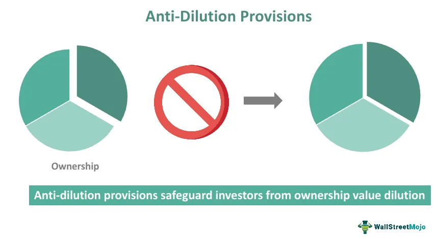

The world of investment is marked by its inherent risks and complexities, particularly when it involves equity and stock dilution. Stock dilution occurs when a company issues new shares, reducing the ownership proportion of existing shareholders. This can have significant consequences for investors, such as reduced earnings per share and a diminished voting power.

This article aims to elucidate the concept of anti-dilution equity protection and its critical role in safeguarding investments. Anti-dilution provisions are mechanisms designed to protect investors from the negative effects of dilution by adjusting the conversion or exercise price of convertible securities when new shares are issued at a lower price than previously issued ones. These provisions ensure that the value of an investor's holdings is preserved, even when the company's actions could effectuate dilution.



We will explore various types of anti-dilution provisions, focusing on their relevance for algorithmic trading investments. In algorithmic trading, where decisions are driven by predefined rules and mathematical models, understanding the intricacies of anti-dilution clauses becomes imperative. These provisions not only influence the valuation of investments but also impact the effectiveness of trading algorithms, which must account for potential equity adjustments.

Having a comprehensive understanding of anti-dilution provisions is essential for investors aiming to make informed decisions. By effectively leveraging these provisions, investors can protect their holdings from unfavorable market conditions and sustain their investment's value over time, thereby contributing to more robust investment strategies.

## Table of Contents

## Understanding Anti-Dilution Provisions

Anti-dilution provisions serve as a protective measure for investors, safeguarding them against the risk of equity dilution. This risk becomes a reality when a company issues new shares at a price lower than what existing investors initially paid, effectively diluting their ownership percentage and potentially reducing the value of their investment. These contractual clauses are integral to investment agreements, especially concerning convertible preferred stocks and certain stock options.

Convertible preferred stocks offer investors the right to convert their preferred shares into a predetermined number of common shares, typically at times beneficial to the investor. However, when new shares are issued at a lower price, the value of existing shares can decrease unless protection mechanisms are in place. Anti-dilution provisions address this issue by adjusting the conversion terms to maintain the investor’s initial economic position.

The basic principle behind anti-dilution provisions is to adjust the conversion price or the conversion ratio in reaction to future share issuances. This adjustment ensures that investors maintain the same level of equity percentage and economic value that they held before the dilution event. When structured into investment agreements, these provisions play a crucial role in maintaining investor confidence, particularly in early-stage companies that may require several funding rounds, often at varying share prices.

The occurrence of equity dilution can significantly impact shareholders if not properly managed. For instance, consider an initial investment where shares were valued at $10. If new shares are subsequently issued at $5, the market value of the original shares could decrease unless the investment agreement includes anti-dilution measures. By recalibrating the conversion terms, anti-dilution provisions aim to protect investors from such undesirable outcomes.

In summary, understanding anti-dilution provisions is essential for investors to preserve their equity stake in a company. These clauses are vital in protecting investments by ensuring that equity ownership percentage and value remain consistent, especially when new shares are issued at prices lower than the original investment.

## Types of Anti-Dilution Provisions

Anti-dilution provisions play a significant role in protecting investors' equity stakes when new shares are issued at prices lower than those paid by previous investors. These provisions can be classified into two principal types: full ratchet and weighted average. Understanding these provisions is crucial for investors looking to safeguard their investments against unfavorable market developments.

Full ratchet anti-dilution provisions offer the highest level of protection for investors. Under this mechanism, the conversion price of an investor’s shares is adjusted to equal the new, lower issuance price of the shares. For example, if an investor originally purchased shares at $10 each and the company subsequently issues new shares at $5, a full ratchet provision ensures that the initial investor’s shares are readjusted as if they, too, were acquired at $5. This adjustment can be particularly advantageous for early investors, as it maintains their percentage ownership in the company despite the new, lower-priced share issuance. However, this provision can lead to substantial dilution for common shareholders and may create challenges for the company during future fundraising rounds.

Weighted average anti-dilution provisions offer a more balanced approach compared to full ratchet provisions. Instead of fully adjusting the conversion price to the new issuance price, weighted average provisions consider a blend of the old and new share prices to determine the level of protection offered. The weighted average provision can be further categorized into broad-based and narrow-based approaches. 

The broad-based weighted average formula is typically expressed as follows:

$$
\text{New Conversion Price} = \left( \frac{(\text{Old Conversion Price} \times \text{Outstanding Shares}) + (\text{New Price} \times \text{New Shares})}{\text{Outstanding Shares} + \text{New Shares}} \right)
$$

In contrast, a narrow-based weighted average formula might consider a narrower scope of shares, often excluding certain categories of shares when calculating the adjusted conversion price.

The broad-based approach generally results in less dilution for existing shareholders and is perceived as more company-friendly, making it attractive to both the company and its potential investors. Weighted average provisions provide a moderate level of protection that balances the interests of investors with a company's growth objectives. 

Understanding these anti-dilution provision types enables investors to make informed decisions when negotiating investment agreements and fosters a symbiotic investment environment that can be beneficial to both investors and companies alike.

## Full Ratchet Provisions

Full ratchet anti-dilution provisions are a form of contractual protection ensuring that investors, particularly those holding convertible securities, are shielded when a company issues new shares at a price lower than the price they initially paid. These provisions adjust the conversion price of convertible securities to match the lower new issuance price, thereby preserving the economic value of early investments. This is particularly advantageous for early-stage investors who are keen to safeguard their ownership percentage in the company without incurring dilution from subsequent financing rounds at reduced valuations.

To illustrate, consider an investor who holds convertible preferred shares with an original conversion price of $10 per share. If the company later issues new shares at $5 per share, a full ratchet provision would reset the conversion price of the investor's shares to $5, thus allowing them to convert at a more favorable rate and maintain their relative equity interest. 

```python
# Python calculation for full ratchet anti-dilution adjustment

def new_conversion_price(original_price, new_issue_price):
    return new_issue_price

original_conversion_price = 10  # Original conversion price
new_issue_price = 5  # New issuance price

adjusted_conversion_price = new_conversion_price(original_conversion_price, new_issue_price)
print(f"The new conversion price is: ${adjusted_conversion_price}")
```

While offering significant protection to early investors, full ratchet provisions can lead to extensive dilution for common shareholders. This occurs because as the conversion price decreases, the number of shares required to maintain equivalency in value increases, effectively diluting the ownership percentage of existing common shareholders. Furthermore, such provisions can complicate future financing rounds by disincentivizing new investors who may perceive the mechanism as unfavorable, potentially affecting the company's ability to raise additional capital.

## Weighted Average Provisions

Weighted average anti-dilution provisions are designed to provide a more balanced approach to protecting investor equity compared to full ratchet provisions. They adjust the conversion price of convertible securities based on an average calculation that factors in both existing and newly issued shares, consequently mitigating the dilution impact when new shares are sold at a price lower than what earlier investors paid.

These provisions come in two primary types: broad-based and narrow-based. The broad-based weighted average considers a larger pool of shares when recalculating the conversion price. It accounts for all outstanding common stock, including options and warrants, thereby offering a moderate level of protection to investors. This makes it less dilutive for common shareholders and is often preferred by companies that wish to attract further investment without alienating existing shareholders.

On the other hand, narrow-based calculations use a smaller pool of shares, typically excluding options and warrants. This narrower scope can result in a less favorable adjustment for common shareholders compared to broad-based adjustments, as it focuses on fewer shares, leading to a potentially higher conversion price for preferred shares. 

Mathematically, the adjusted conversion price (ACP) under the weighted average provision can be computed as follows:

$$
\text{ACP} = \left( \frac{(O \times OP) + (N \times NP)}{O + N} \right)
$$

Where:
- $O$ is the number of outstanding shares before the new issuance.
- $OP$ is the original conversion price.
- $N$ is the number of new shares issued.
- $NP$ is the new issuance price.

By applying this formula, companies can ensure equity adjustments that balance the interests of both new investors and existing shareholders. This method maintains investor protection while harmonizing with corporate growth strategies, making it an attractive option for companies looking to minimize shareholder conflicts. 

Emphasizing these characteristics, weighted average provisions are advantageous for companies aiming to maintain a stable shareholder base and optimizing their capital structure. They ensure a fair adjustment mechanism that protects investor interests without excessively burdening the company's financial structure, thus attracting new capital investments effectively.

## Limitations of Anti-Dilution Provisions

Anti-dilution provisions, while offering a buffer against the dilution of equity stakes, bring along their own set of challenges, particularly in terms of complexity and potential disincentives for new investors. These complexities often arise from the legal and financial intricacies involved in recalibrating share values when new issuances occur at lower prices. The resultant adjustments can be intricate, requiring investors and stakeholders to navigate a labyrinth of contractual stipulations that might not always align with the company’s strategic objectives for growth and capital acquisition.

One significant issue associated with anti-dilution provisions is their potential to create discord among different investor groups. Early investors might favor stringent anti-dilution measures to maintain their percentage ownership and investment value, while newer investors could be deterred by perceived inequities or increased risk in their investment. This misalignment can complicate the capital-raising process, as potential contributors may hesitate if anti-dilution clauses skew the balance of benefits unfairly in favor of earlier stakeholders.

Moreover, these provisions can have a substantial impact on the valuation of a company. Anti-dilution clauses, especially those like full ratchet provisions, can artificially inflate shareholdings for certain investors without corresponding capital infusion, effectively distorting the company's perceived market value. Such distortions can be problematic not only in terms of valuation accuracy but also in attracting future investment, as savvy investors may be wary of companies with opaque or investor-unfriendly equity structures.

Understanding these limitations is essential for companies to effectively leverage anti-dilution measures while pursuing growth. It requires a careful consideration of how these clauses are structured to protect early investors without compromising the company’s ability to attract new capital and expand. Balancing protection with flexibility is key to aligning investor interests with the overarching goals of the company, ensuring an equitable environment that supports both sustainable growth and investor satisfaction.

## Implications for Algorithmic Trading

Understanding anti-dilution provisions is crucial for [algorithmic trading](/wiki/algorithmic-trading) systems as these provisions can significantly affect investment outcomes and decision-making processes embedded within trading algorithms. Anti-dilution measures typically adjust the conversion price of convertible securities when new equity is issued at a price lower than the original purchase price paid by investors. For algorithmic traders, this adjustment represents a crucial variable that must be accounted for within automated strategies to prevent mispricing and ensure accurate portfolio valuations.

Algorithmic trading systems rely on rapid data processing and precise execution strategies, often involving complex mathematical models and code. Therefore, accommodating the nuances of anti-dilution provisions requires integrating these contractual triggers into the algorithm's logic. For example:

1. **Equity Adjustments:** When an anti-dilution clause is triggered, the algorithm must swiftly update the share quantities and conversion prices in its database. This might involve recalculating the weightings of these securities within the portfolio and adjusting trading strategies accordingly.

2. **Code Implementation:** Here is a simple example of how one might implement an update to account for a "weighted average" anti-dilution provision in a Python-based algorithm:

    ```python
    def weighted_average_conversion(current_conversion_price, new_issue_price, old_shares, new_shares):
        total_shares = old_shares + new_shares
        new_conversion_price = ((old_shares * current_conversion_price) + (new_shares * new_issue_price)) / total_shares
        return new_conversion_price

    # Example usage
    old_conversion_price = 10.0  # original conversion price
    new_issue_price = 5.0        # new issue price
    old_shares = 10000           # number of old shares
    new_shares = 5000            # number of new shares

    adjusted_conversion_price = weighted_average_conversion(old_conversion_price, new_issue_price, old_shares, new_shares)
    print(f"Adjusted Conversion Price: {adjusted_conversion_price}")
    ```

3. **Trading Decision Adaptation:** Algorithms should be designed to factor in the possibility of equity dilution events as part of their risk management and decision-making process. This adaptation might involve dynamic reallocation of assets or recalibration of risk exposure levels upon triggering an anti-dilution event.

4. **Backtesting Models:** Algorithm developers must incorporate scenarios of equity dilution during backtesting to ensure historical data evaluations consider the effects of potential future anti-dilution occurrences. This comprehensive testing allows for a more robust algorithm that can handle real-world complexities.

5. **Real-time Monitoring:** The need for regular updates in algorithmic models is pronounced, requiring constant monitoring of corporate actions, such as new equity issuances, that could activate anti-dilution measures. Employing real-time data feeds and alerts into the algorithmic infrastructure can facilitate these updates.

In summary, integrating anti-dilution provisions into algorithmic trading systems ensures that traders can maintain accurate and effective automated strategies even in the face of complex equity market structuring. By accounting for these adjustments, traders mitigate the risk of unforeseen dilution impacting their investments and maintain robust, adaptive trading strategies.

## Conclusion

Anti-dilution equity protection is essential within investment agreements, designed to safeguard investors against the adverse effects of equity dilution. This is particularly significant in circumstances where new shares are issued at a price lower than what earlier investors paid, thus potentially reducing their proportional ownership and the value of their investment.

The two primary types of anti-dilution provisions, full ratchet and weighted average, offer different levels of protection, each with distinct advantages and disadvantages. Full ratchet provisions adjust the conversion price of a security to match the lower issuance price of new shares, providing maximum protection for early-stage investors. However, this benefit can come at a cost, as it may lead to significant dilution of common shareholders' stakes and complicate future financing rounds due to the potential impact on share value and distribution.

On the other hand, weighted average provisions present a more moderate form of protection by recalibrating the conversion price based on an average calculation that considers both old and new shares. This method, which can be implemented in broad-based or narrow-based variants, tends to be more favorable for companies and less damaging to the interests of existing common shareholders. Its balanced nature makes it a preferred option for many businesses looking to raise additional capital while maintaining a stable investor environment.

For investors and traders, especially those engaged in algorithmic trading, understanding these provisions is vital. Algorithmic strategies must account for potential changes in equity structure and pricing to make informed, adaptive trading decisions. By incorporating mechanisms to accommodate these contractual adjustments, algorithmic models can ensure more resilient and effective investment strategies.

Overall, anti-dilution provisions play a crucial role in managing investment risks and securing investor interests in a dynamic market environment. A clear understanding and careful consideration of these provisions are paramount to developing robust investment strategies and maintaining stable investor-company relationships.

## References & Further Reading

[1]: Bonnell, A. (2015). ["Understanding Anti-Dilution Provisions."](https://papers.ssrn.com/sol3/papers.cfm?abstract_id=702581) Goodwin.

[2]: Lu, Y. (2020). ["The Importance of Anti-Dilution Provisions for Startups and Investors."](https://hbr.org/2020/06/the-importance-of-anti-dilution-provisions-for-startups-and-investors) Harvard Business Review.

[3]: Cumming, D., & Johan, S. (2018). ["Anti-Dilution Provisions," in The Oxford Handbook of Venture Capital."](https://www.semanticscholar.org/paper/Venture-Capital-and-Private-Equity-Contracting%3A-An-Cumming-Johan/0d6b7ce7c21b5f8b071e2326fddf5a4fc229b942) Oxford University Press.

[4]: Gompers, P., & Lerner, J. (2004). ["The Venture Capital Cycle."](https://archive.org/details/venturecapitalcy0002gomp) MIT Press.

[5]: Sorkin, A. R. (2003). ["Anti-Dilution by the Numbers."](https://en.wikipedia.org/wiki/Michael_Sorkin) The New York Times.