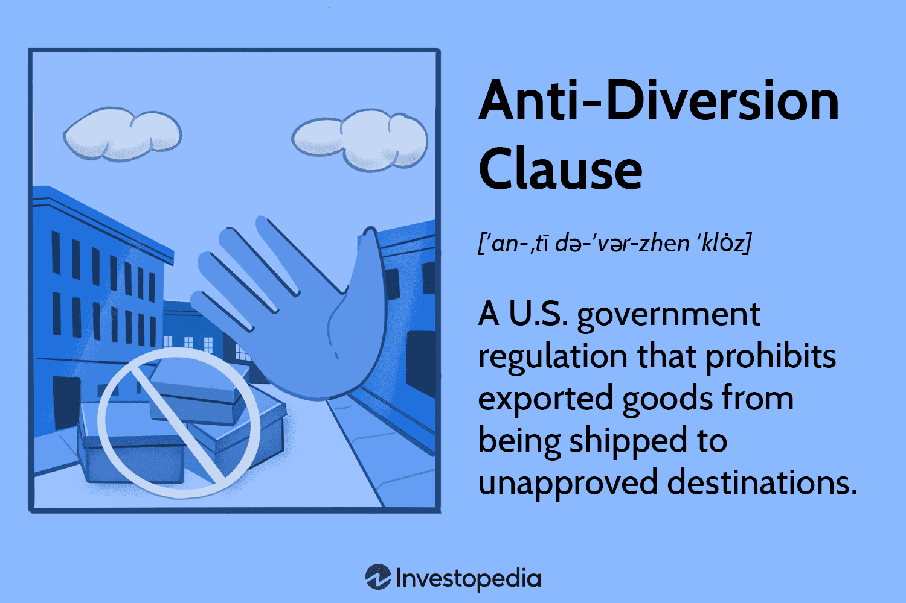

## Table of Contents

## What is an Anti-Diversion Clause?

An Anti-Diversion Clause is a part of a contract that stops a business from taking away customers or sales from another business. It is often used in agreements between a main company and its distributors or franchisees. The main goal is to make sure that the business partners work together fairly and do not compete against each other in a harmful way.

These clauses are important because they help keep a good relationship between the main company and its partners. They make sure that everyone follows the rules and works towards common goals. Without an Anti-Diversion Clause, a distributor might try to sell products directly to customers that the main company wants to keep for itself, which could hurt the business.

## Why is an Anti-Diversion Clause important in contracts?

An Anti-Diversion Clause is important in contracts because it helps keep business relationships fair and strong. When a main company works with distributors or franchisees, they want to make sure everyone is playing by the same rules. This clause stops the partners from taking customers or sales away from each other, which could hurt the business. It makes sure that everyone works together towards common goals without trying to compete in a harmful way.

Without an Anti-Diversion Clause, a distributor might try to sell products directly to customers that the main company wants to keep for itself. This could lead to less profit for the main company and could damage the trust between the company and its partners. By including this clause in contracts, businesses can protect their interests and maintain a healthy working relationship with their partners, ensuring that everyone benefits from the partnership.

## In which types of agreements is an Anti-Diversion Clause commonly used?

An Anti-Diversion Clause is often found in agreements between a main company and its distributors. This type of clause helps keep the business relationship fair by stopping the distributors from selling products directly to customers that the main company wants to keep for itself. It makes sure that the distributors do not take away sales from the main company, which could hurt the business.

This clause is also commonly used in franchise agreements. In these agreements, the franchisor, or the main company, wants to make sure that the franchisees, or the people running the franchise, do not compete against the main company in a harmful way. The Anti-Diversion Clause helps keep everyone working together towards common goals, making sure that the franchisees do not take away customers or sales from the franchisor.

## How does an Anti-Diversion Clause protect the interests of a company?

An Anti-Diversion Clause helps protect a company by stopping its partners, like distributors or franchisees, from taking away its customers or sales. If a distributor starts selling products directly to customers that the company wants to keep for itself, it could hurt the company's profits. The clause makes sure that the partners follow the rules and do not compete against the company in a harmful way.

By having this clause in contracts, the company can keep a good relationship with its partners. It makes sure that everyone works together towards the same goals, without trying to take away business from each other. This helps the company stay strong and successful, because it can trust that its partners will not do anything to hurt its business.

## What are the key components of an effective Anti-Diversion Clause?

An effective Anti-Diversion Clause needs clear rules about what partners can and cannot do. It should say that partners cannot sell products directly to customers that the main company wants to keep for itself. The clause should also explain what happens if a partner breaks the rules, like fines or ending the agreement. This makes sure everyone knows what is expected and what the consequences are for not following the rules.

The clause should be easy to understand so that all partners know what they can and cannot do. It should also be fair to everyone involved, making sure that the main company and its partners can work together without hurting each other's business. By including these key parts, an Anti-Diversion Clause helps keep the business relationship strong and protects the main company's interests.

## Can you provide an example of an Anti-Diversion Clause in a contract?

Here is an example of an Anti-Diversion Clause that could be used in a contract between a main company and its distributor: "The Distributor agrees not to sell the Company's products directly to customers that the Company has identified as its own. This includes any customer that the Company has a direct relationship with or has listed as a reserved customer in the agreement."

"If the Distributor breaks this rule, they will have to pay a fine of $10,000 for each time it happens. If the Distributor keeps breaking this rule after being warned, the Company can end the agreement with the Distributor. This clause is important to make sure that the Distributor and the Company work together fairly and do not take away each other's customers or sales."

## What are the potential consequences of breaching an Anti-Diversion Clause?

If a distributor or franchisee breaks an Anti-Diversion Clause, they might have to pay a fine. The fine can be a set amount of money for each time the rule is broken. This is to make sure that the partner thinks twice before doing something that hurts the main company's business.

Another consequence could be that the main company ends the agreement with the partner. If the partner keeps breaking the rule even after being warned, the company might decide to stop working with them. This is a big deal because it means the partner loses the chance to sell the company's products and make money from them.

These consequences help keep everyone following the rules. They make sure that the main company and its partners work together fairly and do not take away each other's customers or sales. By having clear consequences, the Anti-Diversion Clause protects the main company's interests and keeps the business relationship strong.

## How can companies monitor compliance with an Anti-Diversion Clause?

Companies can monitor compliance with an Anti-Diversion Clause by keeping an eye on where their products are being sold. They can use special software to track sales and see if any distributors are selling to customers that the company wants to keep for itself. This helps the company know if anyone is breaking the rules.

Another way is to have regular check-ins with distributors. The company can ask them about their sales and make sure they are not selling to the wrong customers. By talking to their partners often, the company can catch any problems early and make sure everyone is following the rules.

## Are there any legal challenges or limitations to enforcing an Anti-Diversion Clause?

Enforcing an Anti-Diversion Clause can sometimes be hard because of legal rules. Some countries have laws that limit how much control a company can have over its partners. For example, a company might not be able to stop a distributor from selling to certain customers if those sales are seen as fair competition. If a company tries to enforce the clause too strictly, it could be seen as breaking these laws, which might lead to legal problems.

Another challenge is proving that a partner broke the clause. The company needs to have clear evidence that the distributor or franchisee sold to the wrong customers. This can be hard to do, especially if the sales happen in secret. If the company cannot prove the breach, it might not be able to take action against the partner, like fining them or ending the agreement.

## How does the jurisdiction affect the enforceability of an Anti-Diversion Clause?

The place where a company and its partners do business can change how well an Anti-Diversion Clause works. Different countries have different laws about what companies can and cannot do. In some places, the laws might say that a company cannot control its partners too much. If the Anti-Diversion Clause tries to stop a distributor from selling to certain customers, it might not be allowed if those sales are seen as fair competition. This means the company might not be able to use the clause to punish the distributor.

Also, the rules about proving that someone broke the clause can be different in different places. A company needs to show clear proof that a distributor or franchisee sold to the wrong customers. If the laws in a certain place make it hard to get this proof, the company might not be able to enforce the clause. This is why it's important for companies to know the laws in the places where they do business and make sure their Anti-Diversion Clauses follow those laws.

## What strategies can be used to negotiate an Anti-Diversion Clause in a contract?

When negotiating an Anti-Diversion Clause in a contract, it's important to be clear about what you want. The main company should explain why the clause is needed and how it helps keep the business relationship fair. They should also listen to the distributor or franchisee and understand their concerns. If the partner feels that the clause is too strict, the company might agree to make it less strict. For example, they could allow the partner to sell to certain customers if they get permission first. This way, both sides can feel happy with the agreement.

Another strategy is to have a good understanding of the laws in the place where the business happens. The company should know what the laws allow and make sure the clause follows those laws. If the partner knows the laws too, they can talk about the clause in a smart way. They might ask for changes to the clause to make sure it is fair and legal. By working together and understanding each other's needs and the legal rules, both the company and its partner can agree on an Anti-Diversion Clause that works for everyone.

## How have courts interpreted Anti-Diversion Clauses in past legal disputes?

In past legal disputes, courts have looked at Anti-Diversion Clauses carefully. They want to make sure these clauses are fair and follow the law. Sometimes, courts have said that these clauses are okay if they are clear and do not stop fair competition. They understand that companies need to protect their business, but they also want to make sure that distributors or franchisees are not treated unfairly. If the clause is too strict and stops the partner from making a living, the court might not let the company use it to punish the partner.

In other cases, courts have decided that Anti-Diversion Clauses are not fair if they go against laws about competition. For example, if a clause stops a distributor from selling to certain customers in a way that hurts fair competition, the court might say it is not allowed. The court looks at how the clause affects both the company and its partners. They try to balance the need to protect the company's business with the rights of the distributor or franchisee to make money. This means that companies need to be careful when writing these clauses to make sure they follow the law and are fair to everyone involved.

## References & Further Reading

[1]: U.S. Department of Commerce, Bureau of Industry and Security. ["Export Administration Regulations (EAR)."](https://www.bis.gov/regulations)

[2]: U.S. Department of State, Directorate of Defense Trade Controls. ["International Traffic in Arms Regulations (ITAR)."](https://www.state.gov/bureaus-offices/under-secretary-for-arms-control-and-international-security-affairs/bureau-of-political-military-affairs/directorate-of-defense-trade-controls-pm-ddtc/)

[3]: Lopez de Prado, M. (2018). ["Advances in Financial Machine Learning."](https://www.amazon.com/Advances-Financial-Machine-Learning-Marcos/dp/1119482089) John Wiley & Sons.

[4]: Aronson, D. R. (2006). ["Evidence-Based Technical Analysis: Applying the Scientific Method and Statistical Inference to Trading Signals."](https://www.amazon.com/Evidence-Based-Technical-Analysis-Scientific-Statistical/dp/0470008741) John Wiley & Sons.

[5]: Chan, E. P. (2008). ["Quantitative Trading: How to Build Your Own Algorithmic Trading Business."](https://github.com/ftvision/quant_trading_echan_book) John Wiley & Sons.

[6]: Jansen, S. (2018). ["Machine Learning for Algorithmic Trading."](https://github.com/stefan-jansen/machine-learning-for-trading) Packt Publishing.

[7]: North American Free Trade Agreement (NAFTA). ["Text of the Agreement."](https://edit.wti.org/document/show/c2ba3603-add2-45b6-b339-634513583561)

[8]: World Trade Organization. ["Understanding the WTO: Basics."](https://www.wto.org/english/thewto_e/whatis_e/tif_e/fact4_e.htm?sid=jsw1lW)