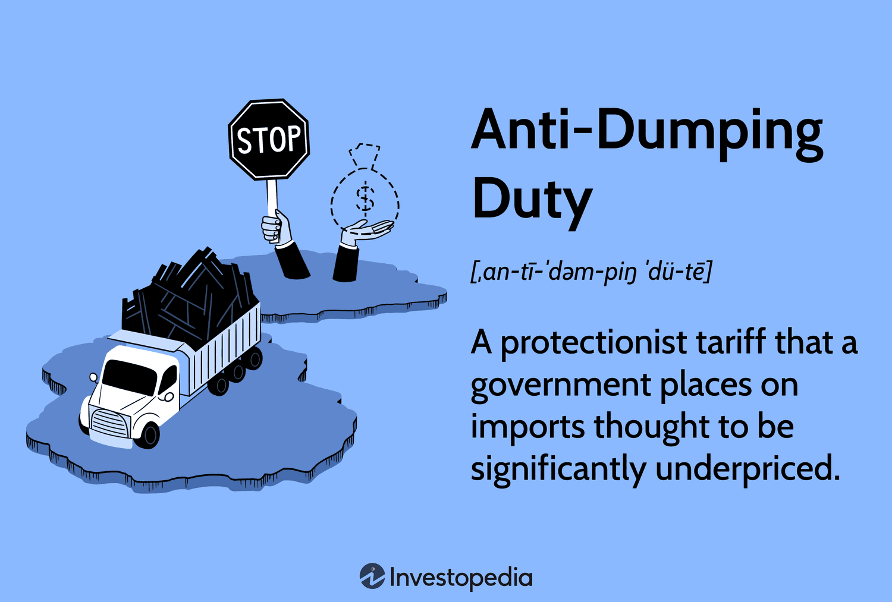

## Table of Contents

## What is an anti-dumping duty?

An anti-dumping duty is a special tax that a country puts on imported goods that are being sold at a very low price. This happens when companies from another country sell their products in a different country for less money than they sell them at home or less than it costs to make them. The purpose of this duty is to protect local businesses from being hurt by these cheap imports. It helps to make sure that local companies can still compete fairly in their own market.

Countries use anti-dumping duties to stop what is called "dumping." Dumping can harm local industries because it makes it hard for them to sell their own products at a fair price. When a country decides to use an anti-dumping duty, it usually follows a detailed investigation to make sure that the imported goods are actually being dumped and that this is causing harm to local businesses. If the investigation confirms these issues, the country can then set the duty to help level the playing field for its own companies.

## Why are anti-dumping duties imposed?

Anti-dumping duties are imposed to protect local businesses from unfair competition. When companies from other countries sell their products in a different country at a very low price, it's called dumping. This can hurt local companies because they can't compete with these cheap prices. The anti-dumping duty is like a special tax that makes the imported goods more expensive, so local companies have a better chance to sell their products.

Governments use anti-dumping duties to make sure that their own businesses can compete fairly. They do this by investigating if the imported goods are really being sold at unfairly low prices and if this is hurting local industries. If they find out that dumping is happening and it's causing problems, they can put the duty in place. This helps to keep the market fair for everyone.

## How does the mechanism of anti-dumping duty work?

The mechanism of an anti-dumping duty starts when a country thinks that companies from another country are selling their products too cheaply in their market. This is called dumping. The country then does a detailed investigation to check if the products are really being sold at a lower price than they should be and if this is hurting local businesses. They look at things like how much the product costs to make, how much it's being sold for in the home country, and how much it's being sold for in their country.

If the investigation shows that dumping is happening and it's causing harm, the country can decide to put an anti-dumping duty on the imported goods. This duty is like a special tax that makes the imported products more expensive. By doing this, the country tries to make the prices of the imported goods closer to what they should be, so local companies can compete more fairly. The duty stays in place until the situation changes or until it's no longer needed to protect local businesses.

## What are the steps involved in imposing an anti-dumping duty?

When a country thinks that companies from another country are selling their products too cheaply in their market, they start an investigation. This is called dumping. The country looks at how much the product costs to make, how much it's sold for in the home country, and how much it's sold for in their country. They also check if this low price is hurting local businesses. This investigation is very important because it helps the country decide if they need to do something about the dumping.

If the investigation shows that dumping is happening and it's causing harm, the country can put an anti-dumping duty on the imported goods. This duty is like a special tax that makes the imported products more expensive. By doing this, the country tries to make the prices of the imported goods closer to what they should be. This helps local companies compete more fairly. The duty stays in place until the situation changes or until it's no longer needed to protect local businesses.

## Who can file a complaint for anti-dumping?

A complaint for anti-dumping can be filed by local businesses that are being hurt by the cheap imported goods. These businesses might be companies that make the same kind of products as the ones being dumped. They feel that the low prices of the imports are making it hard for them to sell their own products.

The process starts when these local businesses go to their government and say that they think dumping is happening. The government then looks into it to see if the complaint is true. If they find out that the imports are really being sold too cheaply and this is hurting local businesses, they might decide to put an anti-dumping duty on those imports.

## What criteria must be met to prove dumping?

To prove dumping, a country needs to show that the imported goods are being sold at a lower price in their market than in the home market of the exporting country. This means they compare the price of the product in the country where it's made to the price it's sold for in the country where it's being imported. They also look at how much it costs to make the product. If the selling price in the importing country is less than the cost to make it, that's a sign of dumping.

The second thing they need to show is that this dumping is hurting local businesses. They check if the cheap imports are making it hard for local companies to sell their own products. This can mean lower sales, lost jobs, or even companies going out of business. If both of these things are true - the product is being sold too cheaply and it's causing harm - then the country can say that dumping is happening and they might put an anti-dumping duty on the imports.

## How is the dumping margin calculated?

The dumping margin is figured out by comparing the price of the product in the country where it's made to the price it's sold for in the country where it's being imported. This comparison helps to see if the product is being sold for less money in the importing country than it should be. The difference between these two prices is the dumping margin. If the product is sold for less in the importing country than in the home country, that difference is the margin.

To make this calculation, people look at how much the product costs to make and how much it's sold for in the home market. They then compare this to the price in the importing country. If the price in the importing country is lower than the cost to make it, or lower than the price in the home market, that's a sign of dumping. The dumping margin helps to decide how much of an anti-dumping duty should be put on the imports to make things fair for local businesses.

## What are the effects of anti-dumping duties on domestic industries?

Anti-dumping duties help domestic industries by making imported goods more expensive. When foreign companies sell their products at very low prices, it's hard for local companies to compete. The duties put a special tax on these imports, which raises their price. This makes it easier for local companies to sell their own products because they don't have to compete with such low prices from abroad. This can help local businesses keep their jobs and keep making money.

However, anti-dumping duties can also have some downsides for domestic industries. Sometimes, these duties can lead to higher prices for consumers because the imported goods become more expensive. This can make it harder for people to buy things. Also, if a country puts duties on imports, other countries might do the same thing back. This can hurt businesses that want to sell their products in other countries. So, while anti-dumping duties can protect local industries, they can also cause some problems.

## Can you provide examples of anti-dumping duties in different countries?

In the United States, the government has put anti-dumping duties on many things, like steel from different countries. For example, they found that some steel from South Korea was being sold too cheaply in the U.S. So, they put a duty on it to make it more expensive and help American steel companies compete better. This helps keep jobs in the U.S. and makes sure American companies can sell their steel without losing too much money.

In the European Union, they have also used anti-dumping duties. For instance, they put duties on solar panels from China because they thought the prices were too low and were hurting European solar companies. By making the Chinese solar panels more expensive, the EU wanted to give their own companies a better chance to sell their products. This was important for the EU because they wanted to support their own green energy businesses.

In India, anti-dumping duties have been used on things like chemicals and electronics. For example, they put duties on certain chemicals coming from China and the U.S. because they thought these were being sold too cheaply. This helped Indian chemical companies by making the imported chemicals more expensive, so they could sell their own products more easily. This shows how countries use these duties to protect their own businesses from unfair competition.

## What are the potential drawbacks of anti-dumping duties?

Anti-dumping duties can make things more expensive for people who buy things. When a country puts a special tax on imported goods, it makes those goods cost more. This means that people might have to pay more for things they need or want. For example, if there's a duty on imported steel, things made from steel, like cars or buildings, might cost more. This can be tough on people who don't have a lot of money to spend.

Another problem with anti-dumping duties is that they can cause other countries to do the same thing back. This is called retaliation. If one country puts a duty on another country's products, that country might get upset and put a duty on the first country's products. This can make it hard for businesses that want to sell their things in other countries. It can also make it harder for countries to work together and trade with each other, which is important for the world's economy.

## How do international trade agreements influence anti-dumping policies?

International trade agreements can change how countries use anti-dumping duties. These agreements are like rules that countries agree to follow when they trade with each other. Some of these rules say how countries should investigate dumping and when they can put duties on imports. For example, the World Trade Organization (WTO) has rules that countries have to follow when they want to use anti-dumping duties. These rules help make sure that countries don't use duties unfairly and that they give other countries a chance to explain their side of the story.

These agreements can also make it harder for countries to put anti-dumping duties in place. If a country doesn't follow the rules, other countries can complain to the WTO. The WTO can then look into the complaint and might tell the country to take the duty away. This makes countries think carefully before they put duties on imports because they don't want to break the rules and cause problems with other countries. So, international trade agreements help keep things fair and balanced in the world of trade.

## What are the current trends and future outlook for anti-dumping duties globally?

Right now, anti-dumping duties are still a big deal around the world. Many countries are using them to protect their own businesses from cheap imports. For example, the United States and the European Union have been putting duties on things like steel and solar panels. Also, countries like India and China are using these duties to help their own industries. The use of anti-dumping duties can change depending on what's happening in the world economy. If there's a lot of competition and prices are going down, more countries might start using these duties to help their businesses.

Looking ahead, the future of anti-dumping duties might depend on how countries work together on trade. If countries can agree on fair rules for trade, they might use fewer anti-dumping duties. But if there's a lot of tension and countries can't agree, we might see more duties being used. Also, as the world tries to deal with problems like climate change, there might be more focus on protecting green industries. This could mean more anti-dumping duties on things like solar panels and electric cars to help these industries grow. So, the use of anti-dumping duties could go up or down depending on how the world changes.

## What are Anti-Dumping Duties and How Can We Understand Them?

Anti-dumping duties are a critical component of international trade policy, employed by countries to address issues of unfair competition and market distortions. These duties are special tariffs imposed on foreign imports that are sold at prices lower than their normal value, often below the cost of production or the domestic market price of the exporting country. The intention behind these measures is to shield domestic industries from what is perceived as predatory pricing practices by foreign companies, which can harm local producers and lead to significant job losses.

Dumping occurs when manufacturers export a product to another country at a price lower than its usual domestic price, a practice that can flood the foreign market with cheaper goods. This can be especially detrimental to industries in the importing country, potentially causing economic damage, including the closure of businesses unable to compete with the low prices of dumped goods. To counter such negative impacts, countries resort to imposing anti-dumping duties.

The calculation of these duties involves determining the margin of dumping, which is the extent to which the export price is lower than the normal value. This can be expressed as:

$$
\text{Dumping Margin} = \frac{\text{Normal Value} - \text{Export Price}}{\text{Export Price}} \times 100
$$

Where:
- **Normal Value** is typically the price in the exporter's domestic market or the cost of production plus a reasonable profit margin.
- **Export Price** is the price at which the product is sold in the importing country.

For instance, if a product has a normal value of $100 but is sold abroad for $70, the dumping margin would be approximately 42.86%, signaling significant underpricing.

Anti-dumping duties are implemented following a comprehensive investigation by the importing country to substantiate the claims of dumping. This investigation typically examines evidence from relevant stakeholders, including domestic producers, and assesses the injury caused by the alleged dumping.

The imposition of these duties is aimed at leveling the playing field for domestic industries, ensuring that they can compete fairly without the disadvantage of artificially low-priced imports. This protection helps to maintain industrial capacity and preserve employment within the affected sectors.

While anti-dumping duties serve as a defensive mechanism for domestic economies, they can sometimes lead to trade disputes and are a subject of contention in international trade relations. The enforcement of these duties must adhere to the legal frameworks established by entities such as the World Trade Organization (WTO), which seeks to ensure fair application and to resolve disputes that may arise from their imposition. 

In conclusion, anti-dumping duties are designed to prevent unfair pricing tactics by foreign exporters, thereby supporting the stability and competitiveness of domestic industries in a globally connected market.

## What is the Role of the World Trade Organization (WTO)?

The World Trade Organization (WTO) plays a pivotal role in regulating the application of anti-dumping measures through its Anti-Dumping Agreement. This agreement outlines the legal framework that WTO member countries must adhere to when imposing anti-dumping duties, ensuring that such measures are applied both lawfully and fairly. The agreement’s primary focus is to maintain transparency during the investigation procedures, allowing all interested parties, including foreign exporters and domestic producers, to present evidence and defend their interests.

The WTO's framework requires that any anti-dumping investigation must follow strict guidelines to ascertain whether dumping is occurring. Dumping is defined as selling a product in an import market at a price lower than its normal value, usually the domestic market price of the exporting country. If dumping is confirmed and it causes harm to the domestic industry of the importing country, anti-dumping duties may be imposed corresponding to the margin of dumping. This margin is calculated as:

$$
\text{Margin of Dumping} = \text{Normal Value} - \text{Export Price}
$$

Moreover, the WTO provides a robust dispute resolution mechanism designed to address disagreements that may arise from the application of anti-dumping actions. Member states that believe anti-dumping measures have been unjustly applied can bring their case before the WTO’s Dispute Settlement Body (DSB). The DSB has the authority to adjudicate these disputes and ensure compliance with WTO rules, potentially authorizing retaliation or recommending remedies if a violation is found.

This structure not only facilitates the fair use of anti-dumping measures but also fosters trust and cooperation between member countries by providing a legal avenue to resolve trade disputes. As such, the WTO’s Anti-Dumping Agreement is a crucial component of modern global trade governance, striving to balance the protection of domestic industries with the promotion of free and fair international trade.

## References & Further Reading

[1]: Irwin, D. A. (2002). ["Free Trade Under Fire."](https://archive.org/details/freetradeunderfi00irwi_1) Princeton University Press. 

[2]: Krugman, P. R., & Obstfeld, M. (2006). ["International Economics: Theory and Policy."](https://archive.org/details/internationaleco0008krug) Pearson Education.

[3]: Francois, J., & Roland-Holst, D. (1997). [“Trade Policy, Risk, and the Role of International Financial Markets.”](https://searchworks.stanford.edu/view/5080083) The American Economic Review, 87(4), 690-707.

[4]: Bown, C. P. (2011). ["Taking Stock of Antidumping, Safeguards and Countervailing Duties,"](https://onlinelibrary.wiley.com/doi/full/10.1111/j.1467-9701.2011.01388.x) National Bureau of Economic Research, Working Paper No. 16992. 

[5]: Vaitsos, C. V. (1976). ["Intercountry Income Distribution and Transnational Enterprises."](https://www.journals.uchicago.edu/doi/abs/10.1086/450907) Clarendon Press.