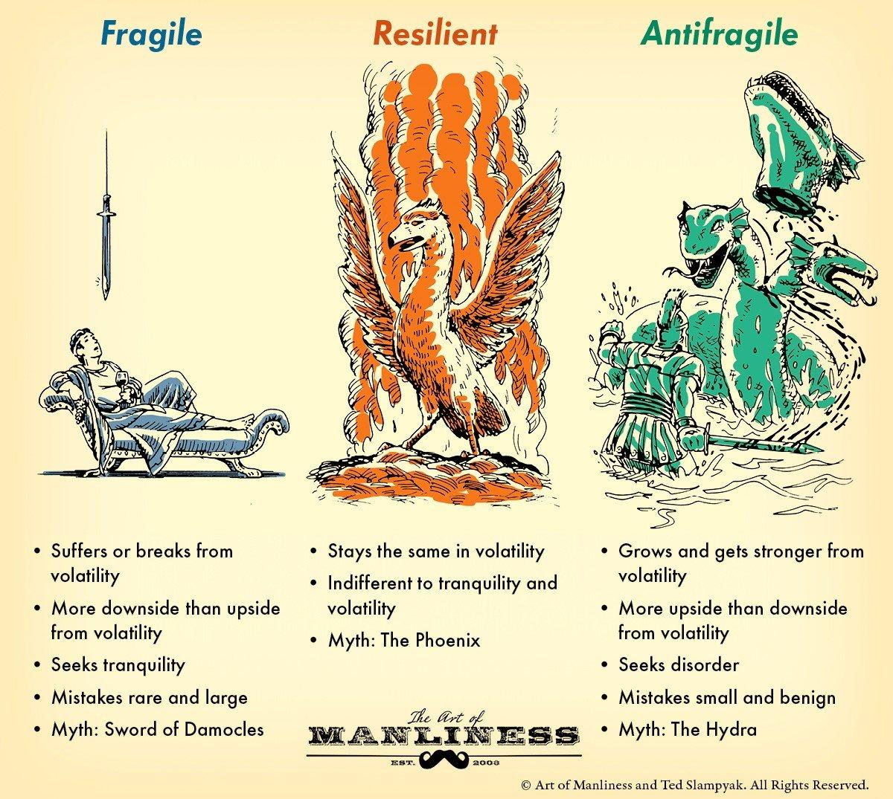

## Table of Contents

## What is anti-fragility?

Anti-fragility is a concept that means something becomes stronger when it faces challenges or stress. It's the opposite of being fragile, where things break easily. Imagine a piece of glass that shatters when dropped. That's fragile. Now think of a muscle that gets stronger when you exercise it. That's anti-fragile. The idea was introduced by Nassim Nicholas Taleb in his book "Antifragile: Things That Gain from Disorder."

In everyday life, anti-fragility can be seen in many places. For example, our immune system becomes stronger when it fights off germs. Businesses can also become anti-fragile if they learn and grow from tough situations, like economic downturns. The key is to not just survive challenges but to use them as opportunities to improve and become better than before.

## How does anti-fragility differ from resilience and robustness?

Anti-fragility, resilience, and robustness are all about handling tough situations, but they work in different ways. Resilience means bouncing back to normal after a challenge. Think of a rubber ball that gets squished but then pops back to its original shape. It doesn't get better from the squishing, it just returns to how it was. Robustness is about being strong and not getting damaged easily. A heavy-duty truck is robust because it can handle rough roads without breaking down, but it doesn't improve from the rough ride.

Anti-fragility goes a step further. It's not just about surviving or staying the same; it's about getting better because of the challenge. Like a muscle that grows stronger with exercise, an anti-fragile system thrives on stress and disorder. While a resilient system returns to its original state and a robust system stays strong, an anti-fragile system actually improves and becomes more capable after facing difficulties.

## Who coined the term 'anti-fragility' and in what context?

The term 'anti-fragility' was coined by Nassim Nicholas Taleb. He introduced this idea in his book called "Antifragile: Things That Gain from Disorder," which he published in 2012. Taleb is a thinker and writer who likes to study how things like businesses, people, and systems handle uncertainty and chaos.

In his book, Taleb talks about how some things don't just survive challenges, they actually get better because of them. He uses the term 'anti-fragile' to describe these things. For example, our bodies can become stronger when they face germs, and some businesses can grow after facing tough times. Taleb's idea has become popular because it helps us understand how to not just survive, but thrive in a world full of surprises and changes.

## Can you provide examples of anti-fragile systems in nature?

In nature, the immune system is a great example of an anti-fragile system. When our bodies are exposed to germs and viruses, our immune system fights them off. Each time it does this, it learns and gets better at fighting those germs in the future. This makes us healthier and more resistant to diseases over time. Just like a muscle that grows stronger with exercise, our immune system becomes more powerful with each challenge it faces.

Another example is how forests recover after a fire. While a fire can destroy a lot of trees and plants, it also clears out the old and weak ones. This makes room for new growth. The soil gets more nutrients from the ashes, and new, stronger plants can grow. Over time, the forest can become even healthier and more diverse than it was before the fire. This shows how nature can use tough situations to become better and stronger.

## How can anti-fragility be applied in personal life?

In personal life, anti-fragility can be applied by seeing challenges as chances to grow and get better. Instead of being scared of tough situations, like losing a job or facing a health problem, you can use them to learn new skills or find new ways to solve problems. For example, if you lose your job, you might decide to learn a new skill or start your own business. This way, you not only recover from the setback but also come out stronger and more prepared for the future.

Another way to apply anti-fragility in your life is by trying new things and stepping out of your comfort zone. When you do things that are a bit scary or hard, like traveling to a new country or taking up a challenging hobby, you learn a lot about yourself and the world. These experiences help you grow and become more adaptable. Over time, you'll find that you're better at handling whatever life throws at you, because you've trained yourself to see every challenge as an opportunity to improve.

## What are the key principles of building an anti-fragile organization?

To build an anti-fragile organization, it's important to embrace change and uncertainty. This means not being afraid of challenges or unexpected events. Instead of trying to avoid or control everything, an anti-fragile organization sees tough situations as chances to learn and grow. For example, if a business faces a problem like a drop in sales, instead of just trying to fix it, they might use it as a chance to try new ideas or change how they work. By being open to change and experimenting, the organization can become stronger and better at handling future problems.

Another key principle is to build flexibility and adaptability into the organization. This means having systems and processes that can change and adjust easily. For instance, instead of having strict rules and plans, an anti-fragile organization might use general guidelines that allow people to make decisions based on what's happening right now. This way, when something unexpected happens, the organization can quickly adapt and find new ways to keep going. By encouraging creativity and problem-solving among its people, the organization can turn challenges into opportunities and keep improving over time.

## How does anti-fragility relate to risk management?

Anti-fragility and risk management are closely connected. In traditional risk management, the goal is often to avoid or minimize risks. This means trying to keep things safe and stable by planning for every possible problem and trying to prevent them from happening. But anti-fragility takes a different approach. Instead of just trying to avoid risks, an anti-fragile approach sees risks as chances to learn and grow. It's about building systems that can not only handle risks but actually get better because of them.

For example, in a business, instead of just trying to avoid all risks, an anti-fragile approach might involve taking calculated risks to try new ideas or enter new markets. If these risks lead to failures, the business learns from them and becomes stronger. This way, the organization doesn't just survive challenges; it uses them to improve and become more capable of handling future risks. By embracing risks and using them as opportunities for growth, an anti-fragile approach can make risk management more effective and help the organization thrive in an uncertain world.

## What are the economic implications of anti-fragility?

Anti-fragility can have big effects on the economy. It means that businesses and markets can do more than just survive tough times; they can actually get better because of them. For example, when there's an economic downturn, some businesses might fail, but others can learn from it and find new ways to grow. This makes the whole economy stronger over time. Instead of always trying to avoid risks, an anti-fragile economy sees them as chances to improve and innovate. This can lead to more jobs and new industries that make the economy more stable and able to handle future challenges.

Another way anti-fragility impacts the economy is by encouraging businesses to be more flexible and ready to change. In an anti-fragile economy, companies are not afraid to try new things and adapt quickly. This helps them to respond better to changes in the market or new technology. When businesses are more adaptable, the whole economy becomes better at dealing with surprises and changes. This can make the economy more dynamic and able to grow, even when things are uncertain. Overall, anti-fragility helps create an economy that's not just about avoiding problems but using them to become stronger and more successful.

## How can anti-fragility be measured or quantified?

Measuring anti-fragility can be tricky because it's not like measuring something easy like weight or height. It's more about looking at how well something can handle and grow from tough situations. One way to measure it is by looking at how a system or person reacts to stress over time. For example, in a business, you could look at how well it bounces back from a crisis like a big drop in sales. If the business not only recovers but also finds new ways to make money and grows stronger, that shows it's anti-fragile.

Another way to measure anti-fragility is by seeing how much a system changes and improves when it faces challenges. This can be done by comparing how things were before and after a tough situation. For instance, if a person's immune system fights off a new illness and then becomes better at fighting it in the future, that's a sign of anti-fragility. By keeping track of these changes and improvements, you can get a sense of how anti-fragile something is. It's all about seeing if challenges make things better, not just different.

## What are the criticisms or limitations of the concept of anti-fragility?

One criticism of anti-fragility is that it's hard to measure and prove. It's easy to see when something breaks, but it's tougher to show that something is getting better from stress. People argue that it's too vague and depends a lot on what you think "better" means. Also, not all stress or chaos is good. Sometimes, too much stress can harm things, not help them. So, figuring out the right amount of stress to make something anti-fragile can be tricky.

Another limitation is that anti-fragility might not work for everything. Some things, like a glass cup, can't become stronger from being dropped. They just break. And in real life, not everyone or every system can turn challenges into growth. Some people might get overwhelmed by stress and never recover. Critics say that expecting everything to be anti-fragile can be unrealistic and might ignore the real limits and needs of different systems and people.

## How does anti-fragility influence innovation and technology development?

Anti-fragility plays a big role in innovation and technology development. When companies and people work on new ideas and technologies, they often face challenges and failures. An anti-fragile approach means seeing these challenges not as problems but as chances to learn and get better. For example, if a new tech product doesn't work at first, instead of giving up, the team might use what they learned to make the next version even better. This way, each failure helps the technology grow stronger and more innovative over time.

In the world of technology, being anti-fragile means being open to trying new things and not being scared of making mistakes. This can lead to big breakthroughs. Companies that embrace anti-fragility are more likely to keep experimenting and pushing the limits of what's possible. They don't just try to avoid risks; they see them as opportunities to create new and better technologies. This mindset can drive innovation and help develop technologies that are more advanced and able to handle future challenges.

## What are advanced strategies for implementing anti-fragility in complex systems?

In complex systems, one advanced strategy for implementing anti-fragility is to encourage diversity and decentralization. Instead of having one big plan that everyone follows, a complex system can be made up of many smaller parts that can work on their own. This way, if one part faces a problem, the other parts can keep going and even help fix the problem. By having different ways of doing things and letting different parts of the system try new ideas, the whole system can learn and grow from challenges. This makes it more likely that the system will not just survive tough times but come out stronger.

Another strategy is to build in feedback loops and continuous learning. In a complex system, it's important to always be looking at what's happening and learning from it. This means setting up ways to get information about how things are going and using that information to make changes. For example, if a part of the system is struggling, the system can use feedback to find out why and then try different solutions. By always learning and adjusting, the system can keep improving and becoming more anti-fragile over time. This approach helps the system to not just react to problems but to use them as opportunities to get better.

## How can we combine risk management, resilience, and antifragility?

Integrating risk management, resilience, and antifragility in algorithmic trading establishes a comprehensive framework for navigating the complexities of financial markets. Each component contributes uniquely to creating a system that not only withstands market volatility but also capitalizes on it.

Risk management remains foundational by enforcing strict controls to mitigate potential losses. Techniques such as stop-loss orders, diversification, and position sizing are standard practices. A stop-loss order, for example, automatically closes a position at a predetermined price level[1]. This prevents excessive losses when markets move unexpectedly against a trader's position. In mathematical terms, a trader might define a stop-loss level as:

$$
\text{Stop-Loss Price} = \text{Entry Price} \times (1 - \text{Stop-Loss Percentage})
$$

Complementing risk management, resilience focuses on the system's ability to adapt and recover from market shocks. Regular monitoring and analysis of market trends and economic indicators allow traders to adjust their strategies in a timely manner. Resilience ensures the system's continuity and efficiency when faced with adverse conditions, providing a buffer while allowing opportunities for recalibration.

Antifragility introduces a dynamic dimension to this framework. Where traditional resilience seeks stability, antifragility thrives on disorder and stress. In algorithmic trading, antifragile strategies might use elements like volatility positioning—where strategies benefit from increasing market turbulence. For instance, the barbell strategy—investing heavily in safe assets while taking smaller, high-risk bets—magnifies gains during volatile periods. Such strategies rely on statistical techniques, including options pricing models that evaluate the premium of high volatility.

Combining these concepts empowers algo traders to construct systems that do more than just defend against losses. They create opportunities for growth by leveraging market volatility to their advantage. A well-balanced algo trading framework incorporates:

1. Risk controls that limit exposure and prevent disproportionate losses.
2. Resilient strategies that ensure consistent operational performance and responsive adaptability.
3. Antifragile tactics that turn market volatility into profitable opportunities, enhancing overall system performance.

By employing this holistic approach, traders not only protect capital but also exploit unexpected market movements for potential gains. This integration ensures that trading strategies not only survive but thrive in ever-changing market conditions, making them robust against a spectrum of risks and opportunities.

---
[1] Kaminski, K. M. (2014). "The trend-following strategy: a simple portfolio strategy." *Journal of Portfolio Management*.

## References & Further Reading

[1]: Taleb, N. N. (2012). ["Antifragile: Things That Gain from Disorder."](https://en.wikipedia.org/wiki/Antifragile_(book)) Random House.

[2]: Kaminski, K. M. (2014). "The trend-following strategy: a simple portfolio strategy." *Journal of Portfolio Management*.

[3]: Lopez de Prado, M. (2018). ["Advances in Financial Machine Learning."](https://www.amazon.com/Advances-Financial-Machine-Learning-Marcos/dp/1119482089) Wiley.

[4]: Aronson, D. R. (2007). ["Evidence-Based Technical Analysis: Applying the Scientific Method and Statistical Inference to Trading Signals."](https://www.amazon.com/Evidence-Based-Technical-Analysis-Scientific-Statistical/dp/0470008741) Wiley.

[5]: Chan, E. P. (2008). ["Quantitative Trading: How to Build Your Own Algorithmic Trading Business."](https://github.com/ftvision/quant_trading_echan_book) Wiley.