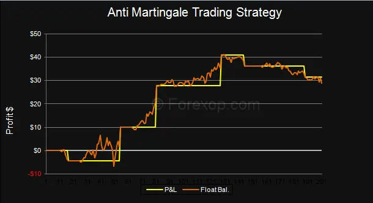

## Table of Contents

## What is the Anti-Martingale system?

The Anti-Martingale system, also known as the Reverse Martingale or Paroli system, is a betting strategy used in gambling, particularly in games like roulette and blackjack. Instead of increasing bets after a loss like the traditional Martingale system, the Anti-Martingale system suggests that you should increase your bet after a win. The idea is to take advantage of winning streaks by betting more when you are winning, and betting less or the same amount when you lose.

This system is based on the belief that winnings will come in streaks, and by increasing bets during these streaks, you can maximize your profits. For example, if you win a bet, you double your next bet. If you lose, you go back to your original bet amount. While this strategy can lead to significant gains during a winning streak, it also carries the risk of losing all your accumulated winnings if the streak ends suddenly. It's important to set strict limits and know when to stop to manage the risks involved.

## How does the Anti-Martingale system differ from the Martingale system?

The Anti-Martingale system and the Martingale system are two different betting strategies used in gambling. The main difference is how they handle wins and losses. In the Martingale system, if you lose a bet, you double your next bet to try to recover your losses. If you win, you go back to your original bet amount. The idea is to keep betting until you win and make up for all your previous losses.

On the other hand, the Anti-Martingale system does the opposite. If you win a bet, you double your next bet to try to take advantage of a winning streak. If you lose, you go back to your original bet amount. The goal is to increase your bets during a winning streak to maximize your profits. Both systems have their risks and can lead to big wins or big losses, depending on how the bets go.

## What are the basic principles of the Anti-Martingale system?

The Anti-Martingale system is a betting strategy where you increase your bet after you win. The idea is to take advantage of winning streaks. If you win a bet, you double your next bet. This way, if you keep winning, you can win more money. If you lose, you go back to betting the same amount you started with. The goal is to make more money during a winning streak.

This system is the opposite of the Martingale system. In the Martingale system, you double your bet after you lose, trying to win back what you lost. But in the Anti-Martingale system, you only increase your bet when you win. This can be risky because if you lose after increasing your bet, you could lose all the money you won. It's important to set limits on how much you bet and know when to stop to avoid losing too much.

## In which types of games or investments is the Anti-Martingale system typically used?

The Anti-Martingale system is often used in games where you bet on things that can go up or down, like roulette or blackjack. In these games, you might bet on red or black in roulette, or whether the next card will be higher or lower in blackjack. If you win, you double your next bet, hoping to win more money while you're on a winning streak. But if you lose, you go back to your original bet. This way, you try to make the most money when you're winning.

This betting strategy can also be used in some types of investments, like trading stocks or cryptocurrencies. If the price of a stock or [cryptocurrency](/wiki/cryptocurrency) goes up, you might buy more of it, hoping it will keep going up so you can make more money. But if the price goes down, you might sell some of it and go back to your original amount. It's important to be careful with this strategy because the market can change quickly, and you could lose money if you're not careful.

## What are the potential benefits of using the Anti-Martingale system?

The Anti-Martingale system can help you make more money when you are winning. If you keep winning, you can double your bets and win even more. This means you can take advantage of a winning streak and make bigger profits. It's a good strategy if you believe that wins come in streaks, because it lets you bet more when you're doing well.

However, using the Anti-Martingale system can also be risky. If you lose after you've been winning and increasing your bets, you could lose all the money you won. It's important to set limits on how much you bet and know when to stop. This way, you can avoid losing too much money if your luck changes.

## What are the risks associated with the Anti-Martingale system?

The Anti-Martingale system can be risky because it relies on winning streaks. If you lose after you've been winning and increasing your bets, you could lose all the money you won. This means that even though you might make more money when you're winning, a sudden loss can wipe out all your gains. It's like climbing a ladder and then falling off right at the top.

Another risk is that you might get too confident during a winning streak and keep betting more and more. This can lead to bigger losses if you don't stop in time. It's important to set strict limits on how much you bet and know when to walk away. Without these limits, you could end up losing more money than you planned.

## How do you implement the Anti-Martingale system in a practical setting?

To use the Anti-Martingale system in a practical setting, you start by deciding on an initial bet amount. Let's say you choose to bet $10. If you win that bet, you double your next bet to $20. If you win again, you double it to $40, and so on. But if you lose at any point, you go back to your original bet of $10. This way, you try to make more money when you're on a winning streak.

For example, imagine you're playing roulette and betting on red. You start with a $10 bet and win. Your next bet is $20 on red, and you win again. Now you bet $40 on red and win once more. You're up to $80 on your next bet. But if you lose this bet, you go back to betting $10. It's important to set a limit on how much you're willing to bet and know when to stop. This helps you avoid losing all your winnings if your luck changes.

## Can you provide a simple example of the Anti-Martingale system in action?

Let's say you're at a casino playing roulette. You decide to start with a $10 bet on red. You win, so for your next bet, you double your money and bet $20 on red. You win again, so you bet $40 on red this time. You win once more, and now you bet $80 on red. But this time, you lose. Since you lost, you go back to betting $10 on your next bet.

In this example, you started with a $10 bet and won three times in a row. Your winnings added up quickly because you doubled your bet each time you won. But when you lost on the $80 bet, you went back to your original $10 bet. This way, you tried to make the most money during your winning streak, but you didn't lose too much when you finally lost a bet.

## What advanced strategies can be used to optimize the Anti-Martingale system?

One way to make the Anti-Martingale system better is by setting clear limits on how much you bet. Decide on a maximum bet amount before you start, and stick to it. This helps you avoid losing all your winnings if you hit a losing streak. You can also set a goal for how much you want to win. Once you reach that goal, stop betting. This way, you can walk away with your winnings instead of risking them on more bets.

Another strategy is to use the Anti-Martingale system with a stop-loss. This means deciding on a certain amount of money you're okay with losing. If you reach that amount, you stop betting. This helps you control how much you might lose. You can also mix the Anti-Martingale system with other betting strategies. For example, you might use it for part of your bets and another system for the rest. This can spread out your risk and help you make more informed bets.

## How does the Anti-Martingale system perform over the long term compared to other betting systems?

The Anti-Martingale system can be exciting to use because it helps you make more money when you're winning. But over the long term, it's hard to say if it's better than other betting systems. That's because all betting systems depend a lot on luck. The Anti-Martingale system might help you win big during a winning streak, but it can also lead to big losses if you lose after betting a lot. So, over time, it might not be any better than other systems like the Martingale or just betting the same amount each time.

In the long run, the house always has an edge in casino games. This means that no matter what betting system you use, you're likely to lose money over time. The Anti-Martingale system, like any other betting system, can't change the odds of the game. It's just a way to manage your bets. So, while it might feel good to use the Anti-Martingale system during a winning streak, it won't make you win more money in the long run compared to other systems. It's important to set limits and know when to stop betting to avoid losing too much.

## What statistical models or theories support the use of the Anti-Martingale system?

The Anti-Martingale system is based on the idea that wins and losses in gambling can happen in streaks. This idea comes from the concept of clustering, where events that are supposed to be random might happen in groups. Some people think that if you win a few times in a row, you're more likely to keep winning. So, the Anti-Martingale system tries to take advantage of these winning streaks by betting more when you win.

However, there isn't strong statistical evidence that supports the use of the Anti-Martingale system over the long term. In games like roulette or blackjack, each bet is independent, meaning past results don't affect future ones. This is known as the gambler's fallacy. Even though the Anti-Martingale system can help you win more during a winning streak, it doesn't change the odds of the game. Over time, the house edge means you're likely to lose money no matter what betting system you use.

## Are there any notable case studies or real-world applications of the Anti-Martingale system?

The Anti-Martingale system has been used in real casinos and by gamblers looking to take advantage of winning streaks. One famous example is the story of a man named Ashley Revell, who in 2004 sold all his possessions and bet everything he had on a single spin of the roulette wheel in Las Vegas. He bet on red and won, doubling his money from $135,300 to $270,600. While this isn't a direct use of the Anti-Martingale system, it shows the excitement and potential of betting more after a win, which is the core idea of the system.

In trading and investment, some people use a version of the Anti-Martingale system to try to make more money during market upswings. For example, a trader might buy more of a stock when its price goes up, hoping to sell it at a higher price later. This strategy can lead to big gains if the market keeps going up, but it can also result in big losses if the market suddenly drops. While there aren't specific case studies on the Anti-Martingale system in trading, the idea of increasing bets or investments during winning periods is a common approach among some traders.

## References & Further Reading

[1]: ["The Mathematics of Gambling"](https://www.amazon.com/Mathematics-Gambling-Edward-Thorp/dp/0897460197) by Edward O. Thorp

[2]: ["Algorithmic Trading: Winning Strategies and Their Rationale"](https://www.wiley.com/en-us/Algorithmic+Trading%3A+Winning+Strategies+and+Their+Rationale-p-9781118746912) by Ernie Chan

[3]: ["Fortune's Formula: The Untold Story of the Scientific Betting System that Beat the Casinos and Wall Street"](https://www.amazon.com/Fortunes-Formula-Scientific-Betting-Casinos/dp/0809045990) by William Poundstone

[4]: ["A Demon of Our Own Design: Markets, Hedge Funds, and the Perils of Financial Innovation"](https://www.amazon.com/Demon-Our-Own-Design-Innovation/dp/0470393750) by Richard Bookstaber

[5]: [Kelly, J. L. (1956). A New Interpretation of Information Rate.](https://www.princeton.edu/~wbialek/rome/refs/kelly_56.pdf) Bell System Technical Journal, 35(4), 917-926. 

[6]: ["The Black Swan: The Impact of the Highly Improbable"](https://en.wikipedia.org/wiki/The_Black_Swan:_The_Impact_of_the_Highly_Improbable) by Nassim Nicholas Taleb