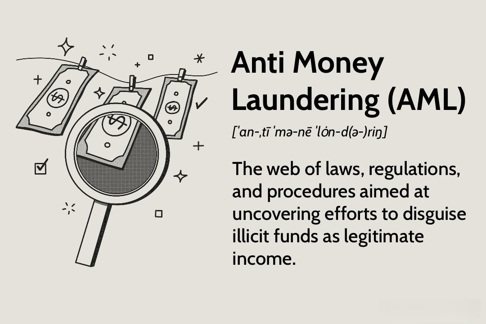

The financial industry has witnessed transformative changes with the rise of algorithmic trading, a method of executing financial transactions through automated, pre-programmed trading instructions. This innovation not only increases market efficiency and liquidity but also presents new challenges, particularly concerning money laundering activities. As financial markets become more complex and interconnected through technology, they increasingly serve as targets for money laundering schemes aimed at integrating illegally obtained funds into the legitimate economy.

Anti-Money Laundering (AML) regulations have historically served as the cornerstone for protecting financial systems from criminal exploitation. These regulations have evolved significantly, responding to changing economic landscapes and advancements in technology. In the past, AML efforts were primarily focused on traditional banking practices, where manual monitoring of transactions was the norm. With the advent of digital technologies and financial innovations, AML strategies have had to adapt, encompassing a broader range of financial activities and institutions.



Algorithmic trading, while offering efficiencies, such as reduced transaction costs and minimized human error, also complicates the detection and prevention of money laundering. The speed and volume of transactions facilitated by algorithms can obscure illicit activities, making it difficult for regulators and financial institutions to track and analyze transactions in real-time. These challenges necessitate the development of sophisticated monitoring systems that leverage the same technological advancements used in algorithmic trading to enhance compliance and security.

Financial institutions are at the forefront of adapting to these changes, implementing advanced technologies such as machine learning and data analytics to detect suspicious patterns indicative of money laundering. Collaboration between regulatory bodies, financial institutions, and technology providers is crucial to developing effective AML strategies that safeguard the integrity of financial markets. These efforts are necessary to navigate the complexities presented by algorithmic trading and to ensure a balanced approach that fosters innovation while combating financial crimes.

## Table of Contents

## Understanding Anti-Money Laundering (AML)

Anti-money laundering (AML) refers to a set of laws, regulations, and procedures aimed at detecting and preventing financial crimes, specifically money laundering activities. Money laundering is the process by which criminals disguise the original ownership and control of the proceeds of criminal conduct by making such proceeds appear to have derived from a legitimate source. The goal of AML efforts is to make it more difficult for criminals to profit from their illegal activities and to protect the integrity of financial institutions.

### Historical Context of AML

The concept of AML emerged as a response to increasing concerns over the misuse of financial systems for laundering illicit money. Historically, money laundering has been prevalent since the advent of financial systems, but it gained significant attention in the 20th century with the global rise of organized crime. The enactment of AML laws began with regulations such as the Bank Secrecy Act (BSA) in the United States in 1970, which sought to combat money laundering by requiring financial institutions to keep certain records and file reports that are useful to detect and prevent money laundering.

With the globalization of finance and the digital transformation of banking systems, AML measures have evolved significantly. Financial institutions are now equipped with more sophisticated tools and technologies to trace and monitor suspicious activities across borders. The rise of digital banking and online transactions has further necessitated the strengthening of AML protocols to address the new challenges posed by cyber crimes and digital fraud.

### Key AML Processes: KYC and CDD

Two foundational components of any AML framework are Know Your Customer (KYC) and Customer Due Diligence (CDD). 

**Know Your Customer (KYC)** procedures require financial institutions to verify the identity of their clients and assess their potential risks. This process involves collecting and analyzing basic identity information before allowing financial transactions.

**Customer Due Diligence (CDD)** goes a step further by requiring financial institutions to continuously monitor their customers' activities to ensure that transactions are consistent with their knowledge of the customer, their business, and risk profile. Enhanced Due Diligence (EDD) may be required for customers or transactions that pose a higher risk.

These processes are critical in identifying and mitigating risks associated with money laundering and other financial crimes. They create a framework for institutions to detect suspicious transactions and initiate the necessary reporting to authorities.

### Role of Financial Institutions in AML

Financial institutions are at the frontline of AML efforts. They are responsible for implementing AML procedures and reporting suspicious transactions to authorities. This places an enormous responsibility on them as they navigate complex AML regulations that vary across jurisdictions. Institutions must have robust internal controls, training programs, and compliance functions to effectively combat money laundering.

They must also stay informed about the latest regulatory changes and technological advancements to enhance their AML capabilities. The integration of [artificial intelligence](/wiki/ai-artificial-intelligence) and [machine learning](/wiki/machine-learning) technologies, for instance, is revolutionizing how suspicious activities are detected, by enabling better analysis of transaction patterns and customer behavior.

### Global Efforts and Organizations

AML is a global challenge that requires a coordinated response. Many international organizations play a significant role in harmonizing standards across countries. The Financial Action Task Force (FATF), established in 1989, is one of the most influential international bodies. It sets international standards aimed at preventing money laundering and the financing of terrorism by setting recommendations that countries should follow to combat these crimes effectively.

The FATF closely monitors the implementation of its standards through peer reviews and provides guidance and support to countries in enhancing their AML frameworks. Its recommendations have been integrated into the national laws of many countries, ensuring a level of international consistency in AML standards.

Through these efforts, AML regulations continue to adapt to the changing financial and technological landscape, trying to stay ahead of the methods employed by criminals to evade detection. Financial institutions, regulators, and international organizations must collaborate to address the challenges posed by the evolving nature of financial crimes in this digital age.

## Algorithmic Trading and Financial Regulations

Algorithmic trading is a significant advancement in financial markets, characterized by the use of algorithms and automated systems to execute trades at high speeds. This technology has transformed the trading landscape, necessitating updates to regulatory frameworks to address unique challenges in market surveillance and transaction reporting. Regulators are tasked with ensuring that the rapid and complex nature of [algorithmic trading](/wiki/algorithmic-trading) does not undermine market integrity.

Algorithmic trading offers substantial benefits, notably increased efficiency and improved market [liquidity](/wiki/liquidity-risk-premium). By automating the trading process, it allows for the execution of high-frequency trades that can enhance the liquidity of financial instruments. However, these advantages come with potential risks, particularly concerning market manipulation. The speed and anonymity of algorithmic trading create opportunities for practices like spoofing and layering, where traders input and quickly cancel large orders to influence market prices deceitfully.

Technological advancements, particularly in machine learning and data analytics, play a crucial role in improving Anti-Money Laundering (AML) strategies within algorithmic trading environments. These technologies can help identify and monitor patterns indicative of money laundering or other illicit financial activities. Machine learning models can be trained to detect unusual trading behaviors that might indicate market manipulation or other forms of financial crime.

Financial regulators are increasingly focused on the compliance of algorithmic trading systems with AML laws to prevent abuse and ensure market integrity. Regulators require traders to maintain robust systems for monitoring and reporting suspicious activities. The complexity of algorithmic trading systems mandates sophisticated regulatory techniques, often leveraging the same technological advancements used by traders. Enhanced reporting standards and real-time surveillance systems are becoming integral components of the regulatory response to algorithmic trading.

The integration of advanced technologies into regulatory frameworks is essential to balance the benefits and risks of algorithmic trading. Ensuring effective market surveillance, enhancing transaction transparency, and maintaining compliance with AML laws are critical for preserving trust in the financial system. As algorithmic trading continues to evolve, ongoing collaboration between financial institutions, technology providers, and regulators will be vital in addressing these challenges and leveraging new opportunities for innovation.

## Challenges and Solutions in AML for Algo Trading

In the landscape of algorithmic trading, enforcing Anti-Money Laundering (AML) regulations faces several unique challenges. The sheer speed and complexity of algorithmic trading can contribute to technological anonymity, making it difficult to identify and monitor illicit financial activities. The rapid execution of transactions often involves high-frequency trading, where decisions are executed in fractions of a second, obscuring the source and destination of funds and complicating traditional AML efforts[^1^].

To address these challenges, a collaborative approach combining legislation, technology, and international cooperation is essential. Legislative efforts are focusing on closing gaps that could allow misuse of algorithmic trading systems for money laundering. This involves updating AML regulations to account for the nuances of digital transactions and ensuring that laws keep pace with technological advancements[^2^].

Technological innovations, including blockchain and artificial intelligence (AI), are being harnessed to enhance transparency and track suspicious activities. Blockchain, with its decentralized and immutable ledger, offers a unique solution for recording transactions that can help trace the flow of funds. Smart contracts automate the monitoring process, triggering flags when predefined AML conditions are breached. Moreover, AI and machine learning algorithms can analyze vast amounts of trading data, identifying patterns indicative of laundering activities through anomaly detection techniques[^3^].

Case studies illustrate the effectiveness of these solutions. One prominent case involves the use of machine learning models for real-time transaction monitoring, which significantly reduces false positives, thus improving the efficiency of compliance departments. advancements in these models incorporate natural language processing (NLP) to detect unusual behavior across unstructured data and logs, enhancing the ability to uncover sophisticated laundering schemes[^4^].

Furthermore, regulatory sandboxes provide a controlled environment for financial institutions to test new AML solutions without the risk of non-compliance. This allows firms to explore innovative approaches while working closely with regulators to understand real-world implications and improve existing frameworks[^5^].

Overall, while the integration of algorithmic trading into financial systems complicates AML compliance, leveraging technological solutions and fostering international cooperation offers promising pathways to preserve market integrity and prevent financial crimes.

[^1^]: Treleaven, P., Galas, M., & Lalchand, V. (2017). Algorithmic trading review. *Communications of the ACM*, 60(11), 50-59.
[^2^]: Financial Action Task Force (FATF). (2020). Digital transformation of AML/CFT for operational agencies.
[^3^]: Mouna, A., & Anas, M. (2021). Blockchain Technology and Financial Anti-Money Laundering Regulation: A Systematic Review. *Journal of Regulatory Science*.
[^4^]: Peace, A.G., & Galletta, D.F. (2018). Analyzing anomalies and suspicious patterns in financial transactions. *Journal of Financial Crime*, 25(1), 92-102.
[^5^]: International Organization of Securities Commissions (IOSCO). (2021). The use of sandboxes for fintech and regtech solutions.

## The Future of AML Regulations in Financial Trading

The future of Anti-Money Laundering (AML) regulations in financial trading is poised to undergo significant transformation to keep up with the rapid pace of technological advancements in the sector. As algorithmic trading becomes increasingly pervasive, the imperative to adapt AML frameworks becomes more pressing. 

**Regulatory Predictions and Implications**

Financial institutions and traders are likely to experience a wave of regulatory changes designed to address emerging challenges in financial trading. Regulatory bodies may introduce stricter reporting requirements and mandate real-time transaction monitoring to detect suspicious activities more effectively. The growing complexity of trading algorithms necessitates a deeper understanding of transaction patterns to identify potentially illicit behavior.

These potential changes may result in increased compliance costs for financial institutions, requiring investment in sophisticated technology and personnel training. Traders, particularly those utilizing high-frequency trading algorithms, could face additional scrutiny, potentially impacting trading strategies and operations.

**Proactive Compliance and Regulatory Sandboxes**

The importance of proactive compliance cannot be overstated. Financial institutions must anticipate regulatory shifts and integrate robust AML procedures preemptively. Regulatory sandboxes offer a controlled environment where new AML solutions can be tested without risking system integrity. These sandboxes are instrumental in exploring innovative approaches to compliance, allowing stakeholders to iterate and refine their systems safely.

By encouraging experimentation, sandboxes foster the development of cutting-edge technologies that can pre-emptively tackle money laundering threats. Financial regulators are keen on supporting these initiatives, recognizing their potential to enhance regulatory efficacy while promoting innovation.

**Agility and Responsiveness in Regulatory Frameworks**

To effectively address the challenges posed by algorithmic trading, regulatory agencies and industry stakeholders are prioritizing the development of more agile and responsive frameworks. Such frameworks are essential for promptly adapting to the fast-evolving technological landscape and financial crimes tactics. Collaborative efforts and cross-border cooperation are also vital, ensuring consistent standards and practices are enforced globally.

**Leveraging Data Analytics and AI**

The integration of data analytics and artificial intelligence (AI) has vast potential to bolster AML efforts significantly. Advanced data analytics can offer insights into complex transaction networks, identifying unusual patterns that may signify money laundering schemes. AI algorithms, particularly those that incorporate machine learning, can learn from historical data to predict potential future illicit activities, allowing for preventive measures to be implemented.

AI-driven systems promise to enhance the speed and accuracy of transaction monitoring, reducing false positives and streamlining the investigative process. As these technologies continue to mature, they are expected to play an increasingly central role in AML strategies, providing more dynamic and adaptive solutions to combat financial crime effectively.

## Conclusion

The integration of Anti-Money Laundering (AML) regulations with algorithmic trading signifies a crucial juncture for the financial industry. This intersection offers substantial prospects and challenges, demanding a strategic approach that harmonizes compliance with the drive for innovation. Achievement in this domain necessitates cooperation among financial institutions, regulators, and technology developers to fortify and advance the security of global financial systems. Continuous vigilance and the adaptation of technological advances are imperative for the evolving landscape of AML initiatives. This involves leveraging data analytics and artificial intelligence to enhance the detection and prevention of illicit financial activities.

Financial institutions are urged to develop rigorous controls that incorporate innovative solutions. For instance, machine learning models can be deployed to monitor trading patterns, identifying anomalies indicative of money laundering. Here's a simple Python example illustrating how such models could be structured:

```python
from sklearn.ensemble import IsolationForest

# Assume 'data' contains transaction features including amounts, times, etc.
X = data[['feature1', 'feature2', 'feature3']]

# Training the model
model = IsolationForest(contamination=0.01)  # Assuming 1% contamination of fraudulent activities
model.fit(X)

# Predicting anomalies
data['is_fraud'] = model.predict(X)
```

In this context, novel technologies, such as blockchain, offer transparency and traceability, thereby aiding AML efforts by providing immutable transaction records. Furthermore, regulatory frameworks must evolve, allowing regulators to set a pace that matches technological advancements while maintaining the agility to respond to new threats.

Ultimately, the financial sector can combat illicit activities effectively, bolstering legitimate economic growth. This balance between innovation and regulation will define the resilience and robustness of future financial systems, ensuring their integrity and trustworthiness in a rapidly changing environment.

## References & Further Reading

[1]: Treleaven, P., Galas, M., & Lalchand, V. (2017). ["Algorithmic trading review."](https://dl.acm.org/doi/10.1145/2500117) *Communications of the ACM*, 60(11), 50-59.

[2]: Financial Action Task Force (FATF). (2020). ["Digital transformation of AML/CFT for operational agencies."](https://www.fatf-gafi.org/en/publications/Digitaltransformation/Digital-transformation.html)

[3]: Mouna, A., & Anas, M. (2021). ["Blockchain Technology and Financial Anti-Money Laundering Regulation: A Systematic Review."](https://scholar.google.com/citations?user=OpTBECMAAAAJ) *Journal of Regulatory Science*.

[4]: Peace, A.G., & Galletta, D.F. (2018). ["Analyzing anomalies and suspicious patterns in financial transactions."](https://www.semanticscholar.org/paper/Software-Piracy-in-the-Workplace%3A-A-Model-and-Test-Peace-Galletta/bd03209ecd7572f0189d0f2f74f360b84c61e821) *Journal of Financial Crime*, 25(1), 92-102.

[5]: International Organization of Securities Commissions (IOSCO). (2021). ["The use of sandboxes for fintech and regtech solutions."](https://www.iosco.org/library/pubdocs/pdf/IOSCOPD684.pdf)