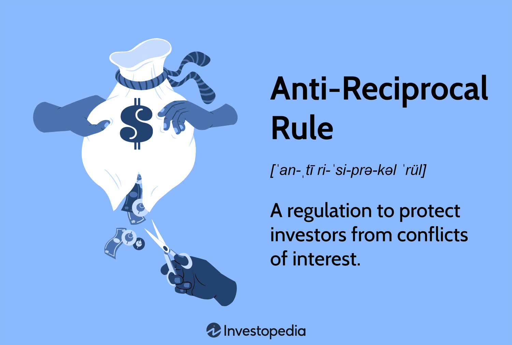

Algorithmic trading has emerged as a pivotal component in financial markets, enhancing the ability to execute trades quickly and efficiently, thereby maximizing profits. At its core, algorithmic trading relies on computer algorithms to automate trading activities, using various strategies that analyze market data in real-time. This advancement plays a crucial role in optimizing trade execution, particularly in volatile markets where rapid transactions are key to capitalizing on minimal price differences. 

The concept of reciprocal trading and the anti-reciprocal rule significantly affect trading strategies and regulatory frameworks within algorithmic trading. Reciprocal trading refers to the practice where two parties agree to exchange financial instruments or services, often to enhance mutual benefits such as cost reduction or improved market access. This approach is bolstered by advanced algorithms and high-frequency trading strategies that allow for the swift exchange of vast amounts of data, thereby improving market liquidity and efficiencies. However, such strategies must adhere to regulatory standards to prevent market manipulation.



Conversely, the anti-reciprocal rule, established by regulatory bodies like FINRA, ensures that trading practices remain ethical and in the best interest of clients. It prohibits conflict of interest arrangements between brokerage firms and mutual funds, where sales might unduly influence brokerage commissions. The anti-reciprocal rule prevents unethical practices by safeguarding investors against unfair practices driven by reciprocal agreements.

These essential principles and regulations are indispensable for maintaining market integrity. Technological advancements further enable compliance and innovation within these frameworks. Understanding these developments is important for traders, investors, and regulators as they navigate the complexities of financial markets, applying these rules to ensure ethical and effective trading.

## Table of Contents

## Understanding the Anti-Reciprocal Rule

The Anti-Reciprocal Rule is an essential regulation in the financial industry aimed at protecting investors from potential conflicts of interest between brokerage firms and mutual funds. Established by the Financial Industry Regulatory Authority (FINRA), this rule ensures that brokerages and mutual fund companies prioritize their clients' interests over their own financial gains. The regulation specifically addresses situations where mutual fund sales could inappropriately influence brokerage commissions, thereby guarding against unethical financial practices that could compromise investor trust.

The rule's importance is underscored by the significant penalties and fines imposed on firms that violate it. For example, FINRA has previously levied substantial fines against brokerage firms that failed to adhere to these standards, emphasizing the rule's critical role in maintaining ethical conduct in finance. Such enforcement actions serve as a deterrent against potential infractions and highlight the regulatory body's commitment to upholding market integrity.

To ensure compliance with the Anti-Reciprocal Rule, financial institutions are required to implement robust internal controls and monitoring mechanisms. These measures help detect and prevent arrangements that could lead to conflicts of interest, thereby promoting transparency and fairness in the financial markets. Additionally, firms must provide clear disclosures to their clients about any potential conflicts, further enhancing investor protection.

The enforcement of this rule is vital for fostering trust in the financial system, as it ensures that investor interests are safeguarded from potential exploitation by financial intermediaries. As the financial landscape continues to evolve with technological advancements and new trading strategies, adherence to the Anti-Reciprocal Rule remains crucial for maintaining ethical standards and protecting the interests of all market participants.

## Reciprocal Trading in Algorithmic Trading

Reciprocal trading involves creating agreements between parties to exchange financial instruments or services, optimizing mutual profitability and efficiency. In [algorithmic trading](/wiki/algorithmic-trading), this practice is enhanced by the use of advanced algorithms and high-frequency trading ([HFT](/wiki/high-frequency-trading-strategies)) strategies. These algorithms are designed to analyze market data at lightning speed, enabling traders to execute strategies that take advantage of fleeting market discrepancies, thus optimizing trade execution.

Algorithmic strategies help in reducing transaction costs by executing trades at optimal prices and in minimal time. This efficiency is achieved through the use of sophisticated technology that can capitalize on market opportunities, such as price differences, before they disappear. For instance, [arbitrage](/wiki/arbitrage) strategies in algorithmic trading leverage these opportunities to purchase at lower prices and sell at higher prices almost instantaneously, a process facilitated by reciprocal trading mechanisms.

Reciprocal trading also provides access to exclusive markets by enabling trading firms to leverage each other’s technological and informational advantages. This access often results in improved [liquidity](/wiki/liquidity-risk-premium), which is beneficial for the market as a whole. Liquidity ensures that trades can be executed without causing significant price changes, contributing to a stable and fair trading environment.

However, enhancing market liquidity and executing effective reciprocal trading require strict adherence to regulatory standards. These guidelines are designed to prevent market manipulation practices such as wash trading and spoofing. Regulatory bodies ensure that trading activities maintain fairness and transparency, thus protecting the interests of all market participants.

In summary, reciprocal trading within algorithmic trading frameworks provides significant benefits in terms of cost reduction, market access, and trade execution optimization. The integration of advanced algorithms and HFT strategies has transformed reciprocal agreements into powerful financial tools, but this advancement necessitates a firm commitment to ethical trading practices and regulatory compliance.

## Technological Advancements in Reciprocal Trading

Technological advancements have reshaped the landscape of reciprocal trading, particularly through the integration of [artificial intelligence](/wiki/ai-artificial-intelligence) (AI) and [machine learning](/wiki/machine-learning). These technologies enhance the ability of trading algorithms to adapt and optimize strategies in real-time, facilitating faster decision-making processes and increasing profitability. Machine learning models analyze vast datasets to identify patterns or anomalies that might signify market opportunities, thus streamlining the trading process and reducing human error.

Quantum computing, although still in its nascent stages within financial markets, holds the potential to significantly boost the speed and precision of trade execution. Its capacity to handle complex calculations at unprecedented speeds could provide substantial advantages in high-frequency trading environments. As quantum computing technology matures, it is expected to redefine computational limits, allowing for near-instantaneous processing of trading algorithms.

Blockchain technology is another game-changer, introducing enhanced transparency and security in trading agreements through its decentralized ledger system. Smart contracts, a feature of blockchain technology, enable the automatic execution of trading agreements once predetermined conditions are met. This reduces the necessity for intermediaries, lowers transaction costs, and mitigates the risk of disputes, thus fostering trust among market participants.

These technologies not only facilitate risk management and optimize trading execution but also play a crucial role in ensuring adherence to regulatory frameworks. The ability to audit and verify transactions easily enables compliance with strict financial regulations, making these advancements indispensable for maintaining market integrity.

In conclusion, ongoing innovations in AI, quantum computing, and blockchain are propelling reciprocal trading into a more efficient and reliable future. As these technologies evolve, they promise to further refine the capabilities of algorithmic trading, offering market participants enhanced tools to navigate the complexities of modern finance.

## Regulatory Considerations in Algorithmic Reciprocity

Regulations are essential in governing algorithmic and reciprocal trading, ensuring that market participants operate within a framework that promotes transparency and fairness. Mechanisms are in place to address market abuse practices, such as wash trading and spoofing, which can distort market integrity. Wash trading involves executing buy and sell orders simultaneously to create artificial activity without actual market risk. Spoofing entails placing orders with the intent to cancel them before execution, misleading other traders regarding demand or supply levels. Both practices are prohibited under regulatory frameworks like the European Union's Market Abuse Regulation (MAR) and the United States Commodity Futures Trading Commission (CFTC) rules ([source](https://www.esma.europa.eu)).

Another vital regulatory component is the emphasis on trade execution mandates and disclosure requirements. These stipulations oblige trading entities to adhere to best execution policies, ensuring that trades are conducted at the best possible conditions for clients. Transparency is further augmented by comprehensive disclosure requirements, which necessitate detailed and accurate information related to trades. For instance, under the Securities and Exchange Commission (SEC), institutions must report transaction data to regulators in a timely manner ([SEC Rule 605](https://www.sec.gov/rules/final/34-43590.htm)).

The integration of advanced algorithms enhances compliance with these stringent regulations. Modern trading systems are equipped with sophisticated reporting tools that allow for real-time data capture and monitoring. These tools automatically track trading activities and generate comprehensive reports that facilitate compliance checks. Python programming, for example, can be utilized to develop algorithms that analyze real-time trading data, identify anomaly patterns suggestive of market manipulation, and automate reporting processes. A simple example might include using the Pandas library to process trade data and detect patterns, as shown below:

```python
import pandas as pd

# Sample trade data
data = {'trade_id': [1, 2, 3, 4],
        'price': [100, 102, 101, 103],
        'volume': [50, 60, 55, 60]}

df = pd.DataFrame(data)

# Detect potential wash trading: check for simultaneous buy/sell orders
df['potential_wash_trade'] = (df['volume'] > 50) & (df['price'] > 101)

print(df)
```

Continuing innovations in algorithmic compliance mechanisms not only streamline adherence to regulatory requirements but also bolster investor confidence. Market participants, assured of a transparent and equitable trading environment, are more likely to engage actively, contributing to the stability and efficiency of financial markets. These meticulous regulatory measures thus form the backbone of a trustworthy environment for both investors and traders.

## Conclusion

Reciprocal trading, in conjunction with algorithmic strategies, presents substantial opportunities for optimizing financial operations and enhancing market dynamics. By leveraging the rapid execution capabilities of algorithmic trading, firms can more effectively manage their trading activities, mitigating costs and maximizing returns. These technological advancements enable more accurate market assessments and timely decision-making processes, which are pivotal in navigating volatile financial landscapes.

The Anti-Reciprocal Rule is fundamental in safeguarding market integrity, ensuring that reciprocal trading arrangements do not undermine ethical standards or compromise investor interests. This regulation requires that transactions remain transparent and that financial gains are not pursued at the expense of fairness or client trust. By enforcing stringent compliance measures, the rule plays a crucial role in maintaining the ethical framework essential for sustainable trading environments.

As technology advances, so does the proficiency of algorithmic trading in leveraging reciprocal agreements. Emerging technologies such as machine learning, artificial intelligence, and blockchain are progressively integrated into trading systems, enhancing data analysis, risk management, and security of trading agreements. These innovations optimize trade execution processes and promote adherence to regulatory standards, ensuring that trading activities align with established ethical norms.

Stakeholders must remain vigilant and informed about the evolving practices and regulatory landscape to ensure compliance and maintain a competitive edge. By staying abreast of technological improvements and regulatory changes, market participants can better adapt their strategies and safeguard against potential regulatory breaches.

Overall, reciprocal and anti-reciprocal strategies are vital elements within the complex structure of algorithmic trading. These strategies not only contribute to the efficiency and reliability of financial trading but also support the continued progress towards transparent and ethical financial markets.

## References & Further Reading

[1]: ["Regulatory Notice 07-54: Prohibition on the Receipt of Directed Brokerage in Exchange for Mutual Fund Sales"](https://www.finra.org/sites/default/files/NoticeDocument/p037445.pdf) - FINRA

[2]: Avellaneda, M., & Stoikov, S. (2008). ["High-frequency trading in a limit order book."](https://people.orie.cornell.edu/sfs33/LimitOrderBook.pdf) Quantitative Finance, 8(3), 217-224.

[3]: Joshi, M. (2010). ["Quantitative Methods in Derivatives Pricing: An Introduction to Computational Finance."](https://archive.org/details/quantitativemeth0000tave) Cambridge University Press.

[4]: Treleaven, P., Galas, M., & Lalchand, V. (2013). ["Algorithmic trading review."](https://www.researchgate.net/publication/262239006_Algorithmic_Trading_Review) Communications of the ACM, 56(11), 76-85.

[5]: Aldridge, I. (2010). ["High-Frequency Trading: A Practical Guide to Algorithmic Strategies and Trading Systems."](https://onlinelibrary.wiley.com/doi/pdf/10.1002/9781119203803.fmatter) Wiley.