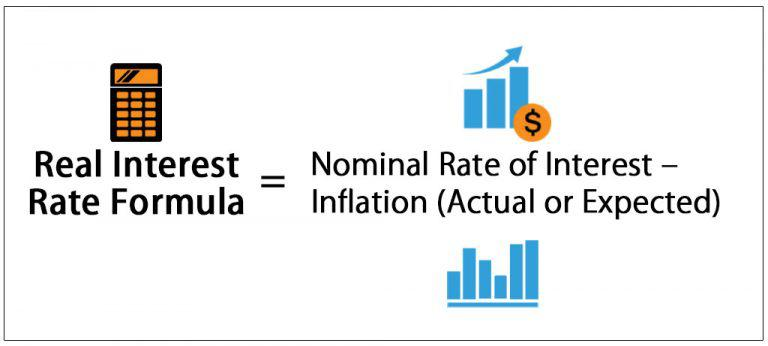

## Table of Contents

## What is anticipated interest?

Anticipated interest is the interest that a person expects to earn on their savings or investments over a certain period of time. It's like guessing how much money your money will make in the future. People often use this idea to plan their finances, like saving for a big purchase or planning for retirement. They look at things like how much they are putting in, how long they will leave it there, and what the interest rate might be.

When people think about anticipated interest, they usually consider the interest rate that banks or investment companies are offering. They might also look at past trends to help them guess what might happen in the future. It's important to remember that this is just a guess, though. The actual interest earned can be different because things like changes in the economy or the rules of the bank can affect it. So, while it's a useful tool for planning, it's not always exactly right.

## How does anticipated interest differ from actual interest?

Anticipated interest is what someone thinks they will earn on their money in the future. It's like making a guess based on the interest rate they know now and how long they plan to keep their money saved or invested. People use this guess to plan things like buying a house or saving for when they stop working. It helps them figure out how much money they might have later on.

Actual interest, on the other hand, is the real amount of money someone earns from their savings or investments. This can be different from what they expected because things can change. For example, the bank might change the [interest rate](/wiki/interest-rate-trading-strategies), or the economy might do something unexpected. So, while you can plan with anticipated interest, the actual interest is what you really get at the end of the day.

## Why is it important to understand anticipated interest in financial planning?

Understanding anticipated interest is really important when you're planning your money stuff. It's like trying to guess how much more money you'll have in the future just by saving or investing what you have now. When you know this, you can make better plans for big things, like buying a house or saving up for when you're older and not working anymore. It helps you figure out if you're saving enough money or if you need to save more to reach your goals.

But, it's also good to remember that anticipated interest is just a guess. The real amount of money you get, which is the actual interest, can be different. Things like changes in the economy or the bank changing the interest rate can make a big difference. So, while it's super helpful to use anticipated interest to plan, you also need to be ready for things to change and maybe not go exactly as you planned.

## Can you explain how anticipated interest is calculated?

To calculate anticipated interest, you start by figuring out how much money you're putting into your savings or investment, how long you plan to leave it there, and what the interest rate is. The interest rate is usually given as a percentage, like 2% or 5%. You then use a simple formula: take the amount of money you're starting with, multiply it by the interest rate, and then multiply that by the number of years you're leaving the money in. For example, if you put $1,000 into a savings account with a 3% interest rate for 5 years, you'd calculate it like this: $1,000 x 0.03 x 5 = $150. So, you'd expect to earn $150 in interest over those 5 years.

But sometimes, the interest you earn can also earn interest, which is called compound interest. This makes the calculation a bit trickier. If your savings or investment compounds annually, you'd use a different formula that takes into account the compounding effect. For the same $1,000 at a 3% interest rate compounded annually for 5 years, you'd use the formula: $1,000 x (1 + 0.03)^5. This comes out to about $1,159, so you'd expect to have $159 in interest. It's important to know whether your interest is simple or compound because it can make a big difference in how much money you end up with.

## What are common scenarios where anticipated interest plays a crucial role?

Anticipated interest is really important when you're saving up for big things like buying a house. If you know how much money you need for a down payment and how long you have to save, you can guess how much interest you'll earn on your savings. This helps you figure out if you're saving enough each month to reach your goal on time. For example, if you need $20,000 in 5 years, and you can save $300 a month, you can use the interest rate to see if that's enough or if you need to save more.

It's also key when you're planning for retirement. When you're working, you save money in things like a 401(k) or an IRA, and you want to know how much that money will grow by the time you stop working. Knowing the anticipated interest helps you decide how much to save each year to have enough money to live on later. If the interest rate goes up or down, you might need to adjust your savings plan to make sure you're on track.

## How does anticipated interest affect loan repayments?

When you take out a loan, like for a car or a house, the bank charges you interest on the money you borrow. Anticipated interest is what the bank thinks you'll end up paying in interest over the whole time you're paying back the loan. This helps the bank decide how much your monthly payments will be. If the bank thinks the interest rates will go up, your monthly payments might be higher because they're expecting you to pay more interest.

But if the interest rates actually go down, you might end up paying less interest than the bank thought at first. This can mean you pay off the loan faster or have smaller monthly payments. It's important to understand anticipated interest because it helps you plan how much money you need to set aside each month to pay back your loan. If the interest rates change a lot, you might need to adjust your budget to make sure you can still make your payments on time.

## What are the potential risks associated with relying on anticipated interest?

Relying on anticipated interest can be risky because it's just a guess about the future. Things like changes in the economy or the bank changing interest rates can make the actual interest different from what you expected. If the interest rate goes down, you might not earn as much money as you planned, which can mess up your savings goals. For example, if you were counting on a certain amount of interest to buy a house, and you don't get it, you might not have enough money when you need it.

Another risk is that you might make big decisions based on your anticipated interest, like how much to save for retirement or how much you can afford to borrow for a loan. If the actual interest turns out to be lower, you might find yourself short on money when you retire or struggling to make your loan payments. It's important to be ready for things to change and to have a backup plan, just in case the interest doesn't turn out the way you hoped.

## How can anticipated interest be used in investment strategies?

When you're planning your investments, knowing about anticipated interest can help you a lot. It's like guessing how much money your investments will make over time. If you think the interest rates will go up, you might choose to put your money into things that do better when interest rates are high, like certain bonds. On the other hand, if you think interest rates will stay low or go down, you might pick investments that do well in those conditions, like stocks or real estate. By thinking about anticipated interest, you can pick the best places to put your money to meet your goals, like saving for a big trip or for when you're older.

But, it's also important to remember that anticipated interest is just a guess. Things can change, and the actual interest you get might be different. If the economy does something unexpected or the interest rates change a lot, your investments might not grow as much as you hoped. That's why it's smart to have a plan that can change if things don't go the way you expected. By keeping an eye on what's happening and being ready to adjust your investments, you can still reach your goals even if the anticipated interest doesn't match up with the actual interest.

## What tools or software can help in calculating anticipated interest?

There are many tools and software that can help you figure out how much interest you might earn in the future. One popular tool is a savings calculator, which you can find on many bank websites or financial planning sites. You just need to put in how much money you're starting with, the interest rate, and how long you plan to save or invest. The calculator does the math for you and shows you how much money you might have at the end. Some calculators also let you see what happens if you add more money over time or if the interest rate changes.

Another useful tool is a compound interest calculator. This is good if your savings or investments earn interest on the interest, which can make your money grow faster. You can find these calculators online, too. They let you put in the same information as a savings calculator, but they also ask how often the interest is added to your account, like monthly or yearly. This gives you a more accurate guess of how much money you'll have in the future. Both of these tools are easy to use and can help you plan your money better.

## How do changes in interest rates impact anticipated interest?

When interest rates change, it can really affect how much interest you think you'll earn in the future. If interest rates go up, the money you have saved or invested might grow faster than you expected. This means your anticipated interest could be higher, and you might end up with more money than you planned. For example, if you were saving for a car and the interest rate goes up, you might be able to buy the car sooner because your savings are growing faster.

On the other hand, if interest rates go down, the money you're saving or investing won't grow as fast as you thought. This means your anticipated interest could be lower, and you might not have as much money as you hoped. If you were planning to use that money for something important, like a down payment on a house, you might need to wait longer or save more each month to reach your goal. It's important to keep an eye on interest rates and be ready to change your plans if they go up or down.

## What are the advanced models used for forecasting anticipated interest?

To forecast anticipated interest, people often use advanced models like time series analysis. This model looks at past interest rates to guess what might happen in the future. It uses math to find patterns in the numbers and then predicts what the interest rates will do next. For example, if interest rates have been going up slowly over the last few years, the model might guess they will keep going up a little bit more. This helps people plan their savings and investments better.

Another model that's used is the econometric model. This one looks at a lot of different things that can affect interest rates, like the economy, what the government is doing, and even what's happening in other countries. It puts all this information together to make a guess about future interest rates. For example, if the economy is doing really well, the model might predict that interest rates will go up because more people want to borrow money. These models are really helpful for making smart decisions about money, but they're not perfect because the future can be hard to predict.

## How can anticipated interest be integrated into long-term financial planning?

When you're planning your money for the long term, like saving for retirement or buying a house, thinking about anticipated interest is really helpful. It's like guessing how much more money you'll have in the future just by saving or investing what you have now. If you know the interest rate and how long you plan to save, you can figure out if you're saving enough to reach your goals. For example, if you want to retire with a certain amount of money, you can use anticipated interest to see how much you need to save each month. It helps you make a plan that fits your dreams and keeps you on track.

But remember, anticipated interest is just a guess. The real amount of money you get, which is the actual interest, can be different because things can change. The economy might do something unexpected, or the bank might change the interest rate. So, while it's good to use anticipated interest to plan, you also need to be ready to adjust your plans if things don't go the way you hoped. By keeping an eye on what's happening and being flexible, you can still reach your long-term goals even if the actual interest turns out to be different from what you expected.

## What are Key Financial Terms?

A robust understanding of pivotal financial terms is indispensable for navigating the financial markets. Recognizing key terms such as principal, interest, compound interest, and yield is crucial, as these concepts significantly influence investment outcomes.

**Principal** refers to the initial amount of money invested or borrowed, excluding interest or other earnings. For investors, the principal serves as the foundation upon which any future returns will be calculated.

**Interest** is the cost of borrowing money or the return obtained from lending. It is typically expressed as a percentage of the principal and can be calculated using simple or compound methods. Simple interest is computed by multiplying the principal amount by the interest rate and the time period involved:

$$
\text{Simple Interest} = \text{Principal} \times \text{Rate} \times \text{Time}
$$

**Compound Interest** represents interest on both the initial principal and the accumulated interest from previous periods. The formula for compound interest is:

$$
A = P(1 + \frac{r}{n})^{nt}
$$

where $A$ is the amount of money accumulated after $n$ years, including interest, $P$ is the principal amount, $r$ is the annual interest rate, and $n$ is the number of times that interest is compounded per year.

**Yield** denotes the earnings generated and realized on an investment over a particular period, typically expressed as a percentage. Yield can vary depending on the nature of the investment and serves as a benchmark for gauging performance.

In addition to these fundamental terms, concepts such as **risk, [liquidity](/wiki/liquidity-risk-premium),** and **diversification** are essential for crafting effective investment strategies. **Risk** refers to the variability of returns on an investment, with some instruments presenting higher risk and potential returns than others. Investors must weigh their risk tolerance when formulating a portfolio strategy.

**Liquidity** signifies the ease with which an asset can be converted into cash without significantly affecting its value. High liquidity allows investors to quickly respond to market changes, enhancing portfolio flexibility.

**Diversification** is the practice of allocating investments across various financial instruments, industries, or geographic locations to reduce exposure to any single asset or risk. Diversification helps mitigate losses when some market segments underperform, thereby stabilizing returns.

Understanding these terms enables investors to better assess opportunities and risks associated with different financial instruments. This knowledge translates to improved decision-making and strategy development, catering to both newcomers and experienced traders. By demystifying complex financial jargon, investors can more confidently engage with the market and optimize their investment outcomes.

## What is the role of interest rates in financial markets?

Interest rates are a pivotal [factor](/wiki/factor-investing) in financial markets, influencing nearly every economic and financial decision made by consumers and investors. They serve as the cost of borrowing and the reward for savings, thereby impacting everything from consumer spending to the valuation of complex financial instruments. A comprehensive understanding of their role is essential for navigating the financial landscape.

When interest rates rise, the immediate impact is often a reduction in consumer spending and borrowing. This is because higher interest rates increase the cost of loans, including mortgages and business financing, which discourages borrowing. For instance, if the interest rate on a mortgage increases, potential homeowners may decide to postpone buying a home due to higher monthly payments. This contraction in borrowing can lead to reduced revenues for businesses that rely on consumer spending, potentially impacting their stock valuations.

Conversely, higher interest rates typically encourage saving because they offer better returns on fixed-income investments such as bonds and savings accounts. This can lead to a shift in how investors allocate their assets, preferring safer, interest-bearing investments over riskier options like stocks. The following formula can represent the relationship between the interest rate (r) and the future value of an investment (FV):

$$
FV = PV \times (1 + r)^n
$$

Where $PV$ is the present value of the investment and $n$ is the number of periods.

In contrast, lower interest rates generally encourage economic activity by making borrowing cheaper, which can stimulate consumer spending and business expansion. Lower borrowing costs can lead to significant increases in spending on big-ticket items like homes and cars, fueling demand across various sectors. This injection of economic activity can boost market confidence and drive up stock prices as companies report higher earnings.

The banking sector is directly influenced by fluctuations in interest rates. Banks earn a profit from the spread between the interest they earn on loans and the interest they pay on deposits. Therefore, changes in interest rates can influence their lending activities, profit margins, and overall financial health.

In the real estate sector, interest rates are a critical factor that determines mortgage rates. Lower rates can increase real estate demand by making home loans more affordable, while higher rates may cool the market by raising financing costs.

In stock markets, interest rates can affect the discount rate used in valuing future cash flows, thereby impacting stock prices. When rates rise, the present value of future cash flows decreases, leading to lower valuations and potentially reduced stock prices. Conversely, lower rates can increase valuations and drive up stock prices as the cost of capital falls.

Overall, interest rates are a fundamental driver of market dynamics, influencing decisions across various financial activities and sectors. An understanding of their implications can guide investors and consumers alike in making informed financial decisions.

## References & Further Reading

[1]: Bernanke, B. S., & Blinder, A. S. (1992). ["The Federal Funds Rate and the Channels of Monetary Transmission."](https://www.jstor.org/stable/2117350) The American Economic Review, 82(4), 901-921.

[2]: Hull, J. C. (2018). ["Options, Futures, and Other Derivatives - 10th Edition."](https://www.semanticscholar.org/paper/Options%2C-Futures%2C-and-Other-Derivatives-Hull/89bdee500c8623864fc9eb7a471546aa713acc44) Pearson.

[3]: ["Anticipating Monetary Policy Under Different Interest Rate Environments"](https://www.federalreserve.gov/aboutthefed/fedexplained/monetary-policy.htm) by Michael D. Bauer and Thomas M. Mertens, National Bureau of Economic Research.

[4]: ["Managing Bond Portfolios: Anticipating Interest Rates"](https://www.investopedia.com/articles/bonds/08/bond-portfolio-strategies.asp) by CFA Institute.

[5]: ["Market Microstructure for Practitioners"](https://www.amazon.com/Trading-Exchanges-Market-Microstructure-Practitioners/dp/0195144708) by Larry Harris, Cambridge University Press.