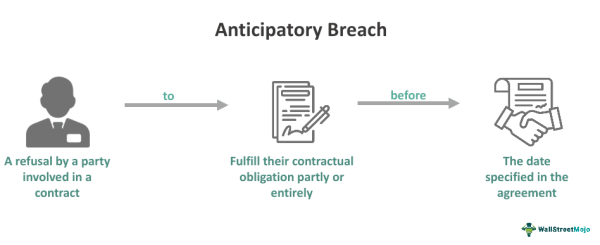

Understanding the nuances of contract law is essential in the intricate systems of legal and financial frameworks, particularly for professionals engaged in algorithmic trading. Anticipatory breach is a pivotal concept in contract law, denoting a situation where one party clearly indicates that they will not fulfill their contractual obligations. This concept becomes particularly significant in algorithmic trading, a modern financial technology that demands rapid and efficient transactional processing.

Algorithmic trading operates at high speeds, executing trades based on programmed strategies and algorithms. In such an environment, an anticipatory breach can have severe repercussions, potentially leading to financial losses due to unfulfilled trades. Recognizing this, the article explores the intersection of anticipatory breach with algorithmic trading. It aims to provide insight into how such breaches can occur in the financial sector, the legal precedents that exist, and how these can be applied to modern trading practices.

This exploration is structured to offer legal examples and articulate the implications of anticipatory breaches within the scope of algorithmic trading. Additionally, it investigates into strategies to manage and mitigate such breaches. This involves proactive contract management, monitoring indicators of potential breach, and employing legal remedies to protect interests. By laying out these considerations, the article seeks to equip traders and financial professionals with the knowledge required to safeguard their operations against the risks posed by anticipatory breaches. Understanding these elements is crucial for maintaining the integrity and efficiency of financial transactions in the fast-paced landscape of algorithmic trading.

## Table of Contents

## Understanding Anticipatory Breach

An anticipatory breach occurs when a party to a contract makes it unequivocally clear, through either actions or declarations, that they do not plan to fulfill their contractual obligations when they become due. This form of breach can profoundly affect the non-breaching party, often granting them the ability to pursue remedies even before the due date for performance has arrived. For instance, if a supplier communicates that it will be unable to deliver goods specified in a contract, or an employee informs their employer of an early termination of their employment agreement, these are illustrative situations of anticipatory breaches.

There are two primary classifications of anticipatory breaches: Express and Implied. An Express anticipatory breach happens when a party overtly states their intention to default on their obligations. This could be through written or verbal communication. For example, an email from a contractor stating their inability to complete a project by the agreed deadline constitutes an express breach. Conversely, an Implied anticipatory breach can be inferred from a party's actions that unequivocally suggest an intention not to perform their contractual commitments. An example of this might be a supplier selling off key inventory that was designated for fulfilling a contractual agreement, which would implicitly suggest their incapacity to meet the contract terms.

Both forms of anticipatory breach involve distinct legal responses. In the case of an Express breach, the non-breaching party can immediately consider the contract repudiated and seek damages or an alternative remedy—a concept that empowers them to avoid waiting until the date of performance, potentially minimizing their losses. With an Implied breach, the non-breaching party may need to rely on clearer evidential support to validate the breach, often requiring a demonstration of how the actions of the breaching party make performance essentially impossible.

Legal systems generally offer a range of remedies to address anticipatory breaches, commonly including the ability to terminate the contract and sue for damages, or alternatively, to treat the contract as ongoing and wait for the breach's actual occurrence, thereby suing at that time. These remedies ensure that the non-breaching parties are able to protect their interests effectively, whenever faced with a counterparty demonstrating an intent not to fulfill their contractual duties.

## Implications of Anticipatory Breach in Algo Trading

Algorithmic trading, a method utilizing computer algorithms to automate the trading process, hinges upon the swift and accurate execution of numerous trades across various financial markets. Any disruption in this process, such as an anticipatory breach of a contract, can lead to significant repercussions. An anticipatory breach occurs when one party to a contract signals its intent not to meet the contractual obligations before the due date. In the context of algo trading, this breach can cause a cascade of issues, primarily due to the interdependent nature of trading algorithms and the precise timing they require.

Algorithms are designed based on certain expectations regarding market conditions and the availability of financial instruments. When a counterparty indicates that it will not honor a trade or deliver a promised financial instrument, these algorithms may not function as intended. This can lead to substantial financial losses due to trades failing to execute or being executed at unfavorable conditions. For instance, suppose an algorithm is programmed to execute a series of transactions contingent upon receiving a particular asset at a specific time. If an anticipatory breach prevents the acquisition of this asset, the entire strategy may falter, resulting in missed opportunities or unfavorable trades.

Early recognition of possible breaches is essential for actors in [algorithmic trading](/wiki/algorithmic-trading). By implementing real-time monitoring systems and establishing alert mechanisms, traders can detect anomalies indicating potential breaches. Quick detection allows for the activation of contingency plans, such as shifting trading strategies, modifying algorithms, or seeking alternative counterparties, which could minimize potential damages.

Understanding legal precedents and protections plays a crucial role in defending against risks associated with anticipatory breaches. Traders should familiarize themselves with relevant legal frameworks that offer recourse in such instances. Legal actions might include filing for injunctions, claiming damages, or restructuring contracts to incorporate penalty clauses specific to anticipatory breaches. Moreover, developing strategies that anticipate potential counterparty deficiencies can help secure the contractual relationships crucial for seamless algorithmic operations. This anticipatory preparedness becomes an integral tool for financial professionals aiming to safeguard their algorithmic infrastructures against [volatility](/wiki/volatility-trading-strategies) induced by contractual failures.

## Legal Examples of Anticipatory Breach

One classic instance of anticipatory breach is the case of Hochster v De La Tour, which set a significant precedent in contract law, particularly employment contracts. In this 1853 case, Hochster was engaged to work for De La Tour, but De La Tour decided to terminate the contract before the employment commenced. Hochster sued for breach of contract before the contract's start date, and the court ruled in his favor. The case established that a party could seek legal remedies for anticipatory breach prior to the contract's performance due date, affirming the right to sue immediately after a breach is anticipated.

In the financial sector, anticipatory breach often manifests when a brokerage firm or financial institution announces it will not honor previously agreed trades. This refusal can seriously disrupt the operations of traders who depend on the execution of these trades for their trading strategies. For instance, if a broker signals their inability to settle a trade on the expected date, traders may face significant financial losses. The legal principle from Hochster v De La Tour aids in protecting financial entities by allowing them to take prompt legal action to mitigate potential damages.

Understanding legal cases where anticipatory breach was established is crucial as they offer insights and guidance for addressing similar situations in contemporary trading environments. Such historical outcomes provide a foundation for interpreting contract law, which can be applied to current trading contexts to anticipate and resolve disputes efficiently and effectively. By leveraging legal insights from these precedents, traders and financial institutions can better navigate the intricacies of contract breaches, safeguarding their operations and financial interests.

## Managing Anticipatory Breaches in Financial Transactions

Proactive contract management and legal oversight are essential measures in mitigating the risks associated with anticipatory breaches in financial transactions. This involves a combination of contractual clarity, effective communication, and strategic utilization of financial instruments.

Firstly, crafting contracts with clear breach protocols is paramount. Contracts should explicitly define what constitutes a breach and outline the procedures to follow if a breach is anticipated. These protocols serve as a preemptive measure, ensuring that all parties are aware of their obligations and the consequences of non-compliance. For instance, clauses may specify timelines for notifying potential breaches and actions required from each party upon receiving such notice. This clarity can prevent misunderstandings and reduce the likelihood of disputes.

Maintaining effective communication with counterparties is another critical strategy. Regular communication can help identify potential issues early, allowing parties to address concerns that might lead to a breach. This can involve periodic check-ins or updates on the progress of fulfilling contractual obligations, helping to foster transparency and trust between parties.

In circumstances where an anticipatory breach is imminent, legal strategies such as sending formal notices can be employed. These notices serve a dual purpose: they alert the breaching party of their impending non-fulfillment and formally document the breach, which can be crucial in any subsequent legal proceedings. Furthermore, parties may seek alternative fulfillment options to mitigate potential losses, such as finding substitute services or goods to replace those not delivered as per the contract.

Financial safeguards like performance bonds and insurance provide an additional layer of protection. Performance bonds act as a guarantee against the fulfillment of the contract, offering financial compensation if the obligations are not met. Similarly, insurance can cover losses resulting from an anticipatory breach, allowing traders to recover financially and continue operations with minimal disruption.

Incorporating these strategies into financial transactions ensures that traders are well-equipped to handle anticipatory breaches, thereby protecting both their interests and maintaining the integrity of their trading operations.

## Conclusion

Anticipatory breach poses substantial risks yet offers a window for proactive measures in algorithmic trading. By understanding the intricacies of anticipatory breaches, traders can not only safeguard their interests but also leverage these situations to mitigate potential losses before they materialize. The rapid nature of algorithmic trading requires professionals to be well-versed in relevant contract laws and equipped with strategic contract management skills. This preparedness enables them to react swiftly to any signals of an impending breach, minimizing financial repercussions.

For financial professionals, staying informed is not optional but essential. Keeping abreast of legal developments and routinely updating contract specifications according to industry best practices can act as significant protective measures. Moreover, establishing rigorous breach detection and response protocols ensures that algorithmic trading operations can continue smoothly, even amidst contractual disputes. With diligent preparation and adherence to legal frameworks, traders can effectively navigate the complexities of contract law, ensuring the stability and reliability of their trading systems in an ever-evolving financial environment.

## References & Further Reading

[1]: Hochster v De La Tour (1853). ["Hochster v De La Tour Case Summary."](https://www.lawteacher.net/cases/hochster-v-de-la-tour.php) Law Teacher.

[2]: Atiyah, P. S., & Smith, S. (2006). "Promises, Promises: Contract Law and the Theory of Contractual Obligation." In Essays on Contract.

[3]: Posner, R. A. (2003). "Economics of Contract Law." Edward Elgar Publishing.

[4]: Macneil, I. R. (1977). "Contracts: Adjustment of Long-Term Economic Relations under Classical, Neoclassical, and Relational Contract Law." Northwestern University Law Review.

[5]: Lopez de Prado, M. (2018). ["Advances in Financial Machine Learning."](https://www.amazon.com/Advances-Financial-Machine-Learning-Marcos/dp/1119482089) Wiley.

[6]: Murphy, A. & Katt, C. (2020). "An Introduction to Algorithmic Trading." In Algorithmic Trading and the Market System.

[7]: Chan, E. P. (2008). ["Quantitative Trading: How to Build Your Own Algorithmic Trading Business."](https://github.com/ftvision/quant_trading_echan_book) Wiley Trading.

[8]: Jansen, S. (2020). ["Machine Learning for Algorithmic Trading."](https://github.com/stefan-jansen/machine-learning-for-trading) Packt Publishing.