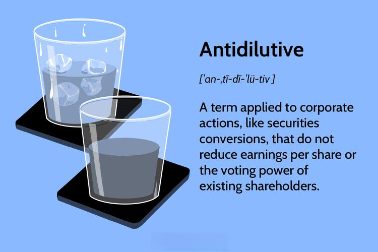

## Table of Contents

## What are antidilutive effects in finance?

In finance, antidilutive effects refer to actions or events that increase the value of existing shares by reducing the total number of shares outstanding or by increasing the company's earnings. When a company buys back its own shares, for example, it can have an antidilutive effect because there are fewer shares among which the company's earnings are divided. This can make each share more valuable, as the earnings per share (EPS) go up.

Another way antidilutive effects can happen is through the conversion of securities like convertible bonds or preferred stock into fewer common shares than originally anticipated. If these securities were expected to convert into a large number of common shares, but end up converting into fewer shares, this reduces the potential dilution of existing shareholders' ownership. As a result, the value of the existing shares can increase because the company's earnings are spread over a smaller number of shares.

## How do antidilutive securities affect a company's earnings per share?

Antidilutive securities help make each share of a company worth more money. This happens because they reduce the total number of shares that the company has. When there are fewer shares, the company's earnings, or profit, are divided among fewer pieces. So, each piece, or share, gets a bigger slice of the profit. This bigger slice is called earnings per share, or EPS, and when it goes up, it usually makes the stock price go up too.

For example, if a company has a special kind of bond that can be turned into shares, but it turns into fewer shares than people thought it would, that's an antidilutive security. Instead of making more shares and spreading the profit thinner, it keeps the number of shares smaller. This means the earnings per share stays higher than it would have been if more shares were made. So, the people who already own shares are happy because their shares are worth more.

## Can you explain the difference between dilutive and antidilutive securities?

Dilutive securities are things like special bonds or stocks that can be turned into more regular shares of a company. When they get turned into shares, it makes the total number of shares go up. This means the company's profit, or earnings, gets spread out over more pieces. So, each piece, or share, gets a smaller slice of the profit. This can make each share worth less money, and it's called dilution because the value of the shares gets watered down.

On the other hand, antidilutive securities are the opposite. They help keep the number of shares from going up too much or even make it go down. For example, if a special bond turns into fewer shares than people expected, it's antidilutive. This means the company's profit doesn't get spread out over as many pieces, so each share gets a bigger slice of the profit. This can make each share worth more money, which is good for the people who already own shares because their shares become more valuable.

## What are some common examples of antidilutive securities?

Antidilutive securities are things that help keep the value of a company's shares from going down by not adding too many new shares. One common example is when a company buys back its own shares. When a company does this, it's taking shares off the market, which means there are fewer shares for the company's earnings to be divided among. This can make each share worth more because the earnings per share go up.

Another example of an antidilutive security is a convertible bond that turns into fewer shares than expected. Convertible bonds are special bonds that can be changed into regular shares of the company. If these bonds turn into fewer shares than people thought they would, it means the company's earnings are spread over fewer shares than anticipated. This keeps the value of the existing shares higher because the earnings per share don't get diluted as much as they could have.

## How can a company determine if a security is antidilutive?

A company can figure out if a security is antidilutive by looking at how it affects the number of shares and the earnings per share. If a security, like a convertible bond, turns into fewer shares than people expected, it's antidilutive. This happens because the company's profit, or earnings, doesn't get spread out over as many shares as it could have. So, each share gets a bigger piece of the profit, which makes the earnings per share go up. This is good for the people who already own shares because their shares become more valuable.

Another way a company can tell if a security is antidilutive is by checking if it reduces the total number of shares. For example, if the company buys back its own shares, it's taking shares off the market. This means there are fewer shares for the company's earnings to be divided among. When there are fewer shares, each share gets a bigger slice of the profit, which makes the earnings per share higher. So, the company looks at these effects to decide if a security is antidilutive or not.

## What role do antidilutive effects play in financial reporting?

Antidilutive effects are important in financial reporting because they show how certain actions can make the value of a company's shares go up. When a company reports its earnings per share, it needs to think about things like buying back its own shares or how special bonds turn into regular shares. If these actions make the earnings per share go up, they are called antidilutive. This is good for the company because it makes the shares more valuable, and it's important for people who read the financial reports to know this.

In financial reports, companies have to explain how antidilutive effects work. They do this by showing how the number of shares changes and how this affects the earnings per share. For example, if a company buys back its shares, it will say in the report that this action made the earnings per share higher. This helps investors understand why the value of their shares might go up and makes the financial reports more clear and useful.

## How do antidilutive effects impact investor perceptions and company valuations?

Antidilutive effects can make investors feel good about a company. When a company does things like buying back its own shares or when special bonds turn into fewer shares than expected, it means each share gets a bigger piece of the company's profit. This makes the earnings per share go up, which can make the stock price go up too. Investors like this because it means their shares are worth more money. So, when investors see that a company is using antidilutive strategies, they might think the company is trying to make their shares more valuable, which can make them want to invest more in the company.

These effects also play a big role in how much a company is worth. When a company's earnings per share goes up because of antidilutive actions, it can make the whole company seem more valuable. This is because the higher earnings per share can make the company look like it's doing better financially. People who want to buy the company or invest in it might be willing to pay more because they see the company's value going up. So, antidilutive effects can help make a company look more attractive to investors and potentially increase its overall valuation.

## What are the accounting standards related to antidilutive securities?

Accounting standards for antidilutive securities are important because they help companies show how certain actions affect their earnings per share. The main standard that deals with this is the International Financial Reporting Standards (IFRS), specifically IAS 33, which talks about how to calculate earnings per share. According to IAS 33, if a security would increase the earnings per share when it turns into regular shares, it's considered antidilutive. This means the company doesn't have to include these securities in the diluted earnings per share calculation because they make the earnings per share higher, not lower.

In the United States, the Generally Accepted Accounting Principles (GAAP) also have rules about antidilutive securities. The Financial Accounting Standards Board (FASB) has a standard called ASC 260 that explains how to report earnings per share. Like IAS 33, ASC 260 says that if a security would raise the earnings per share, it's antidilutive and shouldn't be included in the diluted earnings per share calculation. This helps keep the financial reports clear and makes sure that investors get a true picture of how the company's actions affect the value of their shares.

## Can antidilutive effects influence a company's decision to issue new securities?

Antidilutive effects can play a big role in a company's decision to issue new securities. If a company thinks that issuing new securities might lead to antidilutive effects, like when special bonds turn into fewer shares than expected, it might be more willing to go ahead with the issuance. This is because antidilutive effects can make each share worth more money by keeping the number of shares from going up too much, which can make the company's stock price go up. So, if a company believes that issuing new securities will help increase the value of existing shares, it might see it as a good move.

On the other hand, if a company is worried that issuing new securities might not lead to antidilutive effects and could instead dilute the value of existing shares, it might be more cautious. Dilution happens when the company's profit gets spread out over more shares, making each share worth less. Companies want to avoid this because it can make their stock price go down and upset their investors. So, understanding whether new securities will be antidilutive or dilutive is important for a company when deciding whether to issue them.

## How do antidilutive effects vary across different types of financial instruments?

Antidilutive effects can be different depending on the type of financial instrument a company uses. For example, when a company buys back its own shares, it's taking shares off the market. This means there are fewer shares for the company's earnings to be divided among. So, each share gets a bigger piece of the profit, which makes the earnings per share go up. This is a clear antidilutive effect because it makes the shares more valuable. Another type of financial instrument that can be antidilutive is convertible bonds. If these bonds turn into fewer shares than people thought they would, it means the company's profit is spread over fewer shares than expected. This keeps the value of the existing shares higher because the earnings per share don't get diluted as much as they could have.

Different financial instruments can have different impacts on antidilutive effects. For instance, stock options can be antidilutive if they are exercised at a higher price than the current market value of the stock. When this happens, the company gets more money from the options, which can help increase the earnings per share. On the other hand, if stock options are exercised at a lower price, they can be dilutive instead. Preferred stock can also be antidilutive if it converts into fewer common shares than expected. This means the company's profit is shared among fewer shares, making each share worth more. So, the type of financial instrument and how it's used can change whether it has an antidilutive effect or not.

## What are the strategic considerations for a company managing antidilutive securities?

When a company manages antidilutive securities, it needs to think about how these securities can help make the value of its shares go up. One big thing to consider is timing. If the company buys back its own shares when the stock price is low, it can get more shares for less money. This can make the earnings per share go up a lot because there are fewer shares to divide the profit among. Another thing to think about is how the market might react. If investors see that the company is using antidilutive strategies, they might think the company is trying to make their shares more valuable. This can make them want to invest more in the company, which can help the stock price go up.

Another important consideration is how these securities fit into the company's overall plans. For example, if the company wants to grow by buying other companies, it might use convertible bonds that turn into fewer shares than expected. This can help keep the value of the existing shares high while still raising money for the company's growth. The company also needs to think about how these securities affect its financial reports. When the company shows its earnings per share, it needs to explain how antidilutive effects work. This helps investors understand why the value of their shares might go up and makes the financial reports more clear and useful.

## How do advanced financial models account for antidilutive effects in forecasting and valuation?

Advanced financial models help companies predict how antidilutive effects might change their value and earnings per share. These models use math to figure out what will happen if the company buys back its own shares or if special bonds turn into fewer shares than expected. They look at how these actions can make the company's profit, or earnings, spread over fewer shares. This means each share gets a bigger piece of the profit, which makes the earnings per share go up. By using these models, companies can see how their actions might make their shares more valuable and help them plan better.

These models also help companies understand how investors might react to antidilutive effects. If investors see that the company is doing things to make their shares worth more money, they might want to invest more in the company. This can make the stock price go up. The models take all of this into account when figuring out the company's value. They help the company see how different choices can affect their future and make sure they're making smart decisions that will help their shares grow in value over time.

## What is stock dilution?

Stock dilution occurs when a company increases the total number of its outstanding shares through the issuance of additional shares. This process results in a decrease in the ownership percentage of existing shareholders, as the same ownership is distributed over a larger pool of shares. Consequently, stock dilution can significantly impact the earnings per share (EPS), a critical metric that investors use to gauge a company's profitability on a per-share basis. EPS is calculated using the formula:

$$
\text{EPS} = \frac{\text{Net Income} - \text{Dividends on Preferred Stock}}{\text{Average Outstanding Shares}}
$$

When the denominator in this equation, the average outstanding shares, increases due to stock dilution, the EPS tends to decrease if the net income remains constant, potentially affecting the company’s perceived value in the market.

Common causes of stock dilution include equity financing, where a company raises capital by issuing new shares, thus bringing in additional funds without increasing debt. Stock options, often granted to employees as part of their compensation package, allow holders to purchase company stock at a predefined price. When these options are exercised, new shares are created, contributing to dilution. Convertible securities, such as bonds or preferred stocks that can be converted into common shares at the holder's discretion, also lead to dilution when conversions occur.

Understanding stock dilution is critical for evaluating its effects on shareholder value and market perception. Dilution can dilute voting power and reduce dividends per share, which can lead to shareholder discontent. Furthermore, the market might react negatively to dilution if investors believe it signals financial distress or insufficient cash flow generation, which forces the company to rely on equity rather than debt financing.

Investors and analysts must assess stock dilution to inform their investment decisions, particularly in evaluating a company's long-term strategic actions and the potential impact on their investment's value. Recognizing the scenarios that lead to dilution allows for a better understanding of how these episodes can shift the balance of financial metrics and perceptions in the market.

## What are some strategies to mitigate stock dilution?

Companies have several strategic options to mitigate stock dilution and preserve shareholder value. Some of the most commonly employed strategies include share buybacks, issuing debt instead of equity, and exploring non-dilutive financing options.

### Share Buybacks

Share buybacks, or share repurchase programs, are a primary method utilized by companies to reduce the number of outstanding shares in the market. When a company buys back its own stock, it decreases the supply of shares available, which can lead to an increase in the earnings per share (EPS) ratio since EPS is defined as:

$$
\text{EPS} = \frac{\text{Net Income}}{\text{Outstanding Shares}}
$$

By decreasing the denominator (outstanding shares), share buybacks can positively impact EPS, making the shares more attractive to investors by potentially increasing their market value. Additionally, reducing the share count can enhance the voting power of existing shareholders.

### Issuing Debt Instead of Equity

Another strategy to mitigate stock dilution is to issue debt instead of equity when raising capital. This approach avoids increasing the number of shares outstanding, thus preserving shareholder ownership percentages. However, it is important to weigh the financial risks associated with increased debt, such as higher interest obligations and potential impacts on credit ratings. The decision to issue debt over equity should be made considering the company’s cash flow, debt-to-equity ratio, and overall leverage strategy.

### Non-Dilutive Financing Options

Companies can also explore non-dilutive financing options to prevent the enlargement of the share pool. Such options might include strategic partnerships, joint ventures, or employing revenue-based financing. These methods allow companies to raise funds without issuing additional shares, thereby maintaining current ownership proportions.

For example, a revenue-based financing arrangement might involve receiving capital in exchange for a percentage of future revenue until a set return is reached. This type of financing can be particularly appealing for companies with predictable revenue streams, as it does not require surrendering equity stakes or incurring traditional debt-related obligations.

To effectively integrate these strategies, companies need to carefully analyze their financial position and future growth prospects. Each approach carries inherent advantages and risks, and the optimal choice often depends on the specific circumstances and financial goals of the organization.

## References & Further Reading

[1]: ["Advances in Financial Machine Learning"](https://www.amazon.com/Advances-Financial-Machine-Learning-Marcos/dp/1119482089) by Marcos Lopez de Prado

[2]: ["Machine Learning for Algorithmic Trading"](https://www.amazon.com/Machine-Learning-Algorithmic-Trading-alternative/dp/1839217715) by Stefan Jansen

[3]: ["Quantitative Trading: How to Build Your Own Algorithmic Trading Business"](https://www.amazon.com/Quantitative-Trading-Build-Algorithmic-Business/dp/1119800064) by Ernest P. Chan

[4]: "Stock Dilution" entry on Investopedia: https://www.investopedia.com/terms/s/stockdilution.asp

[5]: Fried, J. M., & Wang, C. C. Y. (2019). [Short-Termism and Capital Flows.](https://www.ecgi.global/sites/default/files/working_papers/documents/finalfriedwang_0.pdf) National Bureau of Economic Research, Inc. 

[6]: "Share Buybacks and Stock Issuances: A Corporate Strategy Perspective" published by Harvard Business School

[7]: ["Debt vs. Equity Financing"](https://www.investopedia.com/ask/answers/042215/what-are-benefits-company-using-equity-financing-vs-debt-financing.asp) on Investopedia

[8]: Li, K., & McKinsey, M. (2019). ["The Impact of Employee Stock Options on Stock Dilution."](https://www.sciencedirect.com/science/article/pii/S0165410103000703) Review of Quantitative Finance and Accounting.