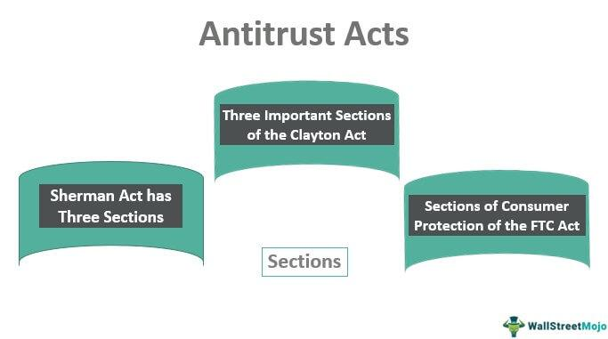

Antitrust laws play a crucial role in shaping the global commerce landscape by working to prevent anti-competitive practices and maintain fair competition. These laws have been instrumental in fostering an economic environment where businesses can compete on a level playing field, thereby ensuring consumer choice, innovation, and fair pricing. Initially designed to combat traditional forms of monopolistic behavior, antitrust laws have expanded in scope to address modern challenges such as digital monopolies and the rise of algorithmic trading.

Digital monopolies, characterized by companies that dominate online markets and control essential digital infrastructure, present unique challenges for antitrust authorities. These entities often engage in practices that hinder competition, such as leveraging vast amounts of data to stifle new entrants or using platform dominance to disadvantage competitors. For example, the rise of technology giants in e-commerce, search engines, and social media underscores the importance of adapting antitrust laws to effectively regulate market power in the digital age.



Simultaneously, the financial sector has witnessed a transformation with the introduction of algorithmic trading, where computer algorithms execute rapid and automated transactions. While algorithmic trading improves market efficiency and liquidity, it also raises concerns about potential anti-competitive practices, such as market manipulation and collusion. These concerns necessitate rigorous antitrust scrutiny to ensure fair competition and protect market integrity.

This article explores the intersection of antitrust laws, monopolistic controls, competition regulation, and algorithmic trading. By examining the functioning of antitrust laws, their significance in curbing monopolistic behavior, and their impact on algorithmic trading, we aim to provide a comprehensive understanding of these critical topics. Antitrust laws continue to serve as essential tools in regulating commerce and fostering dynamic markets, emphasizing the importance of their evolution to meet the demands of a rapidly changing global economy.

## Table of Contents

## Understanding Antitrust Laws

Antitrust laws are fundamental legal frameworks enacted to prevent the formation of monopolies and promote competitive market conditions, thereby benefiting consumers and businesses alike. At the heart of these laws are the Sherman Act, the Federal Trade Commission (FTC) Act, and the Clayton Act, each playing a critical role in regulating and maintaining market fairness.

The Sherman Act, enacted in 1890, is one of the earliest and most significant pieces of antitrust legislation. It prohibits business activities that are deemed to unreasonably restrict interstate commerce and competition in the marketplace. This includes two main areas: agreements among competitors to fix prices, rig bids, or allocate markets, and the attempt to monopolize a market, which undercuts the competitive process essential for consumer welfare.

The FTC Act of 1914 established the Federal Trade Commission and granted it the authority to prevent unfair methods of competition, as well as unfair or deceptive acts or practices in commerce. The FTC serves as a regulatory body to monitor and investigate various business practices, ensuring they comply with the principles of fair competition.

The Clayton Act, also passed in 1914, serves to supplement the Sherman Act by addressing specific practices that the earlier law did not clearly prohibit. The Clayton Act targets anti-competitive behaviors such as price discrimination, exclusive dealing agreements, and mergers and acquisitions that may substantially lessen competition or tend to create a monopoly.

These laws tackle various issues that can threaten competitive markets, including price fixing, where businesses agree on pricing rather than letting competition determine it naturally; bid rigging, which involves collusion among competitors to manipulate the outcome of a bidding process; and market allocation, where competitors divide markets amongst themselves to ensure higher profitability instead of fair competition.

Government enforcement is crucial for the effectiveness of antitrust laws. Agencies such as the FTC and the Department of Justice (DOJ) are tasked with investigating potential violations and can bring legal action against entities that breach these regulations. The enforcement process often involves complex market analyses and the interpretation of economic principles to determine whether particular business conduct harms competition.

In summary, antitrust laws are indispensable to maintaining a competitive economic environment by preventing monopolistic practices and encouraging healthy competition. These laws are continuously evolving to address emerging challenges in various sectors and are enforced through rigorous oversight by dedicated governmental agencies.

## Monopoly Control and Competition Regulation

Monopolies arise when a single firm or entity holds substantial control over a market segment, thereby reducing or eliminating competition. This dominance can lead to adverse outcomes such as inflated prices, reduced product quality, and stifled innovation, which ultimately harm consumers. Antitrust laws are devised to dismantle such monopolistic practices, ensuring fair competition and promoting consumer welfare through competitive pricing and continuous innovation. 

In the United States, several key pieces of legislation form the backbone of antitrust enforcement. The Sherman Antitrust Act of 1890 is one of the earliest and most significant statutes, prohibiting monopolistic behavior and conspiracies that restrict trade. The Clayton Act of 1914 further strengthened these provisions by addressing specific practices that the Sherman Act did not cover, like mergers and acquisitions that could substantially lessen competition. Complementing these is the Federal Trade Commission Act of 1914, establishing the Federal Trade Commission (FTC) to enforce these laws and protect consumer interests.

The enforcement of antitrust laws is primarily undertaken by regulatory bodies such as the FTC and the Department of Justice (DOJ). These bodies have the authority to investigate business practices and act against any that contravene antitrust regulations. This might include scrutinizing mergers and acquisitions that could potentially lead to a dominant market position or investigating practices like price fixing, where companies may collude to set prices at an artificially high level.

For example, the FTC might initiate an investigation into a proposed merger between two large telecommunications firms. If they determine that the merger would likely result in a monopoly, reducing choices and increasing prices for consumers, they may move to block the merger or require the companies to divest certain assets to maintain competition.

Python, with its analytical and data processing capabilities, can be used to model and simulate market dynamics under various competitive scenarios. This can be particularly useful in preemptively identifying market conditions that might give rise to monopolistic behavior. For instance, using libraries like NumPy and pandas, economists and analysts can assess the market impact of mergers:

```python
import numpy as np
import pandas as pd

# Simulated market share data before and after a merger
market_data = {
    'Company': ['A', 'B', 'C', 'Merged'],
    'Pre-Merger Share': [0.3, 0.2, 0.1, 0],
    'Post-Merger Share': [0, 0, 0.1, 0.5]  # Assuming Company A and B merge
}

df = pd.DataFrame(market_data)

# Calculate Herfindahl-Hirschman Index (HHI) to evaluate market concentration
df['Pre-Merger HHI'] = df['Pre-Merger Share'] ** 2
df['Post-Merger HHI'] = df['Post-Merger Share'] ** 2

pre_merger_hhi = df['Pre-Merger HHI'].sum() * 10000
post_merger_hhi = df['Post-Merger HHI'].sum() * 10000

print(f"Pre-Merger HHI: {pre_merger_hhi}")
print(f"Post-Merger HHI: {post_merger_hhi}")
```

The Herfindahl-Hirschman Index (HHI) is a commonly used measure of market concentration. A significant increase in HHI post-merger could indicate reduced competition, prompting regulatory scrutiny. By fostering such analyses, antitrust laws and their enforcement aim to mitigate monopoly power, ensuring a competitive and dynamic market landscape that benefits consumers and businesses alike.

## Algorithmic Trading and Antitrust Concerns

Algorithmic trading has fundamentally altered the dynamics of financial markets by enabling rapid and automated transactions. These algorithms, programmed to execute trades at speeds beyond human capability, improve market efficiency. However, the same technology poses significant challenges as it creates opportunities for market manipulation and collusion.

Concerns about market manipulation primarily center on strategies that exploit algorithms to deceive other market participants. Practices such as "quote stuffing," where an algorithm rapidly places and cancels large volumes of orders to create false market signals, exemplify tactics that can distort market prices and [liquidity](/wiki/liquidity-risk-premium). This type of manipulation complicates the ability of market forces to naturally establish fair prices.

Collusion facilitated by algorithms is another critical area of concern for antitrust authorities. When different firms' algorithms interact, there's a risk that they could learn and adapt to one another's strategies, potentially leading to implicit collusion without direct communication. Such behavior can result in higher prices or reduced choices for consumers, contravening antitrust principles aimed at maintaining competitive markets.

Antitrust authorities closely examine these practices, enforcing regulations to prevent any misuse of algorithmic strategies that could undermine fair competition. Agencies such as the U.S. Federal Trade Commission (FTC) and the Department of Justice (DOJ) employ sophisticated data analysis techniques and [machine learning](/wiki/machine-learning) models to identify and challenge anticompetitive behavior in electronic markets.

Efforts to regulate [algorithmic trading](/wiki/algorithmic-trading) within antitrust frameworks focus on improving transparency and accountability in digital transactions. Regulators may require firms to submit algorithms for review, ensure adherence to fair competition rules, and impose penalties for violations. Continuous monitoring and the development of comprehensive guidelines are imperative to manage the evolving complexity of algorithm-driven markets effectively. 

Thus, in the context of algorithmic trading, the vigilance of antitrust authorities is crucial. It ensures that while technology advances the capabilities of financial markets, it does not simultaneously erode the principles of fairness and competition essential for a healthy economic environment.

## Challenges and Future Directions

The integration of technology with finance presents significant challenges for antitrust regulations, which have traditionally focused on preventing monopolies and ensuring competitive practices. As technology evolves, so does the complexity of financial markets, particularly with the increasing prevalence of algorithmic trading. This evolution necessitates a parallel adaptation of antitrust laws to address novel concerns such as data usage, automation, and cross-border enforcement.

Algorithmic trading, which leverages complex algorithms and vast datasets to execute trades at high speeds, challenges traditional antitrust frameworks. An immediate concern is the potential for these algorithms to facilitate anti-competitive behavior such as collusion or market manipulation. Algorithms could potentially share information or manipulate market conditions, raising issues related to price-fixing or coordinated trading strategies. Antitrust authorities must therefore examine algorithms for embedded biases or tendencies that could contravene competitive norms.

Further complicating the enforcement of antitrust laws is the cross-jurisdictional nature of digital finance. Financial markets and trading platforms often operate across borders, creating challenges for regulatory bodies that traditionally have jurisdictional limitations. This international dimension requires coordinated efforts among global antitrust agencies to ensure consistent regulation and enforcement. Future regulations may need to encompass mechanisms for sharing data and intelligence about algorithmic activities across borders, enhancing the ability to recognize and respond to anti-competitive behaviors globally.

Data usage is another frontier in antitrust regulation. Algorithms rely on large volumes of data to function effectively, and the control of such data can become a source of competitive advantage or monopolistic power. Regulations may need to evolve to ensure that data aggregation does not lead to unfair market dominance or inhibit new entrants. Ensuring equitable access to data sources, while protecting consumer privacy and security, is essential for maintaining competition.

In conclusion, as technological advancements continue to reshape financial markets, regulators face the pressing challenge of evolving antitrust laws to keep pace with these changes. The adaptability of regulations to address issues such as algorithmic trading, data usage, and international cooperation is crucial for sustaining competitive and fair markets. Policymakers must balance the encouragement of innovation with the principles of antitrust, ensuring a level playing field for all market participants.

## Conclusion

Antitrust laws are crucial instruments in curbing monopolistic tendencies and fostering a competitive market environment. Their significance is highlighted in the ongoing digital transformation that reshapes global commerce. As technological advancements accelerate, antitrust regulators face the challenge of striking a delicate balance between encouraging innovation and enforcing regulations to ensure market integrity.

The digital economy, characterized by algorithmic trading and data-driven decision-making, introduces complexities that traditional antitrust frameworks must adapt to address. Algorithmic trading, which enables rapid and automated financial transactions, exemplifies these challenges. While it enhances market efficiency, it also poses risks of market manipulation and anti-competitive collusion. Consequently, antitrust laws must evolve to scrutinize algorithms and prevent practices detrimental to fair competition.

To maintain the effectiveness of antitrust regulations, continuous vigilance is essential. Regulators must continuously monitor technological advancements, adapting laws to cover emerging risks while facilitating beneficial innovations. The integration of technology and finance underscores the importance of flexible regulatory frameworks that can swiftly respond to dynamic market changes and transnational business models.

As digital platforms and algorithmic mechanisms become more prevalent, the role of antitrust enforcement agencies will likely expand, requiring them to develop new strategies and tools for preserving competitive markets. This includes addressing challenges related to cross-border enforcement and the global nature of digital commerce, which demands international cooperation and harmonization of regulatory actions.

In conclusion, antitrust laws remain vital to preventing monopolistic behavior and promoting competition. In the context of digital transformation and algorithmic trading, they require regular updates and adaptations to address new challenges while fostering innovation. Their evolving nature dictates the need for regulators to remain vigilant, ensuring that markets remain free from anti-competitive practices and continue to operate efficiently and fairly.

## References & Further Reading

[1]: ["The Antitrust Paradox"](https://en.wikipedia.org/wiki/The_Antitrust_Paradox) by Robert H. Bork

[2]: Posner, R. A. (2001). ["Antitrust Law, Second Edition"](https://press.uchicago.edu/ucp/books/book/chicago/A/bo3628468.html). University of Chicago Press.

[3]: Borgmann, M. (2019). ["Antitrust and Algorithmic Trading"](https://link.springer.com/book/10.1007/978-3-030-85859-9). Springer Gabler.

[4]: Stucke, M. E. (2013). ["Should We Be Concerned About Data-opolies?"](https://papers.ssrn.com/sol3/papers.cfm?abstract_id=3144045) Colorado Technology Law Journal.

[5]: Ariel Ezrachi & Maurice E. Stucke (2016). ["Virtual Competition: The Promise and Perils of the Algorithm-Driven Economy"](https://www.hup.harvard.edu/books/9780674241589). Harvard University Press.

[6]: Harrington, J. E. Jr. (2012). ["Game Theory and Antitrust: An Overview."](https://scholar.google.com/citations?user=JQGM1YUAAAAJ&hl=en) The Oxford Handbook of International Antitrust Economics.

[7]: U.S. Department of Justice, [Antitrust Division](https://www.justice.gov/atr) Official Website. 

[8]: Federal Trade Commission, ["Guide to Antitrust Laws"](https://www.ftc.gov/advice-guidance/competition-guidance/guide-antitrust-laws).