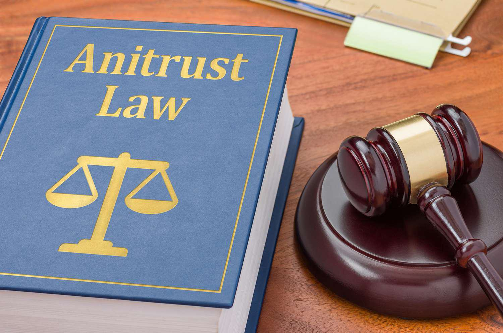

## Table of Contents

## What are antitrust laws?

Antitrust laws are rules that governments make to keep businesses from getting too powerful and hurting other businesses or customers. These laws help make sure that companies compete fairly with each other. This means that big companies can't do things like set very high prices or stop other companies from selling their products.

These laws are important because they help keep the market fair for everyone. When companies compete fairly, it can lead to better products and lower prices for customers. Antitrust laws also stop companies from working together to control the market, which could be bad for customers and other businesses. By making sure that no single company can control too much of the market, these laws help keep the economy healthy and competitive.

## Why were antitrust laws created?

Antitrust laws were created to stop big companies from having too much power and hurting smaller businesses and customers. A long time ago, some big companies started to control whole industries. They could set high prices and stop other companies from competing. This was bad for everyone else, so people and governments decided to make rules to stop this from happening.

These laws help make sure that businesses compete fairly. When companies have to compete, they try to make better products and charge lower prices to attract customers. This is good for everyone because it means more choices and better deals. Antitrust laws keep the market fair and stop big companies from taking over, which helps keep the economy healthy and growing.

## What is the main goal of antitrust laws?

The main goal of antitrust laws is to make sure that businesses compete fairly with each other. These laws stop big companies from getting too powerful and hurting smaller businesses or customers. When companies have to compete, they try harder to make better products and offer lower prices. This is good for everyone because it means more choices and better deals.

Antitrust laws also help keep the market fair and stop big companies from taking over. If one company controls too much of the market, it can set high prices and stop other companies from competing. By making sure that no single company can control too much, these laws help keep the economy healthy and growing.

## Can you name some key antitrust laws in the United States?

In the United States, one important antitrust law is the Sherman Antitrust Act. This law was made in 1890 to stop companies from working together to control prices or stop other companies from competing. It says that it's illegal for businesses to make agreements that hurt competition or try to control a whole industry. This law helps make sure that companies compete fairly and don't hurt customers or other businesses.

Another key law is the Clayton Antitrust Act, which was passed in 1914. This law makes it clearer what kinds of actions are not allowed under the Sherman Act. It stops companies from doing things like buying out other companies to control the market or giving special deals to some customers that hurt other customers. The Clayton Act also created the Federal Trade Commission (FTC), which helps make sure that businesses follow these rules.

The third important law is the Federal Trade Commission Act, also passed in 1914. This law set up the FTC to watch over business practices and stop unfair competition. The FTC can investigate companies and take action if they find that a company is breaking antitrust laws. These three laws work together to keep the market fair and make sure that businesses compete in a way that's good for everyone.

## How do antitrust laws affect businesses?

Antitrust laws make businesses follow fair rules. They stop big companies from doing things that hurt smaller businesses or customers. For example, these laws say that companies can't work together to set high prices or stop other companies from selling their products. If a company tries to take over too much of the market, antitrust laws can stop them. This means businesses have to compete fairly, which can be good for them because it pushes them to make better products and offer better prices.

These laws also mean that businesses have to be careful about how they grow. If a big company wants to buy another company, they have to make sure it doesn't break antitrust rules. Sometimes, they might need to get permission from the government first. This can make it harder for businesses to grow quickly, but it helps keep the market fair for everyone. Overall, antitrust laws make businesses think about how their actions affect others and help keep the economy healthy.

## What is considered an antitrust violation?

An antitrust violation happens when a company does something that goes against the rules meant to keep businesses competing fairly. This can include things like companies working together to set high prices, which is called price fixing. Another violation is when a big company tries to control a whole industry by buying out other companies or making it hard for new companies to start up. This is known as monopolization.

Another common violation is when a company gives special deals to some customers but not others, which can hurt competition. This is called discrimination in pricing. Also, if companies agree not to compete with each other in certain areas or for certain customers, that's called market allocation and it's against antitrust laws. These actions hurt other businesses and customers by making the market unfair.

Antitrust laws help stop these violations by watching over business practices. If a company breaks these rules, they can face big fines or even have to change how they do business. This makes sure that no single company can control too much and that everyone has a fair chance to compete.

## How are antitrust laws enforced?

Antitrust laws are enforced by government agencies like the Federal Trade Commission (FTC) and the Department of Justice (DOJ) in the United States. These agencies watch over businesses to make sure they are following the rules. If they find a company breaking antitrust laws, they can start an investigation. They might ask the company for information or even talk to people who work there. If they find enough evidence, they can take the company to court.

If a company is found guilty of breaking antitrust laws, it can face big fines or have to change how it does business. The government might make the company stop the bad behavior or even break up the company if it's too big. Sometimes, people who have been hurt by the company's actions can also sue the company to get money back. This helps make sure that businesses think twice before breaking the rules and keeps the market fair for everyone.

## What are some famous antitrust cases?

One famous antitrust case is the United States vs. Microsoft Corporation. This case started in the late 1990s. The government said Microsoft was using its power over the Windows operating system to hurt other companies. They said Microsoft made it hard for people to use other web browsers by making Internet Explorer part of Windows. In 2001, the court decided Microsoft broke antitrust laws. Microsoft had to let other companies make software that worked with Windows more easily. This case showed that even very big companies have to follow antitrust rules.

Another well-known case is the breakup of AT&T in the 1980s. AT&T was a huge phone company that controlled almost all the phone service in the United States. The government said AT&T was too big and was stopping other companies from competing. In 1982, AT&T agreed to split into smaller companies. This breakup made it easier for new phone companies to start up and compete. It helped make phone service better and cheaper for everyone. This case showed how antitrust laws can change big industries to make them fairer.

## How do antitrust laws vary internationally?

Antitrust laws can be different in different countries. Each country has its own rules about how businesses should compete fairly. In the United States, the main laws are the Sherman Antitrust Act, the Clayton Antitrust Act, and the Federal Trade Commission Act. These laws help stop big companies from hurting smaller ones or setting high prices. In the European Union, they have their own set of rules called the Treaty on the Functioning of the European Union, which has articles about competition. The European Commission watches over businesses to make sure they follow these rules.

Even though the goals of antitrust laws are similar around the world, the details can be different. For example, some countries might focus more on stopping companies from working together to set prices, while others might care more about stopping one company from getting too big. In China, the Anti-Monopoly Law helps stop unfair business practices, but the government also has a lot of control over how businesses operate. This can make the rules a bit different from what you see in the U.S. or Europe. Understanding these differences is important for businesses that want to work in different countries, because they have to follow the rules in each place.

## What role do mergers and acquisitions play in antitrust law?

Mergers and acquisitions are when one company buys another or when two companies join together. Antitrust laws watch these actions closely because they can change how companies compete. If a big company buys a smaller one, it might get too powerful and hurt other businesses. This could mean fewer choices for customers and higher prices. So, before a merger or acquisition happens, the companies might need to get permission from the government. They have to show that the deal won't hurt competition.

The government agencies, like the Federal Trade Commission (FTC) and the Department of Justice (DOJ) in the U.S., look at these deals carefully. They want to make sure that the market stays fair for everyone. If they think a merger or acquisition might hurt competition, they can stop it from happening. Sometimes, they might let the deal go through but only if the companies agree to certain rules. For example, they might have to sell off part of their business to keep the market balanced. This way, antitrust laws help keep businesses from getting too big and make sure they compete fairly.

## How do antitrust laws impact consumer welfare?

Antitrust laws help make sure that businesses compete fairly, which is good for consumers. When companies have to compete, they try to make better products and offer lower prices to attract customers. This means that people have more choices and can get better deals. Without these laws, big companies might set very high prices or stop other companies from selling their products. This would make it harder for people to find good products at fair prices.

These laws also stop companies from working together to control the market. If companies agree to set high prices or divide up the market, it hurts consumers because they end up paying more for less choice. Antitrust laws watch over these actions and can stop them from happening. By keeping the market fair, these laws help make sure that consumers can enjoy better products, more choices, and lower prices.

## What are the current challenges and debates surrounding antitrust laws?

There are many debates about antitrust laws today. One big issue is how to deal with big tech companies like Google, Amazon, and Facebook. Some people think these companies are too big and have too much power. They say that these companies can hurt smaller businesses and make it hard for new companies to start up. Others argue that these big tech companies help the economy grow and give people lots of good services. It's hard to decide how much control these companies should have and what rules they should follow.

Another challenge is figuring out how to apply old antitrust laws to new technology. The laws were made a long time ago, and some people think they don't work well for today's digital world. For example, it's hard to know how to stop companies from using data in unfair ways. There's also a debate about whether the government agencies that watch over these laws have enough power and resources to do their job well. People are trying to figure out how to update these laws to make sure they keep the market fair for everyone in the modern world.

## References & Further Reading

[1]: European Commission. (2017). Antitrust: Commission fines Google €2.42 billion for abusing dominance as search engine by giving illegal advantage to own comparison shopping service. Retrieved from [https://ec.europa.eu/commission/presscorner/detail/en/ip_17_1784](https://ec.europa.eu/commission/presscorner/api/files/document/print/en/ip_17_1784/IP_17_1784_EN.pdf)

[2]: Federal Trade Commission. (2020). FTC Sues Facebook for Illegal Monopolization. Retrieved from [https://www.ftc.gov/news-events/press-releases/2020/12/ftc-sues-facebook-illegal-monopolization](https://www.ftc.gov/news-events/news/press-releases/2020/12/ftc-sues-facebook-illegal-monopolization)

[3]: Khan, L. M. (2017). Amazon’s Antitrust Paradox. Yale Law Journal, 126, 710-805. Retrieved from [https://www.yalelawjournal.org/note/amazons-antitrust-paradox](https://www.yalelawjournal.org/pdf/e.710.Khan.805_zuvfyyeh.pdf)

[4]: Veljanovski, C. (2020). Algorithmic and AI Collusion: Are Competition Authorities Ready? Journal of Competition Law & Economics, 16(3), 536-575. 

[5]: Ezrachi, A., & Stucke, M. E. (2016). Virtual Competition: The Promise and Perils of the Algorithm-Driven Economy. Harvard University Press. 

[6]: Jones, C. S. (2013). Misconduct in Financial Markets: Regulation, Disciplining and the Law. Routledge.

[7]: Athey, S., & Imbens, G. (2017). The State of Applied Econometrics: Causality and Policy Evaluation. Journal of Economic Perspectives, 31(2), 3-32. 

[8]: Berman, B. (2018). How to Overcome the Challenges of Implementing Predictive Analytics. Business Horizons, 61(3), 409-419. 

[9]: Schumpeter, J. A. (1942). Capitalism, Socialism and Democracy. Harper & Brothers. 

[10]: Financial Conduct Authority. (2018). Algorithmic Trading Compliance in Wholesale Markets. Retrieved from [https://www.fca.org.uk/publications/multi-firm-reviews/algorithmic-trading-compliance-wholesale-markets](https://www.fca.org.uk/publications/multi-firm-reviews/algorithmic-trading-compliance-wholesale-markets)