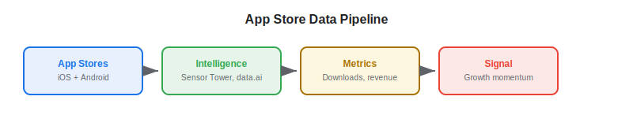
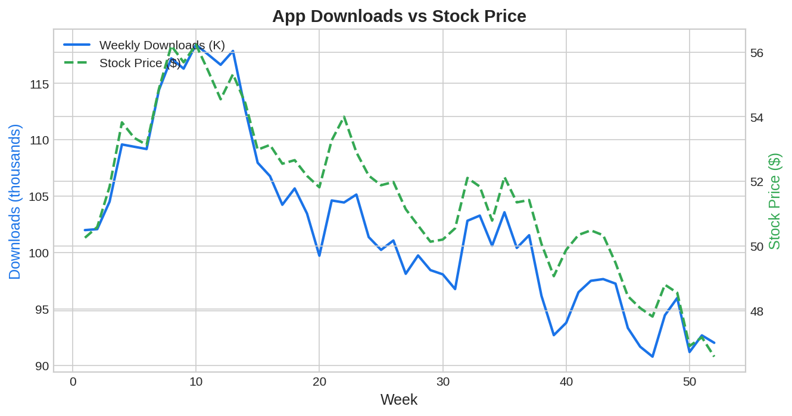

App store data and mobile usage metrics have become valuable [alternative data](https://paperswithbacktest.com/wiki/best-alternative-data) for algo traders targeting technology, gaming, social media, and consumer internet companies. Daily app rankings, download estimates, in-app revenue, and user engagement metrics provide a real-time window into a company's product adoption trajectory — often weeks before quarterly earnings reveal the numbers.

## What Is App Store Data in Trading?

App store data encompasses metrics derived from Apple's App Store and Google Play Store: download estimates (daily/weekly installs per app), revenue estimates (in-app purchases and subscriptions), ranking positions (by category and overall), ratings and review volumes, and daily/monthly active user estimates.

For companies whose revenue is driven by mobile apps — Spotify, Uber, DoorDash, Roblox, Match Group, Duolingo — these metrics are leading indicators of reported user growth and revenue. A sustained rise in App Store rankings for a company's flagship app typically precedes a strong earnings report.

The app economy has grown to the point where mobile metrics are now financially material for a significant portion of public equities. As of 2025, global app store consumer spending exceeds $170 billion annually, and hundreds of publicly traded companies derive a majority of their revenue from mobile applications or in-app transactions. For these companies, app store data provides a near-real-time window into their business that no other data source matches.

The rise of app data as a trading signal parallels the growth of the mobile-first economy. Sensor Tower, founded in 2013, and App Annie (now data.ai), founded in 2010, built businesses by reverse-engineering app store algorithms and using statistical models to estimate download volumes and revenue from observable data points — chart rankings, review counts, and installed-base surveys. These estimates are not exact, but they are directionally accurate enough to predict quarterly user growth metrics within a reasonable margin of error.

A particularly powerful signal emerges from the **gap between app data trends and analyst expectations**. Sell-side analysts covering mobile-first companies typically update their models quarterly, relying on management guidance and historical trends. App store data, by contrast, updates daily. When downloads for a company's app accelerate mid-quarter due to a viral marketing campaign, a product update, or a competitor stumble, the app data reflects this within days — while the analyst consensus remains anchored to the prior quarter's trajectory. This gap is the trading opportunity.

The signal is also valuable for detecting **negative surprises**. If a company's flagship app drops sharply in the App Store rankings, or if download estimates decline while management has publicly guided for user growth acceleration, the discrepancy often resolves in favor of the data: the earnings report disappoints. This asymmetric information is particularly valuable for options strategies around earnings announcements.

## How App Data Creates Trading Signals

### Download Momentum

The core signal: are downloads accelerating, decelerating, or stable relative to analyst expectations? For a company like Spotify, download trends across iOS and Android markets provide a global view of subscriber acquisition.

$$\text{Download Momentum} = \frac{\text{Downloads}_{current\_week}}{\text{Downloads}_{same\_week\_last\_year}} - 1$$

### Revenue Estimation

App intelligence platforms estimate in-app revenue by combining download volumes with average revenue per download (ARPDL) metrics. For gaming companies (Roblox, Take-Two) and subscription apps (Tinder, Duolingo), this provides a bottom-up revenue build.

### Competitive Share Analysis

Tracking relative download rankings across competing apps reveals market share shifts. If Uber's downloads are flat while Lyft's are surging, it suggests a competitive dynamics change worth trading.



## Key App Data Vendors

| Vendor | Data Coverage | Key Metrics | Approximate Cost |
|---|---|---|---|
| Sensor Tower | iOS + Android, global | Downloads, revenue, rankings | $50K–$300K/year |
| data.ai (App Annie) | iOS + Android, 150+ countries | Downloads, usage, revenue | $50K–$400K/year |
| Apptopia | iOS + Android, global | Downloads, DAU/MAU, SDK data | $30K–$150K/year |
| SimilarWeb | Web + mobile, global | App engagement, traffic | $30K–$200K/year |

## Python Implementation: App Download Signal

```python
import numpy as np
import pandas as pd

def compute_app_signal(
    download_data: pd.DataFrame,
    ticker: str,
    app_names: list[str],
    lookback_days: int = 28
) -> dict:
    """
    Compute trading signal from app download trends.
    
    Parameters:
    - download_data: DataFrame [date, app_name, downloads_est, revenue_est]
    - ticker: Associated stock ticker
    - app_names: App(s) belonging to this company
    - lookback_days: Period for trend calculation
    """
    df = download_data[download_data["app_name"].isin(app_names)].copy()
    df = df.sort_values("date")
    
    # Aggregate across company's apps
    daily = df.groupby("date").agg(
        total_downloads=("downloads_est", "sum"),
        total_revenue=("revenue_est", "sum")
    ).reset_index()
    
    if len(daily) < lookback_days * 2:
        return {"signal": "INSUFFICIENT_DATA"}
    
    recent = daily.tail(lookback_days)
    prior = daily.iloc[-(2*lookback_days):-lookback_days]
    
    dl_growth = (recent["total_downloads"].mean() - prior["total_downloads"].mean()) / prior["total_downloads"].mean()
    rev_growth = (recent["total_revenue"].mean() - prior["total_revenue"].mean()) / prior["total_revenue"].mean()
    
    composite = 0.5 * dl_growth + 0.5 * rev_growth
    
    return {
        "ticker": ticker,
        "download_growth": f"{dl_growth:+.1%}",
        "revenue_growth": f"{rev_growth:+.1%}",
        "composite_score": f"{composite:+.3f}",
        "signal": "LONG" if composite > 0.05 else "SHORT" if composite < -0.05 else "NEUTRAL",
    }

# Simulated data
np.random.seed(42)
dates = pd.date_range("2025-06-01", periods=60, freq="D")
data = pd.DataFrame({
    "date": np.tile(dates, 2),
    "app_name": np.repeat(["MainApp", "CompanionApp"], 60),
    "downloads_est": np.concatenate([
        np.random.poisson(50000, 60) + np.arange(60) * 200,
        np.random.poisson(15000, 60) + np.arange(60) * 50
    ]),
    "revenue_est": np.concatenate([
        np.random.poisson(120000, 60) + np.arange(60) * 800,
        np.random.poisson(30000, 60) + np.arange(60) * 150
    ]),
})

result = compute_app_signal(data, "DUOL", ["MainApp", "CompanionApp"])
for k, v in result.items():
    print(f"  {k}: {v}")
```



## Limitations and Risks

**Estimation uncertainty**: Vendors estimate downloads and revenue from panel data and statistical models — actual figures can deviate by 15–30%. Cross-reference multiple vendors when possible.

**Platform policy changes**: Apple and Google periodically change App Store algorithms, promotion mechanics, and privacy policies (e.g., ATT on iOS), which can disrupt download patterns independent of company performance.

**Multi-platform complexity**: Revenue may shift between web, mobile, and desktop. App-only data may miss significant portions of a company's business.

## Conclusion

App store data provides a uniquely granular, daily view of product adoption for mobile-first companies. For algo traders covering tech and consumer internet, download and revenue estimates offer a 2–4 week lead on quarterly user growth and revenue metrics. Combine with [web traffic data](https://paperswithbacktest.com/wiki/web-traffic-alternative-data) for a fuller picture of a company's digital engagement.

---

**Explore further on PapersWithBacktest:**
- Browse [backtested tech strategies](https://paperswithbacktest.com/strategies) with Python code and performance metrics
- Access [clean historical market data](https://paperswithbacktest.com/datasets) for equities, crypto, and futures
- Take the [algo trading course](https://paperswithbacktest.com/course) — 60+ video lessons and notebooks
- Related wiki pages: [Web Traffic Alternative Data](https://paperswithbacktest.com/wiki/web-traffic-alternative-data) · [Best Alternative Data Sources](https://paperswithbacktest.com/wiki/best-alternative-data)
