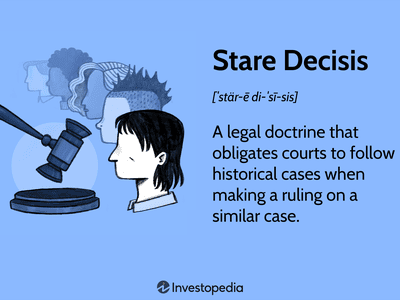

The judicial system is a cornerstone of governance and societal order, playing a pivotal role in interpreting and enforcing the law. It is comprised of various levels of courts with distinct functions, ranging from trial courts that ascertain facts to appellate courts that ensure the law is applied correctly. The efficiency and fairness of the judicial system are critical to upholding the rule of law, preserving rights, and maintaining market stability.

Appellate courts, in particular, serve as the arbiters of legal accuracy and are essential for implementing the judicial review process. They ensure that decisions made in lower courts adhere to legal standards and provide a mechanism for correcting errors. Through their interpretation of laws, appellate courts shape legal precedents that affect both individuals and the broader economy.

Algorithmic trading, a domain heavily reliant on technology, epitomizes the intersection of legal frameworks with modern financial markets. This method of trading uses complex algorithms to automate decision-making in buying and selling securities, dramatically impacting market dynamics. The legality and ethical implications of such automated systems fall under the scrutiny of the legal system, particularly when issues of market manipulation or unfair advantages arise.

This article aims to examine how appellate courts influence the landscape of algorithmic trading through judicial decisions and reviews. Understanding this relationship is crucial for stakeholders in the financial industry, as well as regulators, as it highlights the ongoing evolution of legal standards in response to technological advancements in trading. By exploring these intersections, we gain insights into the profound effects that judicial decisions have on financial markets, ultimately shaping the way technology interacts with trade and commerce.

## Table of Contents

## Understanding the Judicial System

The judicial system in the United States operates under a dual court system comprising both Federal and State courts. This structure allows for the distribution of judicial responsibilities and jurisdiction between these two levels, enabling the management of a vast array of legal matters ranging from local disputes to significant federal issues.

### Federal Court System

The Federal court system is organized in a hierarchical manner with three main levels: District Courts, Circuit Courts of Appeals (Appellate Courts), and the Supreme Court.

1. **District Courts**: These are the general trial courts of the Federal system, where most federal cases begin. The United States is divided into 94 judicial districts, each having at least one District Court. These courts have jurisdiction to hear nearly all categories of federal cases, including both civil and criminal matters.

2. **Circuit or Appellate Courts**: Upon appeal, cases move from the District Courts to the Circuit Courts, commonly known as the Courts of Appeals. There are 13 appellate courts that are divided into 12 regional circuits and 1 Federal Circuit. These courts are responsible for reviewing cases appealed from the District Courts, ensuring the legal process's accuracy and fairness. Appellate Courts do not hold trials but rather review the application of the law to the facts of an original case. They typically review the trial court record and determine whether there have been any legal errors that warrant a reversal or modification of the decision.

3. **Supreme Court**: As the highest court in the United States, the Supreme Court has ultimate appellate jurisdiction over all federal and state court cases involving issues of federal law. It also holds the power of judicial review, allowing it to declare laws and executive actions unconstitutional. The Supreme Court selectively reviews cases, usually those of substantial importance.

### Role of Appellate Courts

Appellate Courts play a crucial role in the judicial system by ensuring that the laws are interpreted and applied correctly. They serve primarily three functions:

- **Legal Accuracy**: Appellate Courts ensure that laws are interpreted consistently and correctly. They assess whether the lower courts have correctly applied the law in arriving at their decisions.

- **Judicial Review**: These courts have a significant role in reinforcing judicial review, which involves the examination of laws and their adherence to the Constitution. Appellate decisions can impact existing laws, sometimes leading to changes in legal frameworks.

- **Precedent Setting**: Decisions made by Appellate Courts, especially the Supreme Court, become precedents that lower courts must follow. These precedents guide how laws are applied and interpreted, thereby impacting subsequent case decisions and legislative measures.

Through their oversight and interpretation of laws, Appellate Courts fulfill a fundamental role in maintaining the legal system's integrity and coherence across the United States' complex and multi-layered judicial framework.

## Functions and Importance of Appellate Courts

Appellate courts serve as critical components of the judicial system, primarily tasked with ensuring the correct application and interpretation of the law. These courts do not conduct trials but rather review the procedures and decisions of lower courts to determine if any legal errors were made that could affect the outcome of a case. Their importance is underscored by their role in maintaining consistency in the legal system, providing a mechanism for error correction, and clarifying and interpreting laws.

One of the fundamental functions of appellate courts is to scrutinize the legal principles applied by trial courts. This includes reviewing the trial court's interpretation of statutory provisions, assessment of facts under legal standards, and the application of legal principles. Through this meticulous review process, appellate courts play an instrumental role in shaping the legal landscape by establishing precedents that guide future judicial decisions.

Appellate courts significantly influence legal interpretations and the economy by addressing complex legal questions that pertain to economic activities and corporate behavior. For example, appellate rulings on antitrust cases can shape market operations and competition policies, thereby affecting the broader economic environment. Decisions in securities litigation can dictate how financial institutions operate, potentially influencing market stability and investor confidence.

A notable example is the United States Court of Appeals' decision in the case of "Citizens United v. Federal Election Commission", which had far-reaching economic and political implications. The ruling, which allowed corporations and unions to spend unlimited amounts on political campaigns, has impacted corporate strategy and political influence.

In another significant case, "Leegin Creative Leather Products, Inc. v. PSKS, Inc.", the Supreme Court, on a decision reviewed by appellate courts, overturned a long-standing precedent regarding minimum resale price agreements. This decision had critical implications for businesses in terms of pricing strategies and competitive practices, thus illustrating how appellate court decisions can influence corporate economic conduct.

Appellate courts also resolve disputes that involve complex commercial transactions and corporate governance, thereby influencing regulatory practices and corporate compliance. Their decisions can lead to the development of new regulatory standards or the reinterpretation of existing ones, impacting how corporations operate across different sectors.

In summary, appellate courts serve as essential arbiters in the legal system, ensuring that laws are applied accurately while simultaneously influencing the broader economic and regulatory landscape through their decisions. Their rulings not only correct legal errors but also establish precedents that shape future judicial interpretations and corporate practices.

## Algorithmic Trading: An Overview

Algorithmic trading refers to the use of automated and algorithm-driven strategies to execute trades in financial markets. The primary principle behind [algorithmic trading](/wiki/algorithmic-trading) is the use of complex mathematical models and formulas to make high-speed decisions on trades, often without human intervention. This method capitalizes on the simultaneous use of different strategies such as [arbitrage](/wiki/arbitrage), [trend following](/wiki/trend-following), and mean reversion to achieve optimal pricing decisions and maximize profits.

The intersection of technology and legal systems in algorithmic trading is becoming increasingly intricate. Algorithmic trading is heavily reliant on sophisticated technology infrastructure, including high-frequency trading ([HFT](/wiki/high-frequency-trading-strategies)) systems and direct market access platforms. These technologies allow for the execution of trades at speeds and volumes far beyond human capabilities. The legal systems intersect by imposing regulations intended to ensure fair play and prevent market manipulation.

Key legal challenges in algorithmic trading include issues of market fairness, manipulation, and the potential for systemic risk. Regulations such as the Market Abuse Regulation (MAR) in the EU and the oversight of the Securities and Exchange Commission (SEC) in the United States set boundaries and compliance standards for algorithmic trading. These frameworks aim to mitigate risks such as spoofing, layering, and front running. Moreover, algorithms must be transparent and adhere to guidelines that prevent unfair advantage due to latency arbitrage. Ensuring compliance involves rigorous testing and continuous monitoring, often requiring advanced audit trails and record-keeping of algorithmic activities to satisfy legal scrutiny.

Overall, while algorithmic trading provides efficiency and [liquidity](/wiki/liquidity-risk-premium) to capital markets, it also necessitates a robust regulatory framework to prevent exploitation, ensure transparency, and protect investors and the financial system. As technology advances, the legal challenges and regulatory landscape will continue to evolve to address emerging risks and opportunities associated with algorithmic trading.

## Legal Implications of Algorithmic Trading

Algorithmic trading refers to the use of computer algorithms to automate trading decisions and execute orders in financial markets. As the reliance on such automated systems has grown, so too have the legal and regulatory challenges associated with them. The complexity of algorithmic trading introduces several critical legal aspects that must be addressed to ensure fair and transparent market operations.

One of the primary regulatory bodies overseeing algorithmic trading in the United States is the Securities and Exchange Commission (SEC). The SEC is responsible for enforcing securities laws to promote market integrity and protect investors. Given the high-speed and high-frequency nature of algorithmic trading, there is potential for market manipulation, system errors, and unfair advantages. Consequently, the SEC has implemented a series of regulations to mitigate these risks. For example, Rule 15c3-5 requires brokers executing trades to maintain risk management controls to prevent erroneous orders that could disrupt the market.

In addition to the SEC, the Commodity Futures Trading Commission (CFTC) plays a role in regulating algorithmic trading, particularly in futures and derivatives markets. Both the SEC and CFTC are involved in monitoring and regulating practices that could lead to flash crashes or systemic risks. Regulatory bodies in other jurisdictions, such as the European Securities and Markets Authority (ESMA), are also tightening their rules concerning high-frequency trading (HFT) and algorithmic trading.

Legal scrutiny impacts algorithmic trading strategies and the companies that deploy them by necessitating compliance with stringent regulatory standards. This scrutiny can lead to significant changes in trading strategies to ensure they are not only profitable but also compliant with existing laws. For instance, algorithmic trading firms must conduct regular audits and implement robust risk management procedures to prevent unintended consequences, such as market disruption.

Moreover, the legal landscape continues to evolve as technology advances. Regulatory bodies require firms to maintain detailed records of trading algorithms and conduct regular testing to ensure they function as intended. This need for documentation and testing represents an administrative and financial burden on trading firms, potentially affecting their overall strategy and operations.

Legal implications broaden into areas such as intellectual property rights concerning the proprietary nature of algorithms, data usage policies, and cybersecurity concerns that could arise from potential breaches. As regulators strive to keep pace with rapid technological advancements, trading entities must remain vigilant in adapting to these changes to avoid legal complications.

In conclusion, the intersection of algorithmic trading and the legal framework governing it presents a complex landscape that demands continuous attention. As regulatory bodies aim to ensure fairness and protect market participants, firms engaged in algorithmic trading must navigate these legal waters carefully to maintain compliance and achieve successful outcomes.

## The Role of Appellate Courts in Regulating Algorithmic Trading

Appellate courts play a crucial role in regulating algorithmic trading by interpreting and enforcing the intricate legal frameworks that govern financial markets. As algorithmic trading relies heavily on technology and operates at rapid speeds, it often challenges existing regulatory structures, necessitating judicial oversight and reinterpretation.

Appellate court cases relevant to algorithmic trading typically address issues such as market manipulation, compliance with securities laws, and the adequacy of regulatory oversight. These courts assess whether the actions of traders and firms align with statutory obligations and regulatory expectations, ensuring that the principles of fair and orderly markets are upheld. Through their decisions, appellate courts provide clarity and guidance on the permissible use of algorithms and automated systems in trading practices.

Significantly, appellate decisions influence regulatory reforms and legal frameworks by establishing precedents that shape future regulatory policies. For instance, in cases where courts have identified gaps in existing regulations regarding algorithmic trading, their rulings have often prompted legislative bodies and regulatory agencies such as the Securities and Exchange Commission (SEC) to enact or amend regulations to better address the complexities of automated trading systems. This judicial feedback loop ensures that regulatory frameworks evolve in conjunction with technological advancements in the financial sector.

Case studies on notable appellate court rulings illustrate the impact of these decisions on algorithmic trading. For example, in the case of *United States v. Coscia*, the defendant, Michael Coscia, was convicted of commodities fraud and spoofing, a form of market manipulation involving algorithmic trading strategies. The appellate court upheld the conviction, emphasizing that Coscia's use of algorithms to create a false impression of market demand violated the Commodity Exchange Act. This ruling reinforced the prohibition of deceptive and manipulative practices in algorithmic trading and clarified the legal standards applicable to such conduct.

Another relevant case is *SEC v. Citadel Execution Services*, where the appellate court reviewed the SEC's sanctions against Citadel for allegedly using algorithms that disadvantaged retail investors. The court's decision highlighted the importance of transparency and fairness in algorithmic trading, prompting discussions on the need for enhanced disclosure requirements and safeguards to protect market participants.

These case studies demonstrate that appellate courts are instrumental in defining the boundaries of lawful algorithmic trading activities. By interpreting complex regulatory frameworks and adjudicating disputes, these courts ensure that the rapid evolution of technology in financial markets does not outpace the legal protections afforded to investors and market integrity.

## Conclusion

The judicial system plays a critical role in shaping the landscape of financial markets, particularly in the context of algorithmic trading. By exercising oversight and enforcing regulations, courts ensure that trading practices adhere to legal and ethical standards. This is essential as the financial markets become increasingly reliant on automated systems and technology-driven trading strategies. The proper functioning of the judicial system safeguards the integrity of these markets, thereby maintaining investor confidence and economic stability.

Appellate courts, in particular, are pivotal in interpreting and enforcing laws that govern complex financial activities. Their decisions set precedents that influence how legal frameworks are applied to novel trading technologies. By reviewing cases related to trading practices, appellate courts can either uphold or challenge the regulatory approaches adopted by bodies such as the Securities and Exchange Commission (SEC). Through this process, appellate courts contribute significantly to the evolution of legal standards, ensuring that they remain relevant in the face of technological advancements.

Looking ahead, the intersection of law and technology in financial trading will continue to evolve. As algorithmic trading algorithms become more sophisticated, legal systems will be challenged to address new risks and ethical concerns. Issues such as market manipulation, data privacy, and cybersecurity are likely to be at the forefront of legal discourse. The proactive involvement of appellate courts will be essential in addressing these challenges, adapting existing laws, and fostering innovation while protecting market participants.

In summary, while algorithmic trading offers substantial efficiencies and opportunities, it also presents unique challenges that require robust legal oversight. The role of appellate courts is indispensable in navigating these challenges, ensuring that advancements in technology align with legal principles, and supporting the continued growth and fairness of the financial markets.

## References

1. U.S. Courts. "Understanding the Federal Courts." Retrieved from https://www.uscourts.gov/about-federal-courts/educational-resources/educational-activities/understanding-federal-courts.

2. Securities and Exchange Commission (SEC). "Rule 15c3-5: Risk Management Controls for Brokers or Dealers with Market Access." Retrieved from https://www.sec.gov/rules/final/2010/34-63241.pdf.

3. Securities and Exchange Commission (SEC). "Algorithmic Trading: Overview." Retrieved from https://www.sec.gov/spotlight/algorithmic-trading.

4. The National Law Review. "Legal Implications of Algorithmic Trading." Retrieved from https://www.natlawreview.com/article/digital-transformation-and-legal-risk-algorithmic-trading.

5. Financial Industry Regulatory Authority (FINRA). "Consolidated Audit Trail: Tracking Algorithmic Trading." Retrieved from https://www.finra.org/rules-guidance/key-topics/consolidated-audit-trail.

6. Federal Judicial Center. "The Role of Federal Courts in the Regulation of Financial Markets." Retrieved from https://www.fjc.gov/history/exhibits/evolution-banking/federal-courts-financial-markets.

7. Investopedia. "Algorithmic Trading: Definition, Basics, and Examples." Retrieved from https://www.investopedia.com/terms/a/algorithmictrading.asp.

8. Cornell Law School, Legal Information Institute. "Judicial Review: An Overview." Retrieved from https://www.law.cornell.edu/wex/judicial_review.

9. Harvard Law Review. "The Impact of Appellate Court Decisions on Market Practices." Retrieved from https://harvardlawreview.org/.

10. Financial Times. "The Emerging Legal Framework for Algorithmic Trading." Retrieved from https://www.ft.com/topic/algorithmic-trading.

## References & Further Reading

[1]: U.S. Courts. ["Understanding the Federal Courts."](https://www.uscourts.gov/sites/default/files/understanding-federal-courts.pdf)

[2]: Securities and Exchange Commission (SEC). ["Algorithmic Trading: Overview."](https://www.sec.gov/files/Algo_Trading_Report_2020.pdf)

[3]: The National Law Review. ["Legal Implications of Algorithmic Trading."](https://thefranklinlaw.com/legal-implications-of-algorithmic-trading-and-financial-regulation/)

[4]: Financial Industry Regulatory Authority (FINRA). ["Consolidated Audit Trail: Tracking Algorithmic Trading."](https://www.finra.org/rules-guidance/key-topics/consolidated-audit-trail-cat)

[5]: Investopedia. ["Algorithmic Trading: Definition, Basics, and Examples."](https://www.investopedia.com/articles/active-trading/101014/basics-algorithmic-trading-concepts-and-examples.asp)

[6]: Federal Judicial Center. ["The Role of Federal Courts in the Regulation of Financial Markets."](https://www.fjc.gov/)

[7]: Harvard Law Review. ["The Impact of Appellate Court Decisions on Market Practices."](https://harvardlawreview.org/print/vol-138/curation-narration-erasure-power-and-possibility-at-the-u-s-supreme-court/)

[8]: Financial Times. ["The Emerging Legal Framework for Algorithmic Trading."](https://www.ft.com/content/6c81d7e1-6f8c-3011-a553-05909b198fdf)