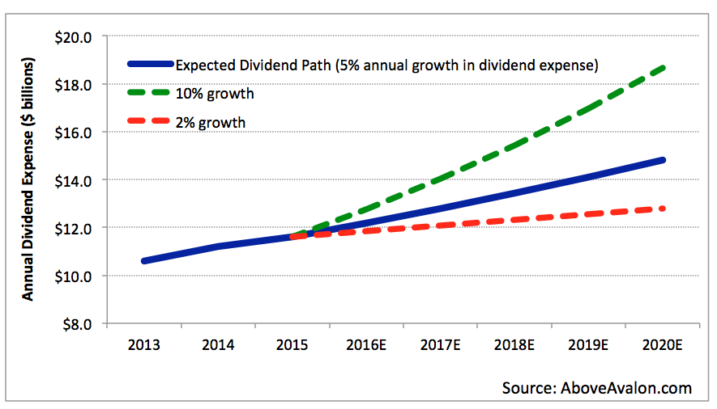

## Table of Contents

## What is a dividend and why do companies like Apple pay them?

A dividend is money that a company pays to its shareholders. It's like a reward for owning part of the company. When a company makes a profit, it can choose to give some of that profit back to the people who own its stock. This payment usually happens a few times a year.

Companies like Apple pay dividends for a few reasons. First, it shows that the company is doing well and making money. When Apple pays a dividend, it tells investors that the company is stable and profitable. Second, paying dividends can make more people want to buy the company's stock. If investors know they can get regular payments, they might be more likely to invest in Apple. This can help the company's stock price stay strong or even grow.

## How often does Apple Inc. pay dividends to its shareholders?

Apple Inc. pays dividends to its shareholders every three months. This means they pay four times a year. Each payment is called a quarterly dividend.

The exact dates for these payments can change a bit each year, but Apple usually announces them in advance. Shareholders need to own the stock by a certain date to get the dividend. This date is called the "record date." If you own Apple stock on the record date, you will get the dividend payment a few weeks later.

## What was the most recent dividend payout amount for Apple Inc.?

The most recent dividend payout from Apple Inc. was $0.25 per share. This payment was made on August 17, 2023, to shareholders who owned the stock on the record date of August 14, 2023.

Apple has been paying dividends since 2012 and has increased the amount over time. This shows that the company is doing well and wants to share its success with its shareholders. The next dividend payment is expected to be announced soon, and it will likely follow the same quarterly schedule.

## What is the current dividend yield for Apple Inc. stock?

The current dividend yield for Apple Inc. stock is around 0.5%. This means if you own $100 worth of Apple stock, you would get about 50 cents in dividends every year. The dividend yield can change because it depends on the stock price and the dividend amount.

Dividend yield is calculated by taking the yearly dividend per share and dividing it by the stock's current price. For Apple, the yearly dividend is $1.00 per share (since they pay $0.25 every quarter). If the stock price is around $200, the yield would be $1.00 divided by $200, which equals 0.5%. Keep in mind that the stock price changes every day, so the yield can go up or down.

## How has Apple's dividend payout changed over the past five years?

Over the past five years, Apple has been increasing its dividend payout. In 2019, Apple paid a quarterly dividend of $0.77 per share each year, which means $0.1925 every three months. By 2023, the annual dividend had grown to $1.00 per share, with a quarterly payment of $0.25. This shows that Apple has been steadily raising its dividend, which is good news for shareholders.

The reason Apple can keep increasing its dividend is because the company has been doing well and making more money each year. When a company's profits go up, it can afford to pay more to its shareholders. Apple's growth in products like the iPhone and services like Apple Music has helped the company earn more, allowing them to share more with investors through higher dividends.

## What factors influence Apple's decision to increase or decrease its dividend?

Apple's decision to increase or decrease its dividend depends on how much money the company is making. If Apple is doing well and making more profit, it can afford to pay more to its shareholders. This is why Apple has been able to increase its dividend over the years. The company's success with products like the iPhone and services like Apple Music helps it earn more money, which can then be shared with investors.

On the other hand, if Apple faces challenges and its profits go down, it might need to decrease its dividend or keep it the same. This could happen if fewer people are buying Apple's products or if the company has to spend more money on new projects. Apple always wants to make sure it can keep paying dividends, so it looks at its financial health carefully before making any changes.

## How does Apple's dividend yield compare to the average in the technology sector?

Apple's dividend yield is around 0.5%, which is lower than the average for the technology sector. The average dividend yield for tech companies can be between 1% and 2%. This means that if you invest in other tech companies, you might get a higher return from dividends than you would from Apple.

The reason Apple's yield is lower is because its stock price is very high. Even though Apple pays a good amount in dividends, the high stock price makes the yield smaller. Many tech companies have lower stock prices, so their dividend yields can be higher even if they pay less in dividends.

## What is the payout ratio for Apple Inc., and what does it indicate about the company's dividend sustainability?

Apple's payout ratio is around 15%. This means that for every dollar Apple makes in profit, it pays out about 15 cents to its shareholders as dividends. A low payout ratio like this shows that Apple is keeping most of its profits to use for other things, like growing the business or saving for the future.

A low payout ratio is a good sign for dividend sustainability. It means Apple has plenty of money left after paying dividends, so it can keep paying them even if things get tough. If Apple keeps making money and growing, it can probably keep increasing its dividends too. This makes the dividend seem safe and likely to continue for a long time.

## How does Apple's dividend growth rate compare to its peers in the S&P 500?

Apple's dividend growth rate over the past few years has been steady but not the highest among its peers in the S&P 500. Apple has been increasing its dividend every year, with the annual dividend going from $0.77 per share in 2019 to $1.00 per share in 2023. This shows a consistent growth, but it's not as fast as some other companies in the S&P 500. For example, companies like Microsoft and Visa have also been increasing their dividends, sometimes at a faster rate than Apple.

When looking at other tech companies in the S&P 500, Apple's dividend growth rate is competitive but not the leader. Some companies focus more on growing their dividends quickly to attract investors, while Apple balances its growth with keeping a lot of money for other uses. This approach helps Apple keep its dividends sustainable over the long term, even if the growth rate is not the highest among its peers.

## What are the tax implications for investors receiving dividends from Apple Inc.?

When investors get dividends from Apple Inc., they have to pay taxes on that money. In the United States, dividends are usually taxed at a lower rate than regular income. This is called the "qualified dividend" rate, which can be 0%, 15%, or 20% depending on your income. If you hold Apple stock for more than 60 days during the 121-day period that begins 60 days before the ex-dividend date, the dividend is considered qualified and gets this lower tax rate.

However, if you don't meet the holding period requirement, the dividend is taxed as ordinary income. This means it could be taxed at your regular income tax rate, which can be much higher. It's important for investors to know these rules because it can affect how much money they keep after taxes. Always talk to a tax advisor to understand how these rules apply to your situation and to plan the best way to manage your investments.

## How do Apple's share buyback programs interact with its dividend policy?

Apple uses both share buybacks and dividends to return money to its shareholders. A share buyback is when Apple buys back its own stock from the market. This can make the remaining shares more valuable because there are fewer shares overall. When Apple decides how much money to use for dividends and how much for buybacks, it looks at its profits and what it thinks is best for shareholders. Sometimes, if Apple thinks its stock is a good buy, it might spend more on buybacks to boost the stock price.

Dividends and buybacks both help shareholders, but in different ways. Dividends give shareholders regular cash payments, which they can spend or reinvest. Buybacks can increase the value of the shares shareholders already own. Apple often balances these two methods. If Apple is making a lot of profit, it might increase dividends a little and also do a lot of buybacks. This way, shareholders get some cash now and might see their shares become more valuable over time.

## What are the future projections for Apple's dividend growth based on current financial analyses?

Analysts think Apple will keep growing its dividends in the future, but not too fast. They expect the company to increase the dividend by a small amount each year. This is because Apple is making a lot of money and wants to share it with its shareholders. Apple's business is strong, and it has products like the iPhone and services like Apple Music that keep bringing in more money. So, as long as Apple keeps doing well, it should be able to keep raising its dividends.

However, Apple also likes to save a lot of money for other things, like making new products or buying back its own stock. This means it won't increase the dividend too quickly. The company wants to make sure it can keep paying dividends for a long time, even if something unexpected happens. So, while the dividend will likely go up a bit each year, it will be a slow and steady increase. This helps keep the dividend safe and reliable for investors.

## How has Apple's dividend evolved?

Apple reintroduced its dividend payments in 2012 after a 17-year break, marking a significant shift in its capital allocation strategy. This resumption was facilitated by the company's robust revenue streams, which have been bolstered by continuous innovation and dominance in the tech market. Apple's decision to reinstate dividends was driven by its substantial cash reserves and consistent earnings growth, which enabled it to return profits to shareholders while continuing to invest in future growth.

Since 2012, Apple's dividend payments have consistently increased, reflecting its strong financial performance and dedication to shareholder value. The company’s dividends have grown in tandem with its earnings, demonstrating a pattern of stability and reliability that attracts investors who prioritize steady income. For example, Apple's annual dividends per share rose from $0.38 in 2012 to $0.96 in 2021, underscoring its commitment to distributing profits as the company grows.

To assess Apple's dividend growth and its implications for financial health and shareholder value, one can examine various metrics such as the Dividend Growth Rate (DGR). This metric is calculated as:

$$
\text{DGR} = \left( \frac{\text{Dividend per share in current year} - \text{Dividend per share in previous year}}{\text{Dividend per share in previous year}} \right) \times 100
$$

This growth in dividends is indicative of Apple’s strategic financial management, which harmonizes shareholder rewards with the reinvestment needs of the business. By maintaining a sustainable payout ratio, Apple is able to balance returning capital to shareholders with retaining profits for growth opportunities and R&D investments. Apple's prudent dividend policy thus reflects a mature stage of business development and assures investors of its robust financial health, which is essential for long-term investor confidence and shareholder value enhancement.

## What is Understanding Dividend Yield?

Dividend yield is a significant consideration for investors assessing the income-generating potential of stock investments. It is defined as the annual dividend per share divided by the current stock price, typically expressed as a percentage. The formula for calculating dividend yield is:

$$
\text{Dividend Yield} = \left( \frac{\text{Annual Dividend per Share}}{\text{Current Stock Price}} \right) \times 100
$$

In the context of Apple Inc., a prominent technology giant, the dividend yield remains moderate relative to traditional income stocks. This is largely due to the nature of the tech industry, which often emphasizes reinvestment in innovation and growth over high dividend payouts. Consequently, Apple's strategy involves balancing shareholder returns through dividends and the reinvestment of profits into the company to fuel future growth.

Several factors influence Apple's dividend yield:

1. **Stock Price Movements**: Apple's stock price variability plays a critical role in affecting its dividend yield. As the stock price increases, the yield may decrease if the dividend payout remains constant. For instance, a rise in Apple's stock price, driven by favorable earnings reports or market conditions, can lead to a reduced dividend yield, even if the absolute dividend payment remains unchanged.

2. **Payout Ratio**: This is the proportion of earnings paid out as dividends to shareholders. A lower payout ratio often indicates that a company retains a larger portion of its earnings for reinvestment, which might be the case for companies with strong growth prospects, such as Apple. Apple's management determines the payout ratio based on growth objectives and strategic investments, impacting the resultant dividend yield.

Understanding these dynamics is crucial for investors who prioritize income-generating potential in their portfolios, as it provides insight into the balancing act between current income and potential for capital appreciation. For tech stocks like Apple, where growth and innovation are paramount, the dividend yield might take a secondary role to the overall strategic goals of the company.

## What is the Role of Algorithmic Trading?

Algorithmic trading has become a cornerstone in modern financial markets, significantly impacting the decision-making processes of investors, particularly in the context of dividend stocks. By leveraging advanced computational algorithms, investors can process large datasets efficiently, thereby optimizing their strategies with precision and speed. This computerized approach to trading enhances the ability of investors to time their transactions strategically, thus maximizing potential returns on dividend-paying stocks.

At the core of [algorithmic trading](/wiki/algorithmic-trading) is the ability to automate trading strategies, which minimizes human intervention and thereby reduces the potential for emotional or biased decision-making. Algorithms can analyze historical data and real-time metrics to identify patterns and trends that might not be readily apparent to human traders. In the context of dividend growth strategies, algorithms can evaluate metrics such as payout ratios, earnings growth, and cash flow stability to predict future dividend payments and identify undervalued stocks.

A key advantage of using algorithms in dividend strategies is the ability to accurately forecast dividend growth, which is crucial for assessing the long-term profitability of an investment. Mathematical models such as the Gordon Growth Model can be employed within algorithms to estimate the expected price of a stock based on anticipated dividends and growth rates:

$$
P = \frac{D_1}{r - g}
$$

where $P$ represents the price of the stock, $D_1$ is the expected dividend next year, $r$ is the required rate of return, and $g$ is the growth rate of dividends. Algorithms can continuously update these variables using real-time data feeds, providing investors with current valuations.

Moreover, the integration of [machine learning](/wiki/machine-learning) into algorithmic trading allows for the development of adaptive models that can learn from historical performance data to improve future predictions. For instance, clustering techniques can be used to segment stocks into categories based on dividend characteristics, enabling targeted investment strategies that align with specific risk and return profiles.

Traders utilizing algorithmic solutions can also capitalize on [arbitrage](/wiki/arbitrage) opportunities that may arise due to mispricings or inefficiencies in the market. By executing trades at optimal times, algorithms can exploit short-lived market anomalies, leading to enhanced returns.

In conclusion, the use of algorithmic trading in dividend strategies brings substantial benefits by providing precise analytical capabilities and minimizing the impact of human error. As technology advances, the role of algorithms in optimizing dividend growth strategies is expected to further solidify, offering investors a powerful tool to navigate complex financial landscapes.

## References & Further Reading

[1]: Bergstra, J., Bardenet, R., Bengio, Y., & Kégl, B. (2011). ["Algorithms for Hyper-Parameter Optimization."](https://dl.acm.org/doi/10.5555/2986459.2986743) Advances in Neural Information Processing Systems 24.

[2]: ["Advances in Financial Machine Learning"](https://www.amazon.com/Advances-Financial-Machine-Learning-Marcos/dp/1119482089) by Marcos Lopez de Prado

[3]: ["Evidence-Based Technical Analysis: Applying the Scientific Method and Statistical Inference to Trading Signals"](https://www.amazon.com/Evidence-Based-Technical-Analysis-Scientific-Statistical/dp/0470008741) by David Aronson

[4]: ["Machine Learning for Algorithmic Trading"](https://github.com/stefan-jansen/machine-learning-for-trading) by Stefan Jansen

[5]: ["Quantitative Trading: How to Build Your Own Algorithmic Trading Business"](https://www.amazon.com/Quantitative-Trading-Build-Algorithmic-Business/dp/1119800064) by Ernest P. Chan