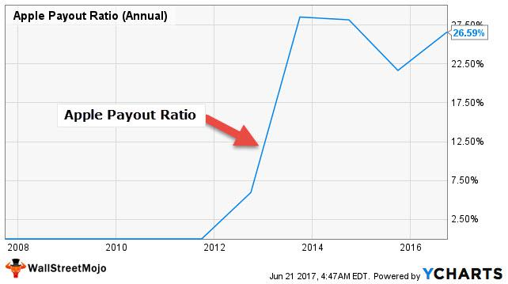

The landscape of investing is continually changing, driven by innovations in financial strategies and market dynamics. Among the diverse investment opportunities, dividend growth stocks have gained prominence for their potential to offer reliable returns over time. These stocks provide a combination of capital appreciation and income generation, appealing to both conservative investors seeking steady income and growth-oriented investors looking for compounding returns.

Apple Inc., a titan in the technology sector, exemplifies the ideal of consistent growth paired with innovative prowess. As one of the most valuable companies globally, Apple has not only transformed industries through its technology but has also captured investor interest through its financial performance and shareholder-friendly practices. The company's ability to balance innovation with financial stability is a key factor that attracts investors to its stock.



In this article, we explore various facets of Apple’s financial dynamics, focusing particularly on dividend growth, dividend yield, and the influence of algorithmic trading in crafting dividend strategies. By investigating Apple’s approach to dividends, investors can gain deeper insights into how dividend growth impacts investment decisions, especially within the tech industry. This exploration is timely, as the evolution of algorithmic trading has provided investors with sophisticated tools to enhance their decision-making processes. Algorithms can analyze vast sets of data to identify optimal investment opportunities, making them a valuable resource in developing effective dividend strategies.

Understanding the dynamics of dividend growth is crucial for investors seeking to make informed choices in tech stocks, as these financial metrics can significantly influence a company's attractiveness as an investment. As we examine Apple’s financial policies and strategic decisions, we aim to provide a comprehensive overview that assists investors in navigating the complexities of tech dividend stocks, ultimately aiding in the crafting of balanced and resilient investment portfolios.

## Table of Contents

## Apple's Dividend Evolution

Apple reintroduced its dividend payments in 2012 after a 17-year break, marking a significant shift in its capital allocation strategy. This resumption was facilitated by the company's robust revenue streams, which have been bolstered by continuous innovation and dominance in the tech market. Apple's decision to reinstate dividends was driven by its substantial cash reserves and consistent earnings growth, which enabled it to return profits to shareholders while continuing to invest in future growth.

Since 2012, Apple's dividend payments have consistently increased, reflecting its strong financial performance and dedication to shareholder value. The company’s dividends have grown in tandem with its earnings, demonstrating a pattern of stability and reliability that attracts investors who prioritize steady income. For example, Apple's annual dividends per share rose from $0.38 in 2012 to $0.96 in 2021, underscoring its commitment to distributing profits as the company grows.

To assess Apple's dividend growth and its implications for financial health and shareholder value, one can examine various metrics such as the Dividend Growth Rate (DGR). This metric is calculated as:

$$
\text{DGR} = \left( \frac{\text{Dividend per share in current year} - \text{Dividend per share in previous year}}{\text{Dividend per share in previous year}} \right) \times 100
$$

This growth in dividends is indicative of Apple’s strategic financial management, which harmonizes shareholder rewards with the reinvestment needs of the business. By maintaining a sustainable payout ratio, Apple is able to balance returning capital to shareholders with retaining profits for growth opportunities and R&D investments. Apple's prudent dividend policy thus reflects a mature stage of business development and assures investors of its robust financial health, which is essential for long-term investor confidence and shareholder value enhancement.

## Understanding Dividend Yield

Dividend yield is a significant consideration for investors assessing the income-generating potential of stock investments. It is defined as the annual dividend per share divided by the current stock price, typically expressed as a percentage. The formula for calculating dividend yield is:

$$
\text{Dividend Yield} = \left( \frac{\text{Annual Dividend per Share}}{\text{Current Stock Price}} \right) \times 100
$$

In the context of Apple Inc., a prominent technology giant, the dividend yield remains moderate relative to traditional income stocks. This is largely due to the nature of the tech industry, which often emphasizes reinvestment in innovation and growth over high dividend payouts. Consequently, Apple's strategy involves balancing shareholder returns through dividends and the reinvestment of profits into the company to fuel future growth.

Several factors influence Apple's dividend yield:

1. **Stock Price Movements**: Apple's stock price variability plays a critical role in affecting its dividend yield. As the stock price increases, the yield may decrease if the dividend payout remains constant. For instance, a rise in Apple's stock price, driven by favorable earnings reports or market conditions, can lead to a reduced dividend yield, even if the absolute dividend payment remains unchanged.

2. **Payout Ratio**: This is the proportion of earnings paid out as dividends to shareholders. A lower payout ratio often indicates that a company retains a larger portion of its earnings for reinvestment, which might be the case for companies with strong growth prospects, such as Apple. Apple's management determines the payout ratio based on growth objectives and strategic investments, impacting the resultant dividend yield.

Understanding these dynamics is crucial for investors who prioritize income-generating potential in their portfolios, as it provides insight into the balancing act between current income and potential for capital appreciation. For tech stocks like Apple, where growth and innovation are paramount, the dividend yield might take a secondary role to the overall strategic goals of the company.

## The Role of Algorithmic Trading

Algorithmic trading has become a cornerstone in modern financial markets, significantly impacting the decision-making processes of investors, particularly in the context of dividend stocks. By leveraging advanced computational algorithms, investors can process large datasets efficiently, thereby optimizing their strategies with precision and speed. This computerized approach to trading enhances the ability of investors to time their transactions strategically, thus maximizing potential returns on dividend-paying stocks.

At the core of [algorithmic trading](/wiki/algorithmic-trading) is the ability to automate trading strategies, which minimizes human intervention and thereby reduces the potential for emotional or biased decision-making. Algorithms can analyze historical data and real-time metrics to identify patterns and trends that might not be readily apparent to human traders. In the context of dividend growth strategies, algorithms can evaluate metrics such as payout ratios, earnings growth, and cash flow stability to predict future dividend payments and identify undervalued stocks.

A key advantage of using algorithms in dividend strategies is the ability to accurately forecast dividend growth, which is crucial for assessing the long-term profitability of an investment. Mathematical models such as the Gordon Growth Model can be employed within algorithms to estimate the expected price of a stock based on anticipated dividends and growth rates:

$$
P = \frac{D_1}{r - g}
$$

where $P$ represents the price of the stock, $D_1$ is the expected dividend next year, $r$ is the required rate of return, and $g$ is the growth rate of dividends. Algorithms can continuously update these variables using real-time data feeds, providing investors with current valuations.

Moreover, the integration of [machine learning](/wiki/machine-learning) into algorithmic trading allows for the development of adaptive models that can learn from historical performance data to improve future predictions. For instance, clustering techniques can be used to segment stocks into categories based on dividend characteristics, enabling targeted investment strategies that align with specific risk and return profiles.

Traders utilizing algorithmic solutions can also capitalize on [arbitrage](/wiki/arbitrage) opportunities that may arise due to mispricings or inefficiencies in the market. By executing trades at optimal times, algorithms can exploit short-lived market anomalies, leading to enhanced returns.

In conclusion, the use of algorithmic trading in dividend strategies brings substantial benefits by providing precise analytical capabilities and minimizing the impact of human error. As technology advances, the role of algorithms in optimizing dividend growth strategies is expected to further solidify, offering investors a powerful tool to navigate complex financial landscapes.

## Comparative Analysis: Apple vs. Peers

Apple Inc., Microsoft Corporation, and Alphabet Inc. (Google's parent company) are among the most prominent technology giants, each with distinct approaches to dividend policies and yields. Examining these companies reveals variations in how they distribute profits and provide returns to shareholders, reflecting different strategic priorities and business models.

Apple, since resuming dividend payments in 2012, has established a steady dividend growth trajectory. The company focuses on balance, distributing a portion of its earnings through dividends, while reinvesting in innovation and expansion. Apple's dividend policy reflects its financial stability and commitment to shareholder value, producing an attractive, though moderate, dividend yield in the technology sector.

In contrast, Microsoft has embraced a more aggressive dividend policy relative to Apple, consistently increasing its dividend payouts over the years. Microsoft's larger dividend yield indicates a mature phase in its business cycle, characterized by robust cash flow generation and a commitment to returning capital to shareholders. The company's dividend approach underscores its strategic emphasis on rewarding shareholders while maintaining sufficient resources for innovation and growth.

Alphabet (Google), however, does not distribute dividends, focusing instead on reinvesting its profits into the company’s core operations and ambitious projects. This approach aligns with Alphabet’s strategy of pursuing long-term growth opportunities, such as [artificial intelligence](/wiki/ai-artificial-intelligence) and cloud computing. By retaining earnings, Alphabet aims to maximize shareholder value through capital appreciation rather than direct income distribution, appealing to investors seeking growth-oriented investments.

Positioning Apple within the broader context of tech dividend stocks highlights a strategic middle ground. Apple combines growth with shareholder returns, catering to investors looking for both income and growth potential. This balanced strategy contrasts with Microsoft's more income-focused approach and Alphabet's capital appreciation strategy.

In summary, Apple, Microsoft, and Alphabet exemplify diverse dividend strategies, each shaped by their financial performance, growth objectives, and shareholder expectations. Understanding these variations is crucial for investors aiming to align their investment strategies with their risk tolerance and income preferences.

## Investment Strategies for Dividend Growth

Investors looking to capitalize on Apple's dividend growth can adopt various strategies tailored to their financial goals and risk tolerance. A primary approach is to focus on reinvestment of dividends, a method that allows investors to purchase additional shares of Apple stock using the dividends received, effectively harnessing the power of compounding. By automatically reinvesting dividends, investors can potentially accumulate a larger position over time, enhancing their returns as Apple's dividend payouts increase.

Balancing growth and income within a diversified investment portfolio is crucial. Apple, known for its robust growth prospects and consistent dividend payments, can serve as a core holding in a balanced portfolio. Investors should aim to combine Apple's stock with other dividend-paying and growth-oriented equities to achieve both income and capital appreciation. This diversification mitigates risk by spreading investments across different sectors and asset classes, reducing dependency on a single source of return.

Mitigating risk and enhancing long-term returns through dividend growth strategies involves careful selection of stocks that not only pay dividends but also have a history of increasing them. Such companies often possess stable earnings, strong [liquidity](/wiki/liquidity-risk-premium), and a commitment to returning capital to shareholders. By analyzing financial health indicators like payout ratios and free cash flow, investors can identify companies with sustainable dividend policies.

For those interested in a quantitative approach, algorithmic trading can offer additional benefits. Algorithms can be programmed to identify stocks with favorable dividend growth metrics using data analysis and machine learning techniques. The following Python code snippet illustrates a simple method to screen for stocks with a history of dividend growth:

```python
import pandas as pd
import yfinance as yf

# Fetch stock data
tickers = ['AAPL', 'MSFT', 'GOOGL']
stocks_data = {ticker: yf.Ticker(ticker).history(period='5y') for ticker in tickers}

# Analyze dividend growth
dividend_growth = {}
for ticker, data in stocks_data.items():
    if 'Dividends' in data.columns:
        dividends = data['Dividends'].loc[data['Dividends'] != 0]
        if len(dividends) > 1:
            initial_div = dividends.iloc[0]
            final_div = dividends.iloc[-1]
            growth_rate = (final_div - initial_div) / initial_div
            dividend_growth[ticker] = growth_rate

# Filter stocks with positive dividend growth
positive_growth_stocks = {ticker: growth for ticker, growth in dividend_growth.items() if growth > 0}

print(positive_growth_stocks)
```

This code retrieves historical stock data and calculates dividend growth rates over five years for selected companies. By identifying stocks with positive and sustainable dividend growth, investors can enhance their portfolios, making informed decisions to balance both income and potential appreciation. 

In conclusion, leveraging Apple's dividend growth involves a combination of reinvestment, diversification, risk assessment, and potentially algorithmic trading, providing a comprehensive strategy that caters to different investment preferences while aiming for long-term success.

## Conclusion

Apple's progression in sustaining and enhancing its dividend payments highlights both its financial robustness and its evolution into a mature corporation. Since reinstating its dividend policy in 2012, Apple Inc. has consistently demonstrated capability in generating stable returns for its shareholders. This commitment underscores Apple's strategic focus on rewarding investors, further solidifying its status as a dependable asset in the investment landscape.

The inclusion of algorithmic trading in dividend strategy formulation adds a notable dimension to investment planning. These algorithms enable investors to efficiently analyze market conditions and Apple's financial metrics, potentially identifying optimal buying or selling opportunities. Algorithmic trading facilitates better timing and decision-making, allowing investors to maximize returns from Apple's dividend payouts.

Apple's trajectory provides insights into both the opportunities and obstacles encountered in tech-focused dividend investing. The company's ability to balance growth with rewarding shareholders through dividends sets an example for effectively integrating dividend strategies within tech portfolios. However, the comparatively moderate dividend yield of tech firms like Apple, when stacked against traditional income stocks, suggests an ongoing challenge in attracting dividend-focused investors.

In summary, Apple's consistent financial trajectory and its approach to dividends exemplify the strategic considerations essential in tech stock investments. The potential offered by integrating algorithmic trading further enhances the ability of investors to navigate the inherently volatile tech sector, ultimately highlighting the nuanced yet rewarding nature of dividends within this industry.

## References & Further Reading

[1]: Bergstra, J., Bardenet, R., Bengio, Y., & Kégl, B. (2011). ["Algorithms for Hyper-Parameter Optimization."](https://dl.acm.org/doi/10.5555/2986459.2986743) Advances in Neural Information Processing Systems 24.

[2]: ["Advances in Financial Machine Learning"](https://www.amazon.com/Advances-Financial-Machine-Learning-Marcos/dp/1119482089) by Marcos Lopez de Prado

[3]: ["Evidence-Based Technical Analysis: Applying the Scientific Method and Statistical Inference to Trading Signals"](https://www.amazon.com/Evidence-Based-Technical-Analysis-Scientific-Statistical/dp/0470008741) by David Aronson

[4]: ["Machine Learning for Algorithmic Trading"](https://github.com/stefan-jansen/machine-learning-for-trading) by Stefan Jansen

[5]: ["Quantitative Trading: How to Build Your Own Algorithmic Trading Business"](https://www.amazon.com/Quantitative-Trading-Build-Algorithmic-Business/dp/1119800064) by Ernest P. Chan