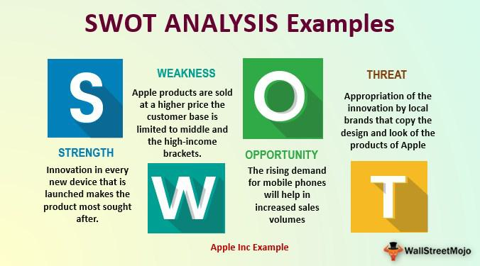

Apple Inc. is globally recognized as a leader in technology, widely praised for its continuous innovation and significant influence in the market. Established in Cupertino, California, Apple has transcended its initial offerings of personal computers to become an iconic entity in consumer electronics, renowned for products such as the iPhone, iPad, and MacBook. Apple's ecosystem, which comprises hardware, software, and services, sets a benchmark for integration and user-friendly design. Nonetheless, Apple's journey is not without challenges and vulnerabilities that may affect its market position and operational strategies.

One of Apple's most pressing issues is the increasingly competitive environment. Rival firms like Samsung and Google are closing the gap by offering technologically comparable products, often at more competitive price points. This raises concerns about Apple’s premium pricing strategy, which, while once a hallmark of exclusivity and quality, now risks alienating price-sensitive consumers, especially in economically volatile times.



In addition to this competitive pressure, Apple's closed ecosystem, often lauded for its seamless integration, simultaneously acts as a constraint. This walled garden approach restricts collaborative opportunities and responsiveness to emerging tech trends, potentially stifling innovation. While Apple's commitment to high-quality, methodical innovation cycles has won admiration, it may not adequately align with the pace of technological advancement, where rapid iteration and experimentation are increasingly critical.

Apple also encounters strategic challenges and missteps in governance and legal fronts. Patent disputes, antitrust investigations, and lagging developments in areas such as artificial intelligence, compared to competitors, highlight strategic gaps that could undermine its innovative edge. Furthermore, governance challenges, including issues surrounding executive succession and diversity, threaten internal stability and long-term strategic planning.

These factors not only influence Apple’s operational health but also have significant implications for algorithmic trading. Market perceptions influenced by Apple's strategic decisions, innovation pace, and competitive performance can lead to volatility in Apple's stock, affecting trading algorithms and market strategies. Understanding these nuances is crucial for investors and analysts who monitor Apple’s financial and market trajectory.

Despite these challenges, Apple's robust brand and history of successful innovation provide a substantial buffer against uncertainties. Its established market presence offers a strong platform from which it can navigate existing challenges, although diligence and adaptability remain essential. As such, stakeholders must be attentive to how these factors will continue to shape Apple's performance in the evolving technological and financial landscapes.

## Table of Contents

## High-Priced Products and Competitive Challenges

Apple Inc.'s premium pricing strategy, one of its defining market approaches, can present significant challenges in variable economic climates. The company's flagship products, often priced at a premium compared to competitors, can alienate potential consumers, particularly in emerging markets or during periods of economic downturn. This pricing strategy is designed to reinforce Apple's brand as a premium product line, yet it simultaneously limits market accessibility.

The competitive landscape presents further issues. Brands such as Samsung offer equally advanced technological products at more affordable prices, appealing to a broader consumer base. Samsung's ability to maintain competitiveness on both technological grounds and cost gives it an advantage in price-sensitive and high-growth regions. 

Despite Apple's strong brand loyalty, which helps maintain a solid customer base, the high price point may deter new customers who could potentially switch to alternatives that provide similar functionalities. In markets where cost competitiveness becomes a pivotal determining [factor](/wiki/factor-investing), Apple's pricing may hinder its ability to penetrate these areas effectively.

The premium pricing model pressures Apple to continuously justify its higher costs through substantial innovation and quality assurance. However, in times where the economic pendulum swings away from consumer confidence, this pricing model could hinder its overall market performance and expansion opportunities. Consequently, while the brand's established reputation offers a degree of protection against economic fluctuations, the rigidity of its pricing strategy may constrain its adaptability in shifting economic landscapes.

## The Closed Ecosystem as a Weakness

Apple Inc.'s ecosystem is a distinct feature that defines much of its product and service experience. Characterized by a tightly controlled environment, Apple's ecosystem unifies the hardware and software across its devices, providing users with a seamless experience. This design is evident in products such as the iPhone, iPad, Mac, Apple Watch, and services like iCloud and Apple Music, all of which work cohesively to create a harmonized user interface and interaction.

However, the very nature of this closed ecosystem presents both technical and strategic limitations. A primary concern is the reduced flexibility for both Apple and third-party developers. Apple's stringent guidelines and policies can sometimes discourage the influx of diverse applications and services, potentially stifling innovation. Developers are required to adapt to Apple's strict frameworks, which can be more challenging compared to the more open environments offered by competitors such as Android. This control can lead to a narrower selection of applications, and some developers may choose platforms with fewer restrictions.

Moreover, the development process within such a closed ecosystem can face added burdens. Apple's insistence on maintaining control over both hardware and software integrations requires a significant investment in research and development, potentially slowing its ability to respond to rapid changes in technology trends. In industries driven by fast-paced innovations, this can be a critical disadvantage. Competitors operating with open ecosystems can experiment and iterate more rapidly, bringing new features and products to market at a quicker pace.

Additionally, Apple's closed ecosystem might limit its capacity to adapt promptly to emerging technologies or new market demands. For instance, as generative AI and [machine learning](/wiki/machine-learning) applications grow in prominence, the open sharing of tools and advancements across platforms becomes crucial. An ecosystem that restricts external integration can lag in adopting cutting-edge technologies that require broad collaboration and flexibility.

In conclusion, while Apple's closed ecosystem ensures a high-quality and integrated user experience, it inherently presents challenges that could impede innovation and flexibility. These factors need careful consideration as the technology landscape evolves, and while Apple has managed to navigate these challenges in the past, ongoing evaluation and adaptation are key to maintaining its competitive edge.

## Pace of Innovation

Apple Inc. has long been a hallmark of high consumer expectations, consistently delivering products that have set benchmarks in design, functionality, and user experience. However, the company's strategic decision to prioritize a slow but high-quality innovation cycle presents a paradox in the ever-accelerating technology sector. While this approach has cemented Apple's reputation for reliability and excellence, it also exposes the firm to challenges from competitors that are more agile in adopting and experimenting with new technologies.

Competitors such as Google and Samsung exemplify this agile approach. Google's open-source philosophy, particularly with its Android operating system, fosters rapid innovation through extensive collaboration across diverse developers and manufacturers. Samsung's prowess in hardware innovation and its strategy of quick adaptation to market demands allow it to launch products featuring cutting-edge technology frequently. These competitors leverage quicker development cycles to introduce novel features and capture new market segments faster than Apple.

Apple, in contrast, tends to focus on refining and perfecting technologies before they reach consumers. This meticulous approach ensures a level of polish that reinforces Apple's brand value but can slow responses to market trends and technological shifts. For instance, Apple's adoption of 5G technology lagged behind some of its competitors. While the company's eventual implementation integrated seamlessly with its ecosystem, it highlighted the challenges associated with maintaining market leadership amidst rapid technological advancements.

The balancing act between innovation speed and product quality is both a strategic choice and a complex challenge. Numerous factors contribute to this dynamic, including research and development investments, supply chain management, and the scalability of new technologies. Furthermore, Apple’s commitment to its closed ecosystem, though contributing to seamless integration, imposes additional constraints on innovation pace.

Understanding this relationship quantitatively can involve analyzing Apple's R&D expenditure growth rates, comparing them with innovation outputs such as patents filed, or product release frequencies relative to those of competitors. These metrics provide a framework for evaluating how effectively Apple can convert innovation investment into market-ready technologies without sacrificing its quality-centric ethos.

```python
# Example Analysis: Hypothetical R&D Growth vs. Innovation Output
import matplotlib.pyplot as plt

# Hypothetical data
years = [2018, 2019, 2020, 2021, 2022]
apple_rd_growth = [10, 12, 14, 16, 18]  # Percentage growth in R&D
innovation_output = [8, 9, 8.5, 10, 9.5]  # Innovation output index

plt.plot(years, apple_rd_growth, label='Apple R&D Growth (%)', marker='o')
plt.plot(years, innovation_output, label='Innovation Output Index', marker='x')
plt.title('Apple R&D Growth vs. Innovation Output')
plt.xlabel('Year')
plt.ylabel('Index')
plt.legend()
plt.grid(True)
plt.show()
```

While Apple's innovation pace poses challenges, it also demonstrates the company's strategic commitment to product excellence. Balancing innovation speed with quality is crucial for sustaining market leadership. This trade-off, while challenging, allows Apple to forge a unique path distinct from its faster-moving competitors, leveraging its strengths to continue delivering highly anticipated and integrated technologies to consumers worldwide.

## Current Business Challenges Facing Apple

Apple Inc. faces a multitude of business challenges that can affect its market standing and future growth trajectory. In the realm of legal issues, Apple is grappling with patent disputes and antitrust scrutiny. These legal challenges have the potential to influence its operations and financial health significantly. Patent disputes often involve high legal costs and potential licensing fees, which can impact Apple's bottom line. Moreover, antitrust scrutiny can constrain Apple's business practices, affecting its revenue streams and innovation capabilities. For instance, regulatory pressures in various jurisdictions may compel Apple to alter its App Store policies, influencing its lucrative services segment.

Market-specific challenges also pose significant threats, particularly in Asia. The Asian market is a battleground for tech companies, with local competitors like Huawei offering formidable competition. Huawei's robust product offerings, particularly in mobile and telecommunications, along with its aggressive pricing strategies, present a challenge to Apple's market share in the region. Furthermore, the geopolitical tensions, particularly between the United States and China, can exacerbate these challenges, impacting Apple's supply chain and market access.

Another strategic concern for Apple is its lag in [artificial intelligence](/wiki/ai-artificial-intelligence) (AI), especially in generative AI technologies where competitors have made significant strides. Companies such as Google and Microsoft have advanced their AI capabilities, integrating them into products and services that enhance user experience and operational efficiency. Apple's slower pace in AI development suggests a strategic gap that needs addressing to maintain competitive advantage. This lag could potentially impede Apple’s ability to innovate rapidly and meet evolving consumer expectations, affecting its long-term growth prospects.

To mitigate these challenges, Apple must adopt proactive strategies such as investing in AI research and development, diversifying its supply chain to reduce geopolitical risks, and engaging with regulators to navigate legal complexities. Addressing these business challenges is crucial for Apple's sustained success and continued market leadership.

## Apple's Governance and Strategic Missteps

Apple's governance has long been a subject of scrutiny, with particular attention to executive succession planning and the lack of diversity within its leadership. These issues present internal challenges that could impact Apple's ability to maintain its competitive edge and its reputation as an innovator. Succession planning is critical for any large organization to ensure continuity and stability. At Apple, the retirement or departure of key executives, such as the late Steve Jobs, has historically posed challenges. Ensuring a seamless transition of leadership requires a well-defined succession plan, yet Apple has occasionally been criticized for its opacity in this area.

Diversity within Apple's corporate hierarchy is another pressing issue. Despite efforts to enhance diversity and inclusion, the company's leadership remains predominantly homogeneous. This lack of diversity can stifle perspectives and innovation, hindering Apple's ability to address a diverse global market effectively. Recent board changes signal an awareness and a movement towards addressing these issues; however, these changes have been incremental and have raised questions about the transparency of Apple's governance practices. Transparency is crucial for maintaining stakeholder trust and ensuring that governance practices are aligning with contemporary societal norms and expectations.

Effective governance is fundamental for Apple's corporate stability and its capacity to foster innovation. Strong governance frameworks can enhance decision-making processes, mitigate risks, and promote a culture that encourages creativity and adaptability. Fostering a robust governance culture requires addressing the identified challenges in succession planning and diversity. Only through transparent and proactive governance can Apple position itself to navigate the complexities of the modern business environment, while safeguarding its reputation as a leader in innovation and technology.

## The Impact on Algorithmic Trading

Apple's perceived weaknesses can have notable implications for [algorithmic trading](/wiki/algorithmic-trading), where market perceptions and data-driven decisions are pivotal. Algorithmic trading relies heavily on market predictions and sentiment analysis, and any uncertainty associated with a major player like Apple can create significant [volatility](/wiki/volatility-trading-strategies). For instance, strategic missteps or delays in product innovation can lead to fluctuations in stock prices, influencing trading algorithms designed to capitalize on predictable trends.

Traders using automated and AI-driven systems must incorporate real-time data and adaptive algorithms to respond to these market movements. For example, Natural Language Processing (NLP) models can be implemented to analyze news articles, social media, and financial reports to quantify market sentiment around Apple's strategic decisions. The output can then be used to adjust trading strategies dynamically. Python libraries such as `pandas`, `numpy`, and `scikit-learn` provide robust frameworks for handling such data analysis, while `beautifulsoup` and `nltk` can extract and preprocess text data.

Here's a basic Python snippet demonstrating how one might use sentiment analysis to adjust trading decisions:

```python
import pandas as pd
from textblob import TextBlob

# Assume stock_prices is a DataFrame with columns 'date' and 'price'
# and news_data is a DataFrame with columns 'date' and 'headline'
def calculate_sentiment(row):
    analysis = TextBlob(row['headline'])
    return analysis.sentiment.polarity

# Calculate sentiment score for each headline
news_data['sentiment'] = news_data.apply(calculate_sentiment, axis=1)

# Merge stock prices and sentiment scores on the date
merged_data = pd.merge(stock_prices, news_data, on='date')

# Strategy: buy if sentiment is positive and sell if it's negative
merged_data['signal'] = merged_data['sentiment'].apply(lambda x: 1 if x > 0 else -1)

# Implement this signal in the trading strategy
def trade(stock_prices, signal):
    # Simple strategy logic for demonstration
    for index, row in stock_prices.iterrows():
        if row['signal'] == 1:
            print(f"Buying on {row['date']}")
        elif row['signal'] == -1:
            print(f"Selling on {row['date']}")

trade(merged_data, merged_data['signal'])
```

Understanding how Apple's strategic challenges may affect its market performance allows traders to refine their models and mitigate potential risks. By integrating sentiment analysis and machine learning techniques, algorithmic trading systems can be better equipped to navigate the complexities induced by Apple's business hurdles. Thus, traders must remain vigilant and continuously update their algorithms to reflect ongoing market dynamics and corporate developments.

## Conclusion

Apple's challenges are multifaceted and require careful examination due to their potential impact on the company's future performance. The competitive pressures Apple faces are primarily due to the heightened competition from rivals such as Samsung, Huawei, and Google. These competitors have been successful in capturing market share by offering advanced technological solutions at more accessible price points. Consequently, Apple must continuously innovate to maintain its market dominance, which increasingly becomes a strenuous task given the fast-paced nature of the tech industry.

The pace of innovation presents another major challenge for Apple. While the company is renowned for its high-quality products, the necessity to keep up with rapid technological advancements poses a significant hurdle. Competitors, unencumbered by the closed ecosystem that characterizes Apple’s operations, are often able to introduce cutting-edge technologies more swiftly. This disparity can result in Apple appearing slow or unresponsive to new trends, impacting its competitive edge.

Internal governance also plays a crucial role in shaping Apple's strategic outlook. Issues such as executive succession planning and the ongoing push for greater diversity reflect the challenges of maintaining effective corporate governance. Decisions made at the executive level can significantly influence the company's direction and responsiveness to external challenges.

Despite these hurdles, Apple's established brand and historical success provide it with a formidable base. The company's reputation for quality and innovation has fostered a loyal customer base that consistently supports its product offerings. This brand strength acts as a buffer against market volatility and economic shifts.

For investors and traders, understanding these dynamics is crucial. Apple's ability or inability to navigate these challenges can lead to significant fluctuations in its stock price, influencing investment and trading decisions. Therefore, keeping a close watch on how Apple addresses its competitive pressures, innovation strategies, and governance issues is essential for those interested in the company's market performance.

## References & Further Reading

[1]: Gans, J., & Stern, S. (2010). ["Is There a 'Chilling Effect' on Collaborative Innovation?"](https://papers.ssrn.com/sol3/papers.cfm?abstract_id=2844843) NBER Working Paper No. 16141.

[2]: Gallagher, S. (2012). ["The walled garden: Second life, Europe, and the law."](https://onlinelibrary.wiley.com/doi/10.1111/j.2041-6962.2012.00108.x) info, 14(1), 24-34.

[3]: Porat, A., & Saia, J. (2020). ["Algorithmic trading and the need for regulations."](https://www.semanticscholar.org/paper/Public-Health-and-Risk-Communication-During-Needs-Porat-Nyrup/3dd2d474d2842902873994236996f070b8184ea4) Journal of Law, Economics, and Organization, 36(1).

[4]: Osterloh, M., & Frey, B. (2000). ["Motivation, knowledge transfer, and organizational forms."](https://www.jstor.org/stable/2640344) Organization Studies, 21(9), 692-709.

[5]: ["The Innovator's Dilemma: When New Technologies Cause Great Firms to Fail"](https://www.hbs.edu/faculty/Pages/item.aspx?num=46) by Clayton M. Christensen