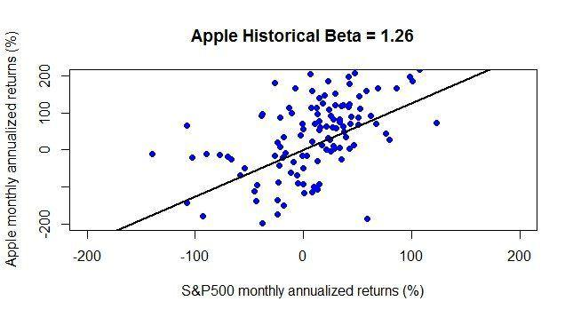

## Table of Contents

## What is the Capital Asset Pricing Model (CAPM)?

The Capital Asset Pricing Model, or CAPM, is a way to figure out how much return, or profit, an investment should give you based on how risky it is. It helps investors decide if an investment is worth it by comparing the expected return to the risk involved. The model uses something called the "risk-free rate," which is the return you get from a very safe investment like a government bond, and the "market risk premium," which is the extra return you expect for taking on more risk by investing in the stock market.

CAPM also uses a measure called "beta" to show how much an investment's price moves compared to the overall market. If an investment has a high beta, it means it's more sensitive to market changes and is riskier. If it has a low beta, it's less sensitive and less risky. By using the risk-free rate, the market risk premium, and the beta of an investment, CAPM calculates the expected return. This helps investors see if the potential reward of an investment is worth the risk they are taking.

## How does CAPM help in valuing stocks like Apple?

CAPM helps in valuing stocks like Apple by figuring out what return you should expect from investing in the company. It does this by looking at how risky Apple's stock is compared to the overall market. Apple's stock has a "beta," which tells us how much its price moves when the market moves. If Apple's beta is higher than 1, it means the stock is more sensitive to market changes and is riskier. If it's lower than 1, it's less sensitive and less risky. By using Apple's beta, along with the risk-free rate (like the return from a government bond) and the market risk premium (the extra return you expect for taking on more risk), CAPM calculates the expected return for Apple's stock.

Once you know the expected return from Apple's stock using CAPM, you can compare it to the stock's actual return or to the returns of other investments. If the expected return from Apple's stock is higher than what you could get from a safer investment, and you think the risk is worth it, then Apple's stock might be a good choice for you. This helps you decide if Apple's stock is priced fairly or if it's a good buy based on the risk and reward. By using CAPM, you can make smarter decisions about whether to invest in Apple or look for other opportunities that might offer a better balance of risk and return.

## What are the components of the CAPM formula?

The CAPM formula has three main parts: the risk-free rate, the market risk premium, and the stock's beta. The risk-free rate is the return you get from a very safe investment, like a government bond. It's the starting point for figuring out what return you should expect from any investment. The market risk premium is the extra return you expect for taking on more risk by investing in the stock market instead of a safe investment. It shows how much more reward you want for the extra risk.

The third part of the CAPM formula is the stock's beta. Beta tells you how much a stock's price moves compared to the overall market. If a stock has a high beta, it means it's more sensitive to market changes and is riskier. If it has a low beta, it's less sensitive and less risky. By putting these three parts together—the risk-free rate, the market risk premium, and the stock's beta—CAPM calculates the expected return for a stock. This helps you see if the potential reward of investing in a stock is worth the risk you're taking.

## Where can I find the necessary data to apply CAPM to Apple stock?

To apply CAPM to Apple stock, you'll need to find three pieces of information: the risk-free rate, the market risk premium, and Apple's beta. The risk-free rate is usually the yield on a 10-year U.S. Treasury bond, which you can find on financial websites like Bloomberg, Yahoo Finance, or the U.S. Department of the Treasury's website. The market risk premium is a bit trickier to pin down because it's not a fixed number, but it's often estimated to be around 5-6%. You can find various estimates for the market risk premium from financial research reports or investment websites.

Apple's beta is a measure of how much its stock price moves compared to the overall market. You can find Apple's beta on financial websites like Yahoo Finance, Google Finance, or Bloomberg. These sites calculate beta by looking at historical stock price data and comparing it to the market's performance. Once you have these three pieces of information—the risk-free rate, the market risk premium, and Apple's beta—you can plug them into the CAPM formula to calculate the expected return for Apple stock. This helps you decide if investing in Apple is worth the risk based on the potential reward.

## How do I calculate the beta for Apple stock?

Calculating the beta for Apple stock involves comparing how much Apple's stock price moves with the movements of the overall market. Beta is a number that shows how sensitive a stock is to changes in the market. A beta of 1 means the stock moves exactly with the market. If Apple's beta is higher than 1, it means Apple's stock is more sensitive to market changes and is riskier. If it's lower than 1, it's less sensitive and less risky. To find Apple's beta, you can look at financial websites like Yahoo Finance or Google Finance. These sites use historical stock price data to calculate beta by comparing Apple's stock price changes to the market's changes over time.

If you want to calculate Apple's beta yourself, you'll need historical stock price data for Apple and a market index like the S&P 500. You can get this data from financial websites or databases like Yahoo Finance or Bloomberg. Once you have the data, you can use a statistical tool or software like Excel to calculate the beta. You do this by figuring out the covariance between Apple's stock returns and the market returns, and then dividing that by the variance of the market returns. This gives you Apple's beta, which you can use in the CAPM formula to help decide if investing in Apple is worth the risk.

## What is the risk-free rate and how do I select it for CAPM?

The risk-free rate is the return you get from a very safe investment, like a government bond. It's the starting point for figuring out what return you should expect from any investment. When you use the risk-free rate in the Capital Asset Pricing Model (CAPM), it helps you see if the potential reward of an investment is worth the risk you're taking. The most common choice for the risk-free rate is the yield on a 10-year U.S. Treasury bond because it's considered very safe and it's easy to find the yield on financial websites.

To select the risk-free rate for CAPM, you should look for the current yield on a 10-year U.S. Treasury bond. You can find this on websites like Bloomberg, Yahoo Finance, or the U.S. Department of the Treasury's website. This yield changes over time, so make sure you use the most recent number. By using the current yield on a 10-year U.S. Treasury bond as your risk-free rate, you can get a good starting point for figuring out the expected return from an investment like Apple stock using CAPM.

## How do I determine the market risk premium for use in CAPM?

The market risk premium is the extra return you expect for taking on more risk by investing in the stock market instead of a safe investment like a government bond. It's not a fixed number, so you have to estimate it. A common way to do this is to look at historical data. You can find the average difference between the return of the stock market (like the S&P 500) and the risk-free rate (like the yield on a 10-year U.S. Treasury bond) over a long period of time. This average difference is your market risk premium. Financial research reports and investment websites often provide estimates of the market risk premium, usually around 5-6%.

Once you have an estimate for the market risk premium, you can use it in the Capital Asset Pricing Model (CAPM) to figure out the expected return for a stock like Apple. The market risk premium shows how much extra reward you want for the risk of investing in the stock market. By using this number along with the risk-free rate and the stock's beta, CAPM helps you decide if the potential reward of investing in Apple is worth the risk you're taking. Remember, the market risk premium can change over time, so it's a good idea to use the most recent estimates when you're doing your calculations.

## Can you explain how to apply the CAPM formula to estimate Apple's expected return?

To estimate Apple's expected return using the Capital Asset Pricing Model (CAPM), you need three pieces of information: the risk-free rate, the market risk premium, and Apple's beta. The risk-free rate is usually the yield on a 10-year U.S. Treasury bond, which you can find on financial websites like Yahoo Finance. The market risk premium is the extra return you expect for taking on more risk by investing in the stock market instead of a safe investment. You can estimate it by looking at the average difference between the stock market's return and the risk-free rate over a long period, which is often around 5-6%. Apple's beta tells you how much its stock price moves compared to the overall market, and you can find it on financial websites too.

Once you have these numbers, you can use the CAPM formula to calculate Apple's expected return. The formula is: Expected Return = Risk-Free Rate + (Beta × Market Risk Premium). Let's say the risk-free rate is 2%, the market risk premium is 5%, and Apple's beta is 1.2. You would plug these numbers into the formula like this: Expected Return = 2% + (1.2 × 5%). That comes out to 2% + 6% = 8%. So, according to CAPM, you should expect an 8% return from investing in Apple stock. This helps you decide if the potential reward of investing in Apple is worth the risk you're taking.

## What are the limitations of using CAPM for Apple stock valuation?

Using the Capital Asset Pricing Model (CAPM) to value Apple stock has some limitations. One big problem is that CAPM assumes the market is always right and that investors have the same information and expectations about the future. But in real life, the market can be wrong, and people have different ideas about what will happen next. This means the expected return CAPM gives you might not match what actually happens. Also, the numbers you use in CAPM, like the risk-free rate and the market risk premium, can change over time. So, if you use old numbers, your estimate might not be very accurate.

Another limitation is that CAPM only looks at one kind of risk, called systematic risk, which is the risk that affects the whole market. But there are other risks, like the risk that comes from things specific to Apple, like changes in its products or management. CAPM doesn't take these other risks into account. Plus, the beta that CAPM uses to measure how sensitive Apple's stock is to the market can be hard to get right. It's based on past data, but past performance doesn't always tell you what will happen in the future. So, while CAPM can give you a starting point for thinking about Apple's expected return, it's not perfect and should be used carefully along with other ways of looking at the stock's value.

## How can I compare the CAPM-calculated expected return to Apple's actual stock performance?

To compare the expected return from CAPM to Apple's actual stock performance, you first need to calculate the expected return using CAPM. Let's say you found that the risk-free rate is 2%, the market risk premium is 5%, and Apple's beta is 1.2. Using the CAPM formula, you would calculate the expected return as 2% + (1.2 × 5%) = 8%. This means, according to CAPM, you should expect an 8% return from investing in Apple stock. Now, you need to look at Apple's actual stock performance over the same period you used to calculate the expected return. You can find this information on financial websites like Yahoo Finance or Google Finance, which show the stock's historical returns.

Once you have both the expected return from CAPM and Apple's actual stock performance, you can compare them. If Apple's actual return is higher than the 8% expected return, it might mean that the stock is doing better than what CAPM predicted. This could suggest that Apple is a good investment because it's giving you more reward for the risk you're taking. On the other hand, if Apple's actual return is lower than the 8% expected return, it might mean the stock is not doing as well as expected. This could suggest that the stock might not be worth the risk. Remember, CAPM is just one tool, and it's important to use other ways to look at Apple's stock too before making any investment decisions.

## What advanced adjustments can be made to the CAPM model when valuing Apple stock?

When using the Capital Asset Pricing Model (CAPM) to value Apple stock, you can make some advanced adjustments to get a more accurate expected return. One way to do this is by using a multi-factor model instead of just one beta. A multi-factor model looks at different things that can affect Apple's stock price, like the size of the company, how much it grows, and how much it pays in dividends. By using these extra factors, you can get a better idea of the risks and rewards of investing in Apple. Another adjustment you can make is to use different time periods for calculating the beta. Instead of just using the last year or two, you can look at longer periods to see how Apple's stock has moved with the market over time. This can help you see if the stock's sensitivity to the market changes over time.

Another advanced adjustment to CAPM is to use a different risk-free rate or market risk premium that better matches your investment time frame. For example, if you're thinking about holding Apple stock for a short time, you might use the yield on a 3-month U.S. Treasury bond instead of the 10-year bond. And if you think the market risk premium might be different in the future because of changes in the economy, you can adjust that number too. By making these changes, you can get a more personalized expected return for Apple stock that fits your own investment goals and risk tolerance. Remember, though, that even with these adjustments, CAPM is just one tool and should be used along with other ways to look at Apple's stock value.

## How does the CAPM valuation of Apple stock fit into a broader investment strategy?

Using the Capital Asset Pricing Model (CAPM) to value Apple stock is just one part of a bigger investment strategy. CAPM helps you figure out what return you should expect from Apple based on how risky it is compared to the whole market. This expected return can guide you in deciding if Apple's stock is a good buy. But it's important to remember that CAPM is based on some guesses, like the risk-free rate and the market risk premium, which can change. So, while CAPM gives you a starting point, you shouldn't rely on it alone to make your investment decisions.

To build a good investment strategy, you need to look at more than just CAPM. You should also think about other things like Apple's financial health, how it's doing compared to other companies, and what's happening in the world that could affect its stock price. By using CAPM along with other tools and information, you can get a fuller picture of whether investing in Apple is right for you. This way, you can make smarter choices about your investments and build a strategy that fits your goals and how much risk you're willing to take.

## What is the CAPM Model and how can it be understood?

The Capital Asset Pricing Model (CAPM) is a foundational concept in financial economics, utilized for determining the expected return of an asset based on its inherent systematic risk. This model, introduced by William F. Sharpe in the 1960s, revolutionized the way investors assess risk and return by focusing on the market as a whole rather than individual asset specifics.

CAPM posits that investors should be concerned only with systematic risk—often referred to as market risk—since unsystematic risk can be eliminated through diversification. Systematic risk is inherent to the entire market and is reflected in macroeconomic factors such as recession, political instability, or changes in interest rates. In contrast, unsystematic risk pertains to individual stocks or sectors and can be diversified away in a sufficiently varied portfolio.

The CAPM formula is expressed as:

$$
E(R_i) = R_f + \beta_i (E(R_m) - R_f)
$$

Where:
- $E(R_i)$ is the expected return on the asset.
- $R_f$ is the risk-free rate, typically represented by government bonds, such as the 10-year U.S. Treasury bond.
- $\beta_i$ is the asset's beta, a measure of its volatility or systematic risk relative to the overall market.
- $E(R_m)$ is the expected return of the market.
- $(E(R_m) - R_f)$ is the market risk premium, indicating the additional return expected from holding a risky market portfolio instead of risk-free assets.

Beta ($\beta_i$) is a critical component of the CAPM, serving as a gauge of how the asset is expected to respond to market movements. A beta greater than one suggests that the asset is expected to be more volatile than the market, while a beta less than one indicates less [volatility](/wiki/volatility-trading-strategies). A beta of one implies that the asset's price is expected to move with the market.

By connecting an asset’s expected returns with its risk as compared to the market, CAPM provides a standardized approach for evaluating investment opportunities. It allows investors to understand whether an asset's potential return compensates sufficiently for its risk. Despite its simplicity and widespread adoption, CAPM relies on the assumption of efficient markets, which may not always align perfectly with real-world conditions. Nonetheless, it continues to be a widely used tool for its ease of use in assessing market-related risks and potential returns.

## How do you perform a step-by-step calculation for Apple's Stock CAPM Analysis?

To perform a Capital Asset Pricing Model (CAPM) analysis on Apple's stock, we follow a series of steps that include selecting a market portfolio proxy, estimating Apple's beta, determining the risk-free rate alongside the market return, and applying the CAPM formula to estimate expected returns.

### Choosing the Proxy for Market Portfolio

The S&P 500 index is a common choice as a proxy for the market portfolio. It encompasses a broad range of large firms that accurately reflect the market's overall movement and risk profile.

### Estimating Beta

Apple's beta represents its systematic risk relative to the market and is calculated using historical return data from both Apple and the S&P 500. The beta (β) can be mathematically represented as follows:

$$
\beta = \frac{\text{Cov}(\text{R}_{\text{Apple}}, \text{R}_{\text{Market}})}{\text{Var}(\text{R}_{\text{Market}})}
$$

Where:
- $\text{R}_{\text{Apple}}$ refers to the returns of Apple.
- $\text{R}_{\text{Market}}$ refers to the returns of the S&P 500.
- Cov(R_Apple, R_Market) is the covariance between Apple's and the market's returns.
- Var(R_Market) is the variance of the market returns.

Python can be used to compute this:

```python
import numpy as np
import pandas as pd
import pandas_datareader as web

# Fetch historical price data for Apple and S&P 500
apple_data = web.get_data_yahoo('AAPL', start='YYYY-MM-DD', end='YYYY-MM-DD')['Adj Close']
sp500_data = web.get_data_yahoo('^GSPC', start='YYYY-MM-DD', end='YYYY-MM-DD')['Adj Close']

# Calculate daily returns
apple_returns = apple_data.pct_change().dropna()
sp500_returns = sp500_data.pct_change().dropna()

# Calculate covariance matrix and derive beta
cov_matrix = np.cov(apple_returns, sp500_returns)
beta_apple = cov_matrix[0, 1] / cov_matrix[1, 1]
```

### Determining Risk-Free Rate and Market Return

The risk-free rate is typically derived from the yield of the 10-year US Treasury bond, which is considered a secure investment with minimal default risk. Meanwhile, the market return is estimated from historical returns of the S&P 500 over a relevant time frame. 

Market return ($\text{R}_{\text{Market}}$) can be calculated as follows:

$$
 \text{R}_{\text{Market}} = \frac{\text{Ending Index Value} - \text{Starting Index Value}}{\text{Starting Index Value}}
$$

### Estimating Expected Return

Using the CAPM formula, the expected return on Apple's stock ($\text{R}_{\text{Apple}}$) is calculated:

$$
\text{R}_{\text{Apple}} = \text{R}_{\text{f}} + \beta (\text{R}_{\text{Market}} - \text{R}_{\text{f}})
$$

Where:
- $\text{R}_{\text{f}}$ is the risk-free rate.
- $\text{R}_{\text{Market}}$ is the estimated market return.
- $\beta$ is Apple's beta.

The calculated expected return offers insight into how much return Apple investors can anticipate relative to the given market risks. This analysis is crucial for aligning investment strategies with risk tolerance and market expectations.

## How can we leverage algorithmic trading with CAPM insights?

Algorithmic trading utilizes sophisticated computer programs to execute trades based on predetermined criteria, often capitalizing on speed and precision unavailable to human traders. Central to refining these algorithmic strategies is the incorporation of insights from financial models like the Capital Asset Pricing Model (CAPM). Through the CAPM, traders gain valuable information about expected returns and systemic risks associated with particular stocks, which can be instrumental in developing more effective trading algorithms.

The CAPM model provides an equation to estimate expected returns on an asset, defined as:

$$

E(R_i) = R_f + \beta_i (E(R_m) - R_f)
$$

Where:
- $E(R_i)$ is the expected return of the asset,
- $R_f$ is the risk-free rate,
- $\beta_i$ is the beta of the asset, representing its sensitivity to market movements,
- $E(R_m)$ is the expected market return.

This equation allows traders to quantify the expected return on a stock like Apple, given its beta and the prevailing market conditions. When integrated into [algorithmic trading](/wiki/algorithmic-trading) strategies, CAPM's insights can serve as a benchmark for evaluating whether the expected returns of a trade justify the inherent risks. For example, an algorithm might prioritize trades in stocks with expected returns exceeding a specific threshold derived from the CAPM equation.

Algorithmic trading platforms can utilize CAPM data to automate decisions based on real-time market changes. By continuously calculating the expected returns through CAPM, algorithms can dynamically adjust their strategies to exploit short-term market inefficiencies. These platforms often employ extensive back-testing with historical data to refine the trading rules, ensuring that the chosen strategies align closely with financial theories like CAPM.

Here is a basic Python snippet illustrating how one might use CAPM within an algorithmic trading framework:

```python
def calculate_expected_return(risk_free_rate, beta, market_return):
    return risk_free_rate + beta * (market_return - risk_free_rate)

# Example variables
risk_free_rate = 0.015  # 1.5% is typical for a 10-year U.S. Treasury bond
beta_apple = 1.2       # Hypothetical beta for Apple
market_return = 0.07   # Hypothetical average market return 7%

expected_return_apple = calculate_expected_return(risk_free_rate, beta_apple, market_return)

# Algorithm trading decision: Execute trade if expected return is above a threshold
if expected_return_apple > 0.06:  # Example threshold
    execute_trade("BUY", "AAPL")
```

Incorporating CAPM into algorithmic trading not only offers guidance on asset selection but also optimizes risk-taking by focusing on assets aligned with market-based expectations. This integration enhances the potential for increased success rates, as algorithms can filter out trades with less favorable risk-return profiles.

However, it is essential to recognize that while CAPM provides valuable insights, it is not exhaustive. The model's assumptions about market efficiency and single-[factor](/wiki/factor-investing) risk assessment might limit its applicability in fast-evolving markets. Therefore, successful algorithmic trading strategies often complement CAPM with additional data sources and models, ensuring a comprehensive approach to stock analysis and trading execution.

## What are the advantages and limitations of CAPM in stock analysis?

The Capital Asset Pricing Model (CAPM) is widely recognized for its elegance and simplicity in estimating the expected returns of an asset. One of its primary advantages is the ability to distill complex risk-return tradeoffs into a single formula. CAPM provides a clear framework for understanding the relationship between an asset's expected return and its systematic risk, as opposed to unsystematic risk, which can be diversified away. This makes CAPM particularly useful for comparing investment opportunities.

Mathematically, CAPM is expressed as:

$$
E(R_i) = R_f + \beta_i (E(R_m) - R_f)
$$

where $E(R_i)$ is the expected return of the asset, $R_f$ is the risk-free rate, $\beta_i$ is the beta of the asset, and $(E(R_m) - R_f)$ is the market risk premium. By incorporating beta, CAPM efficiently communicates how changes in systematic risk impact expected returns.

However, CAPM has notable limitations. A critical assumption is that markets are perfectly efficient, which implies all relevant information is immediately reflected in asset prices. In practice, markets often exhibit inefficiencies due to behavioral biases, transaction costs, or informational asymmetries, leading to potential deviations between expected and actual returns.

Furthermore, CAPM presumes a single-period investment horizon and assumes that all investors have homogeneous expectations, which may not hold in real-world scenarios. It also focuses solely on systematic risk, ignoring other risk factors that could significantly impact returns.

To address some of these limitations, alternative models like the Arbitrage Pricing Theory (APT) and the Fama-French three-factor model have been developed. APT extends CAPM by considering multiple factors that could affect asset returns, providing a more nuanced risk-return analysis. The Fama-French model adds to CAPM by including two additional factors—size and value—alongside market risk, thereby offering a more comprehensive view of expected returns influenced by firm characteristics.

These models cater to the multifaceted nature of financial markets and provide investors with alternative methods to evaluate investment risks and opportunities beyond the scope of CAPM.

## References & Further Reading

[1]: Fama, E. F., & French, K. R. (1992). ["The Cross‐Section of Expected Stock Returns."](https://onlinelibrary.wiley.com/doi/full/10.1111/j.1540-6261.1992.tb04398.x) Journal of Finance, 47(2), 427-465.

[2]: Sharpe, W. F. (1964). ["Capital Asset Prices: A Theory of Market Equilibrium Under Conditions of Risk."](https://onlinelibrary.wiley.com/doi/full/10.1111/j.1540-6261.1964.tb02865.x) Journal of Finance, 19(3), 425-442.

[3]: Ross, S. A. (1976). ["The Arbitrage Theory of Capital Asset Pricing."](https://www.sciencedirect.com/science/article/pii/0022053176900466) Journal of Economic Theory, 13(3), 341-360.

[4]: Lopez de Prado, M. (2018). ["Advances in Financial Machine Learning."](https://www.amazon.com/Advances-Financial-Machine-Learning-Marcos/dp/1119482089) Wiley.

[5]: Jansen, S. (2020). ["Machine Learning for Algorithmic Trading: Predictive Models to Extract Signals from Market and Alternative Data for Systematic Trading Strategies with Python."](https://www.amazon.com/Machine-Learning-Algorithmic-Trading-alternative/dp/1839217715) Packt Publishing.

[6]: Chan, E. P. (2009). ["Quantitative Trading: How to Build Your Own Algorithmic Trading Business."](https://github.com/ftvision/quant_trading_echan_book) Wiley Trading.