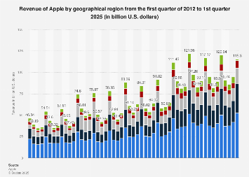

## Table of Contents

## What are the main regions where Apple operates?

Apple operates in many places around the world. The main regions where Apple has big offices and stores are North America, Europe, and Asia. In North America, Apple's headquarters is in Cupertino, California. They also have stores all over the United States and Canada. Europe is another important region for Apple. They have stores in countries like the United Kingdom, Germany, and France. Apple also has offices in many European cities.

In Asia, Apple has a strong presence too. China is a very big market for Apple, with many stores in cities like Beijing and Shanghai. They also have stores and offices in Japan, South Korea, and other countries in the region. Apple's products are popular in these places, and they keep growing their business there. Overall, Apple works hard to reach customers all over the world by having stores and offices in these main regions.

## How does Apple define its business regions?

Apple divides its business into different regions to better manage its operations and sales. The main regions are the Americas, Europe, and Asia-Pacific. The Americas include the United States, Canada, and Latin American countries. Europe covers countries in the European Union, like Germany and France, as well as other European countries like the United Kingdom and Russia. The Asia-Pacific region includes big markets like China, Japan, and Australia, along with other countries in that area.

These regions help Apple focus on specific markets and understand the needs of customers in different parts of the world. For example, in the Americas, Apple might focus on different products or marketing strategies than in Europe or Asia-Pacific. By dividing the world into these regions, Apple can better serve its customers and grow its business in each area.

## Which region generates the most revenue for Apple?

The region that generates the most revenue for Apple is the Americas. This includes the United States, Canada, and countries in Latin America. The United States is the biggest part of this region and has a lot of Apple stores and customers. People in the Americas buy a lot of Apple products like iPhones, iPads, and Mac computers. This makes the Americas the top region for Apple's sales.

Apple also makes a lot of money from other regions, but not as much as the Americas. Europe is the second biggest region for Apple's revenue. Countries like Germany, France, and the United Kingdom have many Apple stores and customers. Asia-Pacific, which includes China, Japan, and Australia, is another important region. However, the Americas still bring in the most money for Apple.

## What percentage of Apple's total revenue comes from each major region?

The Americas bring in the most money for Apple, making up about 40% of their total revenue. This region includes the United States, Canada, and Latin American countries. The United States is the biggest part of this region, with lots of Apple stores and customers buying iPhones, iPads, and Mac computers. This makes the Americas the top region for Apple's sales.

Europe is the second biggest region for Apple, bringing in around 25% of their total revenue. This includes countries like Germany, France, and the United Kingdom, where there are many Apple stores and customers. Apple also makes money from other European countries, but not as much as from the Americas.

The Asia-Pacific region, which includes China, Japan, and Australia, brings in about 35% of Apple's total revenue. China is a very big market for Apple, with many stores in cities like Beijing and Shanghai. Japan and Australia also have a lot of Apple customers. Even though the Asia-Pacific region is important, the Americas still bring in the most money for Apple.

## How have Apple's regional profits changed over the last five years?

Over the last five years, Apple's profits in the Americas have stayed strong. This region, which includes the United States, Canada, and Latin America, still brings in the most money for Apple. The profits have grown a bit each year, mainly because more people keep buying Apple's products like iPhones and Mac computers. The United States is the biggest part of this region, and it has a lot of Apple stores and customers. Even though the growth has slowed down a little, the Americas are still the top region for Apple's profits.

In Europe, Apple's profits have also grown over the last five years. This region includes countries like Germany, France, and the United Kingdom. More people in Europe are buying Apple products, and the company has opened more stores there. The growth in Europe has been steady, but not as fast as in the Americas. Still, Europe is an important region for Apple, bringing in a good amount of profit each year.

In the Asia-Pacific region, which includes China, Japan, and Australia, Apple's profits have gone up and down over the last five years. China is a big market for Apple, but the profits there have been a bit uneven. Some years, profits grew a lot because more people bought iPhones and other products. Other years, the profits didn't grow as much, or even went down a little. Japan and Australia have also seen some growth in Apple's profits, but not as much as in China. Overall, the Asia-Pacific region is still very important for Apple, even though the profits can change from year to year.

## What are the key factors contributing to Apple's profitability in its top region?

In the Americas, Apple's biggest region for profits, a few important things help the company make a lot of money. First, the United States has a lot of Apple stores, and many people there like to buy Apple's products like iPhones, iPads, and Mac computers. Apple keeps coming out with new and better products, which makes people want to buy them. Also, Apple has a strong brand that people trust, so they are willing to spend more money on Apple's things. Another big reason is that Apple has good deals with phone companies in the United States. These companies help sell a lot of iPhones by offering them with phone plans.

Another key [factor](/wiki/factor-investing) is how well Apple can keep making money from the same customers. Many people in the Americas already use Apple products and keep buying new ones when they come out. Apple also makes money from things like the App Store, where people buy apps and other digital stuff. This means that even after someone buys an iPhone, they might keep spending money on Apple's services. All these things together help Apple stay profitable in the Americas, where they make the most money.

## How does Apple's product mix vary by region and affect profitability?

Apple's product mix changes a bit depending on the region, and this can affect how much money they make. In the Americas, especially the United States, iPhones are really popular. People there also buy a lot of iPads and Mac computers. Apple makes a lot of money from these products because they are high-priced and people are willing to pay for them. The App Store also helps Apple make more money in the Americas because people buy apps and other digital things. This mix of products and services helps Apple stay profitable in this region.

In Europe, the product mix is a bit different. While iPhones are still very important, people in Europe also buy a lot of Mac computers and Apple Watches. These products help Apple make money, but not as much as in the Americas. Europe has a strong market for Apple's higher-end products, but the company also has to deal with different languages and cultures, which can make selling products a bit harder. Even though the product mix is different, Apple still makes good profits in Europe.

In the Asia-Pacific region, especially in China, the product mix can change a lot. iPhones are still a big part of Apple's sales, but the company faces more competition from other phone makers. In Japan and Australia, people buy a lot of iPads and Mac computers, which helps Apple make money. The mix of products in Asia-Pacific can affect Apple's profits because it depends on how well they can sell against other companies. Overall, the different product mixes in each region play a big role in how much money Apple makes.

## What are the challenges Apple faces in its least profitable regions?

In its least profitable regions, Apple faces several challenges. One big problem is competition. In places like China and other parts of Asia, there are many other companies making phones and computers that are cheaper than Apple's. This makes it hard for Apple to sell as many of their products. Also, people in these regions might not have as much money to spend on expensive things like iPhones and Mac computers. This means Apple has to find ways to make their products more affordable or show people why they are worth the extra cost.

Another challenge is dealing with different cultures and languages. In some countries, people might not understand Apple's marketing or feel connected to the brand. This can make it harder for Apple to sell their products. Apple also has to follow different rules and laws in each country, which can be complicated and slow down their business. For example, some countries have strict rules about what can be sold or how things are made. All these challenges make it harder for Apple to make as much money in these regions as they do in places like the Americas.

## How does Apple's marketing strategy differ across regions to maximize profits?

Apple changes its marketing in different parts of the world to make more money. In the Americas, especially the United States, Apple focuses on showing how cool and new their products are. They use big ads and work with famous people to make people want to buy iPhones and other things. They also make deals with phone companies to sell more iPhones. This helps Apple make a lot of money because people in the Americas like new technology and are willing to pay for it.

In Europe, Apple's marketing is a bit different. They still talk about how good their products are, but they also focus on how they fit into people's lives. For example, they might show how an Apple Watch can help with fitness or how a Mac can help with work. Apple also makes sure to use different languages and understand the cultures in each country. This helps them sell more products even though it can be harder to reach people in different places. In the Asia-Pacific region, especially China, Apple has to work hard to stand out from other companies. They use ads that show how their products are different and better. They also try to make their products more affordable or offer special deals to get more people to buy them. This helps Apple make more money even though it's a tough market.

## What role do local regulations and economic conditions play in Apple's regional profitability?

Local regulations and economic conditions have a big impact on how much money Apple can make in different parts of the world. In some countries, there are strict rules about what can be sold or how things are made. For example, in China, Apple has to follow rules about what can be in their phones and how they can sell them. These rules can make it harder for Apple to make as much money as they do in other places. Economic conditions also matter a lot. In countries where people don't have as much money to spend, it's harder for Apple to sell their expensive products like iPhones and Mac computers. This means Apple might not make as much money in these regions.

To deal with these challenges, Apple has to change how they do business in each region. In places with strict rules, Apple works hard to follow them while still trying to make money. They might have to spend more time and money to make sure their products meet all the local laws. In countries where people don't have as much money, Apple might try to make their products more affordable or offer special deals. By understanding and adapting to local regulations and economic conditions, Apple can try to make more money even in their least profitable regions.

## How does Apple's supply chain efficiency impact profitability in different regions?

Apple's supply chain helps them make and sell products all over the world. When their supply chain works well, it means they can get products to stores faster and cheaper. This is important because it helps Apple keep prices low and make more money. In the Americas, where Apple makes the most money, having a good supply chain means they can quickly get new iPhones and other products to customers. This makes people happy and keeps them buying Apple's things, which helps Apple stay profitable.

In other regions like Europe and Asia-Pacific, the supply chain can be more complicated. There might be different rules about how things can be shipped or made, which can slow things down and cost more money. In Europe, for example, Apple has to deal with many different countries and languages, which can make it harder to get products to stores quickly. In Asia-Pacific, especially in China, Apple has to work with many different factories and follow strict rules. If the supply chain is not as efficient in these regions, it can be harder for Apple to make as much money. But when Apple can make their supply chain work well everywhere, it helps them sell more products and make more profit in all regions.

## What future trends might affect Apple's profitability in its key regions?

In the future, a few big things might change how much money Apple makes in its main regions. One big thing is how people use technology. More and more people might want to buy new kinds of products, like smart glasses or better virtual reality stuff. If Apple can make these new things and people like them, it could help Apple make more money. But if other companies make these new products first, it might be harder for Apple to keep making as much money as they do now. Another thing is how the economy is doing. If people have more money to spend, they might buy more Apple products. But if the economy is not doing well, people might not want to spend as much on expensive things like iPhones.

In the Americas, where Apple makes the most money, changes in what people want and how much they can spend will be really important. If Apple can keep making cool new products that people want, they can stay profitable. But if other companies start making better or cheaper things, it might be harder for Apple. In Europe and Asia-Pacific, things like new rules and competition will also matter. If there are new rules about how things can be made or sold, Apple might have to spend more money to follow them. And if other companies in these regions make better products, it could be harder for Apple to make as much money. Overall, Apple will need to keep up with new trends and changes to stay profitable in all its key regions.

## References & Further Reading

[1]: ["Advances in Financial Machine Learning"](https://www.amazon.com/Advances-Financial-Machine-Learning-Marcos/dp/1119482089) by Marcos Lopez de Prado

[2]: Bergstra, J., Bardenet, R., Bengio, Y., & Kégl, B. (2011). ["Algorithms for Hyper-Parameter Optimization."](https://dl.acm.org/doi/10.5555/2986459.2986743) Advances in Neural Information Processing Systems 24.

[3]: ["Evidence-Based Technical Analysis: Applying the Scientific Method and Statistical Inference to Trading Signals"](https://www.amazon.com/Evidence-Based-Technical-Analysis-Scientific-Statistical/dp/0470008741) by David Aronson

[4]: ["Machine Learning for Algorithmic Trading"](https://github.com/stefan-jansen/machine-learning-for-trading) by Stefan Jansen

[5]: ["Quantitative Trading: How to Build Your Own Algorithmic Trading Business"](https://www.amazon.com/Quantitative-Trading-Build-Algorithmic-Business/dp/1119800064) by Ernest P. Chan