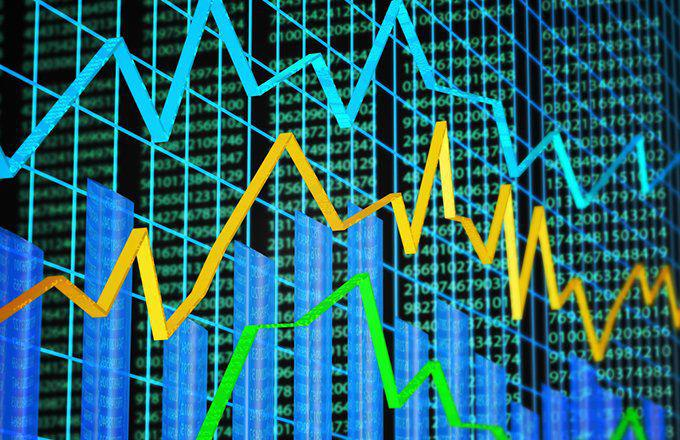

Apple Inc. (AAPL) stands as a titan in the global market, recognized for its trailblazing innovations and a brand that resonates with millions worldwide. This status not only underscores its reputation but also mirrors its substantial financial prowess. Central to understanding Apple's financial health is an examination of its profitability across different international markets and regions. Each of these regions contributes uniquely to Apple's revenue, reflecting varying economic landscapes, consumer preferences, and competitive dynamics.

In addition to evaluating Apple's regional business performance, the article sheds light on the role of algorithmic trading in AAPL stock transactions, which is a significant aspect given the stock's high liquidity and inherent volatility. Algorithmic trading, employed extensively by investors, leverages complex algorithms for executing trades at speeds and frequencies unachievable by human traders. This method influences the stock's market behavior, adding layers of complexity to stock price movements.



Through this exploration, stakeholders can gain a nuanced understanding of how Apple's strategic maneuvering across global markets and the technology-driven dynamics of its stock trading impact its financial outcomes.

## Table of Contents

## Apple's Global Business Regions

Apple Inc., a prominent technology company, conducts its global business operations across several distinct regions: the Americas, Greater China, Europe, Japan, and the Rest of Asia Pacific. This strategic regional segmentation allows Apple to effectively manage and capitalize on the unique economic and consumer dynamics inherent to each area. 

1. **Americas**: This region, encompassing both North and South America, remains the most substantial contributor to Apple's revenue. The demand for Apple products in these markets is robust, fueled by Apple's strong brand loyalty and a consumer base that is highly receptive to its new product releases and services. However, the region faces challenges such as intense competition from other tech giants and tight regulatory scrutiny, which require Apple to continually innovate and adapt.

2. **Greater China**: Including mainland China, Hong Kong, and Taiwan, this region represents one of the fastest-growing segments for Apple. It is pivotal due to its substantial and rapidly expanding consumer base. Apple's significant operating margins in this market underscore its growing importance. The region, however, is subject to geopolitical tensions and intense local competition, which Apple must navigate carefully to maintain and grow its market share.

3. **Europe**: Despite experiencing a relative decline in its contribution to overall profitability, Europe remains a crucial market for Apple. The European segment includes various economically diverse countries, alongside other regions such as India, the Middle East, and Africa. Each of these areas presents distinct consumer preferences and regulatory challenges, impacting Apple's operational strategies and requiring a tailored approach to address local demands.

4. **Japan**: Although smaller in comparison to other segments, Japan is distinguished by being Apple's highest-margin market. This is largely attributed to strong consumer loyalty and the premium pricing strategy that Apple maintains. The cultural preference for premium and high-quality products aligns well with Apple's brand, making Japan an essential market despite its size.

5. **Rest of Asia Pacific**: This diverse region, including countries like Australia and other smaller Asia Pacific nations, although smaller in revenue generation, remains strategically vital for Apple. It supports Apple's diversification efforts, spreading the company's risk and leading to potentially untapped opportunities in emerging markets.

Each of these regions presents its own set of challenges and opportunities, necessitating a balanced and informed regional strategy to enhance Apple's global profitability and sustain its competitive advantage in the technology marketplace.

## The Americas: Largest Contributor to Apple's Revenues

The Americas, encompassing both North and South America, have consistently stood out as Apple's most profitable region, commanding the highest sales figures among all its geographical segments. This region's contribution to Apple's total profit often exceeds 40%, reflecting a robust demand for Apple's wide array of products and services, including the iPhone, iPad, Mac, Apple Watch, and various other hardware and software offerings.

The United States, being Apple's home market, plays a particularly significant role within the Americas. The cultural affinity and brand loyalty fostered over decades have helped Apple maintain a strong foothold, enabling product launches that often define industry standards. Furthermore, Apple's extensive ecosystem has cultivated enduring customer relationships, driving repeat purchases and sustained profitability.

Still, Apple faces challenges within this lucrative region. The competitive consumer electronics market presents constant threats from major brands such as Samsung, Microsoft, and Google. Apple must continuously innovate to sustain its market leadership and protect its profit margins. Additionally, regulatory scrutiny in the United States has been intensifying, with increasing calls for antitrust investigations and privacy regulations that could impact its operations and business model.

Despite these challenges, the Americas remain a cornerstone of Apple's earnings. The company's strategic investments in retail store experiences, continuous product refinements, and expanded service offerings underline its commitment to solidifying its market position. The balance between innovation and regulatory compliance will dictate Apple's ability to navigate these competitive landscapes effectively, ensuring continued profitability in this vital region.

## Greater China: A Fast-Growing Segment

Greater China, encompassing China, Hong Kong, and Taiwan, represents a rapidly expanding market for Apple Inc. The significance of this region to Apple's profitability is underscored by its high operating margins, one of the highest among all of Apple's regional segments. As of recent financial reports, Greater China has consistently contributed a substantial portion of the company's revenues, reflecting Apple's strong brand presence and the growing demand for its products and services in this area. 

Despite the thriving business environment, Apple faces considerable challenges in Greater China. Geopolitical tensions, particularly between the United States and China, pose potential risks to Apple's operations, influencing supply chains and market access. Additionally, the robust presence of local competitors like Huawei, Xiaomi, and Oppo presents a competitive market landscape where Apple must continually innovate and adapt to maintain its market share.

However, the potential for growth in Greater China remains significant. The region's large consumer base, coupled with an increasing disposable income, offers vast opportunities for expanding Apple's footprint. The burgeoning middle class is particularly keen on premium products, which aligns well with Apple's product strategy focusing on quality and innovation.

To capitalize on this potential, Apple continues to invest in retail expansion and marketing tailored to local preferences, while also advancing collaborations with local developers to enrich its ecosystem of applications and services that cater to Chinese consumers. The strategic importance of Greater China is reflected in Apple's ongoing commitment to balancing market opportunities with the inherent challenges, ensuring sustained profitability and growth in this vital segment.

## Europe: A Declining Yet Vital Market

Europe continues to play an essential role in Apple's global strategy, even as its share in the company's overall profitability has experienced a downturn. This development is largely attributed to fluctuating demand patterns, competitive pressures, and a complex regulatory environment across the continent. The European segment for Apple encompasses not only the European Union and its member states but also extends to incorporate regions like India, the Middle East, and Africa. Each of these areas presents unique demands and market dynamics, requiring Apple to tailor its strategies effectively.

In Europe, the challenge of economic uncertainty is pronounced. The region has been grappling with economic sluggishness, partially due to broader geopolitical tensions and local market conditions impacting consumer spending power. Meanwhile, Apple's persistent need to navigate multifaceted regulatory frameworks cannot be understated. The European Union is known for its stringent data protection laws, as exemplified by the General Data Protection Regulation (GDPR), which has necessitated operational adjustments by tech companies including Apple. Furthermore, local policies on waste management and electronic recycling impose additional operational requirements.

India, included within this segment, represents a burgeoning market with a rapidly growing middle class and increasing digitization. However, Apple's high pricing strategy faces challenges in a price-sensitive market where competition from more affordable alternatives is intense. In the Middle East, economic diversification efforts by oil-dependent economies offer a fertile ground for Apple's technological products and services. However, political instability remains a pervasive risk [factor](/wiki/factor-investing).

Africa, with its expanding young population and increasing mobile penetration, presents growth opportunities for Apple's devices and services. Yet, infrastructural limitations and varying economic conditions across the continent mean that Apple has to strategically position itself to capture market share.

To maintain its foothold in this economically and regulatory complex landscape, Apple has amplified its focus on product localization and strategic partnerships. It strives to balance premium pricing with value offerings that appeal to diverse consumer bases, ensuring relevance across varied demographic and economic contexts.

In conclusion, while Europe no longer commands the same proportional weight in Apple's overall profitability, it remains an indispensable part of the company's global strategy. Apple's ability to adapt to economic uncertainties and to align with multi-regional regulatory stipulations is central to sustaining its market presence in this vital segment.

## Japan and Asia Pacific: Niche but Important Markets

Japan, while trailing behind other key regions in terms of sales [volume](/wiki/volume-trading-strategy) for Apple Inc., exhibits one of the company's highest profit margins. This profitability is largely attributed to strong consumer loyalty, which allows Apple to maintain premium pricing strategies in this market. Despite the competitive nature of the tech landscape in Japan, where domestic brands like Sony and Panasonic are significant players, Apple's brand reputation and innovative products continue to attract a dedicated customer base. This loyalty is crucial for Apple's business strategy, enabling the company to sustain high margins and favorable market positioning.

The Rest of Asia Pacific, which encompasses countries like Australia, New Zealand, and several Southeast Asian nations, although smaller in direct revenue contributions, remains strategically important for Apple. This region supports Apple's initiative to diversify its revenue sources. The varying degrees of economic development within these countries provide Apple with opportunities to tailor its market strategies, such as pricing adjustments and product availability, to suit local demands. For instance, in Australia, where the market is more developed, Apple focuses on premium products, while in emerging markets, it might adjust its approach to enhance accessibility.

These regions reflect Apple's strategy of capitalizing on developed markets with substantial purchasing power and emerging markets with significant growth potential. By balancing its efforts across diverse economic landscapes, Apple can fortify its global revenue streams and mitigate risks associated with any single market's economic fluctuations. This dual focus not only enhances Apple's financial resilience but also reinforces its global reach, ensuring the company remains at the forefront of technological innovation and consumer electronics.

## Algorithmic Trading and AAPL Stock

Algorithmic trading, a cornerstone of contemporary financial markets, significantly impacts the trading dynamics of Apple Inc. (AAPL) stock. Due to AAPL's inherent high [liquidity](/wiki/liquidity-risk-premium) and notable [volatility](/wiki/volatility-trading-strategies), it becomes an attractive asset for algorithmic traders who utilize computer systems to execute orders at speeds and frequencies that are impossible for human traders. These sophisticated algorithms can analyze large datasets, identify trading signals, and implement strategies within microseconds, thereby transforming trading patterns.

A primary characteristic of [algorithmic trading](/wiki/algorithmic-trading) is the use of high-frequency trading ([HFT](/wiki/high-frequency-trading-strategies)), which executes numerous trades in fractions of a second. For a stock like AAPL, algorithms are designed to exploit price discrepancies and market inefficiencies quickly. This ability to act on fleeting opportunities is crucial in a volatile market where prices can change rapidly. For example, MATLAB or Python scripts using libraries such as Pandas and NumPy can be coded to monitor stock movements and execute trades based on predefined algorithms. 

```python
import pandas as pd
import numpy as np

# Hypothetical function to simulate algorithmic trading
def trading_signal(prices):
    # Example of a simple moving average crossover strategy
    short_window = prices.rolling(window=40).mean()
    long_window = prices.rolling(window=100).mean()

    signals = pd.DataFrame(index=prices.index)
    signals['signal'] = 0.0
    signals['short_mavg'] = short_window
    signals['long_mavg'] = long_window

    # Generate trading signals
    signals['signal'][40:] = np.where(signals['short_mavg'][40:] > signals['long_mavg'][40:], 1.0, 0.0)   
    signals['positions'] = signals['signal'].diff()

    return signals
```

In the above code, a simple moving average strategy is illustrated, where trades are signaled by short-term averages crossing above or below long-term averages, a strategy that algorithmic systems may adapt to optimize trading actions based on real-time data.

The influence of algorithms is profound because they not only enhance liquidity by increasing market participation but also create complexities. Algorithmic trading can lead to rapid amplification of price movements, increasing the speed and extent of market volatility. This interaction between technology and finance necessitates a deep understanding of algorithm-generated market behaviors, as it frames the context in which modern equity trading, particularly of high-profile stocks like AAPL, occurs.

Thus, the role of algorithmic trading in AAPL stock is emblematic of the broader integration of technology into financial markets, illustrating both opportunities for returns and challenges in terms of market stability and regulation.

## Conclusion

Apple's diversified regional approach forms the foundation of its robust profitability, allowing the company to effectively navigate a spectrum of global challenges. By tailoring its strategies to suit the unique dynamics of diverse markets such as the Americas, Greater China, Europe, Japan, and the Rest of Asia Pacific, Apple not only maximizes its revenue streams but also mitigates risks associated with economic fluctuations and regulatory shifts. Each region presents distinct opportunities and challenges, influencing Apple's financial health and strategic decisions.

The integration of algorithmic trading into the landscape of AAPL stock transactions further complicates the financial milieu, presenting both opportunities and complexities. Algorithmic trading involves using sophisticated algorithms to execute trades at high speeds and large volumes, often taking advantage of AAPL's high liquidity and volatility. This technology-driven trading method can lead to more efficient markets but also introduces volatility that investors must account for when making decisions. The intricate interplay between AAPL's stock dynamics and algorithmic trading showcases the evolving nature of finance, where technology significantly influences market behavior.

For stakeholders, a comprehensive understanding of AAPL's regional business performance, coupled with insights into the technology-driven trading landscape, is essential. Such knowledge enables better forecasting of financial outcomes and informed decision-making. As Apple continues to adapt to the shifting economic and technological environments, its ability to maintain a stronghold in global markets while navigating complexities in trading practices will remain pivotal to its sustained success.

## References & Further Reading

[1]: ["Advances in Financial Machine Learning"](https://www.amazon.com/Advances-Financial-Machine-Learning-Marcos/dp/1119482089) by Marcos Lopez de Prado

[2]: Bergstra, J., Bardenet, R., Bengio, Y., & Kégl, B. (2011). ["Algorithms for Hyper-Parameter Optimization."](https://dl.acm.org/doi/10.5555/2986459.2986743) Advances in Neural Information Processing Systems 24.

[3]: ["Evidence-Based Technical Analysis: Applying the Scientific Method and Statistical Inference to Trading Signals"](https://www.amazon.com/Evidence-Based-Technical-Analysis-Scientific-Statistical/dp/0470008741) by David Aronson

[4]: ["Machine Learning for Algorithmic Trading"](https://github.com/stefan-jansen/machine-learning-for-trading) by Stefan Jansen

[5]: ["Quantitative Trading: How to Build Your Own Algorithmic Trading Business"](https://www.amazon.com/Quantitative-Trading-Build-Algorithmic-Business/dp/1119800064) by Ernest P. Chan