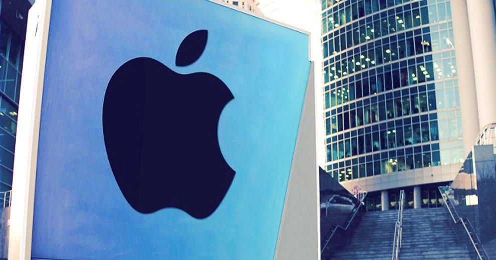

Apple Inc. has established itself as a pioneering entity in the technology sector, consistently achieving remarkable market capitalizations and expanding into a variety of business segments. Founded in 1976 by Steve Jobs, Steve Wozniak, and Ronald Wayne, Apple has evolved from its humble beginnings, marked by the launch of the Apple I computer, into a global giant known for innovation and strategic foresight.

Central to Apple's success is its ability to innovate and maintain a strong brand presence across its various product lines. The company is renowned for its ecosystem, which integrates hardware, software, and services seamlessly. This integration not only enhances user experience but also encourages customer loyalty and repeated product upgrades. The diversification from solely dependence on hardware sales, particularly the iPhone, to include services and other smart devices has further stabilized Apple's financial performance and cushioned the impact of market fluctuations.



In recent years, Apple has navigated shifts in consumer preferences and technological advancements by entering and dominating new market segments such as wearables and services, which encompass Apple Music, the App Store, iCloud, and more. These segments have not only contributed to revenue growth but have also shown higher margins, thereby improving overall profitability.

Additionally, the influence of algorithmic trading on Apple's stock performance is noteworthy. The rise of high-frequency trading and sophisticated predictive algorithms has significantly impacted how Apple's stock is perceived and traded in global financial markets. These technological advancements in trading have introduced a level of volatility that presents both opportunities and challenges for investors worldwide.

Overall, Apple's strategic diversification and commitment to innovation have ensured that it remains at the forefront of the industry. The company continues to leverage its strengths to not only secure its current market position but to also influence future market trends and consumer behaviors.

## Table of Contents

## Apple's Business Segments

Apple Inc. operates several core business segments that have played an essential role in the company's remarkable market presence and financial achievements. These primary segments include the iPhone, Services, Mac, iPad, and Wearables, Home, and Accessories. Each segment contributes uniquely to Apple's growth trajectory and market dominance.

The iPhone, since its launch, remains a pivotal part of Apple's business model. As of recent fiscal reports, the iPhone continues to be the largest revenue contributor for the company, generating nearly half of Apple's total revenue. This dominance in sales underscores the iPhone's critical role in the company's success, driven by continuous innovation, design excellence, and advancements in technology that keep it appealing to a broad base of consumers globally.

However, the iPhone's leadership does not overshadow the significant strides being made by Apple's other segments, particularly the Services segment. The Services sector encompasses a vast array of offerings such as the App Store, Apple Music, iCloud, and Apple Care. Over recent years, this segment has experienced significant growth, reflecting an increasing consumer shift towards digital services and subscriptions. With a high margin compared to hardware, the Services sector has become a crucial element of Apple's business strategy, ensuring a steady revenue stream that balances the cyclicality of hardware sales.

Additionally, Apple's Mac and iPad segments have continually innovated with product developments that cater to both professional and educational markets, among others. These segments contribute significantly to Apple's brand ecosystem, which symbiotically enhances customer loyalty and cross-platform integration.

The Wearables, Home, and Accessories segment further exemplifies Apple's strategic diversification. Products such as the Apple Watch, AirPods, and HomePod integrate seamlessly within the Apple ecosystem, creating enhanced user experiences and functionalities. This segment amplifies Apple's market penetration, especially as wearable technology and smart home devices gain popularity.

In conclusion, while the iPhone remains a cornerstone of Apple's revenue and growth, the expansion and emphasis on other segments such as Services demonstrate the company's forward-thinking strategy to maintain its global market leadership. Through a balanced approach, Apple continues to solidify its influence and ensure diverse revenue streams that contribute to its sustained financial success.

## Apple's Profitability

Apple's profitability is significantly underpinned by its innovative flagship product, the iPhone, which remains the cornerstone of the company's revenue. While hardware sales, especially iPhones, have traditionally been crucial to Apple's financial success, the company has proactively diversified its revenue streams to ensure sustained profitability. This strategic diversification helps mitigate the risks associated with market saturation in the smartphone segment.

Apple has successfully expanded its Services segment, including offerings like the App Store, Apple Music, iCloud, and Apple Pay. These services not only contribute high-margin revenue but also foster a recurring income model that effectively bolsters Apple's overall profit margins. This segment has witnessed robust growth, becoming a critical component of Apple's business model by providing a steady stream of revenue independent of hardware sales. The Services division has seen a significant year-over-year increase in revenue, which plays an instrumental role in offsetting fluctuations in hardware sales.

Here is a snippet of Python code to illustrate the contribution of different segments to Apple's total revenue:

```python
# Hypothetical revenue figures in billions
iphone_revenue = 200
services_revenue = 90
mac_revenue = 40
ipad_revenue = 30
wearables_revenue = 35

# Total revenue
total_revenue = (iphone_revenue + services_revenue + mac_revenue + 
                 ipad_revenue + wearables_revenue)

# Contribution percentage
iphone_contribution = (iphone_revenue / total_revenue) * 100
services_contribution = (services_revenue / total_revenue) * 100

print(f"iPhone Contribution: {iphone_contribution:.2f}%")
print(f"Services Contribution: {services_contribution:.2f}%")
```

By strategically investing in high-margin products and services, Apple has maintained healthy profit margins despite the challenges posed by hardware market saturation. The company's comprehensive approach to creating a vast ecosystem through complementary products and services fosters customer loyalty and increases cross-platform synergies, further amplifying profitability.

In summary, Apple's strategy of broadening its revenue base beyond hardware sales has strengthened its financial robustness. The continued expansion and growth of its Services segment underscore its ability to adapt to market changes and maintain its profitability advantage.

## Detailed Analysis of Apple Revenue Streams

Apple Inc.'s revenue streams exhibit a well-strategized balance between its flagship products and ancillary services, contributing to the company’s robust financial architecture. The iPhone, Apple's leading product, consistently accounts for a substantial portion of its revenue, often making up nearly half of the company's total financial inflow. This dominance underscores the iPhone's critical role in Apple's market presence and its substantial influence on the company’s profitability.

In recent years, Apple's Services segment has marked a significant uptrend, becoming an increasingly vital component of the company's revenue framework. This segment encompasses diverse offerings such as the App Store, Apple Music, iCloud, and Apple Pay, all of which have collectively shown a remarkable increase in year-over-year revenue. The burgeoning importance of Services is evident as it not only supplements Apple's overall revenue but also provides a buffer against the cyclical nature of hardware sales. This has allowed Apple to maintain a more consistent financial performance, smoothing out the fluctuations often associated with hardware market saturation and competition.

Beyond iPhones and Services, Apple's product portfolio includes other crucial segments like the Mac, iPad, and Wearables, Home, and Accessories. The Mac segment, although traditionally smaller than the iPhone, holds a significant share due to its appeal across various professional and educational sectors. The iPad remains a popular choice for consumers seeking portable computing solutions, further contributing to Apple's revenue.

In the wearables category, devices such as the Apple Watch and AirPods have gained considerable traction, evidencing rapid growth and capturing substantial market share in their respective niches. This segment not only adds to Apple's revenue base but also complements the broader ecosystem of Apple products. The integration of these devices with other Apple products enhances customer loyalty and fosters an environment where cross-platform synergies can thrive, prompting users to remain within the Apple ecosystem across multiple device categories.

Overall, Apple’s diversified revenue streams illustrate its strategic prowess in leveraging its ecosystem to achieve sustained growth. By balancing high-margin services with iconic hardware products, Apple secures its financial health while continuing to innovate and adapt to changing market dynamics.

## The Influence of Algorithmic Trading

Algorithmic trading, utilizing computer programs to execute a large number of orders in financial markets at high speeds, can significantly influence Apple's stock performance. This form of trading often affects stock prices and investor sentiment globally, thereby shaping investment strategies. 

High-frequency trading ([HFT](/wiki/high-frequency-trading-strategies)), a subset of [algorithmic trading](/wiki/algorithmic-trading), is notorious for its role in enhancing market [volatility](/wiki/volatility-trading-strategies). By executing trades within fractions of a second, HFT can lead to abrupt price swings. For instance, if an algorithm detects a slight underpricing of Apple's stock in the market, it can initiate a large [volume](/wiki/volume-trading-strategy) of buy orders, which could drive up the stock price swiftly. Similarly, predictive algorithms analyze historical data and current market conditions to forecast future stock price movements. Investors deploying these algorithms might either stabilize or destabilize Apple’s stock by their subsequent trading actions.

These activities present both opportunities and challenges for investors. On the one hand, algorithmic trading can increase [liquidity](/wiki/liquidity-risk-premium) in the market, making it easier for investors to buy and sell Apple shares quickly. On the other hand, the increased volatility associated with such trading mechanisms might pose risks, particularly to individual and long-term investors who may not react as quickly to rapid market changes. For instance, during periods of high volatility caused by algorithmic interventions, manual traders may struggle to execute trades at desired prices due to swiftly changing market conditions.

Moreover, investors increasingly rely on robust data analytics to predict trends. Sophisticated algorithms analyze vast datasets, considering factors such as historical stock performance, macroeconomic indicators, and even sentiment from social media. These algorithms deploy [machine learning](/wiki/machine-learning) models to identify patterns and predict future movements in Apple's share price. For example, by using a machine learning model in Python, investors can train a predictive model to foresee Apple's stock movement:

```python
import pandas as pd
from sklearn.model_selection import train_test_split
from sklearn.ensemble import RandomForestRegressor
from sklearn.metrics import mean_squared_error

# Load historical stock price data
data = pd.read_csv('apple_stock_data.csv')

# Prepare features and target
features = data[['open', 'high', 'low', 'volume']]
target = data['close']

# Split data into train and test sets
X_train, X_test, y_train, y_test = train_test_split(features, target, test_size=0.2, random_state=42)

# Train a Random Forest Regressor
model = RandomForestRegressor(n_estimators=100, random_state=42)
model.fit(X_train, y_train)

# Predict and evaluate
predictions = model.predict(X_test)
error = mean_squared_error(y_test, predictions)
print(f'Mean Squared Error: {error}')
```

This code snippet exemplifies how an investor might model Apple's stock prices using historical data inputs to refine their trading strategy. By leveraging technology, investors can make informed decisions, which in turn contributes to the dynamics of Apple’s stock in global exchanges. 

Overall, algorithmic trading plays a vital role in the modern stock market, introducing a level of complexity and requiring investors to adapt to rapidly-evolving technological trends.

## Conclusion

Apple Inc. has consistently demonstrated its ability to evolve and adapt by broadening its profitable segments, thereby ensuring sustained growth and profitability. The company's strategic focus on diversifying income sources has proven effective in maintaining its competitive edge, especially through the integration and expansion of its Services segment. This area, including offerings such as the App Store, Apple Music, and Apple Pay, has seen robust growth, adding resilience to financial performance amidst fluctuating hardware sales.

Innovative advancements in technology have further allowed Apple to enhance its product and service lineup, driving customer loyalty and ecosystem integration. This fusion of innovation and diversification underscores Apple's approach to remaining a market leader, continuously influencing market trends and setting benchmarks for the tech industry. 

Furthermore, Apple's commitment to leveraging cutting-edge technology has manifested in the creation of an interconnected ecosystem of devices and services, amplifying user engagement and opening new revenue streams. This strategic foresight not only fortifies its market position but also sets the stage for future growth opportunities across various sectors. The company's adeptness in navigating market dynamics while focusing on technological leadership ensures it remains a prominent force in the global marketplace.

## References & Further Reading

[1]: ["Apple Inc. Annual Report 2022"](https://www.sec.gov/Archives/edgar/data/320193/000032019322000108/aapl-20220924.htm) - Provides detailed insights into Apple's financial performance and business segments.

[2]: ["Apple: Behind the Scenes"](https://www.apple.com/newsroom/2023/10/behind-the-scenes-at-scary-fast-apples-keynote-event-shot-on-iphone/) - An article discussing Apple's growth strategy and diversification, published by The Wall Street Journal.

[3]: Linton, O. (2015). ["High-frequency trading: implications for markets and investors."](https://www.econstor.eu/bitstream/10419/189693/1/CWP061818.pdf) Journal of Financial Markets.

[4]: ["Value Creation in the iPhone Ecosystem"](https://transportgeography.org/contents/chapter7/globalization-international-trade/value-creation-iphone/) - An exploration of how Apple's ecosystem adds value by the Harvard Business Review.

[5]: ["Apple Hits High Note in Services Revenue"](https://www.investopedia.com/apple-q3-fy-2024-earning-8687702) - Bloomberg article emphasizing the growth and impact of Apple's Services segment.