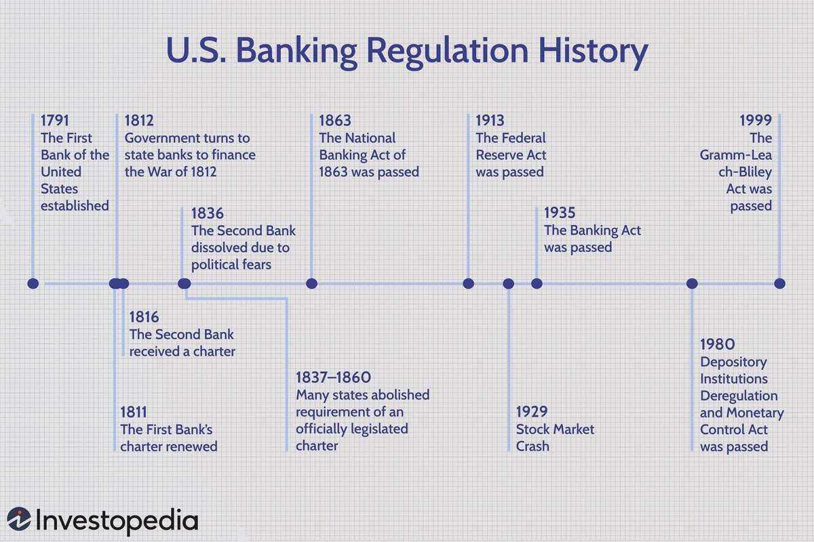

The integration of technology into financial markets has substantially transformed the trading landscape, primarily through the adoption of algorithmic trading. This sophisticated process relies on computer algorithms to execute orders with exceptional speed and accuracy, outpacing traditional manual trading methods. As financial institutions strive for increased efficiency, the reduction of transaction costs, and mitigation of human error, algorithmic trading emerges as a pivotal advancement. Yet, this technological breakthrough is not without its challenges. The potential for market manipulation and systemic risks poses significant concerns, emphasizing the need for stringent regulatory frameworks.

Regulatory guidelines play a crucial role in navigating the complexities inherent in algorithmic trading. A key area of focus for financial institutions and insurers involved in this domain is the Appleton Rule. While algorithmic trading revolutionizes market operations, adhering to regulatory compliance, particularly under the Appleton Rule, ensures stability and integrity. This rule necessitates that insurers operating in New York comply with the state's insurance regulations, even when transacting beyond state borders. Understanding the Appleton Rule's implications, alongside other regulatory requirements, is crucial for maintaining operational integrity.

This article explores the essential aspects of regulatory compliance, with a particular emphasis on the applicability of the Appleton Rule within the context of algorithmic trading. By elucidating these foundational elements, financial institutions can better navigate the regulatory landscape, enhancing both compliance and operational efficacy in the ever-evolving world of algorithmic trading.

## Table of Contents

## Understanding the Appleton Rule

The Appleton Rule is a regulatory mandate that requires insurers conducting operations in New York to adhere to the state's comprehensive insurance regulations, irrespective of whether they conduct business outside of New York. Initially enacted in the early 1900s, the provisions of the Appleton Rule were formalized into New York state law by 1939, with the primary objective of bolstering consumer protection and ensuring regulatory consistency across the insurance sector. This mandate has significant implications, as non-compliance can lead to substantial penalties for insurers, including the possibility of license revocation and the imposition of fines.

The Rule's applicability becomes particularly pertinent when considering cross-state insurance operations in the context of algorithmic trading. It necessitates that insurers engaged in such operations ensure compliance not only with federal regulations but also with the specific requirements set forth by the Appleton Rule. This dual compliance is essential for maintaining operational legitimacy and avoiding punitive actions that could compromise an insurer's ability to operate effectively across state borders.

Understanding the impact of the Appleton Rule in algorithmic trading scenarios is critical. It ensures that even as insurers leverage sophisticated algorithms for efficiency and speed in trading, they do not overlook the regulatory obligations imposed by their home state of New York. Such oversight is a fundamental aspect of risk management and corporate governance, safeguarding both the integrity of financial operations and the interests of consumers.

## Regulatory Framework for Algorithmic Trading

Algorithmic trading is subject to a layered regulatory framework designed to ensure market integrity, transparency, and risk management. The primary regulatory bodies overseeing this space in the United States are the Securities and Exchange Commission (SEC) and the Commodity Futures Trading Commission (CFTC), each with specific mandates and rules.

The SEC's Market Access Rule, formally known as Rule 15c3-5, is crucial for brokers and dealers accessing the securities markets. This rule mandates pre-trade and post-trade risk controls to prevent erroneous orders and mitigate systemic risks. Key provisions include the need for automated risk management controls and supervisory procedures to manage the financial exposure and ensure compliance with regulatory requirements. Implementation of these controls can involve various strategies, such as the use of automated monitoring systems that analyze transaction volumes and order values to detect potential anomalies early.

The CFTC governs the trading of commodity futures and options in the United States. Its Regulation Automated Trading (Reg AT) aims to enhance the integrity of the derivatives markets by imposing stringent risk management practices. This includes requirements for algorithmic traders to register with the CFTC, maintain a comprehensive risk management framework, and ensure transparency in their trading activities. Reg AT emphasizes the development of pre-trade risk controls, business continuity plans, and the obligation for firms to provide detailed records of their trading algorithms to regulatory bodies when requested.

Both the SEC and CFTC regulations highlight the need for robust systems and control mechanisms to manage risks associated with high-speed trading efficiently. By adhering to these regulatory guidelines, financial institutions can operate within the legal framework, avoid potential penalties, and ensure that their trading practices do not compromise market stability. Understanding and complying with these complex regulatory requirements are critical for any firm participating in [algorithmic trading](/wiki/algorithmic-trading) to leverage its benefits fully while safeguarding against the inherent risks.

## Compliance Requirements

Algorithmic traders are mandated to register with relevant regulatory bodies, a step that serves as a foundational compliance requirement to ensure adherence to both federal and state regulations, including considerations of the Appleton Rule. Registration is imperative for establishing accountability and transparency in trading operations. This procedural step aligns with the necessity for traders to operate within a clearly defined legal framework, most notably in states like New York where the Appleton Rule—mandating stringent compliance with state insurance regulations—may have implications for insurers engaging in algorithmic trading activities.

A critical component of compliance is the implementation of robust risk management practices. Pre-trade risk controls are essential to mitigate potential trading anomalies that could disrupt market functioning. Practices such as establishing order size limitations are put in place to prevent excessive market impact, reduce the risk of erroneous trades, and ensure the [liquidity](/wiki/liquidity-risk-premium) and stability of financial markets. Other systemic safeguards, such as the use of circuit breakers and kill switches, act as additional protections to halt or limit trades in volatile market conditions.

Post-trade surveillance further guarantees the integrity of trading activities and compliance with regulatory norms. This involves ongoing monitoring and analysis of trade executions to identify and rectify any irregularities or manipulative practices that may have occurred during trading sessions. Surveillance systems are designed to flag suspicious activities, ensuring that traders adhere not only to established internal policies but also to external regulatory requirements. The deployment of advanced analytics and [machine learning](/wiki/machine-learning) techniques aids in the detection of anomalous patterns that could signal risk or non-compliance, thereby enhancing the overall efficacy of market oversight mechanisms.

Collectively, these compliance measures, encompassing both pre-trade and post-trade protocols, are indispensable in maintaining the seamless operation of algorithmic trading platforms while safeguarding the broader financial system against systemic risks and promoting fair trading practices.

## Risk Management and Controls

Risk management in algorithmic trading involves a comprehensive set of system safeguards designed to enhance operational resilience and prevent potential failures. Stress testing is a fundamental component, simulating extreme market conditions to assess the robustness of trading algorithms. This involves running scenarios that replicate market [volatility](/wiki/volatility-trading-strategies) or liquidity crises, ensuring systems can endure adverse conditions without catastrophic failure. Business continuity plans (BCPs) are equally important, detailing procedures to maintain or quickly resume trading operations during disruptions. A well-developed BCP addresses potential risks such as cyber-attacks, hardware failures, and natural disasters, and outlines recovery strategies to minimize downtime.

Model risk management plays a critical role in the lifecycle of trading algorithms. This process encompasses the rigorous development, testing, and validation of models to ensure their accuracy and reliability. Steps include [backtesting](/wiki/backtesting) algorithms against historical data to verify their predictive performance and applying statistical analysis to understand potential biases or inaccuracies. This also requires continuous monitoring and recalibration of models in response to changes in market conditions. Validation processes typically include independent reviews by risk management teams to provide an objective assessment of model integrity.

Governance frameworks are essential for maintaining robust oversight and internal controls. Effective governance ensures that algorithmic trading activities comply with regulatory standards and organizational policies. The board of directors must actively oversee the risk management initiatives, incorporating regular reviews and updates on risk exposures and control effectiveness. Internal audit functions are necessary to evaluate the operational risks and ensure that there are mechanisms in place to rectify deficiencies. Governance also involves establishing a culture of compliance and accountability within the organization, with clear roles and responsibilities for managing trading operations.

Together, these risk management and control measures form a cohesive strategy to mitigate the risks associated with algorithmic trading. By implementing systematic safeguards, rigorous model validation, and strong governance, financial institutions can enhance their ability to operate effectively in the fast-paced environment of algorithmic trading while minimizing potential systemic risks.

## Appleton Rule Compliance in Algorithmic Trading

For insurers engaged in algorithmic trading, compliance with the Appleton Rule is essential due to the unique regulatory environment of New York State. This rule mandates that insurers, even when operating outside of New York, must adhere to New York's strict insurance regulations. This requires sophisticated alignment of both federal algorithmic trading regulations and the particular stipulations of the Appleton Rule, creating a complex landscape of compliance.

Adhering to federal algorithmic trading regulations entails complying with guidelines set by regulatory bodies such as the Securities and Exchange Commission (SEC) and the Commodity Futures Trading Commission (CFTC). The SEC's regulations include implementing pre-trade and post-trade risk controls to mitigate the risks associated with high-frequency trading. On the other hand, the CFTC's Regulation Automated Trading (Reg AT) emphasizes risk management practices and transparency in trading activities. These federal requirements form the baseline of compliance for any entity involved in algorithmic trading.

Incorporating the Appleton Rule adds another layer of compliance complexity. To effectively integrate these requirements, insurers must develop robust frameworks that address both federal and state regulations. This involves creating compliance systems that are agile enough to accommodate regulatory changes and specific enough to address the idiosyncrasies of each rule. A well-structured framework will streamline operations by providing clear guidelines and processes to ensure consistent compliance across various jurisdictions.

A practical approach to achieving this involves employing advanced risk management systems that can adapt to regulatory demands. These systems should be capable of executing real-time monitoring and reporting, ensuring that trading practices align with both the letter and spirit of applicable laws. Additionally, insurers should invest in compliance technology that supports automated checks and balances, thereby reducing the potential for human error and oversight.

In summary, the integration of the Appleton Rule into the compliance strategy of insurers engaging in algorithmic trading is not just a regulatory necessity but also an operational imperative. By establishing a comprehensive compliance program that encompasses both federal and state regulations, insurers can maintain the requisite level of oversight and control, thereby safeguarding their financial operations and reputational integrity.

## Conclusion

Algorithmic trading offers substantial opportunities for driving innovation and enhancing efficiency within financial markets. This method leverages the power of computer algorithms to execute trades at remarkably high speeds, aiming for optimal transaction outcomes. Nevertheless, the associated compliance challenges are intricate, necessitating careful navigation to prevent operational and legal pitfalls.

A critical component of maintaining operational integrity within algorithmic trading activities is adhering to the Appleton Rule alongside federal regulatory guidelines. The Appleton Rule mandates that insurers in New York comply with the state’s rigorous insurance regulations, extending these standards to operations beyond state boundaries. This requirement reinforces the importance of stringent compliance measures for financial institutions, especially those engaged in algorithmic trading that involves cross-state or cross-border elements.

Additionally, federal regulatory bodies like the Securities and Exchange Commission (SEC) and the Commodity Futures Trading Commission (CFTC) impose significant guidelines and oversight on algorithmic trading practices. Compliance with these guidelines ensures the robust monitoring of trading activities, reducing the risks of market manipulation and potential systemic failures. Failure to adhere to these comprehensive regulatory frameworks can result in severe consequences, including fines or revocation of trading licenses.

To effectively navigate these regulatory landscapes and fully leverage the benefits of algorithmic trading, financial institutions must implement comprehensive risk management and governance practices. This includes developing robust pre-trade and post-trade risk controls, ensuring rigorous testing and validation of trading algorithms, and maintaining strong board oversight. By integrating these practices, institutions can ensure compliance and enhance their capability to innovate within financial markets, ultimately capitalizing on the efficiencies that algorithmic trading presents while minimizing associated risks.

## References & Further Reading

[1]: Singh, A., & Vishwakarma, P. (2019). ["Algorithmic Trading and Its Implications on Financial Markets."](https://pmc.ncbi.nlm.nih.gov/articles/PMC10576973/) SSRN Electronic Journal.

[2]: Securities and Exchange Commission. (2010). ["Risk Management Controls for Brokers or Dealers with Market Access; Final Rule."](https://www.sec.gov/files/rules/final/2010/34-63241.pdf) SEC Release No. 34-63241.

[3]: Commodity Futures Trading Commission. (2016). ["Regulation Automated Trading."](https://www.federalregister.gov/documents/2016/11/25/2016-27250/regulation-automated-trading) CFTC Federal Register Release.

[4]: Sanderson, T., & Arbelaez, M. (2018). ["Managing Model Risk in Algorithmic Trading."](https://www.deloitte.com/uk/en/services/audit-assurance/blogs/managing-model-risk-in-electronic-trading-algorithms-a-look-at-fmsbs-statement-of-good-practice.html) Journal of Risk Model Validation, 12(2).

[5]: Hull, J. (2018). ["Risk Management and Financial Institutions."](https://books.google.com/books/about/Risk_Management_and_Financial_Institutio.html?id=1J1QDwAAQBAJ) John Wiley & Sons.