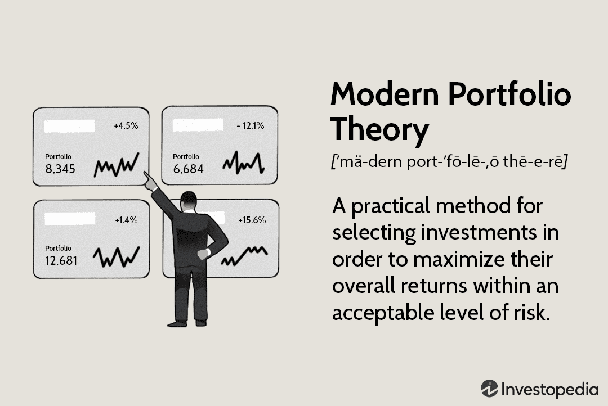

Investment strategies have undergone significant transformation over the years, with Modern Portfolio Theory (MPT) emerging as a foundational element in this evolution. Developed by Harry Markowitz in the 1950s, MPT offers a systematic framework for investors aiming to optimize returns for a given level of risk by strategically diversifying their investment portfolios. This theoretical construct has become indispensable in understanding how to balance risk and return effectively through diversification. MPT posits that it's not enough to look at the expected risk and return of one particular stock in isolation, but rather the portfolio as a whole. 

The theory provides measures for determining an 'efficient frontier'—a set of optimal portfolios that offer the highest expected return for a defined level of risk or the lowest risk for a given level of expected return. This quantifiable methodology has paved the way for structured approaches in managing investments, allowing traders and investors to develop portfolios that effectively manage risk while aiming to maximize returns.



In exploring the integration of MPT with modern algorithmic trading strategies, one gains insights into enhancing portfolio efficiency. Algorithmic trading, which uses pre-set rules to automate trading processes, aligns naturally with the analytical and data-driven principles of MPT. By employing algorithms, traders can dynamically adjust portfolios, maintaining a position on or near the efficient frontier even as market conditions fluctuate. 

Understanding these principles is crucial for investors and traders looking to leverage modern techniques and improve their portfolio management strategies. As the linking of MPT with algorithmic trading methods evolves, investors are afforded greater precision and efficiency in their trading activities. This symbiosis of traditional theory with contemporary technology offers promising enhancements to investment strategies, underscoring the enduring relevance of MPT in today's fast-paced financial markets.

## Table of Contents

## Understanding Modern Portfolio Theory

Modern Portfolio Theory (MPT), introduced by Harry Markowitz in 1952, revolutionized the way investors approach portfolio management by emphasizing the trade-off between risk and return through diversification. The core premise of MPT is that an investor can construct an "optimal portfolio" by considering the expected returns of various assets and their respective volatilities, measured as standard deviation.

### Key Principles

1. **Diversification**:
   MPT posits that by holding a variety of non-correlated or negatively correlated assets, overall portfolio risk can be reduced. The combination of different asset categories, such as stocks, bonds, and cash, can diminish individual asset [volatility](/wiki/volatility-trading-strategies), leading to a smoother return profile over time.

2. **Efficient Frontier**:
   Central to MPT is the concept of the "efficient frontier," which represents a set of portfolios that provide the highest expected return for a defined level of risk. Portfolios on this frontier are considered optimal, as there is no other portfolio configuration that offers higher returns for the same or lower risk level. The efficient frontier is typically visualized as a curve on a graph where the x-axis represents risk (standard deviation) and the y-axis represents expected return.

3. **Risk and Return Optimization**:
   By aiming for diversification, investors can position their portfolios on the efficient frontier, achieving optimum risk-return outcomes. Calculation of this optimal portfolio involves determining the portfolio's expected return, variance, and covariance among the included assets. The efficient frontier can be mathematically defined by solving the optimization problem:
$$
   \text{Maximize } \mathbf{w}^T \mathbf{\mu} - \frac{\lambda}{2} \mathbf{w}^T \Sigma \mathbf{w}

$$

   subject to:
$$
   \mathbf{w}^T \mathbb{1} = 1

$$

   Where $\mathbf{w}$ is the weight vector of the portfolio, $\mathbf{\mu}$ is the expected return vector, $\Sigma$ is the covariance matrix of asset returns, $\lambda$ is the risk aversion coefficient, and $\mathbb{1}$ is a vector of ones.

4. **Assumptions and Limitations**:
   While MPT provides a robust framework for portfolio construction, it rests upon several assumptions that may not always align with real-world market dynamics. It assumes that markets are efficient, meaning that all available information is already reflected in asset prices, and that investors act rationally, aiming to maximize utility. However, market anomalies, behavioral biases, and events like financial crises can challenge these assumptions, affecting the applicability of MPT in certain situations.

Despite these limitations, MPT remains a foundational concept in finance, informing investment strategies and the development of financial products aimed at optimizing returns relative to risk.

## Application of MPT in Portfolio Management

Modern Portfolio Theory (MPT) serves as a foundational concept in portfolio management, primarily by guiding the strategic asset allocation process. At its core, MPT aims to construct a portfolio that achieves the investor's desired risk-return profile through optimal diversification. This approach involves a careful assessment of multiple asset classes, with the goal of identifying a combination that minimizes risk for a given level of expected return.

Portfolio managers incorporate MPT into their strategies by customizing portfolios to fit the specific risk tolerance and return objectives of individual investors. This begins with the integration of quantitative analysis to evaluate the risk and return profile of different investment combinations. The expected return of a portfolio can be computed as the weighted average of the expected returns of the individual assets, as represented by the formula:

$$

E(R_p) = \sum_{i=1}^{n} w_i \cdot E(R_i) 
$$

where $E(R_p)$ represents the expected return of the portfolio, $w_i$ is the weight of each asset within the portfolio, and $E(R_i)$ is the expected return of each asset.

In addition to expected returns, portfolio variance is critical in assessing the risk associated with the investment portfolio. The variance of a portfolio, which measures [dispersion](/wiki/dispersion-trading) of returns, can be calculated using the formula:

$$
\sigma^2_p = \sum_{i=1}^{n}\sum_{j=1}^{n} w_i w_j \sigma_{ij}
$$

where $\sigma^2_p$ is the portfolio variance, $w_i$ and $w_j$ are the weights of assets $i$ and $j$ in the portfolio, and $\sigma_{ij}$ is the covariance between the returns of assets $i$ and $j$. This matrix-based approach ensures a comprehensive understanding of how assets interact and contribute to portfolio risk.

Rebalancing is a crucial aspect of adhering to MPT principles. It involves periodically adjusting the portfolio to maintain the desired asset weights, especially in response to market changes. This practice helps ensure that the portfolio remains aligned with the investor's risk-return profile and continues to operate efficiently on the efficient frontier.

Overall, MPT provides a systematic framework for asset allocation by quantitatively managing risk while optimizing expected returns. Through careful selection, evaluation, and rebalancing of investments, portfolio managers can construct and maintain portfolios that strive to meet investors' financial goals within their risk appetite.

## Algorithmic Trading and Portfolio Optimization

Algorithmic trading leverages automated systems that execute trading decisions based on predefined criteria, streamlining the investment process. This approach allows traders to enhance the efficiency and effectiveness of portfolio management by integrating Modern Portfolio Theory (MPT) principles. MPT serves as a valuable tool within [algorithmic trading](/wiki/algorithmic-trading) strategies by providing a framework for maximizing returns relative to risk through optimal diversification of assets.

Incorporating MPT principles into algorithmic trading enables traders to construct and adjust portfolios that maintain an optimal position on the efficient frontier. An efficient frontier represents the set of portfolios that offers the highest expected return for a given level of risk. By employing algorithms, traders can quickly adapt their portfolios in response to market fluctuations, ensuring they consistently achieve optimal risk-return profiles.

Algorithmic trading systems can identify and exploit market inefficiencies, enhancing returns by capitalizing on opportunities that might be overlooked in a traditional MPT framework. These inefficiencies can arise from various factors, such as temporary mispricings or anomalies in the market. Algorithms can swiftly execute trades to benefit from such situations, thereby potentially increasing portfolio performance beyond the expected outcomes based on conventional market assumptions.

To ensure that strategies align with MPT's diversification and risk management objectives, algorithmic trading often utilizes [backtesting](/wiki/backtesting) and analysis of historical data. Backtesting involves simulating a trading strategy using historical data to assess its viability and effectiveness. This process allows traders to validate their models and make necessary adjustments before deploying them in real-world trading. By testing strategies against historical market conditions, traders can ensure that their approaches align with the diversification and risk minimization tenets of MPT.

Here's an example of a simple algorithmic trading strategy using Python, integrating MPT principles:

```python
import numpy as np
import pandas as pd
import yfinance as yf  # For more datasets, visit: https://paperswithbacktest.com/datasets
from scipy.optimize import minimize

# Fetch historical data
tickers = ["AAPL", "MSFT", "GOOGL"]
data = yf.download(tickers, start="2020-01-01", end="2023-01-01")["Adj Close"]

# Calculate daily returns
returns = data.pct_change().dropna()

# Define portfolio optimization function
def portfolio_volatility(weights, cov_matrix):
    return np.sqrt(np.dot(weights.T, np.dot(cov_matrix, weights)))

# Constraints: sum of weights = 1
cons = ({'type': 'eq', 'fun': lambda x: np.sum(x) - 1})

# Bounds: weights must be between 0 and 1
bounds = [(0, 1) for _ in tickers]

# Initial guess
init_guess = [1./len(tickers) for _ in tickers]

# Minimize volatility (standard deviation) for efficient frontier
cov_matrix = returns.cov()
opt_results = minimize(portfolio_volatility, init_guess, args=cov_matrix, bounds=bounds, constraints=cons)

# Optimal weights
optimal_weights = opt_results.x
print("Optimal Weights:", optimal_weights)
```

In this example, we use historical price data to calculate asset returns and determine the optimal asset allocation that minimizes portfolio volatility. This aligns with MPT's goal of achieving the highest return for a given level of risk through strategic diversification. Integrating such strategies into algorithmic trading frameworks allows for dynamic management of portfolios, maintaining efficiency and enhancing market opportunities.

## Advantages and Disadvantages of MPT

Modern Portfolio Theory (MPT) has been instrumental in shaping contemporary investment strategies by offering a quantitative framework for asset allocation. One of the primary advantages of MPT is its ability to enhance diversification. By mathematically analyzing the correlation between asset returns, MPT helps investors construct portfolios that minimize risk for a given level of expected return. This diversification reduces the overall portfolio risk more effectively than holding individual assets.

Another significant advantage of MPT is the clarification of risk assessment. MPT introduces the concept of portfolio variance and the efficient frontier, which aids investors in understanding the risk-return trade-off. By positioning portfolios on the efficient frontier, MPT ensures that investors achieve the best possible return for the level of risk they are willing to accept.

Moreover, MPT provides a structured approach to portfolio management. It employs quantitative techniques to evaluate the expected returns and risks associated with different asset combinations. This structured analysis supports investment decisions that align with an investor's financial goals and risk tolerance. MPT's systematic nature also facilitates periodic portfolio rebalancing to maintain optimal asset allocation as market conditions change.

However, MPT is not without its critics. It assumes that asset returns are normally distributed and that investors act rationally—assumptions often challenged by real-world market dynamics. During periods of market anomalies or extreme volatility, these assumptions may not hold, reducing the theory's predictive accuracy. This limitation means that MPT might not always account for unforeseen events or investor behaviors that deviate from the rational model. 

Furthermore, MPT's reliance on historical data for predicting future performance can be misleading. Historical returns and volatilities are not always indicative of future market behavior, especially in volatile conditions. For example, the covariance matrix used in MPT calculations might not represent future correlations during market crises, leading to suboptimal asset allocation.

Despite these drawbacks, MPT continues to be foundational in the development of sophisticated investment and trading strategies. Its quantitative framework provides valuable insights that help investors make informed decisions about risk and return. As investment environments become increasingly complex, integrating MPT with new methodologies and technologies can enhance its applicability and effectiveness in achieving efficient investment portfolios.

## Future Trends in Portfolio Management and Algorithmic Trading

The financial landscape continues to evolve with advancements in technology and quantitative finance, ushering in significant changes to portfolio management and algorithmic trading. One notable trend is the integration of [artificial intelligence](/wiki/ai-artificial-intelligence) (AI) and [machine learning](/wiki/machine-learning) (ML) into portfolio management, which can enhance the applications of Modern Portfolio Theory (MPT). These technologies facilitate dynamic portfolio adjustments by analyzing large datasets to identify patterns and predict future asset performance more accurately. For instance, AI algorithms can be trained to optimize asset allocation by continuously learning from market data and adapting to new information, potentially leading to more efficient portfolios.

Algorithmic trading strategies are also becoming more sophisticated by leveraging big data and real-time analytics. This technological advancement enables traders to execute more complex strategies with higher speed and precision. Real-time data analysis allows algorithms to make immediate decisions, maintaining a portfolio's position on the efficient frontier amidst constantly changing market conditions. Additionally, the use of big data provides a deeper understanding of market trends and sentiment, which can be harnessed to predict short-term price movements and improve trade execution strategies.

Emerging investment tools such as risk parity and smart beta offer alternatives to traditional MPT-based strategies. Risk parity strategies focus on equalizing the risk contribution of each asset in a portfolio, potentially reducing volatility and improving risk-adjusted returns. This approach challenges the traditional MPT assumption of market efficiency by considering the distribution of risk rather than asset allocation based solely on expected returns and variances. Smart beta strategies, on the other hand, aim to enhance returns by exploiting specific factors, such as [momentum](/wiki/momentum) or value, which have been shown to deliver premiums over time. These strategies seek to outperform traditional cap-weighted indices by systematically capturing alternative sources of returns.

To optimize returns and adapt to changing markets, investors and portfolio managers must stay informed on these trends. Constantly evolving technologies require a willingness to adopt new methods and integrate them into existing frameworks. This ongoing education and adaptation are crucial as they provide a competitive edge in an increasingly complex financial environment. In this evolving landscape, the confluence of MPT principles with advanced technologies could redefine best practices in portfolio management and trading, potentially achieving more robust and efficient investment outcomes.

## Conclusion

Modern Portfolio Theory (MPT) remains a cornerstone of investment management, offering a structured framework to balance risk and return in portfolio construction. Its core concept of diversification to minimize risk has endured, proving invaluable in developing strategic asset allocations. Despite its foundational role, MPT confronts certain limitations, stemming primarily from its assumptions of market efficiency and normal distribution of returns. These assumptions are often challenged by market anomalies and behavioural biases among investors.

However, as technology and financial methodologies advance, integrating MPT with algorithmic trading significantly enhances investment strategies. Algorithmic trading provides a vehicle to rapidly adjust portfolios in response to market dynamics, ensuring alignment with the optimal risk-return balance outlined by MPT. By using sophisticated algorithms, investors can exploit market inefficiencies and back-test strategies using historical data, aligning their approaches with MPT's diversification and risk management principles.

Investors today face the challenge of pairing theoretical strategies with practical market realities. While MPT offers quantitative insights into risk and return, it requires adaptation to current market conditions and investor behaviour. This balance is crucial for optimal portfolio performance, necessitating ongoing adjustments and strategies that respond dynamically to shifting economic landscapes.

By comprehensively understanding and judiciously applying the principles of Modern Portfolio Theory, investors can strive for more efficient investment portfolios. Leveraging MPT's framework in conjunction with modern technological tools equips investors to pursue healthier portfolios that are well-positioned for sustainable growth.

## References & Further Reading

[1]: Markowitz, H. (1952). ["Portfolio Selection."](https://onlinelibrary.wiley.com/doi/abs/10.1111/j.1540-6261.1952.tb01525.x) Journal of Finance, 7(1), 77-91.

[2]: ["Modern Portfolio Theory and Investment Analysis"](https://books.google.com/books/about/Modern_Portfolio_Theory_and_Investment_A.html?id=181CEAAAQBAJ) by Edwin J. Elton, Martin J. Gruber, Stephen J. Brown, and William N. Goetzmann

[3]: ["Algorithmic Trading: Winning Strategies and Their Rationale"](https://www.wiley.com/en-us/Algorithmic+Trading%3A+Winning+Strategies+and+Their+Rationale-p-9781118460146) by Ernest P. Chan

[4]: Black, F., & Litterman, R. (1992). ["Global Portfolio Optimization."](https://www.jstor.org/stable/4479577) Financial Analysts Journal, 48(5), 28-43.

[5]: Fabozzi, F. J., & Markowitz, H. (2002). ["The Theory and Practice of Investment Management: Asset Allocation, Valuation, Portfolio Construction, and Strategies"](https://onlinelibrary.wiley.com/doi/book/10.1002/9781118267028) by Frank J. Fabozzi and Harry M. Markowitz

[6]: Sharpe, W. F. (1964). ["Capital Asset Prices: A Theory of Market Equilibrium Under Conditions of Risk."](https://onlinelibrary.wiley.com/doi/full/10.1111/j.1540-6261.1964.tb02865.x) Journal of Finance, 19(3), 425-442.

[7]: ["Advances in Financial Machine Learning"](https://www.amazon.com/Advances-Financial-Machine-Learning-Marcos/dp/1119482089) by Marcos Lopez de Prado