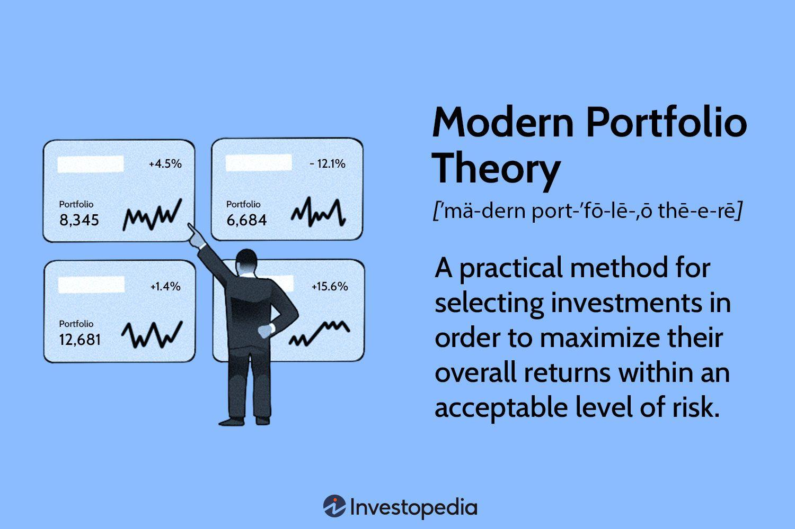

## Table of Contents

## What is Modern Portfolio Theory (MPT)?

Modern Portfolio Theory (MPT) is a way to choose investments that helps you get the most return for the least amount of risk. It was created by Harry Markowitz in the 1950s. The main idea is that you can reduce risk by spreading your money across different types of investments, like stocks, bonds, and other assets. This is called diversification. By doing this, you can create a portfolio that performs better overall than if you put all your money into just one type of investment.

MPT uses math to figure out the best mix of investments. It looks at how each investment moves up and down in value and how they relate to each other. The goal is to find a balance where the ups and downs of different investments cancel each other out, making your whole portfolio more stable. This way, even if one investment does poorly, the others might do well enough to make up for it. MPT helps investors make smarter choices by focusing on the overall performance of their portfolio, not just individual investments.

## Who developed Modern Portfolio Theory and when?

Modern Portfolio Theory, or MPT, was developed by Harry Markowitz. He came up with this idea in the early 1950s. Harry Markowitz was a young economist at the time, and his work on MPT changed how people think about investing.

Markowitz published his ideas in a paper called "Portfolio Selection" in 1952. This paper introduced the concept of diversification and how it can help reduce risk in investments. His work earned him a Nobel Prize in Economics in 1990, showing just how important MPT is in the world of finance.

## What are the key assumptions of Modern Portfolio Theory?

Modern Portfolio Theory makes some important guesses about how investing works. One big guess is that investors are smart and want to make as much money as they can while taking on as little risk as possible. This means they will always choose the best mix of investments that gives them the highest return for the least amount of risk. Another guess is that all investors have the same information about investments, so everyone knows as much as everyone else. This helps explain why everyone might make similar choices when [picking](/wiki/asset-class-picking) investments.

Another key assumption is that the returns of investments follow a normal pattern, kind of like a bell curve. This means that most of the time, returns will be average, with some good returns and some bad returns happening less often. MPT also assumes that how much one investment goes up or down doesn't change the risk of other investments in the portfolio. This is called the idea of "independent returns." By understanding these guesses, MPT helps investors build a mix of investments that can balance risk and reward in a way that makes sense for them.

## How does diversification work within Modern Portfolio Theory?

Diversification in Modern Portfolio Theory is all about spreading your money across different types of investments to lower your risk. Imagine you have a basket of eggs. If you put all your eggs in one basket and drop it, you lose all your eggs. But if you spread your eggs across several baskets, dropping one basket won't ruin everything. In the same way, if you invest all your money in one stock and it does badly, you could lose a lot. But if you spread your money across different stocks, bonds, and other investments, a bad performance in one won't hurt your whole portfolio as much.

MPT uses math to figure out the best way to diversify. It looks at how each investment moves up and down and how they relate to each other. The goal is to find a mix where the ups and downs of different investments balance each other out. For example, when stocks go down, bonds might go up, and vice versa. By carefully choosing different types of investments, you can create a portfolio that is more stable and less risky overall. This way, even if one investment does poorly, the others might do well enough to make up for it, helping you get a better return for the risk you're taking.

## What is the efficient frontier in the context of MPT?

The efficient frontier is a key part of Modern Portfolio Theory. It's like a map that shows you the best possible combinations of investments. Imagine you want to climb a mountain, and the efficient frontier is the path that gets you to the top with the least amount of effort. In investing, this "top" means getting the highest return for the amount of risk you're willing to take. The efficient frontier shows you different mixes of investments that give you the best balance between risk and reward.

To find the efficient frontier, MPT uses math to look at how different investments move up and down and how they relate to each other. It then plots these combinations on a graph, with risk on one axis and return on the other. The curve that forms the top edge of this graph is the efficient frontier. Any point on this curve represents a portfolio that gives you the highest return for a given level of risk. If your portfolio is below this curve, it means you're not getting the best return for the risk you're taking, and you could do better by moving up to the efficient frontier.

## How is the Sharpe ratio used in Modern Portfolio Theory?

The Sharpe ratio is a tool used in Modern Portfolio Theory to help investors figure out how good an investment is when you think about the risk involved. It was created by William F. Sharpe, and it's like a score that tells you how much extra return you're getting for each bit of risk you take. To find the Sharpe ratio, you take the return of your investment and subtract the risk-free rate, which is like the return you'd get from a super safe investment like a government bond. Then, you divide that number by the standard deviation of the investment's returns, which is a way to measure how much the returns jump around. A higher Sharpe ratio means you're getting more return for the risk you're taking, which is what investors want.

In MPT, the Sharpe ratio helps investors compare different portfolios to see which one is the best. If you have two portfolios with the same return, but one has a higher Sharpe ratio, it means that portfolio is doing a better job at managing risk. The Sharpe ratio is especially useful when you're looking at the efficient frontier, which shows the best possible combinations of risk and return. By using the Sharpe ratio, investors can pick the portfolio on the efficient frontier that gives them the highest score, helping them make smarter choices about where to put their money.

## What role do risk and return play in MPT?

In Modern Portfolio Theory, risk and return are like two sides of the same coin. They are super important because they help you figure out the best way to invest your money. Return is what you earn from your investments, like the money you make from stocks going up or dividends. Risk is the chance that your investments might not do well, and you could lose money. MPT says that you should always try to get the highest return you can for the amount of risk you're willing to take. It's all about finding the right balance so you can sleep well at night without missing out on making money.

To do this, MPT uses math to look at how different investments move up and down and how they relate to each other. It helps you build a portfolio where the ups and downs of different investments cancel each other out, making your whole portfolio more stable. This way, even if one investment does poorly, the others might do well enough to make up for it. By carefully choosing different types of investments, you can create a mix that gives you a good return without taking on too much risk. This is the heart of MPT: getting the best return for the risk you're willing to take.

## How can an investor use MPT to construct an optimal portfolio?

An investor can use Modern Portfolio Theory to build an optimal portfolio by first figuring out how much risk they are okay with. MPT says that you should spread your money across different types of investments, like stocks, bonds, and other assets. This is called diversification. By doing this, you can lower the risk of losing money because if one investment does badly, the others might do well enough to make up for it. MPT uses math to look at how each investment moves up and down and how they relate to each other. This helps you find the best mix of investments that gives you the highest return for the amount of risk you're willing to take.

Once you know your risk level, you can use MPT to find the efficient frontier. This is like a map that shows you the best possible combinations of investments. The efficient frontier helps you see which mixes of investments give you the highest return for a given level of risk. You can then pick a portfolio that sits on this frontier, which means you're getting the best return for the risk you're taking. Tools like the Sharpe ratio can also help you compare different portfolios to see which one is the best. By using MPT, you can build a portfolio that balances risk and reward in a way that makes sense for you.

## What are the limitations and criticisms of Modern Portfolio Theory?

Modern Portfolio Theory has some problems that people talk about. One big issue is that it assumes everyone knows the same things about investments, which isn't true. In real life, some people have more information than others, and this can change how they invest. MPT also thinks that how much an investment goes up or down follows a normal pattern, like a bell curve. But in the real world, big surprises can happen, and investments can go up or down a lot more than MPT expects. This means that MPT might not be as good at predicting risk as it thinks.

Another criticism is that MPT focuses a lot on numbers and math, but it doesn't always think about things like taxes, how easy it is to buy or sell investments, or what's happening in the world. These things can really affect how well your investments do. Also, MPT says that you should always try to get the highest return for the least risk, but some people might care more about other things, like not losing money or wanting to invest in companies that do good things for the world. So, while MPT can help you build a good mix of investments, it's not perfect and might not work for everyone in every situation.

## How does Modern Portfolio Theory apply to different asset classes?

Modern Portfolio Theory applies to different asset classes by helping you spread your money across them to lower your risk. Asset classes are big groups of investments, like stocks, bonds, real estate, and cash. MPT says you should pick a mix of these asset classes that gives you the highest return for the amount of risk you're okay with. For example, stocks might go up and down a lot, but they can give you high returns. Bonds are usually safer but don't grow as much. By having both stocks and bonds in your portfolio, you can balance the risk and reward. MPT uses math to figure out the best mix of these asset classes so your portfolio can be as stable and profitable as possible.

Different asset classes don't always move in the same way. When stocks go down, bonds might go up, and vice versa. This is called negative correlation, and it's a big part of how MPT helps you diversify. By carefully choosing different types of assets, you can make sure that the ups and downs of one asset class don't hurt your whole portfolio too much. For example, if you have some money in real estate and some in stocks, a drop in the stock market might not be as bad because real estate could be doing well. MPT helps you find the best way to mix these asset classes so you can get the best return for the risk you're taking, no matter what's happening in the market.

## Can Modern Portfolio Theory be integrated with other investment strategies like factor investing?

Yes, Modern Portfolio Theory can be integrated with other investment strategies like [factor](/wiki/factor-investing) investing. Factor investing is all about picking investments based on certain traits, or factors, that can help you make more money or take less risk. These factors might include things like how big a company is, how much it's growing, or how cheap its stock is compared to its earnings. MPT can work well with factor investing because it helps you find the best mix of investments that have these factors, so you can get a good return without taking on too much risk. By using MPT, you can figure out how to spread your money across different factors to make your portfolio more stable and profitable.

For example, if you're interested in the value factor, which means you want to invest in companies that are cheap compared to their earnings, MPT can help you see how adding these value stocks to your portfolio affects your overall risk and return. You can use MPT's math to find the right balance between value stocks and other types of investments, like [growth stocks](/wiki/growth-stocks) or bonds. This way, you can enjoy the benefits of factor investing while still following MPT's advice on diversification and risk management. So, by combining MPT with factor investing, you can build a smarter, more balanced portfolio that works well for you.

## What are the advanced mathematical models used in Modern Portfolio Theory for portfolio optimization?

Modern Portfolio Theory uses fancy math to help you pick the best mix of investments. One important model is called the mean-variance optimization. This model looks at the average return you expect from each investment and how much it goes up and down. By figuring out these numbers, MPT can help you find a portfolio that gives you the highest return for the amount of risk you're okay with. It's like solving a puzzle where you want to make the most money without taking too many chances. This model helps you see how different investments work together, so you can spread your money in a way that makes your whole portfolio more stable.

Another model used in MPT is the Capital Asset Pricing Model (CAPM). CAPM helps you understand how much risk you're taking with each investment compared to the whole market. It uses something called beta, which shows how much an investment moves with the market. If an investment has a high beta, it moves a lot with the market, which means it's riskier. CAPM helps you figure out if the extra return you're getting from an investment is worth the extra risk. By using CAPM along with mean-variance optimization, you can build a portfolio that not only balances risk and return but also takes into account how each investment fits into the bigger picture of the market.

## What is Understanding Modern Portfolio Theory?

Modern Portfolio Theory (MPT), introduced by Harry Markowitz in 1952, revolutionized the way investors approach portfolio management by emphasizing the trade-off between risk and return through diversification. The core premise of MPT is that an investor can construct an "optimal portfolio" by considering the expected returns of various assets and their respective volatilities, measured as standard deviation.

### Key Principles

1. **Diversification**:
   MPT posits that by holding a variety of non-correlated or negatively correlated assets, overall portfolio risk can be reduced. The combination of different asset categories, such as stocks, bonds, and cash, can diminish individual asset [volatility](/wiki/volatility-trading-strategies), leading to a smoother return profile over time.

2. **Efficient Frontier**:
   Central to MPT is the concept of the "efficient frontier," which represents a set of portfolios that provide the highest expected return for a defined level of risk. Portfolios on this frontier are considered optimal, as there is no other portfolio configuration that offers higher returns for the same or lower risk level. The efficient frontier is typically visualized as a curve on a graph where the x-axis represents risk (standard deviation) and the y-axis represents expected return.

3. **Risk and Return Optimization**:
   By aiming for diversification, investors can position their portfolios on the efficient frontier, achieving optimum risk-return outcomes. Calculation of this optimal portfolio involves determining the portfolio's expected return, variance, and covariance among the included assets. The efficient frontier can be mathematically defined by solving the optimization problem:
$$
   \text{Maximize } \mathbf{w}^T \mathbf{\mu} - \frac{\lambda}{2} \mathbf{w}^T \Sigma \mathbf{w}

$$

   subject to:
$$
   \mathbf{w}^T \mathbb{1} = 1

$$

   Where $\mathbf{w}$ is the weight vector of the portfolio, $\mathbf{\mu}$ is the expected return vector, $\Sigma$ is the covariance matrix of asset returns, $\lambda$ is the risk aversion coefficient, and $\mathbb{1}$ is a vector of ones.

4. **Assumptions and Limitations**:
   While MPT provides a robust framework for portfolio construction, it rests upon several assumptions that may not always align with real-world market dynamics. It assumes that markets are efficient, meaning that all available information is already reflected in asset prices, and that investors act rationally, aiming to maximize utility. However, market anomalies, behavioral biases, and events like financial crises can challenge these assumptions, affecting the applicability of MPT in certain situations.

Despite these limitations, MPT remains a foundational concept in finance, informing investment strategies and the development of financial products aimed at optimizing returns relative to risk.

## How is MPT applied in portfolio management?

Modern Portfolio Theory (MPT) serves as a foundational concept in portfolio management, primarily by guiding the strategic asset allocation process. At its core, MPT aims to construct a portfolio that achieves the investor's desired risk-return profile through optimal diversification. This approach involves a careful assessment of multiple asset classes, with the goal of identifying a combination that minimizes risk for a given level of expected return.

Portfolio managers incorporate MPT into their strategies by customizing portfolios to fit the specific risk tolerance and return objectives of individual investors. This begins with the integration of quantitative analysis to evaluate the risk and return profile of different investment combinations. The expected return of a portfolio can be computed as the weighted average of the expected returns of the individual assets, as represented by the formula:

$$

E(R_p) = \sum_{i=1}^{n} w_i \cdot E(R_i) 
$$

where $E(R_p)$ represents the expected return of the portfolio, $w_i$ is the weight of each asset within the portfolio, and $E(R_i)$ is the expected return of each asset.

In addition to expected returns, portfolio variance is critical in assessing the risk associated with the investment portfolio. The variance of a portfolio, which measures [dispersion](/wiki/dispersion-trading) of returns, can be calculated using the formula:

$$
\sigma^2_p = \sum_{i=1}^{n}\sum_{j=1}^{n} w_i w_j \sigma_{ij}
$$

where $\sigma^2_p$ is the portfolio variance, $w_i$ and $w_j$ are the weights of assets $i$ and $j$ in the portfolio, and $\sigma_{ij}$ is the covariance between the returns of assets $i$ and $j$. This matrix-based approach ensures a comprehensive understanding of how assets interact and contribute to portfolio risk.

Rebalancing is a crucial aspect of adhering to MPT principles. It involves periodically adjusting the portfolio to maintain the desired asset weights, especially in response to market changes. This practice helps ensure that the portfolio remains aligned with the investor's risk-return profile and continues to operate efficiently on the efficient frontier.

Overall, MPT provides a systematic framework for asset allocation by quantitatively managing risk while optimizing expected returns. Through careful selection, evaluation, and rebalancing of investments, portfolio managers can construct and maintain portfolios that strive to meet investors' financial goals within their risk appetite.

## References & Further Reading

[1]: Markowitz, H. (1952). ["Portfolio Selection."](https://onlinelibrary.wiley.com/doi/abs/10.1111/j.1540-6261.1952.tb01525.x) Journal of Finance, 7(1), 77-91.

[2]: ["Modern Portfolio Theory and Investment Analysis"](https://books.google.com/books/about/Modern_Portfolio_Theory_and_Investment_A.html?id=181CEAAAQBAJ) by Edwin J. Elton, Martin J. Gruber, Stephen J. Brown, and William N. Goetzmann

[3]: ["Algorithmic Trading: Winning Strategies and Their Rationale"](https://www.wiley.com/en-us/Algorithmic+Trading%3A+Winning+Strategies+and+Their+Rationale-p-9781118460146) by Ernest P. Chan

[4]: Black, F., & Litterman, R. (1992). ["Global Portfolio Optimization."](https://www.jstor.org/stable/4479577) Financial Analysts Journal, 48(5), 28-43.

[5]: Fabozzi, F. J., & Markowitz, H. (2002). ["The Theory and Practice of Investment Management: Asset Allocation, Valuation, Portfolio Construction, and Strategies"](https://onlinelibrary.wiley.com/doi/book/10.1002/9781118267028) by Frank J. Fabozzi and Harry M. Markowitz

[6]: Sharpe, W. F. (1964). ["Capital Asset Prices: A Theory of Market Equilibrium Under Conditions of Risk."](https://onlinelibrary.wiley.com/doi/full/10.1111/j.1540-6261.1964.tb02865.x) Journal of Finance, 19(3), 425-442.

[7]: ["Advances in Financial Machine Learning"](https://www.amazon.com/Advances-Financial-Machine-Learning-Marcos/dp/1119482089) by Marcos Lopez de Prado