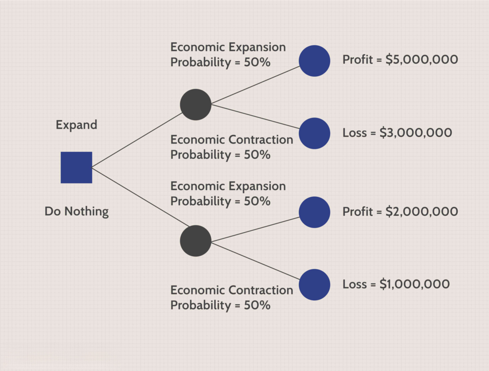

## Table of Contents

## What is a decision tree and how does it work?

A decision tree is a tool that helps people make choices by breaking down a decision into smaller, easier parts. It looks like a tree turned sideways, with branches that represent different choices and outcomes. You start at the tree's trunk, which is your main decision, and then follow the branches to see what happens with each choice you could make. Each branch leads to more branches until you reach the end, which shows the final result of all the choices you made along the way.

Decision trees work by asking a series of yes or no questions, or by choosing between different options at each branch. For example, if you're deciding whether to go outside, the first question might be, "Is it raining?" If the answer is yes, the next question could be, "Do I have an umbrella?" Depending on your answers, you'll follow different paths until you reach a decision, like "Stay inside" or "Go outside with an umbrella." This method helps break down complex decisions into simpler steps, making it easier to see all possible outcomes and choose the best path.

## How are decision trees used in the finance industry?

In the finance industry, decision trees are used to help make important choices about money. For example, banks use them to decide if someone should get a loan. They look at things like how much money the person makes, if they have paid back loans before, and how much they want to borrow. The decision tree helps the bank see all the possible outcomes, like if the person will pay back the loan or not, and then they can make a smart choice.

Decision trees are also used for figuring out which investments might be good. Financial advisors can use them to look at different stocks or other things to invest in. They ask questions like, "Is the company making money?" or "Is the stock price going up?" By following the branches of the decision tree, they can see which investments might make more money and which ones might be risky. This helps them give better advice to people who want to invest their money.

## Can you explain the basic terminology associated with decision trees in finance?

In finance, a decision tree starts with a root node, which is like the trunk of the tree. This is the main decision or question you start with, like "Should we give this person a loan?" From the root node, you have branches that show different choices or answers to the question. Each branch leads to more nodes, called internal nodes, where you ask more questions or make more choices. For example, after the root node question about a loan, an internal node might ask, "Does the person have a good credit score?"

As you keep going down the tree, you eventually reach the end of the branches, which are called leaf nodes or terminal nodes. These are the final results or outcomes of all the choices you made along the way. In the loan example, a leaf node might say "Approve the loan" or "Deny the loan." The paths you take through the tree are called branches, and they help you see all the different ways things could turn out based on the choices you make. By following these branches, financial experts can make better decisions about things like loans, investments, and more.

## What are the advantages of using decision trees for financial analysis?

Decision trees are great for financial analysis because they make complicated decisions easier to understand. They break down big choices into smaller steps, so it's easier to see all the different ways things could go. For example, when deciding if someone should get a loan, a decision tree helps you look at things like their income and credit score, one at a time. This way, you can see clearly if giving them a loan is a good idea or not.

Another advantage is that decision trees show you all the possible outcomes of your choices. This is really helpful in finance because it lets you think about risks and rewards before making a decision. If you're thinking about investing in a stock, a decision tree can show you what might happen if the stock goes up or down. This helps you make smarter choices and avoid big mistakes.

## What are the limitations or challenges of applying decision trees in finance?

One challenge of using decision trees in finance is that they can be too simple for really complicated decisions. Finance often involves a lot of different things to think about, like interest rates, market trends, and economic reports. A decision tree might not be able to handle all these details at once, so it might miss important information. This can lead to bad choices if the tree doesn't consider everything it should.

Another limitation is that decision trees can be hard to keep up to date. In finance, things change all the time, like stock prices and economic conditions. If you don't update your decision tree often, it might give you old information, which can lead to wrong decisions. It takes a lot of work to keep changing the tree to match the latest data, and sometimes it's hard to know when you need to make those changes.

## How do decision trees help in credit scoring and loan approval processes?

Decision trees help in credit scoring and loan approval by making it easier to see if someone should get a loan. They start with a big question like "Should we give this person a loan?" and then break it down into smaller questions. For example, they might ask if the person has a good credit score, how much money they make, and if they have paid back loans before. By following the answers to these questions down the tree, the bank can see all the different ways things could go. If the person has a good credit score and a steady job, the tree might lead to approving the loan. If not, it might suggest denying it.

This method helps banks make fair and smart decisions. It shows them all the possible outcomes based on the information they have. For example, if someone has a low credit score but a high income, the decision tree can help figure out if the loan is still a good idea. It makes the whole process clearer and more organized, so banks can be sure they are making the best choice for both the bank and the person asking for the loan.

## What role do decision trees play in fraud detection within financial institutions?

Decision trees help banks and other financial places catch people who are trying to cheat or steal money. They do this by looking at different signs of fraud, like if someone is using a credit card in a strange way or if there are lots of small purchases that add up to a big amount. The decision tree starts with a big question like "Is this transaction normal?" and then asks smaller questions, like "Is the purchase happening in a new place?" or "Is the amount of money different from what the person usually spends?" By following the answers to these questions, the decision tree can figure out if something fishy is going on.

If the decision tree finds something that looks like fraud, it can tell the bank to look closer at that transaction. This helps stop bad guys from taking money and keeps customers' money safe. But, decision trees can sometimes make mistakes. They might think something is fraud when it's not, or they might miss real fraud if the signs are hard to spot. So, banks use decision trees along with other tools to make sure they catch as much fraud as they can without bothering honest customers too much.

## How can decision trees be used for investment decision-making and portfolio management?

Decision trees help people who manage money make smart choices about investments. They start with a big question like "Should we invest in this stock?" and then break it down into smaller questions. For example, they might ask if the company is making money, if the stock price is going up, and what the overall market is doing. By following the answers to these questions down the tree, the investor can see all the different ways the investment could turn out. If the company is doing well and the market looks good, the tree might suggest buying the stock. If not, it might recommend looking at other options.

In portfolio management, decision trees help keep track of many investments at once. They can show how different choices affect the whole group of investments. For example, if one stock is doing badly, the decision tree can help decide if it's time to sell it and buy something else. By looking at all the possible outcomes, the portfolio manager can make sure the investments are balanced and working well together. This helps them make the best choices to grow the portfolio and keep it safe from big losses.

## What are some advanced techniques for optimizing decision trees in financial applications?

One advanced way to make decision trees better for finance is called "pruning." Pruning means cutting off parts of the tree that don't help much. This makes the tree simpler and easier to use. In finance, where things change a lot, a simpler tree can be more useful because it's easier to update and less likely to get confused by small details. Another technique is using "ensemble methods," like random forests. This means using a bunch of decision trees together to make better predictions. Each tree looks at the data a little differently, and when you put their answers together, you get a more reliable result. This can be really helpful for things like predicting stock prices or figuring out if someone might pay back a loan.

Another way to improve decision trees is by using "feature selection." This means [picking](/wiki/asset-class-picking) only the most important pieces of information to use in the tree. In finance, there can be a lot of data to look at, like interest rates, company earnings, and market trends. By choosing the right pieces of information, the decision tree can focus on what really matters and make better decisions. Also, "boosting" is a technique where you build decision trees one after another, with each new tree trying to fix the mistakes of the last one. This can make the final decision more accurate, which is great for things like fraud detection or investment choices where you need to be as right as possible.

## How do decision trees integrate with other machine learning models in financial forecasting?

Decision trees can work together with other [machine learning](/wiki/machine-learning) models to make better guesses about the future in finance. For example, they can be used with models like neural networks or regression models. Decision trees are good at breaking down big problems into smaller parts and showing all the possible outcomes. Other models, like neural networks, are good at finding patterns in a lot of data. By using decision trees first to sort out the important information, and then letting a [neural network](/wiki/neural-network) look at that information more closely, you can make more accurate predictions about things like stock prices or how the economy might change.

Another way decision trees and other models work together is through something called ensemble methods. This means using many decision trees together with other models to make a final decision. For example, a method called "random forest" uses a lot of decision trees, and then a model like a support vector machine can use the results from those trees to make even better predictions. This teamwork helps catch more details and make smarter choices in financial forecasting. By combining the strengths of different models, you can get a clearer picture of what might happen in the future and make better plans for things like investments and managing money.

## Can you discuss a case study where decision trees significantly impacted a financial decision?

A bank wanted to decide if people should get loans. They used a decision tree to help them. The tree started with a big question: "Should we give this person a loan?" Then it broke it down into smaller questions like, "Does the person have a good credit score?" and "How much money do they make?" By following the answers down the tree, the bank could see all the different ways things could go. If someone had a good credit score and a steady job, the tree suggested approving the loan. If not, it said to deny it. This helped the bank make better choices and give loans to people who were more likely to pay them back.

In another case, a big investment company used decision trees to pick stocks. They started with the question, "Should we invest in this stock?" and then looked at things like if the company was making money and if the stock price was going up. The decision tree showed them all the possible outcomes. If the company was doing well and the market looked good, the tree suggested buying the stock. If not, it recommended looking at other options. This helped the company make smarter investment choices and grow their money better. By using decision trees, they could see all the risks and rewards before deciding, which led to better results for their clients.

## What future developments or trends can we expect in the use of decision trees in finance?

In the future, decision trees in finance will likely get even better at handling lots of data quickly. As computers get faster and smarter, decision trees will be able to look at more information at once. This means they can make even better guesses about things like stock prices or if someone will pay back a loan. Also, decision trees might start working more closely with other smart computer programs, like neural networks. By teaming up, they can learn from each other and make even more accurate predictions. This could help banks and investment companies make smarter choices and avoid big mistakes.

Another trend we might see is decision trees becoming easier to use and understand. Right now, they can be a bit hard to follow, but in the future, they might be made simpler so more people can use them. This could mean more people in finance using decision trees to help with their work, like deciding on loans or investments. Also, decision trees might start being used in new ways, like helping with things like planning for retirement or figuring out the best way to save money. As they get better and easier to use, decision trees could become a big part of how people make financial choices every day.

## References & Further Reading

[1]: Bergstra, J., Bardenet, R., Bengio, Y., & Kégl, B. (2011). ["Algorithms for Hyper-Parameter Optimization."](https://dl.acm.org/doi/10.5555/2986459.2986743) Advances in Neural Information Processing Systems 24.

[2]: ["Advances in Financial Machine Learning"](https://www.amazon.com/Advances-Financial-Machine-Learning-Marcos/dp/1119482089) by Marcos Lopez de Prado

[3]: ["Evidence-Based Technical Analysis: Applying the Scientific Method and Statistical Inference to Trading Signals"](https://www.amazon.com/Evidence-Based-Technical-Analysis-Scientific-Statistical/dp/0470008741) by David Aronson

[4]: ["Machine Learning for Algorithmic Trading"](https://github.com/stefan-jansen/machine-learning-for-trading) by Stefan Jansen

[5]: ["Quantitative Trading: How to Build Your Own Algorithmic Trading Business"](https://www.amazon.com/Quantitative-Trading-Build-Algorithmic-Business/dp/1119800064) by Ernest P. Chan