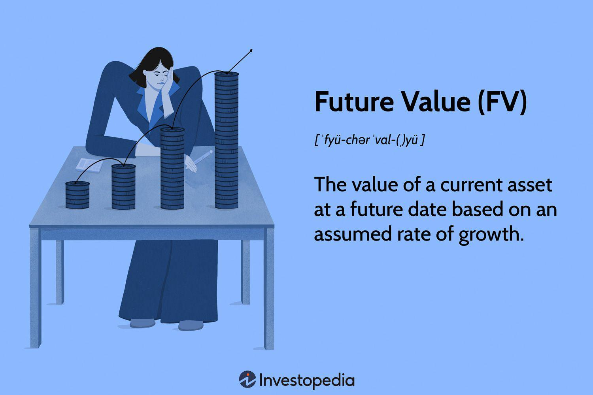

## Table of Contents

## What is the future value formula and why is it important?

The future value formula helps you figure out how much money you will have in the future if you invest a certain amount now. The basic formula is: Future Value = Present Value x (1 + Interest Rate)^Number of Periods. For example, if you invest $100 at an interest rate of 5% for 10 years, the future value would be $100 x (1 + 0.05)^10, which comes out to about $162.89. This formula is useful because it shows how your money can grow over time with compound interest.

Understanding the future value formula is important for making smart financial decisions. It helps you plan for big goals like buying a house, saving for retirement, or funding your child's education. By knowing how much your investments might be worth in the future, you can decide how much to save now and what kind of investments to make. This knowledge can help you reach your financial goals and live a more secure life.

## How do you calculate future value using the formula?

To calculate the future value of your money, you start with the present value, which is the amount of money you have right now. You then multiply this by a factor that takes into account the interest rate and the number of periods over which the money will grow. The formula is Future Value = Present Value x (1 + Interest Rate)^Number of Periods. For example, if you invest $1,000 at an annual interest rate of 3% for 5 years, you would calculate it like this: Future Value = $1,000 x (1 + 0.03)^5. This comes out to $1,000 x 1.159 = $1,159. So, after 5 years, your $1,000 would grow to $1,159.

Understanding how to use this formula is really helpful for planning your financial future. It lets you see how much your savings or investments could be worth down the road. This can guide you in deciding how much to save now and what kind of investments to make. For instance, if you're saving for a big purchase like a car or a home, knowing the future value of your savings helps you set realistic goals and timelines. It's a simple but powerful tool for making your money work for you over time.

## What are the key components of the future value formula?

The future value formula has three main parts that you need to know: the present value, the interest rate, and the number of periods. The present value is the amount of money you start with right now. The interest rate is how much your money grows each period, usually shown as a percentage. The number of periods is how long you keep your money invested, like years or months.

These three parts work together in the formula to tell you how much your money will be worth in the future. You take the present value and multiply it by a special number that comes from the interest rate and the number of periods. This special number is (1 + Interest Rate) raised to the power of the number of periods. So, if you know these three things, you can figure out how much your money will grow over time.

## Can you provide a simple example of using the future value formula?

Let's say you have $500 and you want to know how much it will be worth if you invest it for 3 years at an interest rate of 4% per year. The future value formula helps you figure this out. You start with the present value, which is $500. Then you need to know the interest rate, which is 4%, and the number of periods, which is 3 years.

To calculate the future value, you use the formula: Future Value = Present Value x (1 + Interest Rate)^Number of Periods. Plugging in the numbers, you get: Future Value = $500 x (1 + 0.04)^3. When you do the math, you find that $500 x 1.124864 = $562.43. So, after 3 years, your $500 will grow to about $562.43. This simple example shows how the future value formula can help you see how your money can grow over time.

## How does the frequency of compounding affect future value calculations?

The frequency of compounding can make a big difference in how much your money grows over time. Compounding means that the interest you earn also earns interest. If you compound more often, like monthly instead of yearly, your money can grow faster. This is because each time you compound, you're adding more interest to the amount that will earn interest next time. So, the more often you compound, the more times you get to add interest to your money.

For example, let's say you have $1,000 and you want to invest it for 1 year at an interest rate of 5%. If you compound yearly, at the end of the year, you'll have $1,050. But if you compound monthly, you'll end up with $1,051.16. That's because with monthly compounding, you're [earning](/wiki/earning-announcement) interest on your interest 12 times instead of just once. Over longer periods, like 10 or 20 years, the difference can be even bigger. So, when you're figuring out the future value of your money, it's important to think about how often the interest is compounded.

## What is the difference between simple interest and compound interest in future value?

Simple interest and compound interest are two ways your money can grow over time, but they work differently. Simple interest is when you earn interest only on the original amount of money you started with. For example, if you invest $1,000 at a 5% simple interest rate for one year, you'll earn $50 in interest, and your total will be $1,050. The next year, you'll still only earn interest on the original $1,000, so you'll get another $50, making your total $1,100. Simple interest is easy to calculate, but it doesn't let your money grow as fast because you're not earning interest on the interest.

Compound interest, on the other hand, lets you earn interest on both the original amount and any interest you've already earned. This means your money can grow much faster over time. Using the same example, if you invest $1,000 at a 5% compound interest rate for one year, you'll also earn $50 in interest, making your total $1,050. But the next year, you'll earn interest on the new total of $1,050, so you'll get $52.50 in interest, and your total will be $1,102.50. The more often the interest is compounded, like monthly or daily, the faster your money can grow. This is why compound interest is so powerful for long-term savings and investments.

## How can the future value formula be used in personal financial planning?

The future value formula is a helpful tool for planning your money. It helps you figure out how much your savings or investments will be worth in the future. By using this formula, you can decide how much money to put away now to reach your goals, like buying a house or retiring. For example, if you want to save $50,000 for a down payment on a house in 10 years, you can use the future value formula to see how much you need to save each month at a certain interest rate. This helps you make a plan and stick to it.

Knowing the future value of your money also helps you choose the best investments. Different investments grow at different rates, and the future value formula can show you which ones might help you reach your goals faster. For instance, if you're deciding between a savings account with a low interest rate and a stock that might grow more, you can use the formula to compare how much each option could be worth in the future. This way, you can make smarter choices about where to put your money to make it grow the most over time.

## What are some common mistakes to avoid when using the future value formula?

One common mistake when using the future value formula is forgetting to adjust for the frequency of compounding. If you're using a yearly interest rate but the interest is compounded monthly or daily, you need to make sure your calculations reflect that. Otherwise, your future value estimate will be off. For example, if you think you're getting a 5% annual interest rate but it's compounded monthly, you should use a monthly rate of about 0.417% in your formula. Not doing this can lead to big differences in your final number.

Another mistake is not considering inflation. The future value formula gives you the value of your money in today's dollars, but inflation means that the buying power of money goes down over time. If you're planning for the future, you need to think about how much things will cost then, not just how much your money will be worth. For example, if you want to save for a $20,000 car in 10 years, you should adjust that goal for inflation to make sure you'll actually have enough money to buy it.

## How does inflation impact the future value of money?

Inflation means that the prices of things go up over time. This makes the money you have now worth less in the future. When you use the future value formula to see how much your money will grow, it doesn't take inflation into account. So, even if your money grows, it might not buy as much as you think because everything else is getting more expensive too. For example, if you save $1,000 and it grows to $1,100 in a year, but inflation is 3%, the $1,100 won't buy as much as it would have a year ago.

To plan for the future, you need to think about inflation when using the future value formula. You can do this by adjusting your goal for inflation. If you want to buy something that costs $10,000 today, and you expect inflation to be 2% each year, you'll need more than $10,000 in the future to buy it. By considering inflation, you can make sure you're saving enough to reach your goals, even as prices go up.

## Can the future value formula be applied to investments like stocks or bonds?

Yes, the future value formula can be used to estimate how much your investments in stocks or bonds might be worth in the future. For stocks, you would need to estimate the average rate of return, which can be trickier than with fixed interest rates like those on savings accounts or bonds. If you think a stock will grow by an average of 7% per year, you can use that rate in the future value formula to see what your investment might be worth in, say, 10 years. For bonds, it's a bit easier because they often have a fixed interest rate, so you can use that rate directly in the formula.

However, remember that stocks and bonds can be riskier than savings accounts, and their returns can vary a lot. The future value formula gives you an estimate based on your assumptions, but real-life results might be different. It's a good idea to use the formula to get a general idea of how your investments might grow, but also to keep an eye on how they're actually doing and adjust your plans as needed.

## How do you adjust the future value formula for continuous compounding?

When you want to figure out how much your money will grow with continuous compounding, you use a slightly different formula. Continuous compounding means that your interest is added to your money all the time, not just at set times like monthly or yearly. The formula for this is Future Value = Present Value x e^(Interest Rate x Number of Periods). Here, 'e' is a special number in math, about 2.71828, and you can find it on most calculators. So, if you have $1,000 and want to know how much it will be worth at a 5% interest rate after 1 year with continuous compounding, you'd calculate it like this: Future Value = $1,000 x e^(0.05 x 1). That comes out to about $1,051.27.

Continuous compounding can make your money grow a bit faster than other types of compounding because it's always working. But it's important to know that the difference might not be huge, especially over short periods. For example, if you're only investing for a few years, the difference between monthly compounding and continuous compounding might be small. But over longer periods, like 20 or 30 years, that small difference can add up. So, when you're planning for the long term, using the continuous compounding formula can give you a more accurate idea of how much your money will grow.

## What advanced techniques can be used to optimize future value calculations for complex financial scenarios?

When dealing with complex financial scenarios, one advanced technique to optimize future value calculations is to use scenario analysis. This means you look at different possible futures and see how your money might grow in each one. For example, you could calculate the future value of your money with different interest rates or different levels of inflation. By doing this, you can see how sensitive your future value is to changes in these factors. This helps you plan better because you can prepare for different outcomes and make more informed decisions about where to invest your money.

Another technique is to use Monte Carlo simulations. This is a way to predict the future value of your investments by running thousands of different scenarios based on random changes in things like interest rates or stock prices. It's like playing out many different possible futures to see what might happen. This can give you a range of possible future values instead of just one number, which is helpful for understanding the risks and rewards of your investments. By using these advanced techniques, you can get a clearer picture of how your money might grow and make smarter choices about your financial future.

## What is Future Value in Investment?

Future Value (FV) is a fundamental financial concept leveraged by investors to estimate the prospective worth of an asset at a future date. This estimation is crucial for effective financial planning and investment decision-making. By applying a fixed growth rate over time, investors can forecast the possible expansion of their assets. The calculation of future value is essential for assessing investment opportunities and balancing potential risks against expected rewards.

The two primary mathematical approaches for calculating FV are the simple interest and compound interest formulas. Understanding these formulas helps investors in evaluating long-term financial strategies. 

The simple interest formula is given by:

$$
\text{FV} = P \times (1 + rt)
$$

where:
- $P$ is the principal amount,
- $r$ is the annual interest rate,
- $t$ is the time period in years.

Simple interest is straightforward, making it suitable for low-risk investments with a stable return over time.

In contrast, compound interest can significantly enhance returns, especially over longer investment durations. The compound interest formula is:

$$
\text{FV} = P \times \left(1 + \frac{r}{n}\right)^{nt}
$$

where:
- $n$ is the number of compounding periods per year.

This method accounts for interest on the previously accrued interest, enabling exponential growth of the investment. The power of compounding is particularly evident when the [interest rate](/wiki/interest-rate-trading-strategies) is high or the investment horizon is long.

Beyond these mathematical foundations, FV plays a vital role in evaluating investment opportunities. By projecting future asset values, investors can make informed choices about which opportunities promise favorable returns relative to their risk profiles. This process supports the balancing of risk and reward, as it allows investors to anticipate potential outcomes and devise strategies that align with their financial goals.

Understanding the future value concept and its calculation methods is integral to building robust investment strategies and financial plans. It allows for the projection of asset growth, aiding in the thoughtful allocation of resources to maximize potential returns.

## What are the financial calculation methods for investment growth?

Investment growth calculations are fundamental to understanding how your investments can mature over time. These calculations primarily hinge on two interest types: simple interest and compound interest, each serving distinct purposes in diverse investment scenarios.

Simple Interest is calculated using the formula:

$$
\text{Interest} = P \times r \times t
$$

Where $P$ is the principal amount, $r$ is the annual interest rate, and $t$ is the time in years. Simple interest is straightforward and usually applies to low-risk, steady investments such as bonds or fixed deposits. It offers predictability as the interest is calculated solely on the principal amount, making it beneficial for investments with short time horizons where compounding benefits are negligible.

Conversely, Compound Interest can significantly enhance returns, especially over longer investment periods. The formula for compound interest is:

$$
A = P \times \left(1 + \frac{r}{n}\right)^{n \times t}
$$

Where $A$ represents the amount of money accumulated after $n$ compounding periods, $P$ is the principal, $r$ is the annual interest rate, $n$ is the number of times the interest is compounded per year, and $t$ is the time in years. Compound interest harnesses the power of reinvesting earned interest, thereby increasing the investment value exponentially. It is particularly advantageous for growth-oriented investments such as equities or mutual funds, where returns can be amplified over time.

Understanding how different interest rates and time frames affect investment value is crucial. A higher interest rate accelerates growth, while a longer time frame amplifies compounding effects, thus dramatically increasing potential returns. For example, a $1,000 investment at a 5% annual interest rate compounded annually over ten years results in approximately $1,628.89. However, if the same interest is compounded quarterly, the end value grows to approximately $1,645.31, illustrating the compounded growth's influence.

In practical scenarios, an investor might use simple interest for managing short-term savings goals, ensuring stable and predictable returns. Meanwhile, compound interest is ideal for retirement planning or educational savings accounts, where time allows the compounding feature to work its magic.

Understanding these financial calculation methods allows investors to make informed decisions aligning with their risk tolerance, financial objectives, and investment time horizons. These calculations not only provide a blueprint for potential earnings but also play a pivotal role in strategic asset allocation and future financial planning.

## What are Frequently Asked Questions?

### What is the main purpose of calculating the future value of an investment?

The primary purpose of calculating the future value (FV) of an investment is to estimate how much an asset will be worth at a specific future date. This calculation allows investors to make informed decisions about where to allocate their resources and aids in financial planning by considering growth expectations over time. Understanding FV helps in assessing potential returns and formulating strategies that align with investment goals.

### How do simple and compound interest differ in terms of investment growth?

Simple and compound interest differ fundamentally in how they calculate returns. Simple interest is calculated based only on the initial principal, using the formula:

$$
\text{Simple Interest} = P \times r \times t
$$

where $P$ is the principal, $r$ is the annual interest rate, and $t$ is the time in years. Compound interest, however, is calculated on the principal and any accumulated interest from previous periods, using the formula:

$$
\text{Compound Interest} = P \times (1 + r)^t - P
$$

This compounding effect can significantly enhance growth over time, especially for longer investment periods, as interest is reinvested, contributing to exponential growth rather than linear.

### What are the key advantages of using algorithmic trading in modern markets?

Algorithmic trading offers several advantages in modern financial markets. Key benefits include speed, as algorithms can execute trades faster than human capability; accuracy, as they remove the possibility of manual errors; and the elimination of human emotional influence, which can often lead to impulsive or irrational trading decisions. Additionally, algorithmic strategies like trend-following and [arbitrage](/wiki/arbitrage) can exploit market inefficiencies more effectively than manual trading.

### Can small-scale investors benefit from algorithmic trading, and how?

Yes, small-scale investors can benefit from [algorithmic trading](/wiki/algorithmic-trading) by leveraging the technology's efficiencies and capabilities. With the availability of user-friendly platforms and tools tailored for retail traders, small-scale investors can automate their trading strategies, gain access to market data, and apply sophisticated quantitative models that were previously accessible only to institutional investors. Furthermore, the democratization of algorithmic trading allows these investors to execute trades at the same speeds as larger entities, potentially leveling the playing field.

### How can understanding future value calculations aid in developing algorithm-based trading strategies?

Understanding future value calculations can enhance algorithm-based trading strategies by providing a solid foundation for modeling potential investment growth and risk evaluation. By incorporating FV assessments into algorithmic models, traders can better forecast asset price movements and optimize their strategies to maximize returns. This integration enables more precise decision-making and can improve the effectiveness of trading algorithms through refined quantitative analyses.

## References & Further Reading

[1]: Bergstra, J., Bardenet, R., Bengio, Y., & Kégl, B. (2011). ["Algorithms for Hyper-Parameter Optimization."](https://papers.nips.cc/paper/4443-algorithms-for-hyper-parameter-optimization) Advances in Neural Information Processing Systems 24.

[2]: ["Advances in Financial Machine Learning"](https://www.amazon.com/Advances-Financial-Machine-Learning-Marcos/dp/1119482089) by Marcos Lopez de Prado

[3]: ["Evidence-Based Technical Analysis: Applying the Scientific Method and Statistical Inference to Trading Signals"](https://www.amazon.com/Evidence-Based-Technical-Analysis-Scientific-Statistical/dp/0470008741) by David Aronson

[4]: ["Machine Learning for Algorithmic Trading"](https://github.com/PacktPublishing/Machine-Learning-for-Algorithmic-Trading-Second-Edition) by Stefan Jansen

[5]: ["Quantitative Trading: How to Build Your Own Algorithmic Trading Business"](https://www.amazon.com/Quantitative-Trading-Build-Algorithmic-Business/dp/1119800064) by Ernest P. Chan