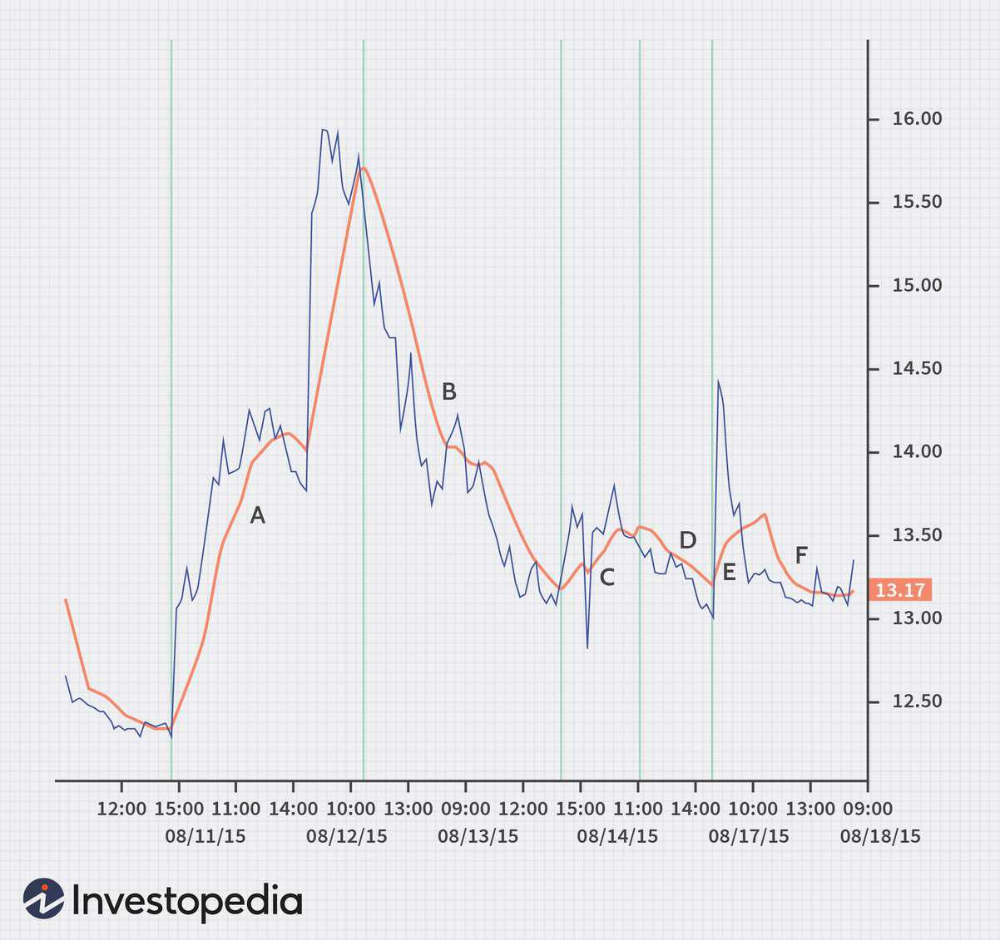

## Table of Contents

## What is the VIX and why is it important in trading?

The VIX, or Volatility Index, is a measure of how much the stock market is expected to change in the near future. It's often called the "fear gauge" because it shows how worried investors are about the market. The VIX is calculated using the prices of options on the S&P 500, which are financial tools that people use to bet on where they think the market will go. When the VIX is high, it means people think the market will move a lot, and when it's low, they think it will stay pretty steady.

The VIX is important in trading because it helps investors understand the level of risk in the market. If the VIX is high, traders might be more cautious and adjust their strategies to protect their investments from big swings. On the other hand, a low VIX might encourage traders to take more risks because they think the market will be calm. By watching the VIX, traders can make better decisions about when to buy or sell, and how to manage their portfolios to balance risk and reward.

## What are moving averages and how do they work?

Moving averages are a tool that traders use to smooth out price data over time. They help to show the overall trend of a stock or market by averaging out the price over a certain number of days. For example, a 50-day moving average takes the average price of the last 50 days and plots it on a chart. This helps traders see the bigger picture and not get distracted by small, day-to-day changes in price.

There are two main types of moving averages: simple and exponential. A simple moving average (SMA) gives equal weight to all the prices in the period, while an exponential moving average (EMA) gives more weight to recent prices. This means that an EMA reacts faster to recent changes in price than an SMA. Traders often use moving averages to find buy and sell signals. For instance, if a stock's price goes above its moving average, it might be a good time to buy, and if it falls below, it might be a good time to sell.

## How can moving averages be applied to VIX trading?

Moving averages can be used with the VIX to help traders understand how the market's fear level is changing over time. By calculating a moving average of the VIX, traders can see if the market is getting more or less worried. For example, if the VIX is going up and crosses above its moving average, it might mean that investors are getting more scared and expect bigger swings in the market. On the other hand, if the VIX goes down and crosses below its moving average, it could mean that investors are feeling calmer and expect the market to be more stable.

Traders might use different lengths of moving averages depending on what they're looking for. A short-term moving average, like a 10-day average, can help traders spot quick changes in the VIX, which might be useful for short-term trading. A longer-term moving average, like a 50-day or 200-day average, can show bigger trends in market fear and help with longer-term planning. By comparing short-term and long-term moving averages of the VIX, traders can get a better sense of whether the market's fear level is shifting in the short term or following a bigger trend.

## What are the different types of moving averages used in VIX trading?

In VIX trading, traders mainly use two types of moving averages: the Simple Moving Average (SMA) and the Exponential Moving Average (EMA). The Simple Moving Average gives equal weight to all the VIX values over a set period. For example, a 20-day SMA of the VIX adds up the VIX values from the last 20 days and divides by 20. This helps traders see the average fear level in the market over that time. The SMA is easy to calculate and understand, making it a popular choice for many traders.

The Exponential Moving Average, on the other hand, puts more weight on recent VIX values. This means the EMA reacts faster to changes in the VIX than the SMA. For example, a 20-day EMA of the VIX will give more importance to the most recent days, making it more sensitive to new market fears or calms. Traders who want to catch quick changes in the market's fear level might prefer using an EMA. Both types of moving averages can help traders make better decisions by showing them how the VIX is trending over time.

## How do you calculate a simple moving average for the VIX?

To calculate a simple moving average (SMA) for the VIX, you need to pick a time period, like 20 days. Then, you add up the VIX values for those 20 days and divide by 20. For example, if the VIX was 15 on day 1, 16 on day 2, and so on up to 20 days, you would add all those numbers together and then divide by 20. This gives you the average VIX value over those 20 days, which is the SMA.

Using this SMA helps traders see the average level of fear in the market over time. If the VIX is higher than its SMA, it might mean that fear is growing, and if it's lower, fear might be going down. Traders can use this information to decide when to buy or sell, depending on how they think the market will react to changes in fear levels.

## What is the significance of using a 50-day moving average in VIX trading?

A 50-day moving average of the VIX helps traders see the medium-term trend in the market's fear level. It smooths out the daily ups and downs of the VIX, so traders can focus on the bigger picture. If the VIX is above its 50-day moving average, it might mean that fear is growing and the market could be more volatile. On the other hand, if the VIX is below its 50-day moving average, it might mean that fear is going down and the market could be calmer.

Traders use the 50-day moving average as a tool to make decisions. For example, if the VIX crosses above its 50-day moving average, some traders might see this as a signal to be more cautious and maybe even sell their stocks. If the VIX crosses below the 50-day moving average, it might be seen as a signal to be less worried and maybe even buy more stocks. By watching how the VIX moves around its 50-day moving average, traders can get a better sense of the market's mood and adjust their strategies accordingly.

## How does a 200-day moving average influence VIX trading strategies?

A 200-day moving average of the VIX helps traders understand the long-term trend of fear in the market. When the VIX is above its 200-day moving average, it suggests that fear is high and the market might be more volatile for a longer time. Traders might use this information to be more careful with their investments. They might sell some of their stocks or use other ways to protect their money from big swings in the market.

On the other hand, when the VIX is below its 200-day moving average, it suggests that fear is low and the market might be more stable for a longer time. This can make traders feel more confident. They might decide to buy more stocks or take on more risk because they think the market will stay calm. By watching how the VIX moves around its 200-day moving average, traders can make better long-term plans for their trading strategies.

## Can you explain the use of exponential moving averages in predicting VIX volatility?

Exponential moving averages, or EMAs, help traders predict how the VIX might change in the future by focusing more on recent data. Unlike simple moving averages, EMAs give more weight to the latest VIX values. This makes them react faster to new changes in the market's fear level. If the VIX starts going up quickly, the EMA will show this change sooner than a simple moving average. Traders can use this to see if fear in the market is growing fast, which might mean the market will become more volatile soon.

By using EMAs, traders can get a better sense of how the VIX might move in the short term. For example, if the VIX crosses above its EMA, it could be a sign that fear is increasing and the market might get more unpredictable. On the other hand, if the VIX goes below its EMA, it might mean that fear is going down and the market could be more stable. This helps traders make quicker decisions about whether to buy or sell, based on their predictions of future market volatility.

## What are the common moving average crossover strategies for trading the VIX?

Moving average crossover strategies for trading the VIX involve using two different moving averages to find the best times to buy or sell. A common strategy is to use a short-term moving average, like a 10-day moving average, and a longer-term moving average, like a 50-day moving average. When the short-term moving average goes above the long-term moving average, it's called a "golden cross." This might mean that the VIX is starting to go up, and fear in the market is growing. Traders might see this as a sign to be more careful and maybe sell some of their stocks.

On the other hand, when the short-term moving average goes below the long-term moving average, it's called a "death cross." This might mean that the VIX is starting to go down, and fear in the market is shrinking. Traders might see this as a sign to feel more confident and maybe buy more stocks. By watching these crossovers, traders can use moving averages to help them decide when to make their moves in the market based on how fear levels are changing.

## How do moving average ribbons enhance VIX trading decisions?

Moving average ribbons are a way to see many moving averages together on one chart. They help traders understand how the VIX is changing over time. A moving average ribbon is made up of several moving averages, like 10-day, 20-day, 30-day, and 50-day averages. When these lines are spread out, it means the VIX is changing a lot and the market might be more unpredictable. When the lines are close together, it means the VIX is not changing much and the market might be more stable.

Traders use moving average ribbons to make better decisions about buying and selling. If the lines of the ribbon start to spread out and the shorter-term moving averages go above the longer-term ones, it might mean that fear in the market is growing. This could be a sign for traders to be more careful and maybe sell some stocks. If the lines start to come together and the shorter-term moving averages go below the longer-term ones, it might mean that fear is going down. This could be a sign for traders to feel more confident and maybe buy more stocks. By looking at the moving average ribbon, traders can get a clearer picture of how the VIX is moving and make smarter choices.

## What are the limitations and risks of using moving averages in VIX trading?

Using moving averages in VIX trading can be tricky because they're not perfect. One big problem is that moving averages always look at the past, not the future. So, they can be slow to show changes in the market. By the time a moving average tells you the VIX is going up or down, the market might have already moved a lot. This can make traders miss good chances to buy or sell, or it might make them buy or sell too late.

Another risk is that moving averages can give false signals. Sometimes, the VIX might cross above or below a moving average, but then it quickly changes direction. This can trick traders into making the wrong moves. Also, moving averages don't work well in markets that are moving sideways without a clear trend. In these times, the VIX might stay around the same level, making the moving averages not very helpful. Traders need to be careful and use other tools along with moving averages to make the best choices.

## How can advanced traders integrate moving averages with other indicators for more robust VIX trading strategies?

Advanced traders can make their VIX trading strategies stronger by using moving averages with other tools like the Relative Strength Index (RSI) or Bollinger Bands. The RSI helps traders see if the VIX is overbought or oversold. If the RSI is high and the VIX is above its moving average, it might mean fear is growing a lot and the market could be very volatile soon. But if the RSI is low and the VIX is below its moving average, it might mean fear is going down and the market could stay calm. By looking at both the RSI and moving averages, traders can get a better idea of what might happen next.

Another helpful tool is Bollinger Bands, which show how much the VIX is moving around its moving average. If the VIX goes outside the top Bollinger Band and is above its moving average, it might mean the market is getting very scared and could have big swings. If the VIX goes below the bottom Bollinger Band and is below its moving average, it might mean the market is getting very calm and won't move much. By using moving averages with Bollinger Bands, traders can see not just the trend but also how big the changes might be. This helps them make smarter choices about when to buy or sell.

## References & Further Reading

[1]: ["Advances in Financial Machine Learning"](https://www.amazon.com/Advances-Financial-Machine-Learning-Marcos/dp/1119482089) by Marcos Lopez de Prado

[2]: Bergstra, J., Bardenet, R., Bengio, Y., & Kégl, B. (2011). ["Algorithms for Hyper-Parameter Optimization."](https://dl.acm.org/doi/10.5555/2986459.2986743) Advances in Neural Information Processing Systems 24.

[3]: ["Evidence-Based Technical Analysis: Applying the Scientific Method and Statistical Inference to Trading Signals"](https://www.amazon.com/Evidence-Based-Technical-Analysis-Scientific-Statistical/dp/0470008741) by David Aronson

[4]: ["Quantitative Trading: How to Build Your Own Algorithmic Trading Business"](https://www.amazon.com/Quantitative-Trading-Build-Algorithmic-Business/dp/1119800064) by Ernest P. Chan

[5]: ["Machine Learning for Algorithmic Trading"](https://github.com/stefan-jansen/machine-learning-for-trading) by Stefan Jansen