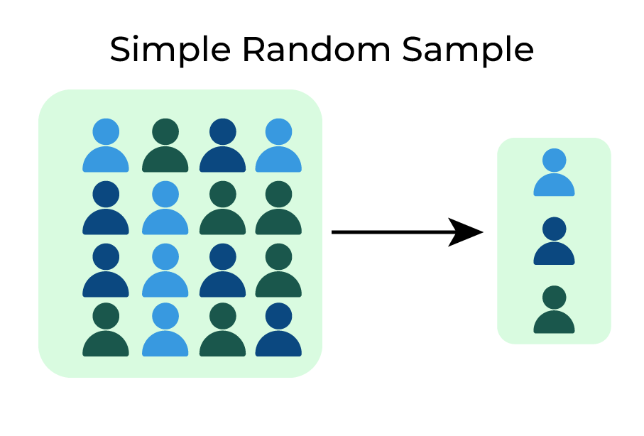

## Table of Contents

## What is simple random sampling?

Simple random sampling is a method used to choose a smaller group of people or items from a larger group. Imagine you have a big jar full of different colored marbles. If you want to know what colors are in the jar without looking at all of them, you can just mix them up and pick a few out without looking. This way, every marble has an equal chance of being picked. That's what simple random sampling does – it makes sure everyone or everything in the big group has the same chance of being chosen for the smaller group.

This method is useful because it helps to make sure the smaller group is a good representation of the whole group. For example, if you use simple random sampling to pick students from a school to ask about their favorite subjects, you're more likely to get a mix of answers that reflects what all the students in the school think. It's like taking a spoonful of soup to taste it; if you stir the soup well before taking the spoonful, that spoonful should give you a good idea of how the whole pot tastes.

## How does simple random sampling work in population studies?

In population studies, simple random sampling is used to pick a small group of people from a bigger group to study. Imagine you want to learn about the health of everyone in a city, but it's too hard to check everyone. So, you use simple random sampling to choose a smaller group that represents the whole city. You do this by giving everyone in the city a number, and then using a computer or a random number table to pick numbers. The people with those numbers are the ones you study. This way, everyone in the city has an equal chance of being chosen, which helps make sure your smaller group is a good reflection of the entire city.

Once you have your smaller group, you can study them to learn about things like their health, habits, or opinions. If you did the simple random sampling right, the results from your smaller group should give you a good idea of what's true for the whole city. For example, if you find that 30% of your smaller group has a certain health problem, you can guess that about 30% of the entire city might have the same issue. This makes it easier and cheaper to learn about big groups of people without having to check everyone.

## What are the benefits of using simple random sampling in population studies?

Simple random sampling is really helpful in population studies because it makes sure everyone has an equal chance of being picked. This means the smaller group you study is a good reflection of the whole population. It's like if you want to know what everyone in your school thinks about a new rule, and you pick students randomly, you're more likely to get a mix of opinions that shows what the whole school thinks.

Another benefit is that it's easy to do and understand. You just need a list of everyone in the population and a way to pick numbers randomly. This makes it less complicated than other ways of [picking](/wiki/asset-class-picking) people to study. Plus, because it's simple, it's usually cheaper and quicker to do. So, if you're trying to learn about a big group of people, simple random sampling can save you time and money while still giving you good information.

## What are the limitations of simple random sampling?

Simple random sampling can be tricky because it needs a complete list of everyone in the group you want to study. If you don't have a good list, you might miss some people, and your results won't be as good. Also, if the group you're studying is spread out over a big area, it can be hard and expensive to reach everyone you pick randomly. For example, if you're studying people in a big country, you might have to travel a lot to find the people you chose.

Another problem is that simple random sampling might not work well if the group has different types of people. If you're studying a city with both rich and poor neighborhoods, just picking people randomly might not give you a good mix of both. You might end up with too many people from one type of neighborhood and not enough from the other. This can make your results less accurate because they don't show the whole picture of the city.

Overall, while simple random sampling is easy to do and understand, it has its limits. You need a good list of everyone, and it can be hard to reach people if they're spread out. Also, it might not give you a good mix of different types of people in the group you're studying. So, it's important to think about these things before you decide to use simple random sampling.

## How do you determine the sample size for simple random sampling in population studies?

To figure out the sample size for simple random sampling in population studies, you need to think about a few things. First, you need to know how big the whole group is that you're studying. Then, you need to decide how accurate you want your results to be. If you want your results to be very accurate, you'll need a bigger sample size. You also need to think about how much the people in your group might differ from each other. If they're very different, you'll need a bigger sample to make sure you get a good mix of all types of people.

Once you have these ideas in mind, you can use a formula to calculate the sample size. This formula takes into account the size of the whole group, how accurate you want to be, and how much people might differ. You can also use special calculators or software that do this math for you. The key is to make sure your sample size is big enough to give you good information about the whole group, but not so big that it's too hard or expensive to study everyone you pick.

## Can you provide an example of simple random sampling applied in a real population study?

Imagine a health department wants to learn about the exercise habits of people in a big city. They decide to use simple random sampling to pick a smaller group to study. First, they make a list of everyone in the city, giving each person a number. Then, they use a computer to pick numbers randomly. The people with those numbers are the ones they will ask about their exercise habits. This way, everyone in the city has an equal chance of being chosen, which helps make sure the smaller group is a good reflection of the whole city.

After picking the sample, the health department sends out surveys to these people. They ask questions about how often they exercise, what types of exercise they do, and how much time they spend on it each week. By studying the answers from this smaller group, the health department can learn about the exercise habits of the entire city. If they find that most people in their sample exercise three times a week, they can guess that this might be true for the whole city too. This makes it easier and cheaper to learn about the exercise habits of a big group of people without having to ask everyone.

## What are the statistical considerations when using simple random sampling in population studies?

When using simple random sampling in population studies, one important statistical consideration is the sample size. You need to make sure your sample is big enough to give you accurate information about the whole group. If your sample is too small, your results might not be reliable. The size of your sample depends on how big the whole group is, how accurate you want your results to be, and how much the people in the group might differ from each other. You can use a formula or a special calculator to figure out the right sample size.

Another statistical consideration is the margin of error. This is how much your results might be off from the true answer for the whole group. A smaller margin of error means your results are more accurate, but it usually means you need a bigger sample. You also need to think about the confidence level, which is how sure you are that your results are close to the true answer. A higher confidence level means you're more sure, but it also means you need a bigger sample. Balancing these things can help you make sure your study gives you good information about the whole population.

## How does simple random sampling compare to other sampling methods in terms of accuracy and efficiency?

Simple random sampling is a good way to pick a smaller group from a bigger one because it gives everyone an equal chance of being chosen. This can make the smaller group a good reflection of the whole group, which means your results can be accurate. But, simple random sampling can be less efficient than other methods. For example, if the people you're studying are spread out over a big area, it can be hard and expensive to reach everyone you pick. Also, if the group has different types of people, like rich and poor neighborhoods, simple random sampling might not give you a good mix of both, which can make your results less accurate.

Other sampling methods, like stratified sampling, can be more accurate and efficient in some cases. Stratified sampling divides the big group into smaller groups based on certain things, like age or income, and then picks people randomly from each smaller group. This can give you a better mix of different types of people and make your results more accurate. But, it can be more complicated and expensive to do. Cluster sampling is another method where you pick groups of people instead of individuals, which can be more efficient if the people are spread out. But, it might not be as accurate as simple random sampling because not everyone has an equal chance of being chosen. So, the best method depends on what you're studying and what resources you have.

## What software tools are commonly used to implement simple random sampling in population studies?

In population studies, simple random sampling can be done using different software tools. One common tool is Microsoft Excel. You can put all the names or numbers of the people in your big group into an Excel sheet. Then, you can use Excel's random number generator to pick numbers randomly. The people with those numbers are the ones you study. Excel is easy to use and a lot of people already have it on their computers.

Another tool people often use is R, which is a free software for doing [statistics](/wiki/bayesian-statistics). In R, you can use functions like `sample()` to pick numbers randomly from your list of people. R is very powerful and can do a lot of different things, but it might be a bit harder to learn if you're new to it. Some people also use software like SPSS or SAS, which are good for big studies and have special tools for picking samples randomly. These tools can help make sure you do simple random sampling the right way and get good results for your study.

## How can bias be minimized when using simple random sampling in population studies?

To minimize bias when using simple random sampling in population studies, it's important to start with a complete and accurate list of everyone in the group you want to study. If your list is missing some people or has wrong information, your sample might not represent the whole group well. So, take time to make sure your list is as good as it can be. Also, when you pick people randomly, use a good way to do it, like a computer or a random number table. This helps make sure everyone really has an equal chance of being chosen, which is the key to keeping bias low.

Another way to reduce bias is to make sure you follow up with everyone you pick for your sample. Sometimes people don't answer surveys or can't be reached, and if this happens more often with certain types of people, it can make your results biased. Try to reach out to everyone in your sample and use different ways to get in touch with them, like phone calls, emails, or even visiting them in person. By doing this, you can make sure your sample stays a good reflection of the whole group and your results are as accurate as possible.

## What advanced techniques can be used to improve the results of simple random sampling in complex population studies?

In complex population studies, one way to improve the results of simple random sampling is by using stratified sampling. This means you divide the big group into smaller groups based on things like age, income, or where they live. Then, you pick people randomly from each smaller group. This can give you a better mix of different types of people and make your results more accurate. For example, if you're studying a city with both rich and poor neighborhoods, stratified sampling can help you get a good mix of people from both areas, which simple random sampling might not do as well.

Another technique is to use cluster sampling, which can be more efficient if the people you're studying are spread out over a big area. Instead of picking people one by one, you pick groups of people, like neighborhoods or schools. Then, you study everyone in those groups. This can save time and money because you don't have to travel all over the place to find people. But, to make sure your results are still accurate, you might need to pick more groups or study more people within each group. Both stratified and cluster sampling can help make your study better, but you need to think about what will work best for your specific situation.

## How do you evaluate the effectiveness of simple random sampling in a population study?

To evaluate how well simple random sampling works in a population study, you need to check if the smaller group you picked is a good reflection of the whole group. One way to do this is by looking at the results of your study and comparing them to what you know about the whole group. For example, if you know that about 50% of the people in the city are women, you can see if about 50% of the people in your sample are women too. If the numbers are close, it's a good sign that your sample is a good match for the whole group.

Another way to check the effectiveness is by looking at the margin of error and the confidence level of your results. The margin of error tells you how much your results might be off from the true answer for the whole group. A smaller margin of error means your results are more accurate. The confidence level tells you how sure you are that your results are close to the true answer. A higher confidence level means you're more sure. By keeping these things in mind, you can see if simple random sampling gave you good information about the whole population.

## References & Further Reading

[1]: Bergstra, J., Bardenet, R., Bengio, Y., & Kégl, B. (2011). ["Algorithms for Hyper-Parameter Optimization."](https://papers.nips.cc/paper/4443-algorithms-for-hyper-parameter-optimization) Advances in Neural Information Processing Systems 24.

[2]: ["Advances in Financial Machine Learning"](https://www.amazon.com/Advances-Financial-Machine-Learning-Marcos/dp/1119482089) by Marcos Lopez de Prado

[3]: ["Evidence-Based Technical Analysis: Applying the Scientific Method and Statistical Inference to Trading Signals"](https://www.amazon.com/Evidence-Based-Technical-Analysis-Scientific-Statistical/dp/0470008741) by David Aronson

[4]: ["Machine Learning for Algorithmic Trading"](https://github.com/stefan-jansen/machine-learning-for-trading) by Stefan Jansen

[5]: ["Quantitative Trading: How to Build Your Own Algorithmic Trading Business"](https://www.amazon.com/Quantitative-Trading-Build-Algorithmic-Business/dp/1119800064) by Ernest P. Chan