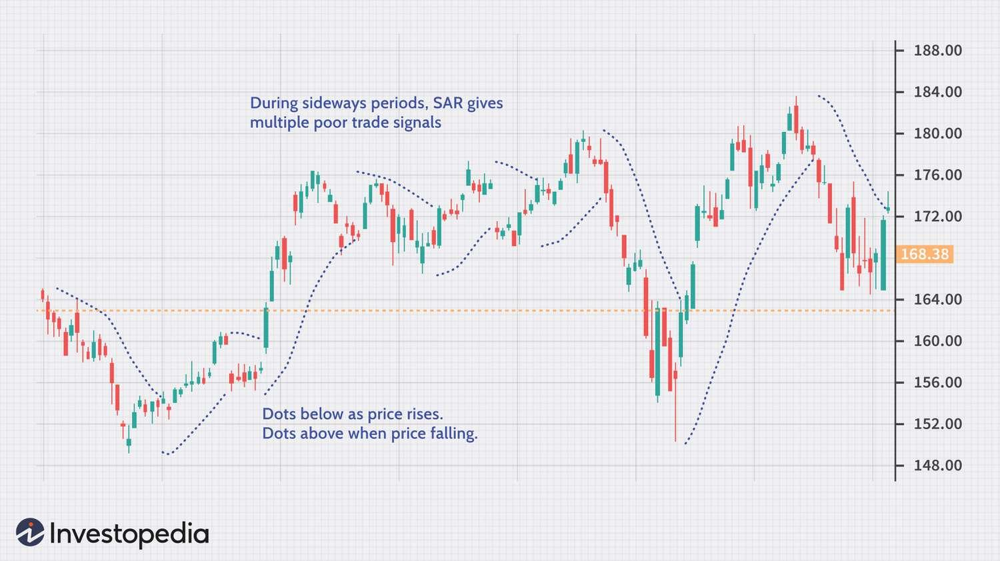

## Table of Contents

## What is Parabolic SAR and how does it work?

Parabolic SAR, or Stop and Reverse, is a technical indicator used by traders to determine the direction of a stock's price movement and potential reversal points. It appears on a chart as a series of dots placed either above or below the price, depending on the trend. When the dots are below the price, it suggests an uptrend, and when they are above the price, it indicates a downtrend. The indicator helps traders decide when to enter or exit a trade by signaling potential trend changes.

The Parabolic SAR works by accelerating its position towards the price as the trend continues. If the price keeps moving in one direction, the dots get closer to the price, which means the indicator becomes more sensitive to price changes. When the price crosses the SAR dots, it signals a potential trend reversal, prompting traders to consider closing their current position and possibly opening a new one in the opposite direction. This makes the Parabolic SAR a useful tool for setting trailing stop-loss orders and managing risk in trading.

## How is Parabolic SAR calculated?

The Parabolic SAR is calculated using a formula that takes into account the previous SAR value, the acceleration factor, and the extreme price. The extreme price is the highest high during an uptrend or the lowest low during a downtrend. The acceleration factor starts at a small value, usually 0.02, and increases by a small increment, typically 0.02, each time the extreme price is updated, up to a maximum value, often set at 0.20. This means the SAR value moves closer to the price as the trend continues.

To find the new SAR value, you subtract the previous SAR from the extreme price, then multiply the result by the acceleration factor. Add this product to the previous SAR to get the new SAR value. If the new SAR value is above the lowest low of the current trend in an uptrend, or below the highest high in a downtrend, you need to adjust it to that extreme price instead. This process repeats with each new period, allowing the SAR to track the price movement and signal potential trend reversals when the price crosses the SAR dots.

## What are the key components of the Parabolic SAR formula?

The Parabolic SAR formula has three main parts: the previous SAR value, the acceleration factor, and the extreme price. The extreme price is the highest high in an uptrend or the lowest low in a downtrend. The acceleration factor starts at a small number, like 0.02, and goes up by a little bit, usually 0.02, every time the extreme price changes. It can go up to a maximum, often set at 0.20. This makes the SAR move closer to the price as the trend keeps going.

To calculate the new SAR value, you take the difference between the extreme price and the previous SAR, then multiply it by the acceleration factor. You add this to the previous SAR to get the new SAR value. If the new SAR value goes above the lowest low in an uptrend or below the highest high in a downtrend, you adjust it to match that extreme price instead. This way, the SAR keeps tracking the price and signals a possible trend change when the price crosses the SAR dots.

## How can beginners use Parabolic SAR to identify potential entry and exit points in trading?

Beginners can use the Parabolic SAR to spot good times to start or end a trade by watching where the little dots are on the chart. If the dots are below the price line, it means the price is going up, and that could be a good time to buy. When the dots are above the price line, it means the price is going down, and that might be a good time to sell or not buy. When the price crosses the dots, it's a sign that the trend might be changing. So, if you see the price going from above the dots to below them, you might want to buy. If it goes from below the dots to above them, you might want to sell.

It's important for beginners to practice using the Parabolic SAR on a demo account before using real money. This way, they can get used to how the dots move and what they mean without risking any money. Also, it's a good idea to use the Parabolic SAR along with other tools, like moving averages or the Relative Strength Index (RSI), to make better decisions. By combining different indicators, beginners can get a clearer picture of when to enter or exit a trade and feel more confident in their choices.

## What are the advantages of using Parabolic SAR in trading?

One big advantage of using Parabolic SAR in trading is that it's easy to understand and use. The little dots on the chart show you if the price is going up or down. When the dots are below the price, it means the price is going up, and that's a good time to buy. When the dots are above the price, it means the price is going down, and that's a good time to sell. This makes it simple for anyone, even beginners, to see when to get into or out of a trade.

Another advantage is that Parabolic SAR helps you set stop-loss orders. A stop-loss order is like a safety net that stops you from losing too much money if the price goes the wrong way. The Parabolic SAR moves closer to the price as the trend continues, so you can use it to adjust your stop-loss order. This way, you can lock in profits as the price goes up and limit your losses if the price goes down. Using Parabolic SAR can help you manage risk better and make smarter trading decisions.

## What are the limitations and potential pitfalls of relying on Parabolic SAR?

One big problem with using Parabolic SAR is that it can give you wrong signals, especially in markets that don't have a clear trend. If the price is moving up and down a lot without going in one direction, the Parabolic SAR might tell you to buy and sell too often. This can make you lose money because you're trading too much and paying fees each time. Also, the Parabolic SAR can be slow to catch up when the price suddenly changes direction. By the time it tells you the trend has changed, you might have already lost money.

Another issue is that Parabolic SAR works best when used with other tools. If you only use Parabolic SAR, you might miss important information that other indicators could give you. For example, using it with something like the Relative Strength Index (RSI) can help you see if a stock is overbought or oversold, which can make your trading decisions better. Relying only on Parabolic SAR might lead you to make trades based on incomplete information, which can be risky.

## How does Parabolic SAR perform in different market conditions, such as trending and ranging markets?

Parabolic SAR works really well in markets that have a clear trend, whether the prices are going up or down. When the market is trending, the little dots of the Parabolic SAR stay on one side of the price line, making it easy to see if you should buy or sell. In an uptrend, the dots are below the price, telling you it's a good time to buy. In a downtrend, the dots are above the price, suggesting it's a good time to sell. The dots also move closer to the price as the trend continues, which helps you set stop-loss orders to lock in profits or limit losses.

But, Parabolic SAR can be tricky in markets that are not trending, like when prices are moving up and down without going in one clear direction. In these ranging markets, the Parabolic SAR might give you wrong signals to buy and sell too often. You could end up trading a lot and losing money on fees. Also, the Parabolic SAR can be slow to catch up if the market suddenly changes direction, which might mean you miss out on the best time to get out of a trade. That's why it's important to use other tools along with Parabolic SAR to get a better picture of what's happening in the market.

## Can Parabolic SAR be combined with other technical indicators to improve trading decisions?

Yes, combining Parabolic SAR with other technical indicators can help you make better trading decisions. Parabolic SAR works great in markets with a clear trend, but it can be tricky in markets that move up and down without a clear direction. Using other indicators like the Relative Strength Index (RSI) can help you see if a stock is overbought or oversold, which can give you more information to decide when to buy or sell. For example, if the Parabolic SAR tells you to buy but the RSI shows the stock is overbought, you might want to wait for a better time to enter the trade.

Another good indicator to use with Parabolic SAR is the Moving Average. Moving Averages help you see the overall direction of the market by smoothing out the price data. If the Parabolic SAR signals a trend change, you can check if the Moving Average supports that signal. If both indicators agree, it can give you more confidence in your decision. Using Parabolic SAR with other tools like these can help you avoid false signals and make smarter trades, especially in markets that are not clearly trending.

## How can traders adjust the Parabolic SAR settings to suit different trading strategies?

Traders can change the Parabolic SAR settings to make it fit different trading plans. The two main things you can change are the starting acceleration factor and the maximum acceleration factor. The starting acceleration factor usually starts at 0.02, but you can make it bigger or smaller. If you make it bigger, the Parabolic SAR will move closer to the price faster, which might be good if you want to catch quick changes in the market. If you make it smaller, it will move slower, which can be better if you want to stay in a trade longer and not get out too soon.

The maximum acceleration factor is usually set at 0.20, but you can change this too. Making it bigger means the Parabolic SAR will keep getting closer to the price as the trend goes on, which can help you lock in profits faster. But, if you make it smaller, the Parabolic SAR won't get as close to the price, which might be good if you want to give the trend more room to move without getting a signal to get out of your trade. By playing around with these settings, traders can make the Parabolic SAR work better for their own way of trading, whether they like to trade fast or slow.

## What are some advanced techniques for using Parabolic SAR in algorithmic trading?

In [algorithmic trading](/wiki/algorithmic-trading), traders can use Parabolic SAR in smart ways to make their trading programs better. One way is to use Parabolic SAR with other indicators, like the Moving Average Convergence Divergence (MACD) or the Relative Strength Index (RSI), to check if the signals they get are good. If the Parabolic SAR says to buy and the MACD also shows a bullish signal, the trading program can be more sure about making that trade. This can help avoid making trades based on wrong signals, which is really important in algorithmic trading where everything happens fast.

Another advanced technique is to change the Parabolic SAR settings based on how the market is acting. Traders can write code that makes the starting and maximum acceleration factors change depending on whether the market is moving fast or slow. If the market is moving a lot, the program can make the acceleration factors bigger so the Parabolic SAR catches quick changes better. If the market is moving slowly, the program can make the factors smaller to keep the trader in the trade longer. This way, the trading program can work better in different market conditions and help the trader make more money.

## How does the effectiveness of Parabolic SAR vary across different asset classes, such as stocks, forex, and commodities?

The effectiveness of Parabolic SAR can change a lot depending on what you're trading, like stocks, [forex](/wiki/forex-system), or commodities. For stocks, Parabolic SAR works well when the market is moving in a clear direction, either up or down. Stocks can have strong trends, so the Parabolic SAR can help traders know when to buy or sell. But, if the stock market is moving up and down without a clear trend, the Parabolic SAR might give wrong signals, making traders buy and sell too often and lose money on fees.

In the forex market, where currencies are traded, Parabolic SAR can be very useful because forex markets often have strong trends. The Parabolic SAR can help traders spot these trends and make good decisions about when to enter or exit trades. But, forex markets can also be very fast-moving, so the Parabolic SAR needs to be adjusted to catch these quick changes. If not, traders might miss out on good opportunities or get out of trades too soon.

For commodities like gold or oil, the Parabolic SAR can be helpful, but it depends on the commodity's market conditions. Some commodities have clear trends that the Parabolic SAR can follow well, helping traders make smart trades. But, commodities can also be affected by many things like weather, politics, or supply and demand, which can make their prices jump around a lot. In these cases, the Parabolic SAR might not work as well and could give wrong signals, so traders need to be careful and use other tools to check the signals they get.

## What are the latest research findings and developments related to the use of Parabolic SAR in trading?

Recent research on Parabolic SAR has focused on improving its accuracy and adaptability to different market conditions. One key finding is that combining Parabolic SAR with [machine learning](/wiki/machine-learning) algorithms can enhance its predictive power. Researchers have found that by feeding historical data into machine learning models, they can better predict when the Parabolic SAR's signals are likely to be accurate. This approach helps traders avoid false signals, especially in ranging markets where the Parabolic SAR tends to struggle. Additionally, studies have shown that adjusting the acceleration factors dynamically based on market [volatility](/wiki/volatility-trading-strategies) can make the Parabolic SAR more responsive to quick market changes, which is particularly useful in fast-moving markets like forex.

Another area of development is the integration of Parabolic SAR into multi-indicator systems. Researchers have found that using Parabolic SAR alongside other technical indicators, such as the Relative Strength Index (RSI) and Moving Average Convergence Divergence (MACD), can provide more robust trading signals. For instance, a study showed that when Parabolic SAR signals align with RSI and MACD, the likelihood of a successful trade increases significantly. This multi-indicator approach helps traders make more informed decisions by confirming trends and reducing the risk of acting on misleading signals. As a result, the latest developments suggest that Parabolic SAR, when used wisely and in combination with other tools, can still be a valuable part of a trader's toolkit.

## What is Understanding Parabolic SAR?

Parabolic SAR (Stop and Reverse) is a technical analysis indicator primarily used to determine the direction of an asset's [momentum](/wiki/momentum) and the point in time when this momentum has a higher-than-normal probability of switching directions. Developed by J. Welles Wilder in his 1978 book "New Concepts in Technical Trading Systems," the Parabolic SAR provides traders with potential entry and exit points in the market via a series of dots placed either above or below an asset’s price on a chart.

Parabolic SAR functions on the concept of a parabolic curve to determine the direction of the market. The indicator generates dots on the chart: if the dots are below the price, it suggests an uptrend. Conversely, if the dots are above the price, it signals a downtrend. The switch of dots from one side to another indicates a probable reversal in the price trend, which is a critical feature for traders using this method to define their strategies.

To calculate the Parabolic SAR, the basic formula considers the prior SAR value, the Extreme Point (EP) which is the highest or lowest price reached during the current trend, and an Acceleration Factor (AF), which is incremented as the trend develops:

$$
\text{SAR}_{\text{new}} = \text{SAR}_{\text{current}} + \text{AF} \times (\text{EP} - \text{SAR}_{\text{current}})
$$

Typically, the default value of the AF starts at 0.02 and can increase up to a maximum of 0.20, advancing by increments of 0.02 whenever the extreme point makes a new high or low. This feature allows the Parabolic SAR to adjust closely to price movements, thus enabling traders to recognize potential reversals efficiently.

Key features of the Parabolic SAR that set it apart from other technical indicators include its applications in trend-following strategies and simplicity in identifying stop and reverse points on charts. Unlike other indicators like moving averages or oscillators, Parabolic SAR is more visually intuitive and directly suggests actionable points in the form of stop-loss levels.

Nevertheless, the Parabolic SAR possesses certain limitations. It is most effective in trending markets and can produce false signals during periods of market consolidation or sideways movement. This reliance on market trends can result in a series of whipsaw trades when the market lacks a definitive direction, leading to potential losses.

In conclusion, while the Parabolic SAR is a powerful tool for identifying trends and reversals in the market, traders should apply it in conjunction with other technical indicators to improve its efficacy, especially in non-trending markets.

## How does Parabolic SAR work?

The Parabolic SAR (Stop and Reverse) works as a price-and-time-based technical indicator designed to identify potential reversals in the market and aid in determining entry and [exit](/wiki/exit-strategy) points. The indicator marks points on a chart that denote where a potential change might occur regarding the asset's direction, functioning effectively in trending markets. Understanding the placement and interpretation of these dots is essential for effective trading.

### Explanation of the Rising and Falling SAR

The Parabolic SAR operates by placing 'dots' above or below the price bars on a chart, depending on the trend direction. In a rising trend, the dots are placed below the price bars, indicating a bullish market condition, while in a falling trend, the dots move above the price bars, pointing to bearish sentiment. As the trend progresses, the dots follow the price action, getting closer to the price. When a dot moves to the opposite side of the price bars, it is considered a signal that the trend direction might reverse.

### Understanding the Dots and Their Placement

Each dot on the chart provides information about potential market conditions. The formula to calculate the next SAR is crucial in determining the placement of these dots. The basic calculation is as follows:

$$
\text{SAR}_{\text{next}} = \text{SAR}_{\text{current}} + \alpha(\text{EP} - \text{SAR}_{\text{current}})
$$

where:
- $\text{SAR}_{\text{current}}$ is the current period’s SAR value.
- $\alpha$ is the acceleration factor, which increases incrementally.
- $\text{EP}$ is the extremum point, the highest high for an uptrend and the lowest low for a downtrend.

The acceleration [factor](/wiki/factor-investing) ($\alpha$) starts at a set value (usually 0.02) and increases by this value every time a new extremum point is registered, up to a maximum value (commonly 0.20).

### Role of SAR in Identifying Potential Entry and Exit Points

The transition of dots from below to above the price, or vice versa, provides signals for possible entry or exit points. Traders can initiate buying positions when the dots switch from above to below the price, suggesting a shift to an upward trend. Conversely, a selling position might be considered when the dots transition from below to above the price, indicating a potential downward shift.

### The Significance of Trend Direction and Reversals

Understanding the direction of the market trend is crucial for effective trading, and the Parabolic SAR is adept at highlighting significant reversals. A notable advantage of this indicator is its ability to dynamically adjust to market conditions, thus providing real-time insights into potential market reversals. However, it is most reliable in trending markets and may produce false signals when the asset's price is moving sideways.

### Case Studies Illustrating Parabolic SAR in Action

Case studies of the Parabolic SAR in action typically illustrate its effectiveness during strong trends and the potential for false signals in choppy or sideways markets. For instance, a study of a renowned stock like Tesla during a sustained upward trend would show consistent dots below the price, confirming a strong buy signal. Conversely, during consolidations or minor price adjustments, the dots would frequently oscillate, suggesting the need for caution or supplementary indicators to avoid premature trades.

By understanding these aspects, traders can better leverage the Parabolic SAR to optimize their trading decisions, enhancing their ability to capitalize on trending markets.

## References & Further Reading

[1]: Wilder, J. W. (1978). ["New Concepts in Technical Trading Systems."](https://archive.org/details/newconceptsintec00wild) Trend Research.

[2]: Murphy, J. J. (1999). ["Technical Analysis of the Financial Markets: A Comprehensive Guide to Trading Methods and Applications."](https://archive.org/details/technicalanalysi0000murp) New York Institute of Finance.

[3]: Chan, E. P. (2009). ["Quantitative Trading: How to Build Your Own Algorithmic Trading Business."](https://github.com/ftvision/quant_trading_echan_book) Wiley.

[4]: Jansen, S. (2020). ["Machine Learning for Algorithmic Trading: Predictive Models to Extract Signals from Market and Alternative Data for Systematic Trading Strategies with Python."](https://github.com/stefan-jansen/machine-learning-for-trading) Packt Publishing.

[5]: Aronson, D. R. (2007). ["Evidence-Based Technical Analysis: Applying the Scientific Method and Statistical Inference to Trading Signals."](https://onlinelibrary.wiley.com/doi/book/10.1002/9781118268315) Wiley.

[6]: De Prado, M. L. (2018). ["Advances in Financial Machine Learning."](https://www.amazon.com/Advances-Financial-Machine-Learning-Marcos/dp/1119482089) Wiley.

[7]: Investopedia. ["Parabolic SAR Indicator."](https://www.investopedia.com/terms/p/parabolicindicator.asp)

[8]: Bergstra, J., Bardenet, R., Bengio, Y., & Kégl, B. (2011). ["Algorithms for Hyper-Parameter Optimization."](https://dl.acm.org/doi/10.5555/2986459.2986743) Advances in Neural Information Processing Systems 24.