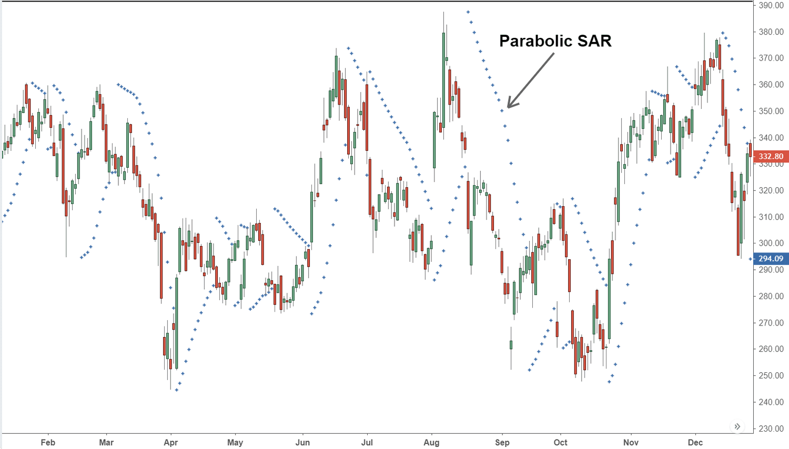

Technical analysis is a crucial component of trading that involves studying historical price and volume data to forecast future price movements. Traders employ various tools and indicators to discern potential market trends and make informed decisions. One such tool is the Parabolic SAR (Stop and Reverse), a popular indicator utilized for determining the direction of a market's price movement and identifying potential reversals.

Developed by J. Welles Wilder, the Parabolic SAR is known for its straightforward approach that uses dots placed above or below price bars to signal buy or sell opportunities. Its ease of use makes it an attractive choice for traders seeking to implement systematic trading strategies. The Parabolic SAR calculates potential reversal points based on recent extreme prices and an acceleration factor, which increases as the trend continues. This unique mechanism allows traders to generate actionable insights into market trends.



Algorithmic trading strategies have revolutionized the trading landscape by allowing traders to execute complex strategies automatically, eliminating human error and emotion. The integration of algorithms into trading dramatically enhances efficiency, consistency, and speed. As traders strive to stay ahead in the competitive market, developing and refining algorithmic strategies becomes imperative.

This article aims to provide an in-depth exploration of the Parabolic SAR within the context of algorithmic trading. By examining how this indicator functions and how it can be incorporated into automated strategies, traders can enhance their ability to identify potential trading opportunities and manage risk effectively. This article will discuss the key concepts, features, and applications of the Parabolic SAR, providing valuable insights to optimize trading strategies across different market conditions. It will serve as a comprehensive resource for traders looking to harness the power of Parabolic SAR within their algorithmic trading frameworks.

## Table of Contents

## Understanding Parabolic SAR

Parabolic SAR (Stop and Reverse) is a technical analysis indicator primarily used to determine the direction of an asset's momentum and the point in time when this momentum has a higher-than-normal probability of switching directions. Developed by J. Welles Wilder in his 1978 book "New Concepts in Technical Trading Systems," the Parabolic SAR provides traders with potential entry and exit points in the market via a series of dots placed either above or below an asset’s price on a chart.

Parabolic SAR functions on the concept of a parabolic curve to determine the direction of the market. The indicator generates dots on the chart: if the dots are below the price, it suggests an uptrend. Conversely, if the dots are above the price, it signals a downtrend. The switch of dots from one side to another indicates a probable reversal in the price trend, which is a critical feature for traders using this method to define their strategies.

To calculate the Parabolic SAR, the basic formula considers the prior SAR value, the Extreme Point (EP) which is the highest or lowest price reached during the current trend, and an Acceleration Factor (AF), which is incremented as the trend develops:

$$
\text{SAR}_{\text{new}} = \text{SAR}_{\text{current}} + \text{AF} \times (\text{EP} - \text{SAR}_{\text{current}})
$$

Typically, the default value of the AF starts at 0.02 and can increase up to a maximum of 0.20, advancing by increments of 0.02 whenever the extreme point makes a new high or low. This feature allows the Parabolic SAR to adjust closely to price movements, thus enabling traders to recognize potential reversals efficiently.

Key features of the Parabolic SAR that set it apart from other technical indicators include its applications in trend-following strategies and simplicity in identifying stop and reverse points on charts. Unlike other indicators like moving averages or oscillators, Parabolic SAR is more visually intuitive and directly suggests actionable points in the form of stop-loss levels.

Nevertheless, the Parabolic SAR possesses certain limitations. It is most effective in trending markets and can produce false signals during periods of market consolidation or sideways movement. This reliance on market trends can result in a series of whipsaw trades when the market lacks a definitive direction, leading to potential losses.

In conclusion, while the Parabolic SAR is a powerful tool for identifying trends and reversals in the market, traders should apply it in conjunction with other technical indicators to improve its efficacy, especially in non-trending markets.

## How Parabolic SAR Works

The Parabolic SAR (Stop and Reverse) works as a price-and-time-based technical indicator designed to identify potential reversals in the market and aid in determining entry and [exit](/wiki/exit-strategy) points. The indicator marks points on a chart that denote where a potential change might occur regarding the asset's direction, functioning effectively in trending markets. Understanding the placement and interpretation of these dots is essential for effective trading.

### Explanation of the Rising and Falling SAR

The Parabolic SAR operates by placing 'dots' above or below the price bars on a chart, depending on the trend direction. In a rising trend, the dots are placed below the price bars, indicating a bullish market condition, while in a falling trend, the dots move above the price bars, pointing to bearish sentiment. As the trend progresses, the dots follow the price action, getting closer to the price. When a dot moves to the opposite side of the price bars, it is considered a signal that the trend direction might reverse.

### Understanding the Dots and Their Placement

Each dot on the chart provides information about potential market conditions. The formula to calculate the next SAR is crucial in determining the placement of these dots. The basic calculation is as follows:

$$
\text{SAR}_{\text{next}} = \text{SAR}_{\text{current}} + \alpha(\text{EP} - \text{SAR}_{\text{current}})
$$

where:
- $\text{SAR}_{\text{current}}$ is the current period’s SAR value.
- $\alpha$ is the acceleration factor, which increases incrementally.
- $\text{EP}$ is the extremum point, the highest high for an uptrend and the lowest low for a downtrend.

The acceleration [factor](/wiki/factor-investing) ($\alpha$) starts at a set value (usually 0.02) and increases by this value every time a new extremum point is registered, up to a maximum value (commonly 0.20).

### Role of SAR in Identifying Potential Entry and Exit Points

The transition of dots from below to above the price, or vice versa, provides signals for possible entry or exit points. Traders can initiate buying positions when the dots switch from above to below the price, suggesting a shift to an upward trend. Conversely, a selling position might be considered when the dots transition from below to above the price, indicating a potential downward shift.

### The Significance of Trend Direction and Reversals

Understanding the direction of the market trend is crucial for effective trading, and the Parabolic SAR is adept at highlighting significant reversals. A notable advantage of this indicator is its ability to dynamically adjust to market conditions, thus providing real-time insights into potential market reversals. However, it is most reliable in trending markets and may produce false signals when the asset's price is moving sideways.

### Case Studies Illustrating Parabolic SAR in Action

Case studies of the Parabolic SAR in action typically illustrate its effectiveness during strong trends and the potential for false signals in choppy or sideways markets. For instance, a study of a renowned stock like Tesla during a sustained upward trend would show consistent dots below the price, confirming a strong buy signal. Conversely, during consolidations or minor price adjustments, the dots would frequently oscillate, suggesting the need for caution or supplementary indicators to avoid premature trades.

By understanding these aspects, traders can better leverage the Parabolic SAR to optimize their trading decisions, enhancing their ability to capitalize on trending markets.

## Integrating Parabolic SAR in Trading Strategies

The Parabolic SAR (Stop and Reverse) is a technical indicator used to identify potential reversal points in the price movements of securities. Integrating the Parabolic SAR into trading strategies can enhance the efficacy of both manual and [algorithmic trading](/wiki/algorithmic-trading) systems by combining it with other indicators and tailoring strategies to suit different market conditions.

### Developing Strategies Combining Parabolic SAR with Other Indicators

To optimize the effectiveness of the Parabolic SAR, it is beneficial to pair it with other technical indicators. Common complementary indicators include moving averages, the Relative Strength Index (RSI), and the Moving Average Convergence Divergence (MACD). For example, traders might use a moving average to confirm the general market trend and the Parabolic SAR to pinpoint precise entry and exit points. This dual-indicator approach can help filter out false signals that might occur when using the Parabolic SAR alone.

### Strategies for Different Market Conditions

Trading strategies should be adapted to suit different market conditions, such as trending or sideways markets:

1. **Trending Markets**: In trending markets, the Parabolic SAR can be highly effective due to its ability to identify potential trend reversals. Traders might opt to enter long positions when the dots of the Parabolic SAR shift below the price in an uptrend and exit or short when the dots appear above the price in a downtrend.

2. **Sideways Markets**: During sideways or range-bound markets, the Parabolic SAR is less reliable, as frequent whipsaws can lead to false signals. In such scenarios, combining the Parabolic SAR with range-bound indicators, such as Bollinger Bands or the RSI, can improve performance by filtering out less probable trade signals.

### Setting Up a Trading Plan Using Parabolic SAR

Creating a structured trading plan with the Parabolic SAR involves several steps:

- **Define Trade Triggers**: Clearly identify the conditions under which a trade will be initiated or closed. For example, entering a trade when the Parabolic SAR switches position relative to the price.

- **Risk Management**: Establish stop-loss and take-profit levels, possibly using the Parabolic SAR’s current placement as dynamic benchmarks.

- **Trade Size**: Determine the size of each trade based on account size and risk tolerance.

### Day Trading and Swing Trading Strategies with Parabolic SAR

- **Day Trading**: For day traders, the Parabolic SAR can provide quick signals in shorter time frames, such as 1-minute or 5-minute charts. Pairing it with momentum indicators like the RSI can help in capturing swift market movements.

- **Swing Trading**: Swing traders might use longer time frames, such as daily or 4-hour charts, and combine the Parabolic SAR with trend confirmation indicators like the MACD to catch longer-lived price swings.

### Backtesting Strategies to Evaluate Performance

Backtesting is critical to evaluate the viability of trading strategies using historical data. This can be done using Python with libraries such as pandas for data manipulation and [backtrader](/wiki/backtrader) for [backtesting](/wiki/backtesting):

```python
import backtrader as bt

class ParabolicSARStrategy(bt.Strategy):
    def __init__(self):
        self.sar = bt.indicators.SAR(self.data.low, acceleration=0.02, maximum=0.2)

    def next(self):
        if not self.position:
            if self.data.close[0] > self.sar[0]:
                self.buy()
        elif self.data.close[0] < self.sar[0]:
            self.sell()

cerebro = bt.Cerebro()
cerebro.addstrategy(ParabolicSARStrategy)
data = bt.feeds.YahooFinanceData(dataname='AAPL', fromdate=datetime(2020, 1, 1), todate=datetime(2023, 1, 1))
cerebro.adddata(data)
cerebro.run()
cerebro.plot()
```

Backtesting allows traders to adjust their parameters and strategies before deploying them in live markets, ensuring that they optimize their use of the Parabolic SAR within the context of their specific trading goals and risk tolerance.

## Algorithmic Trading with Parabolic SAR

Algorithmic trading, often referred to as algo trading, utilizes computer programs to automate trading decisions based on predefined criteria. This approach offers significant benefits, including the elimination of human emotions from trading, the ability to handle large amounts of data quickly, and the potential for evaluating and executing trades more efficiently. By integrating technical indicators like the Parabolic SAR, traders can enhance their algorithmic trading strategies.

To automate Parabolic SAR strategies, traders typically rely on sophisticated trading platforms such as MetaTrader, TradingView, or custom-built systems. These platforms allow the implementation of algorithms that can monitor market conditions, generate signals based on the Parabolic SAR, and execute trades automatically. This automation is especially beneficial in high-frequency trading where speed is critical.

Custom algorithms incorporating the Parabolic SAR revolve around the basic concept of the SAR—identifying potential trend reversals. For example, an algorithm can be programmed to initiate a buy order when the Parabolic SAR flips below the price, indicating an upward trend, and conversely, a sell order when the SAR moves above the price, signaling a downtrend. Here is a simple Python example using a popular library, Pandas, to illustrate implementing a Parabolic SAR strategy:

```python
import pandas as pd
import talib

# Sample data
data = pd.read_csv('market_data.csv')  # Market data with columns: Date, Open, High, Low, Close
high, low, close = data['High'], data['Low'], data['Close']

# Calculate Parabolic SAR
sar = talib.SAR(high, low, acceleration=0.02, maximum=0.2)

# Buy and sell signals
buy_signals = (close > sar) & (close.shift(1) <= sar.shift(1))
sell_signals = (close < sar) & (close.shift(1) >= sar.shift(1))

# Adding signals to the DataFrame
data['SAR'] = sar
data['Buy_Signal'] = buy_signals
data['Sell_Signal'] = sell_signals

# Output signal dates
print("Buy signals:")
print(data[data['Buy_Signal']].index)

print("Sell signals:")
print(data[data['Sell_Signal']].index)
```

Implementing SAR algorithms requires understanding the technical specifications of the chosen trading platform. This includes whether the platform supports the necessary computing power, API access for real-time data, and tools for backtesting strategies—a crucial phase in developing any trading algorithm to ensure its effectiveness under various market conditions.

Examples of successful algo trading strategies using Parabolic SAR combine it with other indicators to filter false signals and improve decision-making accuracy. For instance, pairing Parabolic SAR with [momentum](/wiki/momentum) indicators like the Relative Strength Index (RSI) can confirm the strength of the signals, thereby enhancing the overall strategy's reliability.

By leveraging algorithmic trading methods, traders can exploit the systematic nature of the Parabolic SAR, thereby improving efficiency and potentially increasing profitability in their trading activities.

## Risk Management and Optimization

Effective risk management and optimization are fundamental components of successful algorithmic trading with the Parabolic SAR (Stop and Reverse) indicator. In this context, understanding how to implement stop-loss and take-profit levels, adjust SAR settings, monitor algorithm performance, and avoid common mistakes are crucial for maximizing trading outcomes.

Risk management in algorithmic trading involves setting predefined criteria to minimize losses and safeguard capital. The Parabolic SAR plays a significant role in this by providing precise points for stop-loss and take-profit levels. The SAR’s position above or below the price indicates the potential direction of the market trend, serving as a dynamic tool for setting these levels. Traders often use the SAR value as a trailing stop-loss, adjusting it as the trade progresses to lock in profits while reducing exposure to losses.

    For example, a basic strategy could be:
    ```
    current_SAR = calculate_SAR()  # Function to calculate the current SAR value.
    if market_position == 'long':
        stop_loss = current_SAR
        take_profit = entry_price + (entry_price - current_SAR)  # Assume a 1:1 risk-reward ratio.
    elif market_position == 'short':
        stop_loss = current_SAR
        take_profit = entry_price - (current_SAR - entry_price)
    ```

Adjusting the SAR settings is also essential to cater to different market conditions for enhanced accuracy. The Parabolic SAR has two main parameters: the step or acceleration factor and the maximum value. The acceleration factor dictates how quickly the SAR values adjust to price changes. Traders may increase the acceleration factor in trending markets to capture more price action and reduce it in sideways markets to prevent frequent reversals.

    Example of parameter adjustment:
    ```
    def adjust_SAR_parameters(market_condition):
        if market_condition == 'trending':
            return 0.04, 0.2  # Higher step and max values.
        elif market_condition == 'sideways':
            return 0.01, 0.1  # Lower step and max values.
    ```

Monitoring and optimizing the algorithmic performance involve continuous evaluation and tweaking of the strategy. Automation and backtesting play pivotal roles in this process, allowing traders to simulate strategies in different historical conditions to identify potential weaknesses and areas for improvement. Traders use metrics such as the Sharpe ratio, maximum drawdown, and total return to assess effectiveness.

Common mistakes to be mindful of include over-optimizing the SAR settings to fit historical data, ignoring market [volatility](/wiki/volatility-trading-strategies), and failing to update the trading strategy with evolving market dynamics. To avoid these pitfalls, traders should regularly test their strategies under various scenarios and adapt to market changes accordingly.

In conclusion, employing meticulous risk management techniques with the Parabolic SAR and refining the algorithm ensures sustainable trading success. Avoiding common trading mistakes while systematically optimizing performance is key to capitalizing on market opportunities.

## Conclusion

Throughout this article, we explored the integral role of Parabolic SAR in trading strategies, particularly in the context of algorithmic trading. Initially developed by J. Welles Wilder, the Parabolic SAR (Stop and Reverse) is a technical indicator that aids traders in identifying potential entry and exit points by marking trend directions and reversals. Its clearly defined formula and visual representation make it a favorite among traders who seek a systematic approach to trade management and execution.

One key takeaway is the effectiveness of Parabolic SAR in trending markets, where it provides clear signals for traders to follow. However, its limitations in sideways markets highlight the necessity for integration with other indicators to improve accuracy and reliability. By combining Parabolic SAR with other technical tools, traders can enhance their strategy's robustness across varying market conditions.

In the context of algorithmic trading, automating strategies using Parabolic SAR can lead to consistent performance and reduced emotional interference. Developing custom algorithms and backtesting these strategies can help traders refine their approach and set optimal stop-loss and take-profit levels. Moreover, efficient risk management remains crucial, underscoring the importance of continuous monitoring and optimization of the trading algorithms to mitigate potential losses.

For those eager to deepen their understanding of technical analysis and further refine their trading strategies, a wealth of resources is available. Books such as "Technical Analysis of the Financial Markets" by John Murphy and online platforms like Investopedia offer valuable insights and educational content relevant to both novice and experienced traders.

We encourage traders to experiment with Parabolic SAR in their algorithmic setups, allowing for innovation and personal adaptation within trading strategies. Engaging with this versatile indicator can open new avenues for strategy development.

Finally, we invite readers to share their experiences and feedback on implementing Parabolic SAR in their trading practices, fostering a community of learning and growth. Your insights could lead to enriching exchanges, pushing the boundaries of what's possible in technical analysis and algorithmic trading.

## References & Further Reading

[1]: Wilder, J. W. (1978). ["New Concepts in Technical Trading Systems."](https://archive.org/details/newconceptsintec00wild) Trend Research.

[2]: Murphy, J. J. (1999). ["Technical Analysis of the Financial Markets: A Comprehensive Guide to Trading Methods and Applications."](https://archive.org/details/technicalanalysi0000murp) New York Institute of Finance.

[3]: Chan, E. P. (2009). ["Quantitative Trading: How to Build Your Own Algorithmic Trading Business."](https://github.com/ftvision/quant_trading_echan_book) Wiley.

[4]: Jansen, S. (2020). ["Machine Learning for Algorithmic Trading: Predictive Models to Extract Signals from Market and Alternative Data for Systematic Trading Strategies with Python."](https://github.com/stefan-jansen/machine-learning-for-trading) Packt Publishing.

[5]: Aronson, D. R. (2007). ["Evidence-Based Technical Analysis: Applying the Scientific Method and Statistical Inference to Trading Signals."](https://onlinelibrary.wiley.com/doi/book/10.1002/9781118268315) Wiley.

[6]: De Prado, M. L. (2018). ["Advances in Financial Machine Learning."](https://www.amazon.com/Advances-Financial-Machine-Learning-Marcos/dp/1119482089) Wiley.

[7]: Investopedia. ["Parabolic SAR Indicator."](https://www.investopedia.com/terms/p/parabolicindicator.asp)

[8]: Bergstra, J., Bardenet, R., Bengio, Y., & Kégl, B. (2011). ["Algorithms for Hyper-Parameter Optimization."](https://dl.acm.org/doi/10.5555/2986459.2986743) Advances in Neural Information Processing Systems 24.