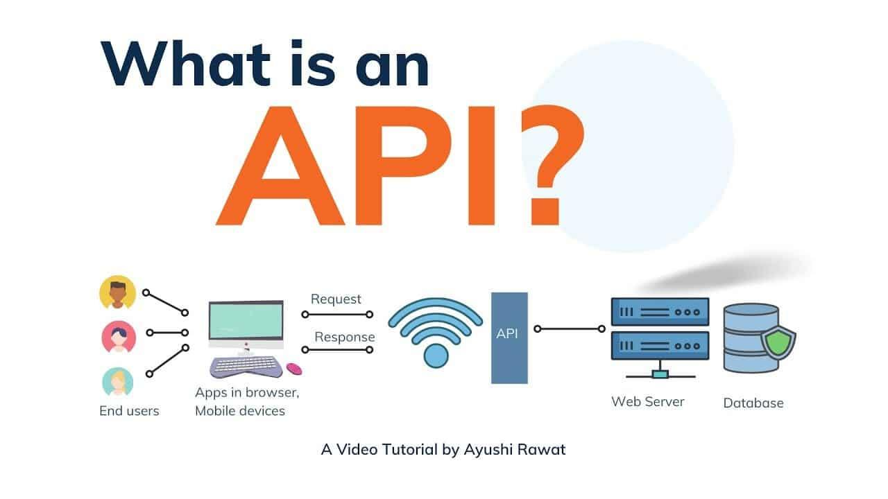

## Table of Contents

## What is an Application Programming Interface (API)?

An Application Programming Interface, or API, is like a messenger that helps different software programs talk to each other. Imagine you want to use a weather app on your phone. The app doesn't create the weather data itself; instead, it asks for this information from a weather service through an API. The API takes the request from the app, sends it to the weather service, and then brings back the weather data to show on your phone.

APIs are important because they allow different pieces of software to work together without needing to know how each other works inside. This makes it easier for developers to build new apps or add features to existing ones. For example, a travel app might use an API to get flight information from an airline, hotel details from a booking service, and even currency conversion rates from a financial service, all without having to build these services from scratch.

## Why are APIs important in software development?

APIs are really important in software development because they help different programs work together easily. Imagine you're building a new app and you need information like weather updates or maps. Instead of creating everything from scratch, which would take a lot of time and money, you can use APIs to get this information from other services that already have it. This makes it much faster and easier to build your app because you're using what's already out there.

Another reason APIs are important is that they let developers focus on what makes their app special. For example, if you're making a fitness app, you can use a health data API to track users' steps without having to build that feature yourself. This way, you can spend more time making your app better at what it does best, like giving personalized workout plans. APIs help developers build better apps by letting them use other people's work, which is a big help in making software development quicker and more efficient.

## What are the different types of APIs?

APIs come in different types, and each type is used for different things. One type is the **REST API**, which is really common. REST stands for Representational State Transfer. It's like sending messages back and forth over the internet using standard web protocols. When you use a REST API, you can get, send, update, or delete information easily. Another type is the **SOAP API**, which stands for Simple Object Access Protocol. SOAP is a bit more strict and uses XML to send messages. It's good for things that need to be very secure and reliable, like banking systems.

There's also the **GraphQL API**, which is newer and lets you ask for exactly the data you need, nothing more or less. This can make your app faster because it doesn't have to deal with extra information. Then there are **Webhooks**, which are like APIs but work a bit differently. Instead of your app asking for information, a webhook sends information to your app whenever something happens, like when a new comment is posted on a blog. Each type of API has its own use, and choosing the right one depends on what your app needs to do.

## How does an API work?

An API works like a bridge between different software programs. When one program needs information or a service from another program, it sends a request through the API. The API takes this request, sends it to the right place, and then brings back the response. For example, if you're using a weather app on your phone, the app sends a request through an API to a weather service. The API talks to the weather service, gets the current weather data, and sends it back to your app so it can show you the weather.

APIs use special rules, called protocols, to make sure the messages between programs are understood correctly. These protocols help make sure the request and response are in the right format. For instance, a REST API uses HTTP to send and receive data in a simple way. When you ask for something using a REST API, you might use a "GET" request to fetch data or a "POST" request to send new data. This makes it easy for different programs to work together, even if they were made by different people or companies.

## What is the difference between a public and private API?

A public API is like an open door that anyone can use. Companies make these APIs available so that developers from anywhere can use their services to build new apps or add features to existing ones. For example, a social media platform might have a public API that lets developers post updates or fetch user data. These APIs often come with documentation and usage limits to make sure they're used fairly and don't get overloaded.

On the other hand, a private API is like a locked door that only certain people can use. Companies use private APIs to connect different parts of their own systems or to share data with trusted partners. These APIs are not available to the public and are used to keep things secure and under control. For instance, a company might use a private API to let its different departments share information without exposing it to the outside world.

## What are RESTful APIs and how do they differ from other APIs?

RESTful APIs are a type of API that follows the rules of REST, which stands for Representational State Transfer. These APIs use standard web protocols like HTTP to send and receive data. When you use a RESTful API, you can do things like get information, send new information, update existing information, or delete information by using different types of requests, like GET, POST, PUT, and DELETE. They're popular because they're easy to use and work well with the internet, making it simple for different programs to talk to each other.

RESTful APIs are different from other APIs like SOAP and GraphQL. SOAP APIs are more strict and use XML to send messages, which can be good for things that need a lot of security and reliability, like banking. But SOAP can be harder to use because it has more rules. GraphQL APIs, on the other hand, let you ask for exactly the data you need, which can make your app faster because it doesn't have to deal with extra information. RESTful APIs are simpler and more flexible than SOAP, but they might not be as efficient as GraphQL when it comes to getting just the right amount of data.

## How do you secure an API?

Securing an API is really important to keep your app and the data it uses safe. One way to do this is by using something called authentication. This means making sure only the right people can use your API. You can do this by asking for a special key or password, like how you need a username and password to log into a website. Another way is to use something called HTTPS, which is like sending messages in a secret code that only the right people can read. This keeps the information safe as it travels over the internet.

Another thing you can do is to use something called rate limiting. This means setting rules on how often someone can use your API, so no one can use it too much and maybe cause problems. You can also use something called encryption, which is another way to keep messages secret. And it's a good idea to check the data that comes into your API to make sure it's safe and doesn't have anything bad in it. By doing these things, you can help keep your API and the apps that use it safe and working well.

## What are API keys and how are they used?

API keys are like special passwords that let you use an API. When you want to use a service that has an API, like a weather app, you need to ask for an API key from the company that owns the service. They give you a unique code, which is your API key. You then include this key in your requests to the API, kind of like showing a ticket to get into a show. This helps the company know who is using their service and make sure only people with permission can use it.

Using API keys helps keep the API secure. When you send your request with the API key, the service checks if the key is valid before giving you any information. This way, only people with the right key can get the data they need. API keys also help the company keep track of how much you're using their service. If you use it too much, they might ask you to slow down or get a different kind of key. This makes sure everyone can use the service fairly and keeps it running smoothly for everyone.

## What is API versioning and why is it important?

API versioning is like keeping track of different versions of a book. When you update an API, you give it a new version number, so people using the old version can still use it, while others can try out the new one. This is important because it helps keep things working smoothly. If you change the API without telling anyone, apps that use it might stop working because they're expecting the old way of doing things. By using versions, you can update and improve your API without breaking the apps that rely on it.

Versioning also helps developers know what changes have been made. When a new version comes out, there's usually a list of what's different, like new features or fixes for problems. This way, developers can decide if they want to switch to the new version or stick with the old one for a while. It's like choosing between an old phone that still works and a new one with better features. API versioning makes sure everyone can keep using the API in a way that works best for them.

## How can APIs be used to integrate different systems?

APIs are like helpers that let different systems talk to each other. Imagine you have a store's website and a separate system that keeps track of inventory. You can use an API to connect these two systems so that when someone buys something on your website, the inventory system knows to update the stock numbers. This way, you don't have to manually enter the same information into both systems, which saves time and reduces mistakes.

Using APIs to connect systems also makes things more flexible. If you want to add a new feature to your website, like showing customer reviews from a review platform, you can use an API to get that information without having to build a whole new system for it. This means you can keep improving your website or app by using services from other places, making it easier to keep everything up to date and working well together.

## What are the common challenges faced when developing and using APIs?

When developing and using APIs, one common challenge is making sure different systems can talk to each other correctly. Sometimes, the way one system sends information might not match what another system expects. This can cause errors or make things not work as they should. Developers need to make sure their API follows clear rules, like using standard formats for data, so other systems can understand it. Another challenge is keeping APIs secure. Since APIs often deal with sensitive information, it's important to protect them from people who might try to use them in bad ways. This means using things like API keys and encryption to keep data safe.

Another challenge is managing changes to an API. When you update an API, you need to be careful not to break the apps that use it. This is where versioning comes in, but it can still be tricky to manage different versions and make sure everyone knows about the changes. Performance is also a big issue. If too many people use an API at once, it might slow down or stop working. Developers need to plan for this by setting limits on how much the API can be used and making sure it can handle a lot of requests without problems.

## What are some advanced API design patterns and best practices?

When designing APIs, one important pattern is the use of Hypermedia as the Engine of Application State (HATEOAS). This means that the API includes links in its responses that tell the user what they can do next. It's like a website where you can click on different links to go to different pages. This makes the API easier to use because it guides the user through the different steps they need to take. Another pattern is the Command Query Responsibility Segregation (CQRS), which separates the parts of the system that read data from the parts that change data. This can make the API faster and easier to manage because reading and writing data can be done in different ways.

Best practices for API design include keeping things simple and consistent. This means using clear names for everything and following standard ways of doing things, like using common HTTP methods like GET, POST, PUT, and DELETE. It's also important to think about how the API will be used and to document it well so other developers can understand how to use it. Another good practice is to design the API with security in mind from the start, using things like authentication and encryption to keep data safe. By following these patterns and practices, you can create APIs that are easier to use, more secure, and better at working with other systems.

## What are Advanced API Trading Techniques?

High-Frequency Trading ([HFT](/wiki/high-frequency-trading-strategies)) is a sophisticated strategy within [algorithmic trading](/wiki/algorithmic-trading) that employs APIs to execute a large number of trades at ultra-fast speeds. This method capitalizes on the tiny discrepancies in stock prices that occur over extremely short timeframes, often milliseconds. The key to success in HFT lies in the ability to process vast amounts of data and execute trades faster than human perception or traditional trading methods can achieve. This is often accomplished through colocating trading servers near exchange servers, thereby minimizing latency.

Algorithmic strategies in API trading harness various quantitative techniques to enhance decision-making processes. By employing technical analysis, statistical models, and [machine learning](/wiki/machine-learning), traders can develop complex algorithms that identify profitable trading opportunities. Technical analysis involves examining past market data, such as price movements and [volume](/wiki/volume-trading-strategy), to forecast future price trends. Traders can utilize indicators like moving averages or the Relative Strength Index (RSI) to form trading signals.

Statistical models, such as mean-reversion or [momentum](/wiki/momentum)-based strategies, require a robust understanding of mathematical principles. For instance, the concept of mean reversion assumes that prices will eventually revert to their historical average. This model might be formulated mathematically as:

$$
X_{t+1} = \alpha + \beta X_t + \epsilon_t
$$

where $X_t$ is the current price, $\alpha$ is the intercept, $\beta$ is the slope of the historical mean, and $\epsilon_t$ is the error term. Algorithms based on such models analyze historical data to predict future trends and base trading decisions on these forecasts.

Furthermore, machine learning algorithms enhance trading strategies by learning from vast datasets and adjusting to new market conditions without explicit programming. These algorithms can classify data, identify patterns, and manage the complexity of the financial markets, making them invaluable in developing predictive trading models.

Customization and scalability are pivotal for experienced traders looking to diversify their trading operations across different asset classes. APIs provide the flexibility needed to build customized trading systems that cater to individual preferences and strategic objectives. By designing bespoke trading algorithms, traders can adapt to various markets and instruments, from equities and commodities to [forex](/wiki/forex-system) and cryptocurrencies.

Scalability refers to the capability of an algorithm to maintain its performance or even improve as the scale of operation increases. In API trading, scalability means expanding trading strategies from handling small portfolios to managing diverse and extensive asset collections. This involves not only adapting algorithms for higher volumes but also integrating systems seamlessly across different trading platforms and exchanges.

Overall, advanced API trading techniques empower traders with tools and methods to enhance their trading strategies, enabling them to execute trades with precision and efficiency across multiple markets.

## References & Further Reading

[1]: Bergstra, J., Bardenet, R., Bengio, Y., & Kégl, B. (2011). ["Algorithms for Hyper-Parameter Optimization."](https://papers.nips.cc/paper/4443-algorithms-for-hyper-parameter-optimization) Advances in Neural Information Processing Systems 24.

[2]: ["Advances in Financial Machine Learning"](https://www.amazon.com/Advances-Financial-Machine-Learning-Marcos/dp/1119482089) by Marcos Lopez de Prado

[3]: ["Evidence-Based Technical Analysis: Applying the Scientific Method and Statistical Inference to Trading Signals"](https://www.amazon.com/Evidence-Based-Technical-Analysis-Scientific-Statistical/dp/0470008741) by David Aronson

[4]: ["Machine Learning for Algorithmic Trading"](https://github.com/stefan-jansen/machine-learning-for-trading) by Stefan Jansen

[5]: ["Quantitative Trading: How to Build Your Own Algorithmic Trading Business"](https://books.google.com/books/about/Quantitative_Trading.html?id=j70yEAAAQBAJ) by Ernest P. Chan