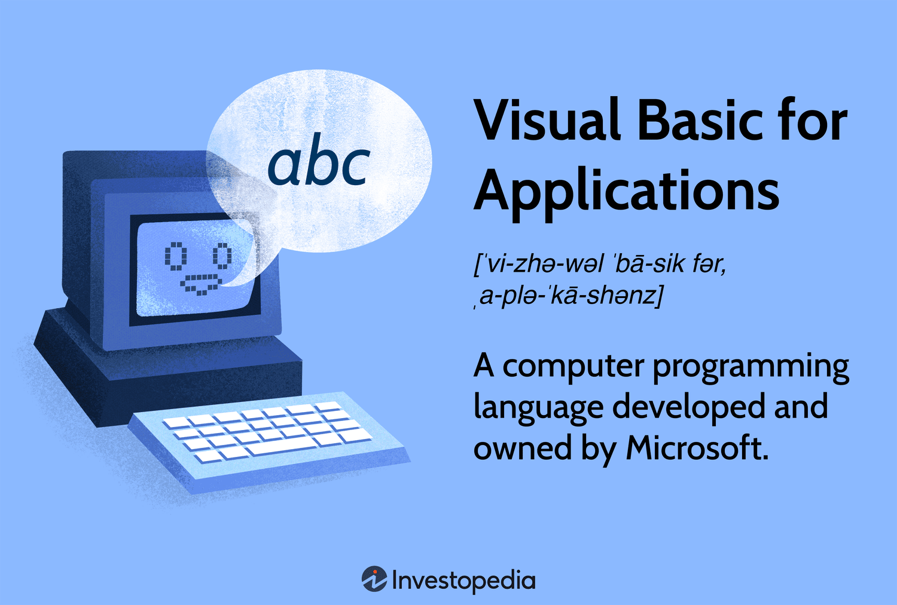

In the digital era, Application Programming Interfaces (APIs) have revolutionized the way software communicates, dramatically enhancing the efficiency and scope of interactions between disparate technological systems. At their core, APIs are designed to make it easier and more seamless for applications to request and exchange information. This fundamental capability has expanded the possibilities in various sectors, notably in the financial industry where APIs have become instrumental in transforming algorithmic trading.

APIs are particularly indispensable in algorithmic trading, a domain where speed, precision, and the ability to process vast amounts of data in real time are crucial to success. Algorithmic trading involves the use of complex algorithms to automate trading strategies, execute trades at optimal prices, and manage market risks. Given the need for rapid, accurate data retrieval, and swift order executions, APIs provide the indispensable bridge between sophisticated trading algorithms and the financial markets.



The utility of APIs in algorithmic trading is multifaceted. APIs provide access to real-time market data, which allows traders to make informed, data-driven decisions and to capitalize on market trends as they emerge. Furthermore, they facilitate direct interaction with broker platforms, enabling the instantaneous placement, modification, or cancellation of orders. This automated interaction ensures that trading strategies can be executed with minimal latency, a critical factor in maintaining a competitive edge in the fast-paced trading environment.

This article will explore various types of APIs, demonstrating their distinct functionalities and how they integrate into trading scenarios. We will highlight specific API examples from leading brokers and platforms, clarifying their practical applications and benefits. Such insights aim to present a comprehensive understanding of how APIs power modern trading operations, optimize performance, and provide robust tools for traders seeking to harness the full potential of algorithmic trading.

## Table of Contents

## Understanding APIs and Their Importance

An Application Programming Interface (API) serves as a crucial intermediary, enabling different software applications to communicate and interact with each other effectively. By defining a set of rules and protocols, APIs allow developers to access specific functionalities and data of another application without requiring them to understand its internal mechanics. This capability is pivotal in creating interconnected software environments where efficiency and interoperability are paramount.

APIs are designed to simplify software development and innovation by allowing developers to harness existing solutions, thereby reducing the need for redundant work. Through APIs, software components can interact seamlessly, facilitating a collaborative digital ecosystem. This interaction could involve accessing a web service to retrieve information, updating a database, or integrating various applications to create more complex systems.

In finance and trading, APIs play an indispensable role by supporting algorithm-driven trading strategies. The high-speed nature of trading necessitates real-time data access, and APIs fulfill this requirement by providing timely and accurate market data. This capability is essential for traders to make informed decisions promptly. For instance, trading APIs offer crucial functionalities like fetching current stock prices, account balances, or historical data, all critical for executing precise trades.

Moreover, APIs are instrumental in executing trades automatically. They allow trading systems to send orders directly to the market, bypassing human intervention. This automation is key in deploying high-frequency trading ([HFT](/wiki/high-frequency-trading-strategies)) strategies where speed and responsiveness to market changes are critical. By enabling direct interaction with broker platforms, APIs facilitate order placements, modifications, and cancellations with precision and minimal delay.

The benefits of APIs extend to scalability and flexibility in trading operations. Traders and developers can build custom applications tailored to specific trading requirements without starting from scratch. APIs provide the backbone for these applications, offering essential building blocks that can be combined in innovative ways to enhance trading performance.

In summary, APIs not only streamline the communication between disparate software systems but also drive the functionality needed for sophisticated trading strategies in financial markets. By providing real-time data access and supporting trade execution, APIs are fundamental to the modern trading landscape, empowering traders with tools to optimize their strategies and performance.

## Types of APIs

Application Programming Interfaces (APIs) are essential tools in modern software development, enabling seamless interaction between different software systems. In the trading sector, APIs facilitate [algorithmic trading](/wiki/algorithmic-trading) by allowing programs to communicate efficiently with trading platforms. Various types of APIs cater to these needs, each with its unique features and applications.

### RESTful APIs

RESTful APIs are built on the representational state transfer (REST) architectural style, leveraging HTTP requests to access and manipulate resources. They are widely favored for their simplicity, statelessness, and compatibility with web technologies. In a RESTful API, the standard HTTP methods—GET, POST, PUT, DELETE—are used to perform operations on resources, typically represented in JSON or XML formats. For instance, a GET request could retrieve the latest market prices, while a POST request might be used to place a trade order. Their straightforward nature makes RESTful APIs ideal for applications requiring a stable and scalable communication framework, such as retrieving historical stock data or performing transactional operations.

### WebSocket APIs

WebSocket APIs offer a real-time, full-duplex communication channel over a single, long-lived connection, making them particularly suited for applications requiring immediate data exchange. Unlike RESTful APIs, which follow a request-response model, WebSocket APIs enable the server to push updates to the client as soon as new data is available—crucial for high-frequency trading applications where timely market information is vital. The persistent connection provided by WebSocket APIs minimizes latency, ensuring that traders receive the latest market data and can respond instantly, thereby executing trades at optimal prices.

### FIX Protocol

The Financial Information Exchange (FIX) Protocol is an API standard specifically designed for real-time exchange of securities transactions. It is predominantly used in institutional trading environments due to its robustness and comprehensive feature set tailored for complex trading activities. FIX Protocol supports a wide array of financial instruments and encompasses everything from pre-trade to post-trade processes. Its message-oriented architecture allows for the seamless exchange of data including trade orders, confirmations, and market data, making it indispensable for institutional traders who require precise and reliable transaction capabilities. The protocol's flexibility and extensive adoption make it a cornerstone in the infrastructure of international financial markets.

In summary, the choice between RESTful, WebSocket, and FIX Protocol APIs depends greatly on the specific requirements of the trading strategy and the technology infrastructure in place. Each API type offers distinct advantages that, when leveraged properly, can significantly enhance trading performance and decision-making capabilities.

## The Role of APIs in Algo Trading

APIs serve as an essential conduit between trading algorithms and market platforms, streamlining the execution of automated trading strategies. Through APIs, traders gain access to real-time market data, empowering them to make informed and timely decisions that are essential for success in fast-moving financial markets. The potency of an API lies in its ability to deliver up-to-the-minute information on stock prices, currency pairs, or any other tradable assets. This real-time data is critical as it allows traders to adjust their strategies on the fly, optimizing their positions based on the latest available information.

Furthermore, APIs facilitate seamless connectivity with broker platforms, an integral feature for automating the entire trading process. This integration enables traders to place orders directly, modify existing orders, and manage portfolios effectively without manual intervention. For instance, using an API, a trading algorithm can automatically place a buy order when a predetermined condition is met, such as a moving average crossover, and subsequently set a stop-loss to manage risk. This level of automation is crucial for executing complex and multifaceted trading strategies that rely on speed and precision.

The flexibility provided by APIs also allows traders to customize their trading environments, tailoring their strategies to specific market conditions. By integrating algorithms with broker APIs, traders can implement sophisticated strategies that leverage real-time data and analytics. The use of APIs reduces latency in order execution, minimizes human error, and allows for the rapid adjustment of trading tactics, all of which contribute to enhanced trading performance.

Ultimately, APIs are pivotal in the landscape of algorithmic trading, providing a robust framework for executing trades swiftly and efficiently. Their ability to integrate with market platforms and deliver instantaneous data makes them indispensable tools for traders seeking competitive advantages in the dynamic world of financial markets.

## Popular Broker APIs for Trading

In the rapidly evolving world of algorithmic trading, APIs provided by brokers are crucial for traders seeking to exploit market opportunities efficiently. Among the plethora of available broker APIs, several stand out due to their popularity and reliability.

**Zerodha Kite API** is a prominent choice among traders in India, recognized for its user-friendly interface and versatility. Zerodha, one of India's leading stockbrokers, offers the Kite Connect API, which facilitates seamless integration for algorithmic trading. The API provides access to market data, order management, and historical data retrieval, making it ideal for deploying advanced trading strategies. It supports various programming languages such as Python, Java, and Node.js, which allows developers to code their trading algorithms with ease. Kite Connect ensures real-time access to data, crucial for high-frequency trading scenarios, and includes comprehensive documentation to streamline the development process.

**Interactive Brokers API** is another highly regarded option, particularly in institutional circles. It supports a wide range of asset classes, including stocks, bonds, futures, and forex, making it a versatile platform for global trading operations. The API suite includes options for both synchronous and asynchronous data handling, ensuring flexible integration into existing systems. Interactive Brokers offers a powerful array of functionalities including market data interfaces, risk management tools, and order entry, which are critical for both retail and institutional traders. With support for Java, C++, Python, and several other programming languages, this API caters to a wide range of technical requirements, thus being a preferred choice for traders seeking robustness and depth in their trading infrastructure.

Lastly, the **Binance API** caters specifically to the burgeoning field of [cryptocurrency](/wiki/cryptocurrency) trading. Given the dynamic and volatile nature of the cryptocurrency markets, the API provides both REST and WebSocket interfaces, enabling traders to execute trades and receive live market data with low latency. The API supports a comprehensive suite of functionalities including obtaining market depth, historical trade data, and account management utilities. For developers, Binance offers extensive documentation complemented by community support forums, ensuring that even those new to cryptocurrency trading can build efficient trading systems. Python is frequently used with the Binance API, thanks to libraries like `python-binance`, which simplify many API interactions.

Each of these broker APIs presents a unique set of characteristics suited to different trading environments. Regardless of the market or asset class, when employed effectively, these APIs empower traders to implement sophisticated trading strategies tailored to their specific needs.

## How to Start Trading with APIs

To start trading with APIs, a systematic approach is necessary to ensure smooth integration and operational success. The initial step involves registering with an API provider to receive API keys, which are essential for authenticating and authorizing access to the API's functionalities. These keys function as unique identifiers, ensuring that only authorized applications can communicate with the API.

The next critical step is selecting a programming language to develop your API-driven trading application. Python and Java are widely recommended due to their robust libraries and community support. Python, in particular, is favored for its simplicity and efficiency in handling data operations, making it ideal for the rapid development of trading algorithms.

Once you have your API keys and selected programming language, the integration process begins. This involves incorporating the API into your trading system to access market data, execute trades, and manage transactions. To illustrate, here's a simple example of how you can use Python to connect to a trading API, fetch market data, and place trades:

```python
import requests

# Define your API key and endpoint
api_key = 'YOUR_API_KEY'
base_url = 'https://api.example.com'

# Function to authenticate and request data
def get_market_data(symbol):
    headers = {'Authorization': f'Bearer {api_key}'}
    endpoint = f'{base_url}/market-data/{symbol}'
    response = requests.get(endpoint, headers=headers)
    return response.json()

# Example usage
symbol = 'BTCUSD'
market_data = get_market_data(symbol)
print(market_data)

# Function to place a trade
def place_trade(symbol, quantity, side):
    headers = {
        'Authorization': f'Bearer {api_key}',
        'Content-Type': 'application/json'
    }
    data = {
        'symbol': symbol,
        'qty': quantity,
        'side': side  # 'buy' or 'sell'
    }
    endpoint = f'{base_url}/orders'
    response = requests.post(endpoint, headers=headers, json=data)
    return response.json()

# Example trade execution
trade_response = place_trade('BTCUSD', 0.1, 'buy')
print(trade_response)
```

In this code snippet, the `get_market_data` function requests real-time market data for a specified symbol, while the `place_trade` function executes a trade by specifying the symbol, quantity, and side (buy or sell). 

Integrating APIs is not simply about connecting to them. It requires handling responses efficiently, managing potential errors, and ensuring security best practices are followed, such as securing your API keys and using encrypted connections. These steps ensure a reliable trading system capable of executing real-time decisions based on market conditions.

## Examples of API Usage in Trading

Using the Binance API with Python to fetch the latest Bitcoin price is a practical example of utilizing APIs in trading to access real-time market data. This process begins by setting up API keys through Binance’s platform, which are essential for authentication and authorization. Python, a versatile programming language, is commonly used for such tasks due to its extensive library support and ease of use.

To initiate this process, developers first need to install the `python-binance` library, which provides a comprehensive interface for interacting with Binance’s API:

```bash
pip install python-binance
```

Once the library is installed, developers can use the following Python code snippet to fetch the latest Bitcoin (BTC) price:

```python
from binance.client import Client

# Replace 'your_api_key' and 'your_api_secret' with your actual Binance API key and secret
api_key = 'your_api_key'
api_secret = 'your_api_secret'

client = Client(api_key, api_secret)

# Get the latest price of Bitcoin
btc_price = client.get_symbol_ticker(symbol="BTCUSDT")
print(f"The latest BTC price is: {btc_price['price']}")
```

This code establishes a connection to Binance’s server and retrieves the current trading price of Bitcoin against USDT (Tether), exemplifying how API usage can streamline data acquisition processes essential for developing trading strategies.

APIs do more than simply providing market data; they are critical in the development of custom trading strategies. By offering access to essential market and account data, APIs permit traders to implement sophisticated algorithms that assess market conditions and make informed decisions. This access is foundational for creating automated systems that can manage trades based on pre-set criteria.

Detailed examples of API usage also focus on placing orders and implementing trading logic. For instance, to place a market buy order for Bitcoin, one can extend the previous example as follows:

```python
# Place a market order to buy 0.01 BTC
order = client.order_market_buy(
    symbol="BTCUSDT",
    quantity=0.01
)

print(f"Order result: {order}")
```

In practice, this demonstrates how APIs allow traders to translate trading strategies into executable code that can perform actions such as order placements. The integration of APIs enables conditions and logic checks that alter trading behavior dynamically, supporting strategies such as stop-loss orders, limit orders, and more complex algorithmic trading patterns.

Challenges in using APIs include ensuring data security and handling connection errors gracefully. To combat these issues, developers often implement error handling routines and secure data transmission protocols. This ensures that trading activities continue smoothly without undue interruptions when connection issues arise.

By leveraging APIs, traders can construct robust, efficient trading systems capable of operating around the clock, maximizing their engagement in the fast-paced world of trading. These systems significantly enhance efficiency in executing high-frequency trading strategies and managing large volumes of transactions.

APIs serve as vital tools for traders, allowing for the realization of bespoke trading strategies and efficient, informed decision-making.

## Challenges and Considerations in Using Trading APIs

While the integration of Application Programming Interfaces (APIs) in algorithmic trading presents numerous advantages, it is not without its set of challenges and considerations that traders must address to maximize efficiency and security.

One significant challenge is potential downtime. Market APIs can experience interruptions that temporarily disconnect traders from real-time market data and trading operations. This downtime can disrupt trading algorithms, leading to missed opportunities or unintended trades. To mitigate this risk, traders often implement fail-safes and backup systems, ensuring continuity in trading activities during API outages.

Data security is another crucial concern. APIs, by their nature, involve the transmission of sensitive data, including financial transactions and proprietary trading algorithms. The use of secure communication protocols, such as HTTPS for RESTful APIs or encryption mechanisms like TLS/SSL, is essential to protect data from unauthorized access and cyber threats. Moreover, API providers may enforce additional security measures such as token-based authentication and IP whitelisting to enhance security.

The initial complexity of setting up APIs can deter some traders, particularly those without a technical background. Configuring APIs requires knowledge of programming and understanding the specific requirements of the trading platform and the API. This initial learning curve demands an investment of time and resources but is crucial for the successful implementation and use of APIs in trading strategies.

Costs associated with using APIs also warrant careful consideration. While some APIs are freely accessible, others may involve subscription fees or usage charges based on the [volume](/wiki/volume-trading-strategy) of data transmission or the frequency of API calls. Additionally, limitations in functionality, such as restrictions on the number of API requests per minute or limited access to certain market data, can impact trading strategies. Traders must evaluate these factors to determine the most cost-effective and suitable API for their needs.

To harness the full potential of trading APIs, investment in learning their use and development is paramount. Traders proficient in utilizing APIs can craft more sophisticated and responsive trading systems. Programming skills, particularly in languages like Python or Java, enable traders to customize API usage, optimize trading algorithms, and automate processes. By mastering these capabilities, traders can significantly enhance their trading efficiency and effectiveness, positioning themselves to capitalize on market opportunities more adeptly.

## Conclusion

APIs are foundational components of modern algorithmic trading, providing the critical link between trading strategies and market platforms. They facilitate seamless integration by enabling automated access to real-time market data, order execution, and account management, essential for executing complex algorithms efficiently. By doing so, they help traders achieve precision and speed that manual trading cannot match.

When properly implemented, APIs can support robust, scalable, and efficient trading operations. This robustness comes from the ability to execute high-frequency trades and adapt quickly to market changes, thus optimizing trading performance. The power of APIs lies in their capacity to handle large volumes of transactions with minimal latency, ensuring that traders can capitalize on even the smallest market fluctuations.

As API technology continues to advance, it promises to further transform the trading landscape. Emerging technologies like [artificial intelligence](/wiki/ai-artificial-intelligence) and [machine learning](/wiki/machine-learning) are becoming increasingly integrated with APIs, enhancing their capabilities and offering greater efficiencies. For instance, predictive analytics through machine learning can be combined with APIs to anticipate market movements, providing traders with a strategic edge.

Moreover, advancements in security protocols within APIs will address data privacy concerns, making them more secure for financial applications. The ongoing evolution of API technology is expected to unlock new opportunities, enabling more sophisticated trading strategies and attracting a broader range of participants to algorithmic trading. As such, staying abreast of these developments will be crucial for traders aiming to leverage the full potential of APIs in the future.

## References & Further Reading

[1]: Banga, A. (2021). ["Python for Finance Cookbook: Over 50 recipes for applying modern Python libraries to financial data analysis"](https://play.google.com/store/books/details/Python_for_Finance_Cookbook_Over_50_recipes_for_ap?id=O0fODwAAQBAJ&hl=en-US). Packt Publishing.

[2]: Lopez de Prado, M. (2018). ["Advances in Financial Machine Learning"](https://www.amazon.com/Advances-Financial-Machine-Learning-Marcos/dp/1119482089). Wiley.

[3]: Chan, E. (2008). ["Quantitative Trading: How to Build Your Own Algorithmic Trading Business"](https://github.com/ftvision/quant_trading_echan_book). John Wiley & Sons.

[4]: Jansen, S. (2020). ["Machine Learning for Algorithmic Trading"](https://github.com/stefan-jansen/machine-learning-for-trading). Packt Publishing.

[5]: Aronson, D. (2007). ["Evidence-Based Technical Analysis: Applying the Scientific Method and Statistical Inference to Trading Signals"](https://www.amazon.com/Evidence-Based-Technical-Analysis-Scientific-Statistical/dp/0470008741). Wiley.