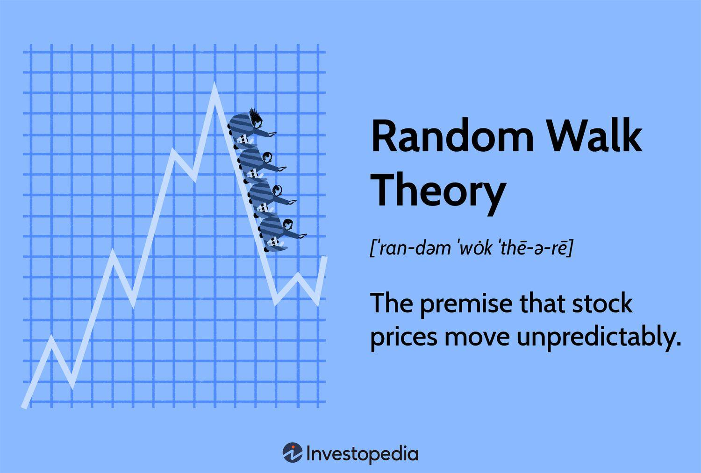

## Table of Contents

## What is the Random Walk Theory?

The Random Walk Theory is an idea in finance that says stock prices move randomly and are not predictable. It means that past movements or trends in stock prices cannot be used to predict what will happen next. According to this theory, trying to beat the market by picking individual stocks is a waste of time because the market is already reflecting all available information.

This theory is important because it supports the idea of the Efficient Market Hypothesis, which says that it's hard to consistently do better than the market average. If stock prices really do move randomly, then it makes sense to invest in a broad market index instead of trying to pick specific stocks. This way, you spread out your risk and don't rely on guessing which stocks will go up or down.

## How does the Random Walk Theory apply to stock prices?

The Random Walk Theory says that stock prices move in a random way and you can't predict them. It means that what happened to a stock price in the past doesn't help you know what will happen next. So, if a stock went up yesterday, it doesn't mean it will go up again today. This idea makes it hard to guess which stocks will do well in the future just by looking at old prices.

Because of this, the Random Walk Theory supports the idea that the stock market is efficient. This means that all the information people know about a company is already included in the stock's price. If you can't predict stock prices, then trying to pick certain stocks to beat the market is a tough game. Instead, many people think it's better to invest in a bunch of different stocks, like in an index fund, to spread out the risk and not rely on guessing which stocks will go up or down.

## Can you explain the difference between a random walk and a predictable trend in stock markets?

A random walk in the stock market means that stock prices move up and down in a way that you can't predict. Imagine you're walking and each step you take is in a random direction. That's what stock prices do if they follow a random walk. They don't follow any pattern or trend from the past, so knowing what happened yesterday doesn't help you guess what will happen tomorrow. This idea makes it hard to pick stocks that will do better than the market because the next move is a surprise.

On the other hand, a predictable trend in stock markets means that prices move in a way that you can see a pattern or direction over time. If a stock has been going up for a while, you might think it will keep going up. People who believe in trends look at past prices and other information to try to guess what will happen next. They think they can find patterns that will help them pick stocks that will do well in the future.

The big difference is that with a random walk, past prices don't help you predict the future, but with a predictable trend, people think they can use past data to make good guesses about what will happen next. This is why some people try to beat the market by finding trends, while others believe in the random walk and just invest in a broad range of stocks to spread out their risk.

## What are the basic assumptions of the Random Walk Theory in the context of investing?

The Random Walk Theory in investing assumes that stock prices move randomly and cannot be predicted based on past performance. This means that if a stock went up yesterday, it doesn't tell you anything about whether it will go up or down today. The theory suggests that all the information that people know about a company is already included in the stock's price. So, trying to guess which stocks will do better than others by looking at past prices is a waste of time because the next move in price is a surprise.

Because of these assumptions, the Random Walk Theory supports the idea that the stock market is efficient. This means that it's hard to consistently pick stocks that will beat the market. If stock prices really do move randomly, then it makes more sense to invest in a broad range of stocks, like in an index fund, instead of trying to pick individual stocks. This way, you spread out your risk and don't rely on guessing which stocks will go up or down.

## How does the Efficient Market Hypothesis relate to the Random Walk Theory?

The Efficient Market Hypothesis (EMH) and the Random Walk Theory are closely related ideas in finance. The Efficient Market Hypothesis says that stock prices always show all the information that people know about a company. This means that if something new happens, like a company doing better than expected, the stock price will change right away to show that new information. Because of this, it's hard to find stocks that are priced wrong and make money by buying them before other people do.

The Random Walk Theory fits well with the Efficient Market Hypothesis. It says that stock prices move in a random way and you can't predict them based on what happened before. If stock prices really do move randomly, it supports the idea that the market is efficient. This is because if prices were easy to predict, people would buy and sell stocks to make money, and that would make the prices change until they showed all the information people know. So, both theories suggest that trying to pick stocks to beat the market is tough, and it might be better to just invest in a broad range of stocks to spread out your risk.

## What evidence supports the Random Walk Theory in financial markets?

Evidence for the Random Walk Theory in financial markets comes from looking at how stock prices move over time. Many studies have shown that stock prices do not follow clear patterns that you can use to predict what will happen next. For example, researchers have looked at stock prices over many years and found that the changes in price from one day to the next seem to be random. This means that if a stock goes up one day, it's just as likely to go up or down the next day, and you can't guess which it will be just by looking at past prices.

Another piece of evidence comes from how hard it is for professional investors to beat the market. If stock prices followed predictable trends, then people who study the market a lot should be able to pick stocks that do better than average. But many studies show that most professional investors, even those who are very smart and experienced, don't do much better than the market as a whole over long periods of time. This suggests that stock prices move randomly, making it tough to guess which stocks will do well in the future.

## How can investors use the Random Walk Theory to develop investment strategies?

Investors can use the Random Walk Theory to develop strategies by understanding that trying to predict stock prices based on past movements is not likely to work. Instead of [picking](/wiki/asset-class-picking) individual stocks that they think will go up, investors might choose to invest in a broad range of stocks, like an index fund. An index fund includes many different stocks and follows the overall market. This way, investors spread out their risk because they're not betting on just one or a few stocks. They're betting on the whole market, which is less risky over time because the ups and downs of individual stocks balance out.

Another way investors can use the Random Walk Theory is by focusing on long-term investing rather than trying to time the market. If stock prices move randomly, trying to buy and sell stocks quickly to make money is risky and hard to do well. Instead, investors can put their money into the market for the long term, knowing that over many years, the market tends to go up. This approach is less stressful and can lead to better results because it avoids the mistakes that come from trying to guess short-term price movements.

## What are the criticisms and limitations of the Random Walk Theory in investing?

Some people don't agree with the Random Walk Theory because they think you can predict stock prices by looking at patterns or other information. They say that if you study the market a lot, you can find stocks that will do better than others. For example, some investors use technical analysis, which means looking at past price charts to find patterns that might help them guess what will happen next. Others use [fundamental analysis](/wiki/fundamental-analysis), which means looking at a company's financial health and other details to decide if its stock is a good buy. These people believe that the market isn't always efficient and that you can find stocks that are priced wrong and make money from them.

Another problem with the Random Walk Theory is that it doesn't explain why some investors do better than others over time. If stock prices really move randomly, then everyone should do about the same in the market. But we see that some investors, like Warren Buffett, have done much better than average for many years. This suggests that maybe the market isn't as random as the theory says. Also, the theory doesn't take into account things like big news events or changes in the economy that can make stock prices move in ways that aren't random. So, while the Random Walk Theory can be useful for some investors, it doesn't explain everything about how the stock market works.

## Can the Random Walk Theory be tested empirically? If so, how?

Yes, the Random Walk Theory can be tested empirically by looking at how stock prices move over time. Researchers do this by studying long periods of stock price data to see if the changes in price from one day to the next are random. They use statistical tests to check if past price movements can help predict future movements. If stock prices really move randomly, then these tests should show that knowing what happened yesterday doesn't help you guess what will happen tomorrow. Many studies have done this and found that stock prices do seem to move in a random way, which supports the Random Walk Theory.

Another way to test the Random Walk Theory is by looking at how well professional investors do. If stock prices follow a random walk, then it should be hard for even the smartest and most experienced investors to pick stocks that do better than the market average. Researchers look at the performance of mutual funds and other investment managers over many years. They find that most professional investors don't do much better than the market as a whole, which suggests that stock prices might move randomly. However, some investors do beat the market, which shows that the theory might not explain everything about how the stock market works.

## How do technical analysis and the Random Walk Theory conflict, and can they coexist?

Technical analysis and the Random Walk Theory have different ideas about how stock prices move. Technical analysis says that you can look at past price charts and find patterns that help you guess what will happen next. People who use technical analysis believe that if a stock has been going up, it might keep going up, and they use this to decide when to buy or sell stocks. On the other hand, the Random Walk Theory says that stock prices move randomly and you can't predict them based on what happened before. If stock prices really move randomly, then looking at past prices won't help you guess what will happen tomorrow.

Even though they seem to disagree, technical analysis and the Random Walk Theory can still coexist in the world of investing. Some investors might use technical analysis because they believe they can find patterns that others miss, while others might follow the Random Walk Theory and invest in a broad range of stocks to spread out their risk. Both approaches can be useful depending on what an investor believes about the market. The key is to understand that the Random Walk Theory suggests that the market is hard to beat, but it doesn't mean that no one can ever find ways to do better than average.

## What advanced statistical methods are used to analyze the Random Walk Theory in financial markets?

Advanced statistical methods help researchers test the Random Walk Theory by looking at how stock prices move over time. One common method is called autocorrelation analysis. This method checks if the changes in stock prices from one day to the next are related to each other. If stock prices follow a random walk, the autocorrelation should be close to zero, meaning that knowing what happened yesterday doesn't help you guess what will happen tomorrow. Researchers also use variance ratio tests to see if the changes in stock prices over short periods are the same as over longer periods. If prices move randomly, these changes should be similar, and the test helps confirm if that's true.

Another method is the runs test, which counts how often stock prices go up or down in a row. If prices move randomly, the number of runs (sequences of ups or downs) should be what you'd expect by chance. This helps see if there are patterns in how prices move. Also, researchers use regression analysis to check if past prices can predict future prices. If the Random Walk Theory is right, past prices shouldn't help much with predicting the future. These advanced methods give a detailed look at how stock prices behave and help decide if the Random Walk Theory fits what we see in the market.

## How have modern financial models evolved from or beyond the Random Walk Theory?

Modern financial models have evolved from the Random Walk Theory by trying to explain more about how stock prices move. The Random Walk Theory says that stock prices move randomly and you can't predict them based on past prices. But some modern models, like the ones that use behavioral finance, say that people's feelings and mistakes can make stock prices move in ways that aren't random. These models look at how people might overreact to news or follow what others are doing, which can create patterns in stock prices that you can predict. This means that while the Random Walk Theory is still important, these new models try to explain more about why stock prices move the way they do.

Another way modern financial models have gone beyond the Random Walk Theory is by using more advanced math and computer programs. For example, some models use [machine learning](/wiki/machine-learning) to look at a lot of data and find patterns that might help predict stock prices. These models can look at not just past prices, but also things like news articles, social media posts, and economic reports to guess what might happen next. While the Random Walk Theory says that all this information is already in the stock price, these new models think that by looking at more data in new ways, you might be able to find ways to do better than the market. So, while the Random Walk Theory is still a big idea in finance, modern models are trying to find new ways to understand and predict how stock prices move.

## What is the Random Walk Theory and how can it be understood?

The Random Walk Theory posits that stock price movements are inherently unpredictable, suggesting that they follow a random path devoid of any discernible patterns. Developed by economist Eugene Fama during the mid-20th century, the theory suggests that consistent outperformance of the market through strategies like stock picking or market timing is improbable. This notion is fundamentally linked to the Efficient Market Hypothesis (EMH), which argues that all available information is already reflected in stock prices, rendering any attempt to exploit information predictively futile.

The Random Walk Theory operates on the assumption that stock prices evolve according to a stochastic process, primarily a "random walk", which can be mathematically expressed as:

$$

P_{t+1} = P_t + \epsilon_{t+1} 
$$

where $P_{t+1}$ is the future price, $P_t$ is the current price, and $\epsilon_{t+1}$ represents a random error term following a normal distribution with a mean of zero.

Critics of the Random Walk Theory, however, argue that it neglects the potential for patterns or informed trading that may arise from investor behavior or market anomalies. They contend that certain investors or institutional entities possess the ability to glean insights from available data, thus enabling them to identify lucrative trading opportunities that the theory ostensibly dismisses as nonexistent.

Nonetheless, despite the debate, the Random Walk Theory endures as a pivotal concept within financial economics owing to its impact on investment approaches and strategy formulation. For individual investors, the implications of the theory suggest a need for diversification, as attempting to 'beat' the market may yield little reward on average. Institutional investors, on the other hand, may focus on developing sophisticated quantitative models to navigate the complex interplay between randomness and market efficiency.

Understanding the Random Walk Theory encourages investors to evaluate their strategies critically, taking into account the unpredictable nature of stock price movements and maintaining realistic expectations about the potential for market outperformance.

## References & Further Reading

[1]: Malkiel, B. G. (1999). ["A Random Walk Down Wall Street: The Time-Tested Strategy for Successful Investing"](https://www.tandfonline.com/doi/full/10.1080/14697688.2016.1256598). W. W. Norton & Company.

[2]: Fama, E. F. (1970). ["Efficient Capital Markets: A Review of Theory and Empirical Work."](https://onlinelibrary.wiley.com/doi/abs/10.1111/j.1540-6261.1970.tb00518.x) Journal of Finance, 25(2), 383-417.

[3]: Chincarini, L. B., & Kim, D. (2006). ["Quantitative Equity Portfolio Management: An Active Approach to Portfolio Construction and Management"](https://archive.org/details/quantitativeequi0000chin). McGraw-Hill.

[4]: Cartea, Á., Jaimungal, S., & Penalty, J. (2015). ["Algorithmic and High-Frequency Trading."](https://assets.cambridge.org/97811070/91146/frontmatter/9781107091146_frontmatter.pdf) Cambridge University Press.

[5]: Chan, E. P. (2009). ["Quantitative Trading: How to Build Your Own Algorithmic Trading Business"](https://github.com/ftvision/quant_trading_echan_book). John Wiley & Sons.

[6]: Jansen, S. (2018). ["Machine Learning for Algorithmic Trading - Second Edition."](https://github.com/stefan-jansen/machine-learning-for-trading) Packt Publishing.

[7]: Lo, A. W., Mamaysky, H., & Wang, J. (2000). ["Foundations of Technical Analysis: Computational Algorithms, Statistical Inference, and Empirical Implementation."](https://www.nber.org/papers/w7613) The Journal of Finance, 55(4), 1705-1765.