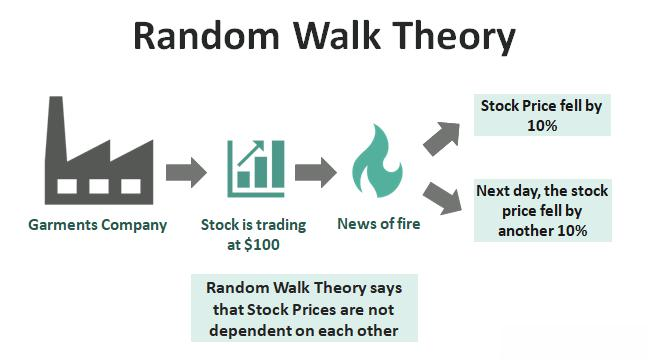

In the rapidly evolving world of finance, the dynamics between investing and algorithmic trading are becoming increasingly important. Investors and traders are continually seeking tools and theories to predict market movements and optimize returns. The Random Walk Theory offers a distinctive lens through which to view stock price behaviors, asserting that these movements are essentially unpredictable. This concept challenges traditional investment strategies that rely on market timing or stock picking, suggesting instead that all available information is already embedded in stock prices.

This article examines the complexities of the Random Walk Theory and its influence on algorithmic trading practices. As technological advancements proliferate, algorithmic trading has emerged as a sophisticated method to execute trades with unprecedented speed and precision. It processes massive datasets to identify patterns and opportunities that might be overlooked by human analysis. By merging the traditional insights of the Random Walk Theory with modern algorithmic approaches, investors can potentially achieve superior trading strategies and returns.



We will explore how these concepts can be utilized to enhance trading results, providing a framework for understanding the delicate balance between market predictability and randomness. Join us in this exploration as we tackle the intricate puzzle presented by contemporary finance, navigating the fine line between chaos and order in the quest for more informed and lucrative investment strategies.

## Table of Contents

## Understanding the Random Walk Theory

The Random Walk Theory posits that stock price movements are inherently unpredictable, suggesting that they follow a random path devoid of any discernible patterns. Developed by economist Eugene Fama during the mid-20th century, the theory suggests that consistent outperformance of the market through strategies like stock picking or market timing is improbable. This notion is fundamentally linked to the Efficient Market Hypothesis (EMH), which argues that all available information is already reflected in stock prices, rendering any attempt to exploit information predictively futile.

The Random Walk Theory operates on the assumption that stock prices evolve according to a stochastic process, primarily a "random walk", which can be mathematically expressed as:

$$

P_{t+1} = P_t + \epsilon_{t+1} 
$$

where $P_{t+1}$ is the future price, $P_t$ is the current price, and $\epsilon_{t+1}$ represents a random error term following a normal distribution with a mean of zero.

Critics of the Random Walk Theory, however, argue that it neglects the potential for patterns or informed trading that may arise from investor behavior or market anomalies. They contend that certain investors or institutional entities possess the ability to glean insights from available data, thus enabling them to identify lucrative trading opportunities that the theory ostensibly dismisses as nonexistent.

Nonetheless, despite the debate, the Random Walk Theory endures as a pivotal concept within financial economics owing to its impact on investment approaches and strategy formulation. For individual investors, the implications of the theory suggest a need for diversification, as attempting to 'beat' the market may yield little reward on average. Institutional investors, on the other hand, may focus on developing sophisticated quantitative models to navigate the complex interplay between randomness and market efficiency.

Understanding the Random Walk Theory encourages investors to evaluate their strategies critically, taking into account the unpredictable nature of stock price movements and maintaining realistic expectations about the potential for market outperformance.

## Algorithmic Trading: An Overview

Algorithmic trading refers to the use of computer algorithms to automate trading decisions based on pre-defined criteria. This approach harnesses the capabilities of advanced technology, allowing for execution speeds and trading frequencies that surpass human capabilities. 

At its core, [algorithmic trading](/wiki/algorithmic-trading) involves leveraging algorithms to analyze market conditions and execute trades. These algorithms can deploy a variety of strategies, such as [arbitrage](/wiki/arbitrage), where discrepancies in prices across markets are exploited for profit, or [market making](/wiki/market-making), which involves providing [liquidity](/wiki/liquidity-risk-premium) to markets by simultaneously buying and selling a specific asset. Algorithms can also follow trends, using statistical methods to identify and capitalize on market trends, or perform [statistical arbitrage](/wiki/statistical-arbitrage) by identifying price inefficiencies between related financial instruments.

The automation inherent in algorithmic trading provides traders with several benefits. It reduces the likelihood of human error, ensures trades are executed at optimal prices, and mitigates the impact of emotional decision-making. However, it also presents potential risks. Technical malfunctions, coding errors, and over-optimization can lead to substantial financial losses. For instance, a poorly configured algorithm might trigger unintended trades, exacerbating [volatility](/wiki/volatility-trading-strategies) or causing flash crashes.

Given its substantial presence in modern financial markets, algorithmic trading raises important questions about market efficiency and ethical responsibilities. On one hand, it can enhance market liquidity and efficiency by narrowing bid-ask spreads and ensuring swift execution. On the other hand, it can exacerbate market volatility and create barriers to entry for traditional traders who lack access to advanced technology.

For investors engaging in algorithmic trading, understanding the logic embedded in algorithms is crucial. It is vital to evaluate the design, backtest strategies against historical data, and ensure robust risk management measures are in place. As trading environments continually evolve, maintaining an adaptable and well-informed approach to algorithmic trading is a key consideration for market participants.

## The Intersection of Random Walk Theory and Algorithmic Trading

The Random Walk Theory, which suggests that stock prices follow a random path, poses an interesting challenge to algorithmic traders who focus on identifying patterns or anomalies. Despite the inherent randomness proposed by the theory, algorithmic trading operates on the notion that even seemingly unpredictable markets possess exploitative opportunities within their data structures.

Sophisticated algorithms, often employing [machine learning](/wiki/machine-learning) techniques and statistical analysis, are instrumental in uncovering market inefficiencies. By analyzing vast datasets, these algorithms are capable of detecting subtle trends that may not be immediately visible in the price movements. For instance, high-frequency trading algorithms might leverage minuscule price discrepancies that occur over fractions of a second to turn a profit, challenging the core premises of the Random Walk Theory.

The influence of the Random Walk Theory is evident in the strategic approaches employed by algorithmic traders. While the theory advocates for market unpredictability, it also serves as a critical parameter in developing algorithmic strategies with realistic expectations. Traders must acknowledge that complete market predictability is impossible; thus, algorithms are crafted with probabilistic models that accommodate uncertainty.

To illustrate the interplay between algorithmic trading and the Random Walk Theory, consider studies where algorithmic trading has both supported and refuted aspects of the theory. One notable case involves algorithms designed to exploit [momentum](/wiki/momentum) in stock prices. While traditional interpretations of the Random Walk would dismiss momentum as random noise, algorithmic models have successfully identified momentum as a reliable indicator under specific market conditions. Conversely, some algorithmic failures underscore the randomness by suffering losses when expected patterns did not materialize.

Understanding this intersection is key for traders aiming to design algorithms that are both innovative and aligned with market realities. By appreciating the constraints imposed by the Random Walk Theory, traders can create robust algorithms that recognize randomness yet adapt to exploit systematic inefficiencies where they exist. Ultimately, the integration of these concepts not only enriches algorithmic trading methodologies but also fosters a deeper comprehension of market dynamics in a constantly shifting financial landscape.

## Investment Strategies Incorporating Random Walk and Algorithms

Combining insights from the Random Walk Theory with algorithmic trading can result in robust investment strategies that effectively navigate the complexities of modern financial markets. The Random Walk Theory advocates for the inherent unpredictability of stock prices, suggesting that constructing a portfolio with a broad spectrum of assets can reduce the risks inherent in randomness. Diversification, therefore, becomes an essential tool for investors aiming to buffer against unpredictable market movements. By spreading investments across various asset classes, sectors, and geographies, investors can mitigate specific risks and enhance the potential for steady returns.

Algorithmic models play a pivotal role in optimizing investment strategies by utilizing [backtesting](/wiki/backtesting). Backtesting involves evaluating trading strategies against historical data to determine their effectiveness without risking actual capital. This process allows investors to fine-tune their algorithms and assess potential outcomes under various market conditions. Backtesting helps identify the strengths and weaknesses of a strategy, guiding adjustments that align it closer to market realities. 

Risk management is a critical component given that even the most sophisticated algorithms cannot wholly eliminate market unpredictability. Implementing sound risk management protocols ensures that potential losses are capped and aligns with the investor's risk tolerance. This includes setting stop-loss orders, maintaining diversified assets, and regularly reviewing performance metrics to adapt strategies to the evolving market landscape.

Integrating these concepts into a cohesive investment approach requires balancing strategic foresight with flexibility. Investors can harness machine learning techniques to identify patterns or anomalies within the market data, potentially capturing opportunities that would remain hidden within a purely random framework. Furthermore, utilizing advanced programming for algorithms—such as Python for quantitative analysis—enhances the precision and adaptability of trading strategies. The following Python code snippet demonstrates a basic framework for implementing a diversified portfolio strategy using historical data:

```python
import pandas as pd
import numpy as np
from sklearn.covariance import LedoitWolf

# Load historical price data
prices = pd.read_csv('historical_data.csv', index_col='Date', parse_dates=True)

# Calculate daily returns
returns = prices.pct_change().dropna()

# Calculate target portfolio variance
cov_matrix = LedoitWolf().fit(returns).covariance_
inv_cov_matrix = np.linalg.inv(cov_matrix)
ones_column = np.ones(len(cov_matrix))

# Calculate optimal portfolio weights
weights = np.dot(inv_cov_matrix, ones_column) / np.dot(np.dot(ones_column.T, inv_cov_matrix), ones_column)

# Portfolio statistics
expected_return = np.dot(weights, returns.mean()) * 252  # Annualized
expected_volatility = np.sqrt(np.dot(weights.T, np.dot(cov_matrix, weights))) * np.sqrt(252)

print("Optimized Portfolio Weights:", weights)
print("Expected Annual Return:", expected_return)
print("Expected Annual Volatility:", expected_volatility)
```

This code provides a starting structure for determining optimal portfolio weights aimed at minimizing risk while aiming for desired returns. By leveraging these quantitative methods alongside the foundational understanding of financial theories, investors can craft investment strategies that are both dynamic and resilient.

## Challenges and Risks of Algorithmic Trading within the Random Walk Framework

Algorithmic trading, while offering significant advantages such as speed and efficiency, is fraught with challenges that can threaten financial stability. Foremost among these are technical glitches, where software or hardware malfunctions lead to unintended trading outcomes. Such incidents can result in substantial financial losses and contribute to market disruptions. The infamous "flash crash" of May 6, 2010, serves as a stark reminder, when the Dow Jones Industrial Average plummeted nearly 1,000 points within minutes, largely attributed to a single algorithmic trading program that executed a massive sell order.

Over-optimization presents another critical risk in algorithmic trading. Traders, in their quest for maximum returns, may develop models that fit historical data too perfectly. This can lead to an illusion of predictive accuracy that fails in live markets, where the data environment is inherently more chaotic and less predictable. This challenge is particularly relevant within the framework of the Random Walk Theory, which posits that future stock price movements are random and largely unpredictable.

Randomness, a core element of the Random Walk Theory, implies that market phenomena can occur without any predictable pattern. As such, traders relying solely on past data to model future trends may encounter unexpected market behaviors that defy their algorithms' predictions. This inherent randomness necessitates constant monitoring and adaptation of trading algorithms. The dynamic nature of markets means that algorithms need to be agile and responsive to sudden shifts in market conditions, much like a living system that adapts to changes in its environment.

To mitigate these risks, robust risk management protocols are crucial. Traders must implement real-time monitoring systems to promptly detect and address anomalies. This process can include setting automated circuit breakers to halt trading when markets behave erratically or when certain thresholds are breached. Furthermore, a diversified strategy that incorporates various trading algorithms can help spread risk and reduce the impact of a single point of failure.

Additionally, continuous adaptation and learning are essential. This might involve employing machine learning techniques to allow algorithms to evolve based on new data inputs, ensuring they remain relevant as market conditions change. However, this also introduces the challenge of ensuring that the algorithms do not become overly complex to the point where they are difficult to interpret and manage.

In conclusion, while the integration of algorithmic trading within the Random Walk framework presents opportunities to capitalize on market movements, it is accompanied by a set of challenges that require vigilant oversight and rigorous risk management practices. Balancing the unpredictability of markets with the precision of technology is fundamental to navigating the complexities of modern finance.

## Conclusion

Investing in finance through the lens of Random Walk Theory and algorithmic trading presents a complex landscape teeming with both opportunities and challenges. The fundamental premise of the Random Walk Theory highlights the unpredictable nature of stock price movements, suggesting that patterns may be elusive. However, the advent of algorithmic trading technology counters this notion by equipping investors with tools to analyze vast datasets swiftly, thus uncovering potential patterns or anomalies.

The dynamic interplay between randomness and algorithmic precision underscores the importance of balance in investment strategies. By acknowledging the limits imposed by randomness while harnessing technological advances, investors can enhance decision-making processes. An informed approach allows the integration of diversified portfolios and algorithmic models, such as backtesting strategies against historical data, to navigate market uncertainties effectively.

As financial markets evolve, so too must our comprehension and application of these theories and technologies. Continuous adaptation is critical, as emerging developments in algorithmic trading promise to blur the lines between market randomness and predictability further. Innovators and investors alike must remain vigilant, embracing both the constraints and capabilities these concepts offer, to cultivate potentially rewarding investment strategies in an ever-changing financial landscape.

## References & Further Reading

[1]: Malkiel, B. G. (1999). ["A Random Walk Down Wall Street: The Time-Tested Strategy for Successful Investing"](https://www.tandfonline.com/doi/full/10.1080/14697688.2016.1256598). W. W. Norton & Company.

[2]: Fama, E. F. (1970). ["Efficient Capital Markets: A Review of Theory and Empirical Work."](https://onlinelibrary.wiley.com/doi/abs/10.1111/j.1540-6261.1970.tb00518.x) Journal of Finance, 25(2), 383-417.

[3]: Chincarini, L. B., & Kim, D. (2006). ["Quantitative Equity Portfolio Management: An Active Approach to Portfolio Construction and Management"](https://archive.org/details/quantitativeequi0000chin). McGraw-Hill.

[4]: Cartea, Á., Jaimungal, S., & Penalty, J. (2015). ["Algorithmic and High-Frequency Trading."](https://assets.cambridge.org/97811070/91146/frontmatter/9781107091146_frontmatter.pdf) Cambridge University Press.

[5]: Chan, E. P. (2009). ["Quantitative Trading: How to Build Your Own Algorithmic Trading Business"](https://github.com/ftvision/quant_trading_echan_book). John Wiley & Sons.

[6]: Jansen, S. (2018). ["Machine Learning for Algorithmic Trading - Second Edition."](https://github.com/stefan-jansen/machine-learning-for-trading) Packt Publishing.

[7]: Lo, A. W., Mamaysky, H., & Wang, J. (2000). ["Foundations of Technical Analysis: Computational Algorithms, Statistical Inference, and Empirical Implementation."](https://www.nber.org/papers/w7613) The Journal of Finance, 55(4), 1705-1765.