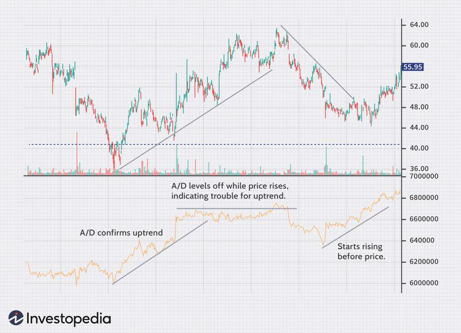

## Table of Contents

## What are technical indicators and why are they used in mutual fund analysis?

Technical indicators are tools that help investors and traders analyze past market data, mainly price and volume, to predict future price movements of mutual funds. These indicators use mathematical formulas and are shown on charts to make it easier to understand trends and patterns. They can be simple, like moving averages, or more complex, like the Relative Strength Index (RSI). By looking at these indicators, investors can make smarter decisions about when to buy or sell their mutual fund shares.

In mutual fund analysis, technical indicators are used because they provide a quick and visual way to assess the performance and potential of a fund. Instead of going through lots of financial reports and data, investors can use these indicators to see if a mutual fund is gaining or losing value over time. This helps them decide if the fund is a good investment or if it's time to sell. Using technical indicators can also help reduce the risk of making bad investment choices by giving a clearer picture of market trends.

## How do beginners identify the most common technical indicators used for mutual funds?

Beginners can start by learning about some of the most common technical indicators used for mutual funds. One of the easiest to understand is the Moving Average. This indicator shows the average price of a mutual fund over a certain period, like 50 days or 200 days. It helps smooth out price changes and makes it easier to see if the fund's price is going up or down over time. When the price is above the moving average, it might be a good time to buy, and when it's below, it might be a good time to sell.

Another common indicator is the Relative Strength Index (RSI). This one measures how fast and how much the price of a mutual fund is changing. The RSI is shown as a number between 0 and 100. If the RSI is above 70, it means the fund might be overbought, which could mean the price might go down soon. If it's below 30, the fund might be oversold, and the price could go up. This helps beginners decide if a mutual fund is a good buy or if they should wait.

Lastly, the Moving Average Convergence Divergence (MACD) is another useful indicator. It shows the relationship between two moving averages of a mutual fund's price. The MACD line is created by subtracting the 26-day moving average from the 12-day moving average. A signal line, which is a 9-day moving average of the MACD line, is then plotted on top. When the MACD line crosses above the signal line, it's a sign to buy, and when it crosses below, it's a sign to sell. These three indicators are great starting points for beginners to understand how mutual funds are performing.

## What is the difference between leading and lagging indicators, and how do they apply to mutual fund analysis?

Leading indicators are tools that try to predict what will happen to a mutual fund's price in the future. They look at things like how fast the price is changing or how many people are buying or selling the fund. For example, the Relative Strength Index (RSI) can tell you if a mutual fund might be overbought or oversold before it actually happens. This can help you decide to buy or sell the fund before the price changes a lot. Leading indicators are useful because they give you a heads-up, but they can also be wrong sometimes because predicting the future is tricky.

Lagging indicators, on the other hand, show you what has already happened to a mutual fund's price. They are based on past data, like moving averages, which show the average price of a fund over a certain time. For example, if a mutual fund's price goes above its 200-day moving average, it might mean the fund is doing well and could keep going up. Lagging indicators are good because they are more reliable since they are based on what has already happened, but they don't help you predict the future. They are useful for confirming trends that you see with leading indicators.

## Can you explain how to use moving averages to analyze mutual fund performance?

Moving averages are a great way to see how a mutual fund is doing over time. They work by taking the average price of the fund over a certain number of days, like 50 days or 200 days. This helps smooth out the daily ups and downs of the price, making it easier to see if the fund is going up or down overall. For example, if you look at the 50-day moving average and see it's going up, it means the fund's price has been going up over the last 50 days. If the price of the fund is above the moving average, it might be a good time to buy because the fund is doing well.

You can also use two moving averages together to get more information. For example, you can look at both the 50-day and the 200-day moving averages. If the 50-day moving average goes above the 200-day moving average, it's called a "golden cross," and it's a sign that the fund might keep going up. On the other hand, if the 50-day moving average goes below the 200-day moving average, it's called a "death cross," and it might be a sign that the fund's price could go down. By watching these moving averages, you can get a better idea of whether to buy or sell your mutual fund shares.

## What role do Relative Strength Index (RSI) and Moving Average Convergence Divergence (MACD) play in mutual fund analysis?

The Relative Strength Index (RSI) is a tool that helps you see if a mutual fund might be overbought or oversold. It's a number between 0 and 100. If the RSI is above 70, it means the fund might be overbought, and the price could go down soon. If it's below 30, the fund might be oversold, and the price could go up. By looking at the RSI, you can decide if it's a good time to buy or sell the fund. It's like a warning signal that helps you make better choices about your investments.

The Moving Average Convergence Divergence (MACD) is another useful tool for analyzing mutual funds. It shows the difference between two moving averages of the fund's price, usually the 12-day and 26-day moving averages. The MACD line is created by subtracting the 26-day moving average from the 12-day moving average. There's also a signal line, which is a 9-day moving average of the MACD line. When the MACD line crosses above the signal line, it's a sign to buy the fund because it might go up. When it crosses below the signal line, it's a sign to sell because the price might go down. Using the MACD helps you see trends and make smarter decisions about when to buy or sell your mutual fund shares.

## How can technical indicators help in timing the entry and exit points for mutual fund investments?

Technical indicators can help you decide the best times to buy or sell your mutual fund investments by giving you clues about where the price might go next. For example, if you see the price of your mutual fund go above its 50-day moving average, it might be a good time to buy because the fund is doing well. On the other hand, if the price drops below the 200-day moving average, it might be a sign to sell because the fund might keep going down. By watching these moving averages, you can get a better idea of when to make your move.

Another helpful indicator is the Relative Strength Index (RSI), which tells you if a mutual fund is overbought or oversold. If the RSI is above 70, it means the fund might be overbought, and the price could go down soon. This might be a good time to sell. If the RSI is below 30, the fund might be oversold, and the price could go up. This could be a good time to buy. The Moving Average Convergence Divergence (MACD) also helps with timing. When the MACD line crosses above the signal line, it's a sign to buy, and when it crosses below, it's a sign to sell. Using these indicators together can help you time your entry and exit points better, making your investment decisions smarter and more successful.

## What are some advanced technical indicators that experts use for deeper mutual fund analysis?

Experts often use advanced technical indicators like the Bollinger Bands and the Stochastic Oscillator to get a deeper understanding of mutual fund performance. Bollinger Bands are lines drawn on a chart that show the highest and lowest prices of a mutual fund over a certain time, usually 20 days. The middle line is the moving average of the fund's price. When the price goes near the upper band, it might be overbought, and when it goes near the lower band, it might be oversold. This helps experts see if the price is moving a lot and if it might be a good time to buy or sell.

Another advanced indicator is the Stochastic Oscillator, which looks at the closing price of a mutual fund compared to its price range over a certain time, usually 14 days. It gives you a number between 0 and 100. If the number is above 80, the fund might be overbought, and if it's below 20, it might be oversold. This helps experts predict if the price will go up or down soon. By using these advanced indicators, experts can make more detailed and informed decisions about their mutual fund investments.

## How do technical indicators complement fundamental analysis in mutual fund evaluation?

Technical indicators and fundamental analysis work together to help you make better choices about mutual funds. Fundamental analysis looks at the financial health of a mutual fund, like how much money it makes and how well it's managed. It helps you understand if the fund is a good investment based on its earnings, expenses, and other financial details. But, it doesn't tell you much about what the price might do next. That's where technical indicators come in. They use past price and volume data to show you trends and patterns, helping you predict if the price will go up or down. By using both, you get a fuller picture of the fund's potential and can make smarter investment decisions.

For example, you might use fundamental analysis to pick a mutual fund that looks strong and healthy. Then, you can use technical indicators like moving averages or the RSI to find the best time to buy or sell that fund. If the fund's price is above its 50-day moving average and the RSI is below 30, it might be a great time to buy because the price could go up soon. By combining the deep understanding from fundamental analysis with the timing insights from technical indicators, you can improve your chances of making profitable investments in mutual funds.

## What are the limitations and potential pitfalls of relying solely on technical indicators for mutual fund decisions?

Relying only on technical indicators for mutual fund decisions can be risky because they don't tell you everything about a fund. These indicators focus on price and volume data, which can help predict short-term price movements. But they don't give you information about the fund's financial health, like how much money it's making or how well it's managed. So, if you only use technical indicators, you might miss important details that could affect the fund's long-term performance. For example, a fund might look good based on its moving averages, but if it's losing money or has high fees, it could still be a bad investment.

Another problem with using just technical indicators is that they can be wrong sometimes. They are based on past data, and the future doesn't always follow the same patterns. This means you could make a decision to buy or sell based on what the indicators are showing, but the price might not move the way you expect. This can lead to losses if you're not careful. It's also easy to get too focused on the short-term ups and downs shown by the indicators and miss out on the bigger picture of the fund's overall value and potential. So, it's important to use technical indicators along with other tools like fundamental analysis to make the best investment decisions.

## How can one backtest technical indicators to validate their effectiveness in mutual fund analysis?

To backtest technical indicators for mutual fund analysis, you need to look at how well these indicators would have worked in the past. Start by choosing the indicators you want to test, like moving averages or the RSI. Then, get historical price data for the mutual fund you're interested in. Use this data to apply the indicators and see what buy and sell signals they would have given over time. For example, if the 50-day moving average crossed above the 200-day moving average, did the price go up after that? By doing this for a long period, you can see if the indicators would have helped you make money or if they led to losses.

Backtesting helps you understand if the indicators are reliable, but it has its limits. Just because an indicator worked well in the past doesn't mean it will work the same way in the future. Markets change, and what worked before might not work again. Also, backtesting can be tricky because you need to make sure you're not just seeing patterns by chance. It's important to test the indicators on different time periods and different funds to see if they really work. Using software or tools that can automate the backtesting process can make it easier and more accurate, helping you decide if the indicators are worth using for your mutual fund decisions.

## In what ways do different market conditions affect the reliability of technical indicators for mutual funds?

Different market conditions can make technical indicators more or less reliable when analyzing mutual funds. In a strong, trending market, where prices are clearly going up or down, technical indicators like moving averages and the MACD can be very helpful. They can show you when to buy or sell based on clear patterns. But in a choppy or sideways market, where prices don't move much, these indicators can give you a lot of false signals. You might think it's time to buy or sell, but the price doesn't move as expected because the market isn't trending.

Also, during times of high market volatility, like when there's big news or economic changes, technical indicators can be less reliable. The sudden price swings can make the indicators give signals that don't last long. For example, the RSI might show a fund is overbought, but the price keeps going up because of panic buying. In calm markets, with less volatility, indicators can be more reliable because the patterns they show are more likely to hold true. So, it's important to think about the current market conditions when using technical indicators to make decisions about mutual funds.

## How can portfolio managers integrate technical indicators into their overall strategy for managing mutual funds?

Portfolio managers can use technical indicators to help them decide when to buy or sell mutual fund shares. They can look at indicators like moving averages to see if the fund's price is going up or down over time. If the price is above the moving average, it might be a good time to buy because the fund is doing well. If it's below, it might be time to sell. They can also use the RSI to see if the fund is overbought or oversold, which can help them time their trades better. By watching these indicators, managers can make smarter choices about when to make moves in the market.

But, technical indicators are just one part of the puzzle. Portfolio managers also need to look at the fund's financial health and other big picture stuff, like the economy and market trends. This is called fundamental analysis. By using both technical indicators and fundamental analysis, managers can get a fuller picture of the fund's potential. They can use the technical indicators to find the best times to buy or sell, while using fundamental analysis to make sure the fund is a good long-term investment. This way, they can manage the mutual fund more effectively and help their investors make more money.

## How can technical indicators be applied to mutual funds?

Mutual funds are typically analyzed with a focus on [fundamental analysis](/wiki/fundamental-analysis), concentrating on financial statements, macroeconomic conditions, and management quality. Yet, technical indicators offer a complementary framework that can enhance the analysis by providing quantitative measures driven by recent price and [volume](/wiki/volume-trading-strategy) data. Incorporating technical indicators into mutual fund analysis can bring forth insights into market trends, entry and exit points, and potential reversals, bridging the gap between long-term investment holding periods and short-term market movements.

Key technical indicators applicable to mutual funds include trendlines, moving averages, the Relative Strength Index (RSI), support and resistance levels, and chart formations.

**Trendlines** are drawn over recognized pivot highs, or lows, to provide a visual indication of the direction and strength of a trend. A well-defined upward or downward trendline can signal either a continuation or a potential reversal in trend.

**Moving averages** smooth out price data over a specific period, providing insights into the overall direction of the market. The simple moving average (SMA) and the exponential moving average (EMA) are widely used to identify potential support and resistance levels. The crossover of moving averages can signal bullish or bearish trends.

- A common formula for an exponential moving average is:  
$$
  \text{EMA}_t = \left(\frac{\text{Price}_t \times (\text{Smoothing factor})}{{1 + \text{period}}}\right) + \left(\text{EMA}_{t-1} \times (1-\text{Smoothing factor})\right)

$$

**Relative Strength Index (RSI)** measures the magnitude of recent price changes to evaluate overbought or oversold conditions, providing signals on potential return reversals when values breach specific thresholds, typically 70 for overbought and 30 for oversold.

**Support and resistance levels** represent price points where a security tends to stop and reverse. These levels often reflect the prices that have shown consistent historical significance.

**Chart formations** like head and shoulders, and double tops or bottoms, can anticipate reversals or continuations. These patterns are critical for forecasting price objectives and possible direction shifts.

Together, these tools equip investors with methods to forecast and interpret market movements more precisely. While technical indicators should not be the sole basis for investment decisions, they are a beneficial asset in refining strategies, especially when markets exhibit short-term [volatility](/wiki/volatility-trading-strategies). When applied judiciously alongside fundamental analysis, these indicators enhance an investor’s ability to respond adeptly to shifting market conditions.

## What are the Popular Technical Indicators in Detail?

### Moving Averages

Moving Averages (MAs) are widely used technical indicators that help investors identify market trends and determine support and resistance levels. They smooth out price data, creating a single flowing line, which makes it easier to visualize the direction of the trend. There are several types of moving averages, including the Simple Moving Average (SMA) and the Exponential Moving Average (EMA).

$$
\text{SMA} = \frac{\sum_{i=1}^{n} P_i}{n}
$$

Here, $P_i$ represents the price at each time period, and $n$ is the number of periods. The SMA provides an average over a specific time period, while the EMA gives more weight to recent prices, making it more responsive to new information.

Signals such as the Golden Cross and the Death Cross are pivotal for making buy or sell decisions. The Golden Cross occurs when a short-term moving average crosses above a long-term average, indicating a potential upward trend. Conversely, the Death Cross is a bearish signal where a short-term average crosses below a long-term average.

### Supertrend

The Supertrend indicator is used to identify market trends and provide buy or sell signals. It is plotted on price charts and indicates trends based on its position relative to the current price. The indicator is computed using the Average True Range (ATR), which accounts for market volatility.

$$
\text{Supertrend} = (\text{Multiplier} \times \text{ATR}) + \text{Close Price}
$$

If the price is above the Supertrend line, it is considered an uptrend (buy signal), and if below, it is a downtrend (sell signal).

### Average Directional Index (ADX)

The Average Directional Index (ADX) measures the strength of a trend without indicating its direction. The ADX values range from 0 to 100, with higher values indicating stronger trends. A low ADX value suggests that the market is likely moving sideways, while a high value indicates a strong trend.

$$
\text{ADX} = 100 \times \frac{\text{EMA of } |DI_{\text{plus}}-DI_{\text{minus}}|}{DI_{\text{plus}} + DI_{\text{minus}}}
$$

It helps avoid sideways markets and guides strategic decisions by differentiating strong trends from weak ones.

### Parabolic SAR

The Parabolic SAR (Stop and Reverse) is a technical indicator used to determine potential market reversals and set stop-loss levels. It is displayed as dots placed above or below the price on a chart. When the dots are below the price, it indicates a bullish trend, and when they are above, a bearish trend.

The formula for the Parabolic SAR is:

$$
\text{SAR}_{\text{current}} = \text{SAR}_{\text{previous}} + \text{AF} \times (\text{EP} - \text{SAR}_{\text{previous}})
$$

Where $\text{AF}$ is the acceleration [factor](/wiki/factor-investing), and $\text{EP}$ is the extreme point (either the highest high for a long trade or the lowest low for a short trade during the current trend). This formula adjusts the SAR value, helping traders to identify potential reversals effectively.

## References & Further Reading

[1]: ["Technical Analysis of the Financial Markets: A Comprehensive Guide to Trading Methods and Applications"](https://www.amazon.com/Technical-Analysis-Financial-Markets-Comprehensive/dp/0735200661) by John J. Murphy

[2]: Pring, M. J. (2002). ["Technical Analysis Explained: The Successful Investor's Guide to Spotting Investment Trends and Turning Points."](https://www.amazon.com/Technical-Analysis-Explained-Fifth-Successful/dp/0071825177) 

[3]: Chan, E. (2009). ["Quantitative Trading: How to Build Your Own Algorithmic Trading Business."](https://github.com/ftvision/quant_trading_echan_book)

[4]: Kaufman, P. J. (2013). ["Trading Systems and Methods."](https://www.amazon.com/Trading-Systems-Methods-Website-Wiley/dp/1118043561) 

[5]: ["Algorithmic Trading and DMA: An Introduction to Direct Access Trading Strategies"](https://www.amazon.com/Algorithmic-Trading-DMA-introduction-strategies/dp/0956399207) by Barry Johnson