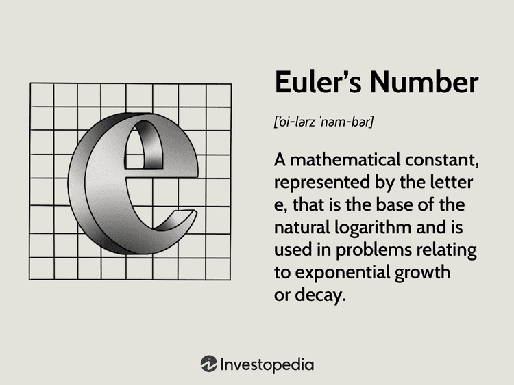

Euler's number, commonly represented as 'e', is a fundamental constant that is indispensable in mathematics and finance. Its approximate value, 2.71828, makes 'e' a cornerstone in numerous scientific and financial applications. Euler's number underpins the natural logarithm and is vital for understanding exponential growth and decay processes. This becomes especially important in finance, where the continuous compounding of interest is a fundamental concept driven by the exponential function $e^x$.

In finance and algorithmic trading, mathematical models often rely on exponential functions to capture market behaviors and predict future trends. Understanding Euler's number and its mathematical properties is crucial for developing these sophisticated trading strategies. Financial models often incorporate 'e' to analyze growth rates, investment returns, and the effects of compounding.



By integrating Euler's number into financial algorithms, analysts and traders can better anticipate market dynamics, enhance decision-making, and optimize portfolio management. This constant's significance is not limited to theoretical mathematics but extends into practical applications that impact real-world financial systems. Recognizing the value of mathematics in finance can facilitate more efficient and intelligent approaches to market challenges, illustrating the profound impact of Euler's number on modern quantitative finance.

## Table of Contents

## Understanding Euler's Number

Euler's number, expressed as 'e', approximately equals 2.71828 and stands as a cornerstone within the field of mathematics. It holds the distinction of being the base of natural logarithms, making it indispensable in analyses involving exponential growth and decay, compound interest, and principles of calculus.

The discovery of Euler's number is rooted in the study of compound interest, where it emerged as a limiting value when interest is compounded over ever-smaller periods. Specifically, as the number of compounding periods per year approaches infinity, the compound interest formula $(1 + \frac{1}{n})^n$ converges to 'e'. This observation underscores its significant historical and practical connection to finance, particularly in understanding the concept of continuous compounding where the formula becomes $e^{rt}$ for an initial amount 'P', over time 't', with an interest rate 'r'.

In mathematical contexts, Euler's number is pivotal in calculus. It is used in defining the exponential function $f(x) = e^x$, which is notable for the unique property that the function's rate of change is directly proportional to its value. This self-similar property is expressed through the derivative: $\frac{d}{dx} e^x = e^x$.

Euler's number also features prominently in the solutions to differential equations, modeling scenarios where growth or decay processes are proportional to the current state, such as population growth, radioactive decay, and heat transfer.

Given these characteristics, Euler's number is indispensable for mathematical modeling and analysis across varied scientific disciplines, allowing for precision and understanding of processes that can be represented exponentially. It provides a mathematical basis not only for solving complex problems but also for deriving insights critical to financial mathematics and beyond.

## Euler's Number in Finance

Euler's number (e) significantly influences financial mathematics, notably through its application in continuously compounding interest. This concept posits that interest is constantly calculated and added to the principal, as opposed to being calculated at discrete intervals. The formula for continuously compounding interest is given by:

$$
A = P e^{rt}
$$

where $A$ represents the amount of money accumulated after time $t$, $P$ is the principal amount, $r$ is the annual interest rate, and $e$ is Euler's number.

Understanding exponential growth functions is essential for finance professionals as they provide insights into how investments grow over time. This is particularly relevant in the prediction and analysis of future investment value. The formula $A = Pe^{rt}$ allows one to calculate the future value of an investment, illustrating how compounding frequency impacts overall returns. When returns are continuously compounded, they result in higher accumulation compared to standard interval-based compounding methods.

Euler's number is instrumental in constructing financial models that anticipate future investment values. As compounding frequency increases, the models based on exponential functions, particularly those incorporating $e$, become more precise, thus making them preferable in financial forecasting.

Moreover, the properties of Euler's number enable financial analysts to gain a deeper understanding of market dynamics and comprehend the time value of money. In particular, exponential growth models clarify how small, continuous growth rates can have significant long-term effects. This insight is crucial in evaluating the viability and potential returns of various investment vehicles.

By harnessing the mathematical properties associated with $e$, analysts can enhance their analysis of investment scenarios, optimize their financial strategies, and make informed decisions regarding interest rates and growth projections. This capability is vital in an environment where even minor variations in growth assumptions can lead to substantial differences in projected outcomes.

## Algorithmic Trading and Exponential Functions

Algorithmic trading has emerged as a prominent feature in modern financial markets, leveraging mathematical models to execute trades with speed and precision. Central to these models is Euler's number, $e$, which plays a crucial role in analyzing exponential trends and stochastic processes. This mathematical constant appears frequently in finance, particularly in the computation of key metrics such as exponential moving averages (EMAs).

EMAs are valuable tools for traders as they help smooth out price fluctuations by placing a greater weight on recent data points, thereby providing a more responsive metric compared to simple moving averages. The formula for an EMA incorporates Euler's number and can be represented as follows:

$$

EMA_t = \frac{V_t \cdot (2/(N+1)) + EMA_{t-1} \cdot (1 - 2/(N+1))} 
$$

Where:
- $EMA_t$ is the exponential moving average at time $t$,
- $V_t$ is the value of the data at time $t$ (e.g., stock price),
- $N$ is the number of periods in the EMA.

The property of exponential functions allows EMAs to react more swiftly to market changes, which is vital in high-frequency trading environments where timely insights can significantly impact profitability. By utilizing Euler's number, EMAs benefit from a mathematically rigorous method of discounting older data points exponentially, ensuring that recent trends exert more influence on the moving average.

Python, a popular programming language for algorithmic traders, can efficiently calculate EMAs using libraries such as Pandas. A simple implementation might look like this:

```python
import pandas as pd

# Assume `data` is a pandas DataFrame with a column 'price' representing stock prices.
data['EMA'] = data['price'].ewm(span=N, adjust=False).mean()
```

In [algorithmic trading](/wiki/algorithmic-trading), understanding and leveraging exponential functions extends beyond EMAs. These principles are applied in constructing stochastic models that predict market behavior under uncertainty. The stochastic calculus, often incorporating components that are directly proportional to $e^x$, helps model complex systems where variables follow a random path, thus aiding in risk management and strategy optimization.

The strategic importance of mastering exponential functions and logarithms underscores their utility in crafting resilient trading algorithms. With rigorous application, traders can minimize risks and capitalize on opportunities, affirming the necessity of mathematical insight in the field of algorithmic trading.

## Case Studies and Practical Applications

Euler's number, $e$, finds significant application in sophisticated trading algorithms, reflecting its importance in financial strategies aimed at maximizing returns and exploiting market opportunities. 

One prominent case study focuses on the implementation of continuously compounding interest models in high-frequency trading environments. In such scenarios, the formula for continuously compounded interest, given by:

$$
A = Pe^{rt}
$$

is crucial. Here, $A$ represents the future investment value, $P$ the principal amount, $r$ the interest rate, and $t$ the time period. Hedge funds frequently employ this model to assess the expected growth of their investments, allowing for real-time adjustments that align with rapid market movements. By leveraging this exponential growth model, financial institutions can optimize their portfolios, ensuring maximum ROI in volatile market conditions.

Quant traders, known for their analytical precision, utilize Euler's number to develop algorithms that identify and exploit market inefficiencies. One such application of $e$ is found in the use of exponential moving averages (EMAs), which are crucial for predicting short to medium-term trends in asset prices. The formula for calculating an EMA at time $t$ is:

$$
\text{EMA}_t = \alpha \times \text{Price}_t + (1 - \alpha) \times \text{EMA}_{t-1}
$$

where $\alpha$ is the smoothing factor, typically derived from $e$ to weight recent price data more heavily than older data. This approach allows traders to smooth out price fluctuations and focus on underlying trends, thereby making informed trading decisions.

Several financial institutions have reported substantial gains by integrating these models. For example, Goldman Sachs and Citadel have publicly acknowledged their use of algorithms based on exponential functions to manage vast portfolios and preemptively strike market changes.

Python libraries such as Pandas and NumPy offer tools to implement these calculations efficiently. Below is a simple Python code snippet to compute an EMA using NumPy:

```python
import numpy as np

def calculate_ema(prices, span):
    alpha = 2 / (span + 1)
    ema = np.zeros_like(prices)
    ema[0] = prices[0]
    for t in range(1, len(prices)):
        ema[t] = alpha * prices[t] + (1 - alpha) * ema[t - 1]
    return ema

# Example usage:
prices = [100, 101, 102, 103, 104, 105]
span = 5
ema_values = calculate_ema(prices, span)
print(ema_values)
```

This kind of implementation is foundational for algorithmic strategies that rebalance portfolios or automate trading processes based on trend recognition. As such, Euler's number remains an integral component of mathematical modeling in finance, aiding quant traders and financial institutions in maximizing their strategic outcomes.

## Future Trends in Finance and Mathematics

The financial landscape is continuously evolving, with mathematical constants such as Euler's number playing a pivotal role in shaping emerging trends. As finance increasingly intersects with [machine learning](/wiki/machine-learning) and data science, the application of these mathematical elements is expected to grow significantly.

Machine learning and data science are transforming traditional financial models by introducing advanced analytical techniques. Algorithms that leverage Euler's number are used in predictive modeling, particularly in estimating growth rates and compounding interest. These techniques allow for enhanced accuracy in forecasting market behaviors. For instance, the natural exponential function, $\exp(x) = e^x$, is commonly used in machine learning models to handle exponential growth patterns found in financial time series data.

As the industry adopts more sophisticated technologies, the demand for precision and efficiency in financial calculations intensifies. Euler's number facilitates continuous compounding calculations, which are essential for optimizing high-frequency trading strategies and risk management. In Python, such calculations can be efficiently executed using the following snippet:

```python
import numpy as np

def continuous_compounding(principal, rate, time):
    return principal * np.exp(rate * time)

# Example usage
principal = 1000  # Initial investment
rate = 0.05       # Annual interest rate
time = 2          # Time in years

future_value = continuous_compounding(principal, rate, time)
print(f"The future value of the investment is: ${future_value:.2f}")
```

Moreover, the integration of machine learning and data science enables better handling of complex datasets, improving decision-making processes. Neural networks and other machine learning models incorporate exponential functions and their derivatives to optimize learning algorithms, ensuring faster and more accurate predictions of stock market trends.

Innovations in technology, including the rise of quantum computing, have the potential to further impact the use of Euler's number. Quantum algorithms may offer novel ways of processing financial data, utilizing mathematical principles in more efficient ways that traditional computing may not achieve.

In summary, as financial markets embrace cutting-edge technologies, Euler's number and similar mathematical constants will become increasingly integral. Their applications in machine learning and algorithmic trading will enhance the capability to anticipate and respond to market dynamics, thus shaping the future of finance.

## Conclusion

In conclusion, Euler's number, denoted as 'e', holds substantial importance in the fields of finance and algorithmic trading. Its role extends beyond a mere mathematical constant; it forms the backbone of models for continuously compounding interest, exponential growth, and market behavior analysis. By grasping the intricacies of Euler's number and its applications, finance professionals and traders can develop more robust strategies and enhance their decision-making processes.

For individuals pursuing careers in finance and trading, understanding the mathematical foundations is crucial. This knowledge not only aids in comprehending current financial models but also paves the way for innovation in algorithmic trading and quantitative finance. Mastery of these principles allows for better anticipation of market trends and the ability to react swiftly to changes.

Furthermore, as technology and financial strategies continue to evolve, the significance of mathematical principles like those underpinning Euler's number becomes increasingly apparent. Emerging fields such as machine learning and data science are enhancing traditional financial methodologies. As these technologies advance, the ability to apply mathematical constants creatively and effectively will be vital to gaining a competitive edge.

In summary, Euler's number is not merely a theoretical concept but a practical tool that significantly impacts financial markets and trading strategies. Continued exploration and understanding of its properties will be imperative for those aiming to excel in the dynamic and ever-changing landscape of finance.

## References & Further Reading

[1]: Bergstra, J., Bardenet, R., Bengio, Y., & Kégl, B. (2011). ["Algorithms for Hyper-Parameter Optimization."](https://papers.nips.cc/paper/4443-algorithms-for-hyper-parameter-optimization) Advances in Neural Information Processing Systems 24.

[2]: ["Advances in Financial Machine Learning"](https://www.amazon.com/Advances-Financial-Machine-Learning-Marcos/dp/1119482089) by Marcos Lopez de Prado

[3]: ["Evidence-Based Technical Analysis: Applying the Scientific Method and Statistical Inference to Trading Signals"](https://www.amazon.com/Evidence-Based-Technical-Analysis-Scientific-Statistical/dp/0470008741) by David Aronson

[4]: ["Machine Learning for Algorithmic Trading"](https://github.com/stefan-jansen/machine-learning-for-trading) by Stefan Jansen

[5]: ["Quantitative Trading: How to Build Your Own Algorithmic Trading Business"](https://www.amazon.com/Quantitative-Trading-Build-Algorithmic-Business/dp/1119800064) by Ernest P. Chan