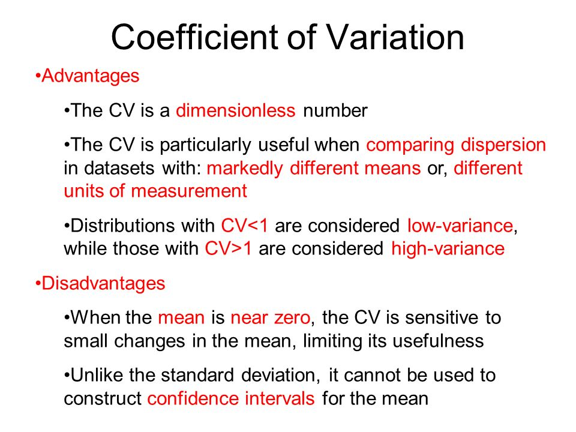

## Table of Contents

## What is the coefficient of variation and how is it calculated?

The coefficient of variation, often abbreviated as CV, is a statistical measure that shows the extent of variability in relation to the mean of a data set. It's useful when you want to compare the degree of variation from one data set to another, even if the means are drastically different. The CV is expressed as a percentage, which makes it easy to understand and compare.

To calculate the coefficient of variation, you first need to find the standard deviation of your data set. The standard deviation is a measure of the amount of variation or dispersion in the data. Once you have the standard deviation, you divide it by the mean of the data set. Then, you multiply the result by 100 to convert it into a percentage. The formula is: CV = (Standard Deviation / Mean) * 100. This simple calculation helps you understand how spread out the data is relative to its average value.

## Why is the coefficient of variation useful in statistics?

The coefficient of variation is useful in statistics because it helps compare how spread out different sets of data are, even when their averages are different. Imagine you're comparing test scores from two different classes. One class might have an average score of 70, and the other might have an average of 90. Just looking at the averages doesn't tell you much about how the students did compared to each other. But if you use the coefficient of variation, you can see which class had more consistent scores, regardless of the average.

Another reason the coefficient of variation is helpful is that it's a percentage, so it's easy to understand and compare. For example, if one set of data has a CV of 10% and another has a CV of 20%, you can quickly see that the second set of data is more spread out. This makes it a great tool for scientists, researchers, and anyone who needs to make sense of data from different sources or experiments.

## How does the coefficient of variation differ from standard deviation?

The coefficient of variation (CV) and standard deviation are both measures of how spread out data is, but they give you different information. Standard deviation tells you how much the numbers in your data set vary from the average. It's like measuring how far away each number is from the middle, and then figuring out an average of those distances. If the standard deviation is high, it means the numbers are spread out a lot; if it's low, the numbers are closer together.

The coefficient of variation, on the other hand, takes the standard deviation and divides it by the average of the data set, then turns it into a percentage. This is helpful because it lets you compare how spread out different sets of numbers are, even if their averages are very different. For example, if you're comparing the heights of two different groups of people, one group might be taller on average, but the CV can tell you which group has more variation in height compared to their own average. So while standard deviation just tells you about the spread in one set of data, the CV lets you compare the spread between different sets of data.

## In what types of data sets is the coefficient of variation most useful?

The coefficient of variation is most useful in data sets where you want to compare the spread of different groups even if their averages are different. Imagine you're looking at the test scores of two different classes. One class might have higher average scores, but the coefficient of variation can show you which class has more consistent scores relative to their own average. This makes it easier to understand how each class did compared to the other, beyond just looking at the averages.

It's also helpful in fields like finance and biology. In finance, you might want to compare the risk of different investments. If one investment has a higher average return but also a higher coefficient of variation, it might be riskier than another with a lower average return but also a lower coefficient of variation. In biology, you could use it to compare the growth rates of different species of plants, where the averages might be different but the relative variability is what's important.

## Can you provide examples of how the coefficient of variation is used in finance?

In finance, the coefficient of variation is often used to compare the risk of different investments. Imagine you're looking at two stocks. One stock might have a higher average return, but if its coefficient of variation is also higher, it means that stock's returns are more spread out. This tells you that the stock with the higher coefficient of variation is riskier because its returns are less predictable. By using the coefficient of variation, investors can make better decisions about which stocks might be a safer bet, even if the average returns look good.

Another way the coefficient of variation is used in finance is when comparing the performance of different mutual funds. Let's say you're choosing between two funds. One fund might have a higher average return, but if its coefficient of variation is also higher, it means the fund's returns are more variable. This could be a sign that the fund is riskier because its performance can swing more widely. By looking at the coefficient of variation, investors can see which fund offers a better balance of return and risk, helping them pick the one that matches their investment goals and risk tolerance.

## How is the coefficient of variation applied in quality control and manufacturing?

In quality control and manufacturing, the coefficient of variation is used to check how consistent the products are. Imagine a factory making screws. Each screw should be the same size, but there will be small differences. The coefficient of variation helps the factory see how much these sizes vary compared to the average size. If the coefficient of variation is low, it means the screws are very similar to each other, which is good. If it's high, the sizes are more spread out, and the factory might need to adjust their machines to make the screws more consistent.

Another way the coefficient of variation is used is when comparing different production lines or different factories. Let's say one factory makes car parts and another makes the same parts but in a different place. The average size of the parts might be different between the two factories, but the coefficient of variation lets them compare how consistent each factory is. If one factory has a lower coefficient of variation, it means their parts are more uniform, which can be important for quality control and making sure the parts fit well together in the cars.

## What are the limitations of using the coefficient of variation?

The coefficient of variation can be tricky to use if the data set has a mean of zero or very close to zero. If the mean is zero, you can't divide the standard deviation by the mean because you would be dividing by zero, which doesn't work. Even if the mean is just very small, the coefficient of variation can get really big, which might make the data seem more spread out than it really is. So, it's not a good choice for data sets where the mean might be zero or very close to zero.

Another problem with the coefficient of variation is that it assumes the data is normally distributed. If the data isn't spread out in a normal way, the coefficient of variation might not give a good picture of how spread out the data is. Also, it's not very useful for comparing data sets that have negative values because the coefficient of variation works best with positive numbers. So, you have to be careful about what kind of data you're using it with and make sure it fits the right conditions.

## How does the coefficient of variation help in comparing the variability of different datasets?

The coefficient of variation helps in comparing the variability of different datasets by giving a percentage that shows how spread out the numbers are compared to the average. Imagine you have two sets of test scores from different classes. One class might have higher average scores, but the coefficient of variation can tell you which class has more consistent scores compared to their own average. This way, you can see if one class did better overall, even if their average scores are different.

For example, if one class has a coefficient of variation of 10% and another has a coefficient of variation of 20%, you can easily see that the second class's scores are more spread out. This makes it easier to understand and compare how each class did, beyond just looking at the averages. By using the coefficient of variation, you get a clearer picture of how spread out the data is in each set, which helps in making better comparisons.

## Can the coefficient of variation be used for non-normal distributions? If so, how?

The coefficient of variation can be used for non-normal distributions, but you need to be careful. It works best with data that follows a normal distribution because it assumes the data is spread out in a certain way. If the data isn't spread out normally, the coefficient of variation might not give a good picture of how spread out the data is. But, if you still want to use it, you can calculate it the same way: divide the standard deviation by the mean and then multiply by 100 to get a percentage.

Even though the coefficient of variation might not be as accurate for non-normal data, it can still be useful if you're just trying to get a rough idea of how spread out the data is. Just remember that the results might not be as reliable as they would be with normal data. If you're working with data that has a lot of extreme values or is skewed in some way, you might want to look at other measures of variability too, to get a fuller picture.

## What advanced statistical techniques involve the use of the coefficient of variation?

One advanced statistical technique that involves the coefficient of variation is in the field of reliability engineering. Engineers use the coefficient of variation to understand how consistent a product or system is over time. For example, when testing the lifespan of batteries, they might look at the coefficient of variation to see how much the lifespans vary from the average. A lower coefficient of variation means the batteries are more reliable because their lifespans are more consistent. This helps engineers make better decisions about how to improve the product or system.

Another technique is in the area of financial modeling, where the coefficient of variation is used to assess the risk and return of different investments. Financial analysts might compare the coefficient of variation of different stocks or portfolios to see which ones have more predictable returns. A stock with a lower coefficient of variation might be seen as less risky because its returns are more consistent. This helps investors make informed choices about where to put their money, balancing potential returns with the level of risk they are comfortable with.

## How can the coefficient of variation be used in risk assessment and portfolio management?

In risk assessment and portfolio management, the coefficient of variation helps investors understand how risky an investment might be. Imagine you're looking at two different stocks. One stock might have a higher average return, but if its coefficient of variation is also higher, it means that stock's returns are more spread out. This tells you that the stock with the higher coefficient of variation is riskier because its returns are less predictable. By using the coefficient of variation, investors can compare different investments and see which ones offer a good balance between potential returns and the level of risk they are comfortable with.

When managing a portfolio, the coefficient of variation can help you see how consistent the returns of different assets are. If you have a mix of stocks, bonds, and other investments, you can use the coefficient of variation to check how much each one's returns vary from the average. A lower coefficient of variation means the returns are more consistent, which can be important for building a stable portfolio. By looking at the coefficient of variation, you can make better decisions about which assets to include in your portfolio to help manage risk and aim for steady growth.

## What are some cutting-edge research areas that utilize the coefficient of variation?

One cutting-edge research area that uses the coefficient of variation is in the study of biological systems. Scientists are looking at how the coefficient of variation can help understand the variability in gene expression. Genes tell cells what to do, but they don't always work the same way in every cell. By using the coefficient of variation, researchers can see how much gene expression varies from cell to cell. This helps them understand how diseases like cancer might start and grow, because cancer cells often have very different gene expression compared to normal cells.

Another area is in the field of climate science. Researchers are using the coefficient of variation to study how much rainfall varies from year to year in different places. This helps them predict how climate change might affect water supplies and farming. If the coefficient of variation is high, it means rainfall is very unpredictable, which can be a big problem for farmers who need steady water to grow crops. By understanding this variability, scientists can help plan for the future and make sure communities have enough water, even as the climate changes.

## What is the Coefficient of Variation and how do we understand it?

The Coefficient of Variation (COV) is a standardized measure of the dispersion of a probability distribution or frequency distribution. It provides a dimensionless number that evaluates the extent of variability in relation to the mean of the dataset. This can be defined mathematically as:

$$
\text{COV} = \left( \frac{\sigma}{\mu} \right) \times 100\%
$$

where $\sigma$ is the standard deviation and $\mu$ is the mean of the dataset.

Expressing variability as a percentage of the mean allows COV to facilitate comparisons across different datasets, regardless of the magnitude of their means. This attribute is particularly useful when comparing the consistency or risk across various datasets or investment instruments whose means may differ substantially. For example, this mechanism helps in comparing the relative [volatility](/wiki/volatility-trading-strategies) of stocks or assets whose prices are on different scales.

In financial portfolios, COV is an essential tool for quantifying risk, as it measures the degree of variability, enabling investors to assess asset volatility relative to the expected return. A lower COV indicates a more consistent investment, while a higher COV suggests greater risk or inconsistency concerning its mean return.

Using COV is advantageous when assessing and managing risk in investment decisions, as it normalizes the standard deviation relative to the mean, allowing for meaningful comparisons among assets with different expected returns.

Python code can be used to easily compute COV for a given dataset. Here is a simple example:

```python
def coefficient_of_variation(data):
    import numpy as np

    mean = np.mean(data)
    std_dev = np.std(data)

    cov = (std_dev / mean) * 100
    return cov

# Example usage:
stock_returns = [10, 15, 14, 10, 13, 17]
cov_value = coefficient_of_variation(stock_returns)
print(f"Coefficient of Variation: {cov_value:.2f}%")
```

This script calculates the COV for a given list of stock returns, highlighting the ease with which such analyses can be performed using programming tools. By leveraging COV, analysts and traders can achieve a better understanding of the relative risk of different investment opportunities, enabling more informed decision-making.

## What are the applications of the coefficient of variation in trading?

The Coefficient of Variation (COV) plays a significant role in investment risk assessments by enabling traders and investors to gauge and compare risk-return profiles across various financial assets. The COV, defined as the ratio of the standard deviation ($\sigma$) to the mean ($\mu$), is given by the formula:

$$
\text{COV} = \frac{\sigma}{\mu} \times 100\%
$$

This metric provides a standardized measure of risk, enabling investors to distinguish which financial assets possess higher risk levels relative to their expected returns. In practice, assets with higher COV are considered riskier as they exhibit higher variability relative to the expected return.

Investors and traders frequently utilize COV to construct diversified portfolios and achieve a balanced risk allocation. By assessing COV values, they can select assets that offer an optimal trade-off between risk and return, ensuring that portfolios are aligned with their risk tolerance and investment objectives. For instance, lower COV values may imply a more stable return, allowing investors to prioritize such assets for risk-averse strategies.

Additionally, the application of COV in trading often involves its use alongside other statistical measures, such as the standard deviation and beta. While standard deviation offers insight into the absolute volatility of an asset, COV provides a relative measure, allowing comparisons across diverse securities with varying expected returns.

Incorporating COV into investment analysis can be enhanced through computational tools and software. Python, for instance, can be employed to calculate COV for a range of securities. Here is a simple Python example to compute COV:

```python
def calculate_cov(expected_return, standard_deviation):
    if expected_return == 0:
        raise ValueError("Expected return cannot be zero.")
    cov = (standard_deviation / expected_return) * 100
    return cov

# Example: Calculating COV for two stocks
expected_return_A = 0.15  # 15%
standard_dev_A = 0.10    # 10%

expected_return_B = 0.10  # 10%
standard_dev_B = 0.05    # 5%

cov_A = calculate_cov(expected_return_A, standard_dev_A)
cov_B = calculate_cov(expected_return_B, standard_dev_B)

print(f"COV for Stock A: {cov_A:.2f}%")
print(f"COV for Stock B: {cov_B:.2f}%")
```

Overall, COV provides an essential means of evaluating risk-return dynamics, supporting informed decision-making processes in trading and portfolio management.

## How can COV be used: Practical Examples?

Let's consider an example of two stocks to better understand the application of the Coefficient of Variation (COV) in analyzing risk. Suppose we have Stock A and Stock B, each with different expected returns and standard deviations, which are useful for computing their respective COVs.

For Stock A, assume an expected return $R_A$ of 15% and a standard deviation $\sigma_A$ of 10%. The COV for Stock A is calculated as:

$$
\text{COV}_A = \frac{\sigma_A}{R_A} = \frac{10\%}{15\%} = 0.67
$$

This COV value of 0.67 indicates the risk per unit of return for Stock A.

In contrast, for Stock B, assume an expected return $R_B$ of 10% and a standard deviation $\sigma_B$ of 5%. The COV for Stock B is:

$$
\text{COV}_B = \frac{\sigma_B}{R_B} = \frac{5\%}{10\%} = 0.5
$$

A COV of 0.5 for Stock B signifies a lower risk per unit of expected return compared to Stock A. This implies that Stock B provides a better risk-adjusted return than Stock A.

These calculations illustrate how the COV can guide investment choices, helping investors compare the risk-reward trade-offs in different portfolios. By focusing on lower COV values, traders can identify securities that offer more favorable risk-adjusted returns, thereby optimizing their portfolios for more efficient risk management. 

In practice, this type of analysis can be further refined by integrating COV into algorithmic trading systems, using programming languages like Python for calculations and backtesting. For example, a Python script to calculate the COV of stocks might look like this:

```python
def calculate_cov(expected_return, standard_deviation):
    return standard_deviation / expected_return

# Example data
stock_a_return = 0.15
stock_a_std_dev = 0.10

stock_b_return = 0.10
stock_b_std_dev = 0.05

cov_a = calculate_cov(stock_a_return, stock_a_std_dev)
cov_b = calculate_cov(stock_b_return, stock_b_std_dev)

print(f"Stock A COV: {cov_a:.2f}")
print(f"Stock B COV: {cov_b:.2f}")
```

This script allows traders to automate the process of calculating COV, making it easier to analyze and react to market data swiftly.

## What is the conclusion?

The Coefficient of Variation (COV) serves as a crucial metric in statistical analysis and algorithmic trading by providing a standardized method to compare the risk associated with various securities. This measure of relative [dispersion](/wiki/dispersion-trading) is calculated by the formula:

$$
\text{COV} = \left( \frac{\text{Standard Deviation}}{\text{Mean}} \right) \times 100
$$

Through this formula, traders can gain insights into the risk-return profile of different financial assets, which is indispensable for constructing diversified portfolios and optimizing trading strategies. By integrating COV with other statistical tools, traders can effectively balance risk and enhance their decision-making processes.

The use of COV in algorithmic trading strategies allows for improved identification of securities offering superior risk-adjusted returns. This metric aids in the backtesting of trading algorithms, guiding the refinement of trading models through software tools such as Python. An example Python function that can calculate COV is as follows:

```python
def calculate_covariance(expected_return, standard_deviation):
    if expected_return == 0:
        return float('inf')
    cov = (standard_deviation / expected_return) * 100
    return cov

# Example usage:
expected_return_A = 0.15
standard_deviation_A = 0.10
cov_A = calculate_covariance(expected_return_A, standard_deviation_A)

expected_return_B = 0.10
standard_deviation_B = 0.05
cov_B = calculate_covariance(expected_return_B, standard_deviation_B)

print(f"COV for Stock A: {cov_A}")
print(f"COV for Stock B: {cov_B}")
```

Advancements in statistical analysis continue to empower the COV as an analytical tool in financial markets. This ongoing development enhances the capacity of traders to manage risk, adapt strategies to changing market conditions, and achieve more consistent trading performances. By continually incorporating innovative statistical insights, the application of the Coefficient of Variation will remain an integral aspect of sophisticated financial analysis and strategy development.

## References & Further Reading

[1]: Alexander, C. (2008). ["Market Risk Analysis, Volume I: Quantitative Methods in Finance."](https://archive.org/details/marketriskanalys0001alex) Wiley.

[2]: ["Algorithmic Trading: Winning Strategies and Their Rationale"](https://www.wiley.com/en-us/Algorithmic+Trading%3A+Winning+Strategies+and+Their+Rationale-p-9781118746912) by Ernie Chan

[3]: Wang, Y., & Hsu, T. (2016). ["Risk Assessment and Management in Algorithmic Trading."](https://www.researchgate.net/publication/311806838_Lim_CP_Wang_LB_Eds_2016_Blended_Learning_for_Quality_Higher_Education_Selected_Case_Studies_on_Implementation_from_Asia-Pacific_Paris_France_UNESCO) IEEE International Conference on Big Data.

[4]: Grinold, R. C., & Kahn, R. N. (1999). ["Active Portfolio Management: A Quantitative Approach for Producing Superior Returns and Controlling Risk"](https://www.amazon.com/Active-Portfolio-Management-Quantitative-Controlling/dp/0070248826) McGraw-Hill.

[5]: Fabozzi, F. J., Focardi, S. M., & Kolm, P. N. (2010). ["Quantitative Equity Investing: Techniques and Strategies"](https://www.semanticscholar.org/paper/Quantitative-Equity-Investing%3A-Techniques-and-Fabozzi-Focardi/1c49a2a53919f7e65cb96f16691b8ff726fd3cd7) Wiley.