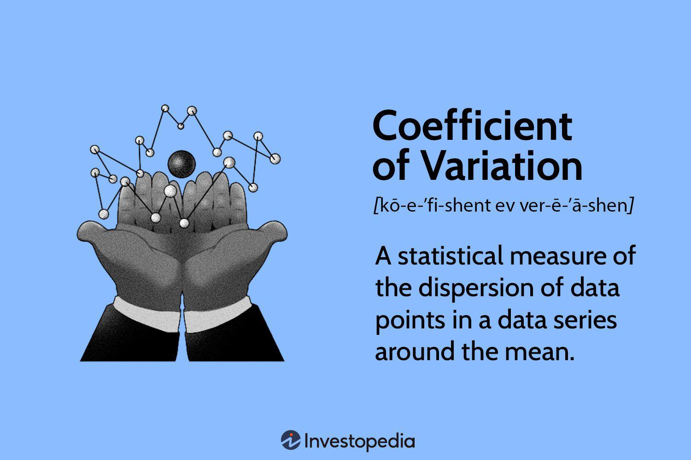

In algorithmic trading, understanding statistical metrics is essential for success. This article focuses on the Coefficient of Variation (COV) and its application in statistical analysis and algorithmic trading. The COV is a critical measure that aids traders and analysts in quantifying risk and comparing it across various financial instruments. As financial markets become more complex, the ability to assess risk effectively is paramount.

The COV is calculated as the ratio of the standard deviation to the mean, typically expressed as a percentage:



$$
\text{COV} = \left( \frac{\text{Standard Deviation}}{\text{Mean}} \right) \times 100 \%
$$

This formula provides a measure of relative variability and helps traders understand the degree of variation between different securities. By examining COV, market participants can identify which assets pose more considerable risk relative to their expected returns, thus enabling better risk management and portfolio optimization.

Algorithmic trading heavily relies on statistical techniques to enhance trading performance. Incorporating COV into trading strategies can help traders make informed decisions by highlighting assets with favorable risk-adjusted returns. By effectively utilizing COV, traders are better equipped to manage risk and optimize their trading strategies in an ever-evolving market landscape.

## Table of Contents

## Understanding the Coefficient of Variation

The Coefficient of Variation (COV) is a standardized measure of the dispersion of a probability distribution or frequency distribution. It provides a dimensionless number that evaluates the extent of variability in relation to the mean of the dataset. This can be defined mathematically as:

$$
\text{COV} = \left( \frac{\sigma}{\mu} \right) \times 100\%
$$

where $\sigma$ is the standard deviation and $\mu$ is the mean of the dataset.

Expressing variability as a percentage of the mean allows COV to facilitate comparisons across different datasets, regardless of the magnitude of their means. This attribute is particularly useful when comparing the consistency or risk across various datasets or investment instruments whose means may differ substantially. For example, this mechanism helps in comparing the relative [volatility](/wiki/volatility-trading-strategies) of stocks or assets whose prices are on different scales.

In financial portfolios, COV is an essential tool for quantifying risk, as it measures the degree of variability, enabling investors to assess asset volatility relative to the expected return. A lower COV indicates a more consistent investment, while a higher COV suggests greater risk or inconsistency concerning its mean return.

Using COV is advantageous when assessing and managing risk in investment decisions, as it normalizes the standard deviation relative to the mean, allowing for meaningful comparisons among assets with different expected returns.

Python code can be used to easily compute COV for a given dataset. Here is a simple example:

```python
def coefficient_of_variation(data):
    import numpy as np

    mean = np.mean(data)
    std_dev = np.std(data)

    cov = (std_dev / mean) * 100
    return cov

# Example usage:
stock_returns = [10, 15, 14, 10, 13, 17]
cov_value = coefficient_of_variation(stock_returns)
print(f"Coefficient of Variation: {cov_value:.2f}%")
```

This script calculates the COV for a given list of stock returns, highlighting the ease with which such analyses can be performed using programming tools. By leveraging COV, analysts and traders can achieve a better understanding of the relative risk of different investment opportunities, enabling more informed decision-making.

## Applications of Coefficient of Variation in Trading

The Coefficient of Variation (COV) plays a significant role in investment risk assessments by enabling traders and investors to gauge and compare risk-return profiles across various financial assets. The COV, defined as the ratio of the standard deviation ($\sigma$) to the mean ($\mu$), is given by the formula:

$$
\text{COV} = \frac{\sigma}{\mu} \times 100\%
$$

This metric provides a standardized measure of risk, enabling investors to distinguish which financial assets possess higher risk levels relative to their expected returns. In practice, assets with higher COV are considered riskier as they exhibit higher variability relative to the expected return.

Investors and traders frequently utilize COV to construct diversified portfolios and achieve a balanced risk allocation. By assessing COV values, they can select assets that offer an optimal trade-off between risk and return, ensuring that portfolios are aligned with their risk tolerance and investment objectives. For instance, lower COV values may imply a more stable return, allowing investors to prioritize such assets for risk-averse strategies.

Additionally, the application of COV in trading often involves its use alongside other statistical measures, such as the standard deviation and beta. While standard deviation offers insight into the absolute volatility of an asset, COV provides a relative measure, allowing comparisons across diverse securities with varying expected returns.

Incorporating COV into investment analysis can be enhanced through computational tools and software. Python, for instance, can be employed to calculate COV for a range of securities. Here is a simple Python example to compute COV:

```python
def calculate_cov(expected_return, standard_deviation):
    if expected_return == 0:
        raise ValueError("Expected return cannot be zero.")
    cov = (standard_deviation / expected_return) * 100
    return cov

# Example: Calculating COV for two stocks
expected_return_A = 0.15  # 15%
standard_dev_A = 0.10    # 10%

expected_return_B = 0.10  # 10%
standard_dev_B = 0.05    # 5%

cov_A = calculate_cov(expected_return_A, standard_dev_A)
cov_B = calculate_cov(expected_return_B, standard_dev_B)

print(f"COV for Stock A: {cov_A:.2f}%")
print(f"COV for Stock B: {cov_B:.2f}%")
```

Overall, COV provides an essential means of evaluating risk-return dynamics, supporting informed decision-making processes in trading and portfolio management.

## Advantages and Limitations of COV

The Coefficient of Variation (COV) is favored for its ability to provide a standardized measure of variation, making it particularly useful in financial and statistical analyses. By expressing the standard deviation as a percentage of the mean ($\text{COV} = \frac{\text{Standard Deviation}}{\text{Mean}} \times 100$), COV enables easy comparison across different datasets and investment instruments, regardless of their absolute scales. This standardization is crucial when analyzing diverse data types, whether financial metrics, experimental data, or biological samples.

One significant advantage is its capacity to facilitate comparisons between variables with different units or widely varying means. In finance, this tool allows investors to assess the risk relative to the expected returns of various assets. For instance, COV can reveal a more comprehensive picture of risk when evaluating stocks, bonds, or other securities with divergent expected returns and volatility levels.

However, the COV is not without its limitations. It may become problematic in datasets characterized by a strong presence of both positive and negative values, or when the mean of the data approaches zero. As the mean approaches zero, the COV can inflate significantly, leading to misleading interpretations of relative risk. In cases where the mean is negative, the concept of relative variability loses its intuitive appeal, further complicating analysis.

To illustrate, consider a dataset where the mean is zero or close to zero. The COV calculation could result in extremely high values, which might misrepresent the dataset’s true variability. Therefore, when applying COV in financial analysis or constructing portfolios, it is crucial to ensure that the data characteristics, such as a non-zero mean, are compatible with COV’s computational requirements.

Overall, while the Coefficient of Variation offers substantial benefits in standardizing measure variation across diverse datasets, it is vital to understand its limitations. Careful consideration is necessary to avoid erroneous risk assessments, especially when integrating COV into financial analysis and decision-making processes.

## COV in Algorithmic Trading Strategies

In [algorithmic trading](/wiki/algorithmic-trading), the Coefficient of Variation (COV) is employed to enhance trading strategies by effectively measuring relative volatility. This metric is particularly valuable in decision-making, as it helps highlight securities with superior risk-adjusted returns. By focussing on relative volatility, traders can discern which assets provide the best balance of risk and reward.

Traders often use COV during [backtesting](/wiki/backtesting) to measure and optimize the performance of trading algorithms. Backtesting involves simulating a trading strategy using historical data to evaluate its potential efficacy before actual deployment. Incorporating COV into these simulations allows traders to identify and fine-tune algorithms that prioritize not just returns, but the consistency of those returns relative to the risk assumed.

The integration of COV within algorithmic models is facilitated by tools such as Python, alongside statistical software packages. Python, with its robust libraries like NumPy, pandas, and SciPy, offers a streamlined approach to calculate and apply COV in trading strategies. For example, calculating COV in Python can be performed as follows:

```python
import numpy as np

# Example return data for a security
returns = np.array([0.10, 0.15, 0.20, 0.25, 0.30])

# Calculating mean and standard deviation
mean_return = np.mean(returns)
std_deviation = np.std(returns)

# Calculating COV
cov = std_deviation / mean_return

print(f"Coefficient of Variation: {cov:.2f}")
```

This code snippet exemplifies how traders can compute the COV, providing a quantifiable insight into the volatility of a security relative to its expected return. By integrating such calculations into their trading algorithms, practitioners can achieve more refined and predictive models, thus enhancing the potential success of their strategies in the dynamic landscape of financial markets.

## Using COV: Practical Examples

Let's consider an example of two stocks to better understand the application of the Coefficient of Variation (COV) in analyzing risk. Suppose we have Stock A and Stock B, each with different expected returns and standard deviations, which are useful for computing their respective COVs.

For Stock A, assume an expected return $R_A$ of 15% and a standard deviation $\sigma_A$ of 10%. The COV for Stock A is calculated as:

$$
\text{COV}_A = \frac{\sigma_A}{R_A} = \frac{10\%}{15\%} = 0.67
$$

This COV value of 0.67 indicates the risk per unit of return for Stock A.

In contrast, for Stock B, assume an expected return $R_B$ of 10% and a standard deviation $\sigma_B$ of 5%. The COV for Stock B is:

$$
\text{COV}_B = \frac{\sigma_B}{R_B} = \frac{5\%}{10\%} = 0.5
$$

A COV of 0.5 for Stock B signifies a lower risk per unit of expected return compared to Stock A. This implies that Stock B provides a better risk-adjusted return than Stock A.

These calculations illustrate how the COV can guide investment choices, helping investors compare the risk-reward trade-offs in different portfolios. By focusing on lower COV values, traders can identify securities that offer more favorable risk-adjusted returns, thereby optimizing their portfolios for more efficient risk management. 

In practice, this type of analysis can be further refined by integrating COV into algorithmic trading systems, using programming languages like Python for calculations and backtesting. For example, a Python script to calculate the COV of stocks might look like this:

```python
def calculate_cov(expected_return, standard_deviation):
    return standard_deviation / expected_return

# Example data
stock_a_return = 0.15
stock_a_std_dev = 0.10

stock_b_return = 0.10
stock_b_std_dev = 0.05

cov_a = calculate_cov(stock_a_return, stock_a_std_dev)
cov_b = calculate_cov(stock_b_return, stock_b_std_dev)

print(f"Stock A COV: {cov_a:.2f}")
print(f"Stock B COV: {cov_b:.2f}")
```

This script allows traders to automate the process of calculating COV, making it easier to analyze and react to market data swiftly.

## Conclusion

The Coefficient of Variation (COV) serves as a crucial metric in statistical analysis and algorithmic trading by providing a standardized method to compare the risk associated with various securities. This measure of relative [dispersion](/wiki/dispersion-trading) is calculated by the formula:

$$
\text{COV} = \left( \frac{\text{Standard Deviation}}{\text{Mean}} \right) \times 100
$$

Through this formula, traders can gain insights into the risk-return profile of different financial assets, which is indispensable for constructing diversified portfolios and optimizing trading strategies. By integrating COV with other statistical tools, traders can effectively balance risk and enhance their decision-making processes.

The use of COV in algorithmic trading strategies allows for improved identification of securities offering superior risk-adjusted returns. This metric aids in the backtesting of trading algorithms, guiding the refinement of trading models through software tools such as Python. An example Python function that can calculate COV is as follows:

```python
def calculate_covariance(expected_return, standard_deviation):
    if expected_return == 0:
        return float('inf')
    cov = (standard_deviation / expected_return) * 100
    return cov

# Example usage:
expected_return_A = 0.15
standard_deviation_A = 0.10
cov_A = calculate_covariance(expected_return_A, standard_deviation_A)

expected_return_B = 0.10
standard_deviation_B = 0.05
cov_B = calculate_covariance(expected_return_B, standard_deviation_B)

print(f"COV for Stock A: {cov_A}")
print(f"COV for Stock B: {cov_B}")
```

Advancements in statistical analysis continue to empower the COV as an analytical tool in financial markets. This ongoing development enhances the capacity of traders to manage risk, adapt strategies to changing market conditions, and achieve more consistent trading performances. By continually incorporating innovative statistical insights, the application of the Coefficient of Variation will remain an integral aspect of sophisticated financial analysis and strategy development.

## References & Further Reading

[1]: Alexander, C. (2008). ["Market Risk Analysis, Volume I: Quantitative Methods in Finance."](https://archive.org/details/marketriskanalys0001alex) Wiley.

[2]: ["Algorithmic Trading: Winning Strategies and Their Rationale"](https://www.wiley.com/en-us/Algorithmic+Trading%3A+Winning+Strategies+and+Their+Rationale-p-9781118746912) by Ernie Chan

[3]: Wang, Y., & Hsu, T. (2016). ["Risk Assessment and Management in Algorithmic Trading."](https://www.researchgate.net/publication/311806838_Lim_CP_Wang_LB_Eds_2016_Blended_Learning_for_Quality_Higher_Education_Selected_Case_Studies_on_Implementation_from_Asia-Pacific_Paris_France_UNESCO) IEEE International Conference on Big Data.

[4]: Grinold, R. C., & Kahn, R. N. (1999). ["Active Portfolio Management: A Quantitative Approach for Producing Superior Returns and Controlling Risk"](https://www.amazon.com/Active-Portfolio-Management-Quantitative-Controlling/dp/0070248826) McGraw-Hill.

[5]: Fabozzi, F. J., Focardi, S. M., & Kolm, P. N. (2010). ["Quantitative Equity Investing: Techniques and Strategies"](https://www.semanticscholar.org/paper/Quantitative-Equity-Investing%3A-Techniques-and-Fabozzi-Focardi/1c49a2a53919f7e65cb96f16691b8ff726fd3cd7) Wiley.