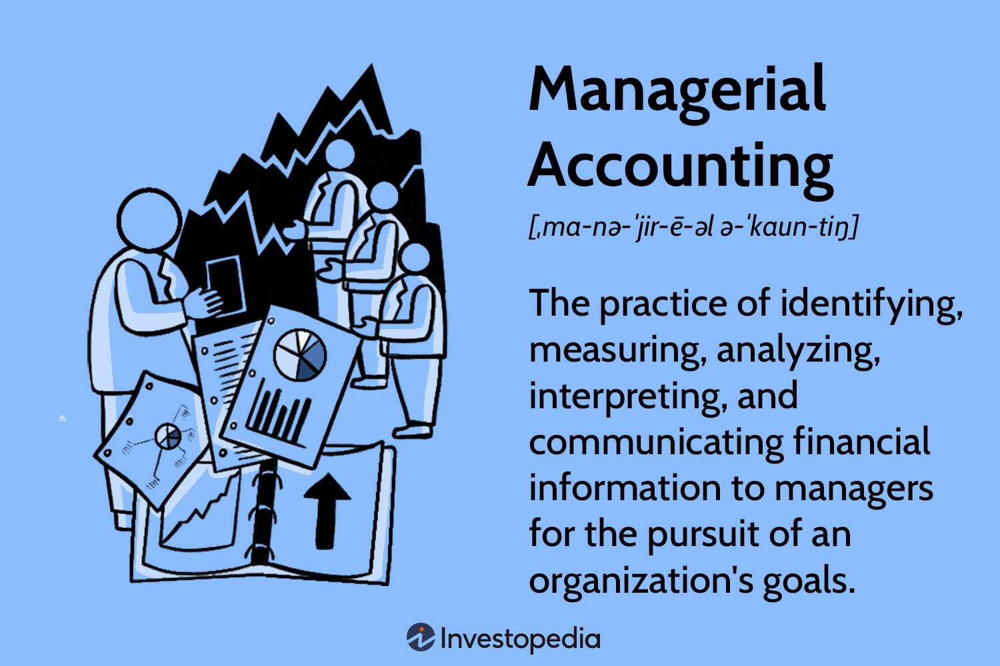

Understanding the synergy between financial decision-making, business management, managerial accounting, and algorithmic trading is crucial for modern businesses. These interconnected elements constitute the backbone of efficient strategic planning and operations in today's evolving financial landscape. Financial decision-making forms the foundation by providing the strategic direction necessary to steer corporate growth and sustainability. Accurate data analysis and risk assessment are paramount, promising sound financial performance projections. This is where managerial accounting plays an essential role, offering actionable insights that drive informed decisions.

Managerial accounting distinguishes itself by concentrating on internal analysis rather than external reporting. It supports strategic planning by facilitating the planning, forecasting, and budgeting processes within organizations. Techniques such as cost accounting and performance measurement are instrumental in refining business operations to achieve efficiency.



Simultaneously, algorithmic trading represents a significant advancement in leveraging technology for financial markets. It employs complex algorithms to automate trading tasks, executing high-frequency strategies that exploit market inefficiencies. This dynamic area benefits substantially from quantitative finance, which provides the mathematical and statistical foundation required for algorithm development and implementation.

The integration of these domains enables businesses to harness the full potential of modern financial strategies. This integration facilitates the anticipation and response to market trends, thus optimizing financial performance. By utilizing managerial accounting to generate deep insights and coupling these with algorithmic trading strategies, companies can develop robust trading algorithms and strategic management processes.

In the subsequent discussion, we will elaborate on the pivotal role managerial accounting plays in decision-making and explore the transformative potential of algorithmic trading. This exploration aims to provide a comprehensive understanding of how these elements contribute to enhanced business success and improved financial outcomes.

## Table of Contents

## The Role of Financial Decision-Making in Business Management

Financial decision-making is integral to business management, directly influencing the trajectory of corporate growth and sustainability. At its core, it involves the systematic analysis of financial data to make informed strategic decisions. This process requires a thorough evaluation of potential risks and a detailed projection of the company's future financial performance.

The decision-making process often begins with the gathering and analysis of financial data, a task primarily supported by managerial accounting. Managerial accounting focuses on internal data analysis, offering insights that are crucial for making sound financial decisions. Unlike financial accounting, which looks at a company's overall financial health and reports to external stakeholders, managerial accounting zeroes in on specific segments of the business. This specialization allows managers to identify areas of potential inefficiency and develop strategies to address them.

Effective financial decision-making also necessitates risk assessment. This involves the identification of existing and potential financial risks, such as market [volatility](/wiki/volatility-trading-strategies) or investment uncertainties. Quantitative methods, like sensitivity analysis and scenario analysis, are often employed to evaluate these risks. Such methods provide insight into how different variables can impact financial outcomes, helping managers to mitigate risks proactively.

Additionally, projecting future financial performance is a critical component of decision-making. This projection involves predicting future revenue, expenses, and cash flow, using historical data as a reference point. Financial modeling tools can be particularly useful in this context. For example, a Python script might be used to create a financial model that simulates various business scenarios, using libraries like NumPy and Pandas for data handling and analysis:

```python
import numpy as np
import pandas as pd

# Sample data representing past financial performance
past_data = pd.DataFrame({
    'Revenue': [100000, 150000, 200000],
    'Expenses': [50000, 70000, 90000]
})

# Calculating past profit
past_data['Profit'] = past_data['Revenue'] - past_data['Expenses']

# Forecasting future revenue assuming a 10% year-over-year growth
growth_rate = 0.10
projected_revenue = past_data['Revenue'] * (1 + growth_rate)

# Displaying projected revenue
print("Projected Revenue for next year:", projected_revenue.iloc[-1])
```

Such models aid in visualizing potential future states, allowing managers to make decisions that are aligned with both short-term and long-term business goals.

Managerial accounting acts as the backbone of financial decision-making, providing actionable insights that facilitate strategic planning and informed decision-making. By analyzing current financial data and projecting future performance, businesses can ensure sustained growth and competitive advantage. This interplay of data analysis, risk assessment, and forecasting forms the foundation of financial decision-making, highlighting its pivotal role in business management.

## Managerial Accounting: A Tool for Strategic Planning

Managerial accounting plays a pivotal role in strategic planning by supplying critical data essential for planning, forecasting, and budgeting within organizations. Unlike financial accounting, which concentrates on generating reports for external stakeholders, managerial accounting is designed to assist internal managers in making informed decisions that enhance operational efficiency.

One of the primary techniques of managerial accounting is cost accounting, which involves analyzing the costs of production and operations to determine optimal pricing strategies and cost management. This approach allows businesses to allocate their resources more effectively and identifies areas where cost reductions are achievable. By understanding the cost structure, organizations can make strategic adjustments to improve their profitability.

Performance measurement is another crucial aspect of managerial accounting. It involves the use of various financial and non-financial metrics to evaluate the efficiency and effectiveness of an organization's operations. Commonly used performance measurement tools include balanced scorecards, key performance indicators (KPIs), and benchmarking against industry standards. These tools help identify performance gaps and areas needing improvement, enabling companies to align their operational objectives with strategic goals.

Financial forecasting is an essential component of managerial accounting that helps organizations predict future financial trends based on historical data, current market conditions, and economic indicators. This process often involves the construction of financial models to project revenues, expenses, and cash flows. For example, a simple linear regression model can be employed to estimate future sales based on past trends. In Python, this can be achieved using libraries like pandas and statsmodels:

```python
import pandas as pd
import statsmodels.api as sm

# Sample data for sales forecasting
data = {'Month': [1, 2, 3, 4, 5, 6], 'Sales': [200, 220, 250, 270, 300, 320]}
df = pd.DataFrame(data)

# Defining the independent and dependent variables
X = df['Month']
Y = df['Sales']
X = sm.add_constant(X)  # Add a constant term for the intercept

# Performing linear regression
model = sm.OLS(Y, X).fit()

# Forecasting future sales
future_months = pd.DataFrame({'Month': [7, 8, 9]})
future_months = sm.add_constant(future_months)
forecast = model.predict(future_months)

print(f"Future sales predictions: {forecast}")
```

Managerial accounting is thus indispensable for strategic planning as it offers a multitude of analytical tools that facilitate effective resource management and strategic decision-making. By leveraging these techniques, organizations can optimize their operations, allocate resources efficiently, and maintain a competitive edge in an ever-changing business landscape.

## Algorithmic Trading: Leveraging Technology in Financial Markets

Algorithmic trading employs sophisticated mathematical models and algorithms to automate the execution of trading orders in financial markets. This method decisively shifts the traditional trading paradigm by minimizing human intervention and leveraging computational power to enhance operational efficiency and accuracy.

Central to [algorithmic trading](/wiki/algorithmic-trading) are high-frequency trading ([HFT](/wiki/high-frequency-trading-strategies)) strategies. HFT capitalizes on executing a large number of orders at exceptionally high speeds, often within microseconds. These strategies exploit minor price discrepancies and [liquidity](/wiki/liquidity-risk-premium) imbalances, generating profits from small price fluctuations that occur within brief time frames. The ability of algorithms to respond instantly to market events, process vast volumes of information, and execute trades at velocities beyond human capacity exemplifies the strategic advantage of algorithmic trading.

Quantitative finance plays an instrumental role in the development and implementation of trading algorithms. Through quantitative models, finance professionals can integrate complex mathematical theories and statistical methods to formulate trading strategies and assess risks. Algorithms are typically based on models that encompass elements such as market microstructure, pricing theories, and statistical [arbitrage](/wiki/arbitrage). For instance, the Black-Scholes model, a foundational concept in options pricing, informs the development of algorithms that determine fair option prices and strategic entry and [exit](/wiki/exit-strategy) points for trades.

The integration of [machine learning](/wiki/machine-learning) algorithms has further advanced the capabilities of algorithmic trading. By utilizing large datasets, machine learning models can uncover patterns and insights that inform predictive analytics, ultimately optimizing trading decisions. Consider the following Python code snippet that showcases a basic implementation of a machine learning model for predicting stock price movements:

```python
import numpy as np
from sklearn.ensemble import RandomForestClassifier
from sklearn.model_selection import train_test_split
from sklearn.metrics import accuracy_score

# Simulated stock price data (features and target)
X = np.random.rand(1000, 5)  # Features: 1000 samples, 5 features each
y = np.random.randint(0, 2, 1000)  # Target: Binary classification (0 or 1)

# Split data into training and testing sets
X_train, X_test, y_train, y_test = train_test_split(X, y, test_size=0.2, random_state=42)

# Initialize and train the Random Forest model
model = RandomForestClassifier(n_estimators=100, random_state=42)
model.fit(X_train, y_train)

# Predict and evaluate the model
predictions = model.predict(X_test)
accuracy = accuracy_score(y_test, predictions)
print(f"Model Accuracy: {accuracy:.2f}")
```

This code illustrates a fundamental approach to predicting stock price movements using a random forest classifier. Although simplified, it highlights the potential of machine learning to enhance algorithmic trading.

Overall, algorithmic trading transforms financial markets by harnessing technology to automate and optimize trading activities. Its capacity to employ mathematical rigor and computational prowess enables traders to execute sophisticated strategies designed to exploit market inefficiencies and achieve superior financial outcomes.

## Integrating Managerial Accounting with Algorithmic Trading

Integrating managerial accounting with algorithmic trading involves leveraging the analytical capabilities of managerial accounting to refine and enhance algorithmic trading strategies. This fusion facilitates a more strategic approach to financial management, allowing businesses to utilize detailed internal financial data to craft trading algorithms that are both profitable and efficient.

Managerial accounting is fundamental in providing comprehensive cost analysis, performance measurement, and financial forecasting—elements that are essential in constructing effective algorithmic trading models. For instance, cost analysis can be employed to fine-tune trading algorithms, ensuring that they operate within optimal cost parameters and deliver anticipated returns. By analyzing cost behaviors and understanding cost drivers, businesses can identify inefficiencies within their trading strategies and make necessary adjustments to maximize profitability.

Furthermore, forecasting processes inherent in managerial accounting allow businesses to predict future market trends, which enhances the development of algorithms capable of exploiting market inefficiencies. By employing historical data and statistical techniques, traders can forecast price movements and [volume](/wiki/volume-trading-strategy) trends, leading to the formulation of trading algorithms that are statistically calibrated to respond to anticipated market conditions.

An example of this integration could involve using a Managerial Accounting Information System (MAIS) to aggregate and process financial data that informs algorithmic trading decision-making. For instance, the following Python snippet demonstrates a basic logistic regression model, a statistical method often used in trading algorithms to predict binary outcomes, such as a price increase or decrease:

```python
import pandas as pd
from sklearn.model_selection import train_test_split
from sklearn.linear_model import LogisticRegression
from sklearn.metrics import accuracy_score

# Sample dataset loading
data = pd.read_csv('financial_data.csv')  # Hypothetical file
features = data[['financial_metric1', 'financial_metric2']]  # Example features from managerial accounting insights
target = data['price_movement']  # Binary target for price movement

# Splitting data into training and test sets
X_train, X_test, y_train, y_test = train_test_split(features, target, test_size=0.2, random_state=42)

# Logistic Regression Model
model = LogisticRegression()
model.fit(X_train, y_train)

# Predictions
predictions = model.predict(X_test)

# Accuracy
accuracy = accuracy_score(y_test, predictions)
print(f'Model Accuracy: {accuracy:.2f}')
```

This example demonstrates how specific financial metrics gleaned from managerial accounting can be critical inputs for trading models, thereby enhancing the predictive accuracy of algorithmic strategies. Such integration ensures that decision-making is not only data-driven but also aligned with the financial goals of the business.

Ultimately, the intertwining of managerial accounting and algorithmic trading empowers businesses to make informed decisions that are cost-effective and strategically aligned with market dynamics. This synergy is pivotal in achieving superior financial performance and gaining a competitive advantage in today's fast-paced financial markets.

## Case Studies and Applications

While the integration of managerial accounting and algorithmic trading is a theoretically appealing concept, its real-world application provides tangible evidence of its effectiveness. Several case studies highlight how businesses leverage these integrated practices to enhance financial decision-making and secure a competitive advantage. 

One notable example is a multinational corporation in the consumer goods sector that integrated managerial accounting insights with an algorithmic trading system to fine-tune its supply chain management. This company utilized cost accounting data to inform and adjust its trading algorithms in commodities markets, which allowed for dynamic hedging strategies. By doing this, the company reduced procurement costs by 15% annually, demonstrating improved financial performance and operational efficiency. This case underscores the potential for managerial accounting data to refine algorithmic trading strategies, thereby optimizing budget forecasting and risk management.

Another instance involves a financial services firm that adopted a comprehensive performance-tracking system linked with algorithmic trading. By incorporating real-time performance data and variance analysis from managerial accounting, the firm revamped its risk management framework. This approach enabled them to set algorithms that responded to market volatility more adeptly through advanced simulations and scenario planning. As a result, they reduced their exposure to adverse market movements by 20%, contributing to greater portfolio stability. This application illustrates how continuous monitoring and adjustment of performance metrics empower companies to manage risks proactively and maintain financial robustness.

In a further example, a tech company specializing in [artificial intelligence](/wiki/ai-artificial-intelligence) integrated algorithmic trading processes with managerial accounting to enhance decision-making in R&D investments. The data visualization capabilities of managerial accounting were employed to analyze resource allocation efficiency. By optimizing these insights, the company's trading algorithms could predict the potential market impact of various tech innovations. This strategic alignment led to a 25% increase in the return on R&D investments as the company was better equipped to prioritize projects with the highest market potential.

These case studies highlight the tangible benefits of integrating managerial accounting with algorithmic trading. By marrying internal financial data insights with advanced technological strategies, companies not only improve their decision-making processes but also fortify their competitive positions in dynamic markets. These examples serve as a testament to the effectiveness of these tools in performance tracking and risk management, proving that such integration is not only feasible but also advantageous.

## Challenges and Considerations

Integrating managerial accounting with algorithmic trading offers significant efficiencies and enhanced decision-making capabilities; however, it also presents distinct challenges that businesses must navigate. One primary concern is data management, as both fields rely on vast amounts of data that need to be accurately processed, stored, and analyzed. Proper data management ensures that the algorithms and accounting practices are fed the most relevant and up-to-date information, but this can become increasingly complex as the volume of data grows. Efficient data storage solutions and robust data processing infrastructures are important investments that businesses must consider.

Technological costs are another significant challenge. Developing and maintaining the sophisticated algorithms required for algorithmic trading is resource-intensive. Moreover, integrating these algorithms with managerial accounting systems can demand hefty initial investments and ongoing maintenance costs. These might include the purchase of advanced software, hardware upgrades, and the hiring of technical experts to facilitate integration and troubleshoot issues as they arise.

The necessity for skilled personnel is critical as these systems become more advanced. There is a growing demand for employees who possess a hybrid skill set, combining a strong grasp of financial accounting principles with adeptness in programming and data analysis. Recruiting and retaining such talent can be challenging and costly, potentially creating barriers for companies attempting to implement these integrated systems.

The ongoing need for system updates and security measures is another consideration. Technological advancements occur rapidly, and businesses must continuously update their systems to stay competitive. These updates are essential not only for enhancing performance but also for closing potential security vulnerabilities. Cybersecurity becomes paramount as the interconnectedness of financial systems increases the potential for data breaches or other cyber threats.

Managing volatility in financial markets is a further challenge associated with algorithmic trading. Algorithms must be designed to adapt to rapid market shifts and fluctuations, necessitating ongoing monitoring and recalibration. This dynamic environment imposes additional demands on businesses to ensure their systems are resilient and responsive.

Finally, ensuring compliance with financial regulations is a significant consideration. The integration of managerial accounting and algorithmic trading must adhere to the regulatory frameworks that govern financial reporting and trading activities. As regulations evolve, businesses must stay informed and adjust their practices accordingly to avoid legal repercussions.

In summary, while the integration of managerial accounting with algorithmic trading offers potential benefits, addressing the complexities of data management, technological investments, talent acquisition, system updates, market volatility, and regulatory compliance is essential for successful implementation.

## Conclusion

The integration of financial decision-making, managerial accounting, and algorithmic trading is increasingly recognized as essential for modern enterprises striving for financial efficiency and success. These elements collectively offer a comprehensive framework for navigating the complexities of today's business environments. By leveraging data-driven insights, companies can refine their strategic management processes and enhance their decision-making capabilities.

Financial decision-making serves as the backbone of business management, guiding strategic choices crucial for corporate growth and sustainability. The actionable insights provided by managerial accounting inform these decisions, facilitating more accurate budgeting, forecasting, and strategic planning. Techniques such as cost accounting and performance measurement allow businesses to analyze their operations intricately, thereby optimizing operational efficiency.

Algorithmic trading, characterized by its use of advanced mathematical models and algorithms, automates trading decisions and capitalizes on market inefficiencies. The fusion of quantitative finance in algorithm development plays a significant role in implementing sophisticated trading strategies. This aspect of modern financial markets also underscores the intersection of technology and finance, enhancing the ability to manage complex trading tasks with precision.

The integration of managerial accounting with algorithmic trading offers a holistic approach to financial management. Such synergy allows businesses to better anticipate market trends and optimize their financial performance by aligning internal capabilities with external opportunities. For instance, companies can utilize cost analysis to design trading algorithms that maximize profitability.

Looking ahead, the fusion of these disciplines is poised to grow in importance, as businesses increasingly rely on technology and data analytics to maintain competitiveness. The continuous evolution of these practices promises further innovation in strategic management, ensuring that companies who adeptly integrate these elements can achieve a substantial competitive edge. As such, remaining attuned to technological advancements and adept at integrating these diverse financial practices will be crucial for business success in the future.

## References & Further Reading

[1]: Bergstra, J., Bardenet, R., Bengio, Y., & Kégl, B. (2011). ["Algorithms for Hyper-Parameter Optimization."](https://dl.acm.org/doi/10.5555/2986459.2986743) Advances in Neural Information Processing Systems 24.

[2]: ["Advances in Financial Machine Learning"](https://www.amazon.com/Advances-Financial-Machine-Learning-Marcos/dp/1119482089) by Marcos Lopez de Prado

[3]: ["Evidence-Based Technical Analysis: Applying the Scientific Method and Statistical Inference to Trading Signals"](https://www.amazon.com/Evidence-Based-Technical-Analysis-Scientific-Statistical/dp/0470008741) by David Aronson

[4]: ["Machine Learning for Algorithmic Trading"](https://github.com/stefan-jansen/machine-learning-for-trading) by Stefan Jansen

[5]: ["Quantitative Trading: How to Build Your Own Algorithmic Trading Business"](https://www.amazon.com/Quantitative-Trading-Build-Algorithmic-Business/dp/1119800064) by Ernest P. Chan