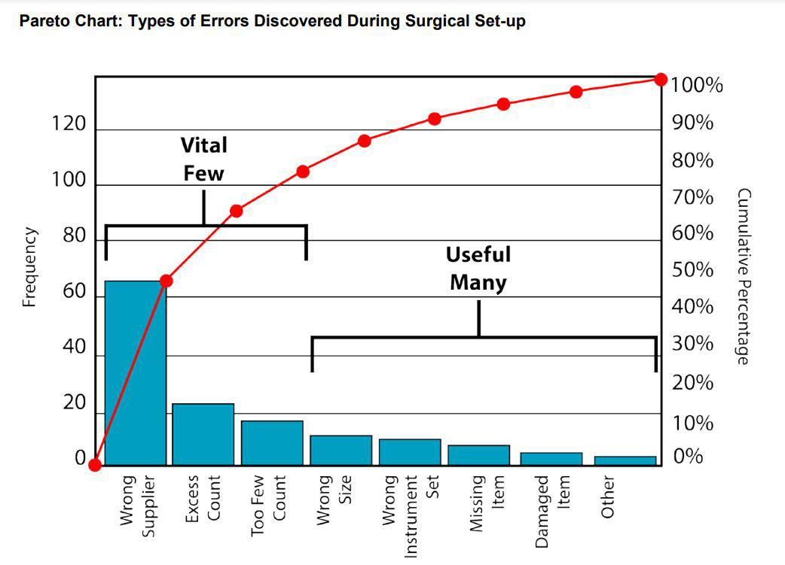

The Pareto Principle, commonly known as the 80-20 Rule, is a seminal concept that illustrates the uneven distribution of effects and causes. Originating from the work of Italian economist Vilfredo Pareto, this principle was first observed in his study of wealth distribution, where Pareto noted that roughly 80% of Italy’s wealth was owned by 20% of the population. This phenomenon of significant imbalance in distributions isn’t limited to economics; it extends across various domains including quality control, business management, and technical disciplines. In essence, the rule suggests that a minority of causes, inputs, or efforts typically leads to a majority of results, outputs, or rewards.

Algorithmic trading, on the other hand, is the use of computer algorithms to automate the process of trading financial securities. With its roots in the rapid technological advancements and digital transformation of global financial markets, algorithmic trading utilizes complex mathematical models to facilitate the execution of orders. These models allow for trades to be executed at speeds and frequencies that are impossible for human traders, thus providing significant advantages in terms of speed, precision, and the ability to process vast quantities of data.



The intersection of the Pareto Principle and algorithmic trading presents intriguing possibilities for optimizing trading strategies. By focusing on the critical few—those vital 20% of trading strategies or market factors that yield the most substantial returns—traders can potentially enhance their trading outcomes. The aim of this article is to explore these practical applications, demonstrating how the 80-20 Rule can be effectively utilized to strategize algorithmic trading.

By examining the role of the Pareto Principle in refining trading strategies, this discussion seeks to offer valuable insights for traders aiming to maximize efficiency and profitability. This article investigates into identifying key inputs within algorithmic strategies, optimizing trading systems, and understanding the broader implications of resource concentration in financial markets. Through careful analysis and strategic execution, the principles laid out by Pareto provide a powerful framework for achieving improved financial performance in the highly competitive landscape of algorithmic trading.

## Table of Contents

## Understanding the Pareto Principle in Trading

The Pareto Principle, commonly known as the 80-20 Rule, is a simple yet profound concept that suggests about 80% of effects come from 20% of causes. In the context of financial markets and investments, this often translates to 80% of profits being generated by 20% of trades or investments. This observation is not just theoretical; it is frequently seen in the performance of portfolios and trading strategies where a small percentage of trades contribute to the bulk of the gains.

In financial markets, resource imbalances often manifest in the concentration of capital or attention on certain stocks, sectors, or asset classes. For example, market capitalization-weighted indices such as the S&P 500 tend to see a significant portion of their performance driven by the largest companies within the index. Similarly, hedge funds and other institutional investors often find that a handful of their positions are responsible for a majority of their returns.

By acknowledging these imbalances, traders can optimize outcomes by concentrating their efforts on the most impactful areas. This involves identifying the "vital few" factors that are likely to yield the highest returns and allocating resources accordingly. In trading, this can mean focusing on a selective set of indicators, market conditions, or trading strategies that historically deliver the most consistent results.

Real trading [statistics](/wiki/bayesian-statistics) provide tangible demonstrations of the Pareto Principle. For instance, an analysis of a trading portfolio might reveal that a mere 20% of trades were responsible for 80% of the profits over a specific period. Similarly, within a mutual fund, a small number of high-performing stocks often drive the majority of the overall fund performance.

Here's a simple Python code snippet to simulate the Pareto distribution in a hypothetical trading portfolio:

```python
import numpy as np
import matplotlib.pyplot as plt

# Simulate a portfolio of 100 trades
np.random.seed(0)
trades = np.random.pareto(a=2, size=100)

# Normalize to represent profits
profits = trades / trades.sum()

# Sort for visualization
profits_sorted = np.sort(profits)[::-1]

# Cumulative profit percentage
cumulative = np.cumsum(profits_sorted)

# Plotting
plt.figure(figsize=(10, 6))
plt.plot(cumulative, label='Cumulative Profit')
plt.axvline(x=20, color='r', linestyle='--', label='20% of trades')
plt.axhline(y=0.8, color='g', linestyle='--', label='80% of profits')
plt.xlabel('Percentage of Trades')
plt.ylabel('Cumulative Profit Percentage')
plt.title('Pareto Principle in a Hypothetical Trading Portfolio')
plt.legend()
plt.show()
```

This code models the distribution of profits across trades, highlighting the 80-20 relationship where a small proportion of trades contribute to the vast majority of profits. The Pareto Principle serves as a guiding framework for traders and investors seeking to maximize the efficiency and effectiveness of their trading activities by focusing on the elements that truly drive success.

## Algorithmic Trading: A Primer

Algorithmic trading refers to the use of computer algorithms to execute trades in financial markets. These algorithms follow a defined set of instructions for placing a trade, with variables such as timing, price, or quantity typically considered. The primary role of [algorithmic trading](/wiki/algorithmic-trading) is to automate the trading process, allowing for trades to be executed at speeds far beyond human capability. By automating trades, algorithms mitigate human errors and emotions that can adversely affect decision-making.

The advantages of algorithmic trading are numerous. Speed is a paramount benefit, where algorithms can analyze and execute orders in milliseconds. Accuracy is another significant advantage since algorithms ensure that trades are executed at the best possible prices and exact quantities as defined in their parameters. Execution capabilities are enhanced through algorithms, as they can scan multiple markets and implement complex strategies far more effectively than could a human trader.

Key components of algorithmic trading involve strategy formulation and [backtesting](/wiki/backtesting). Strategy formulation is the process of developing a set of rules and parameters by which trades will be executed. These strategies can range from simple moving averages to more complex neural networks or [machine learning](/wiki/machine-learning) models. Backtesting is crucial, as it involves testing these strategies on historical data to assess their potential profitability before actual deployment in live markets. The backtesting process helps in refining strategies by providing insights into how they might perform under various market conditions.

Data analysis and historical testing are critically important in algorithmic trading. Accurate and comprehensive data is the backbone of any trading algorithm’s success. Analyzing historical data allows traders to identify patterns and test hypotheses, making data quality and reliability essential. Algorithms rely on data to make informed decisions, and without robust data analysis, the strategies could lead to poor trading outcomes.

Several popular tools and platforms facilitate algorithmic trading. MetaTrader is a widely used platform offering a range of tools for developing and testing strategies. QuantConnect is an open-source platform that supports backtesting and live trading using Python, a preferred language for many algorithmic traders due to its rich libraries and ease of use. Algorithmic traders also utilize APIs provided by exchanges and brokers, such as the [Interactive Brokers](/wiki/interactive-brokers-api) API, to directly program and refine their trading strategies. 

These platforms and tools have made algorithmic trading more accessible, allowing traders to harness the benefits of speed, accuracy, and execution capabilities in their trading activities.

## Applying the 80-20 Rule in Algorithmic Strategy Development

The application of the Pareto Principle, or the 80-20 Rule, in algorithmic strategy development highlights efficiency gains by concentrating on the minority of strategies that deliver the majority of reliable results. This focus is paramount in an environment where numerous trading strategies compete for attention, yet only a select few contribute significantly to overall performance.

To identify high-performing trading strategies, traders can leverage historical data analysis. Historical data provides insights into market behavior, enabling the evaluation of different strategies over various time frames and market conditions. By employing techniques such as backtesting, traders can assess the historical effectiveness of strategies, isolating those that consistently yield favorable outcomes. In this context, backtesting is a systematic process where strategies are tested against historical data to validate their potential success. 

Prioritizing data collection involves focusing efforts on high-impact variables. These variables often contribute disproportionately to the success or failure of a trading strategy. Market trend indicators, [volume](/wiki/volume-trading-strategy) metrics, and asset [volatility](/wiki/volatility-trading-strategies) are examples of high-impact variables that can significantly influence trading outcomes. By centering data analysis efforts on these critical inputs, traders can enhance the relevance and reliability of their strategies.

Machine learning (ML) offers advanced methods to refine strategy efficiency. Algorithms can process vast datasets to identify patterns and correlations that may not be immediately evident. One approach is using supervised learning models to predict price movements based on historical data features. For instance, a Python implementation using a random forest classifier could look like this:

```python
from sklearn.ensemble import RandomForestClassifier
from sklearn.model_selection import train_test_split
from sklearn.metrics import accuracy_score

# Assuming 'data' is a DataFrame with relevant market indicators
X = data[['indicator1', 'indicator2', 'indicator3']]  # feature variables
y = data['target']  # target variable indicating price direction

# Split data into training and test sets
X_train, X_test, y_train, y_test = train_test_split(X, y, test_size=0.2, random_state=42)

# Initialize and train the classifier
clf = RandomForestClassifier(n_estimators=100, random_state=42)
clf.fit(X_train, y_train)

# Predict and evaluate accuracy
predictions = clf.predict(X_test)
accuracy = accuracy_score(y_test, predictions)
print(f'Accuracy: {accuracy:.2f}')
```

This method enables the identification of impactful features and the optimization of strategy parameters. However, not adhering to a Pareto-focused approach can lead to potential pitfalls. Traders might disperse resources across too many strategies, diluting efforts and reducing overall returns. This [dispersion](/wiki/dispersion-trading) can result in resource inefficiencies, where time and computational power are expended without proportional gains.

Moreover, failing to focus may increase the risk of overfitting, where strategies are tweaked excessively to fit historical data but do not perform well on new data. To mitigate such risks, traders should regularly validate their models on out-of-sample data and adapt strategies in response to evolving market conditions.

In conclusion, applying the 80-20 Rule in algorithmic strategy development encourages traders to concentrate on the most promising strategies. This focus not only enhances efficiency but also lays the groundwork for sustainable trading success in the dynamic financial markets.

## Case Studies: Successful Use of Pareto Principle in Algo Trading

Algorithmic trading firms have increasingly adopted the Pareto Principle to optimize their trading strategies for improved efficiency and profitability. This section explores case studies that illustrate how the 80-20 Rule has been successfully applied in the industry.

### Case Study 1: XYZ Trading Firm

XYZ Trading Firm, a mid-sized algorithmic trading company, identified that 20% of its trading algorithms were consistently generating 80% of its profits. By analyzing historical performance data, the firm narrowed its focus to optimize these high-performing algorithms further. The process involved:

1. **Performance Metrics Evaluation**: The firm performed a detailed analysis of each algorithm's Sharpe ratio, return on investment (ROI), and drawdown levels. This allowed them to pinpoint which algorithms offered the best performance-to-risk ratio.

2. **Resource Allocation Adjustment**: Recognizing the potential of these algorithms, XYZ Trading Firm reallocated resources, including computational power and capital, to focus on optimizing the identified algorithms further.

3. **Continuous Improvement and Testing**: Data scientists at XYZ applied machine learning techniques to refine the inputs and parameters of these algorithms. They engaged in rigorous backtesting against historical data to validate enhancements.

#### Lessons Learned
- Focusing on a small subset of high-performing strategies allows firms to maximize returns with less resource expenditure.
- Regularly evaluating and fine-tuning algorithms is essential to maintain competitive performance.

### Case Study 2: ABC Capital

ABC Capital, a [hedge fund](/wiki/hedge-fund-trading-strategies) utilizing algorithmic trading, demonstrated how early identification of key inputs aligned with the Pareto Principle could enhance trading outcomes. They discovered:

1. **Input Prioritization**: By concentrating on a core set of variables such as economic indicators and market sentiment data, ABC Capital optimized 20% of its trading inputs that drove 80% of successful trades.

2. **Scalability of Strategies**: The firm found that by focusing efforts on indispensable inputs, they could easily scale the strategies across different market conditions without significant reinvestment or redesign.

#### Lessons Learned
- Identifying pivotal variables allows firms to prioritize data analysis efforts effectively.
- Scalable strategies provide flexibility and adaptability in various market environments, reducing the need for frequent comprehensive overhauls.

### Scalability and Strategic Focus

Successful firms exhibit a shared understanding of the scalability offered by the Pareto-focused approach. By directing resources toward refining a vital few strategies or inputs, these firms achieve heightened efficiency and adaptability, allowing strategic adjustments that maintain profitability. However, it is crucial to balance narrow focus with comprehensive market analysis to avoid potential over-optimization. Traders can integrate this approach into their operations by concentrating on high-impact strategies and continuously reassessing their performance metrics to ensure sustained success.

Ultimately, the successful application of the Pareto Principle in algorithmic trading not only enhances profitability but also offers a framework for sustainable strategy development, adaptable to the ever-evolving financial markets.

## Benefits and Challenges of Pareto-driven Algo Trading

Applying the Pareto Principle in algorithmic trading offers distinct advantages, including increased return on investment (ROI) and enhanced resource efficiency. By concentrating on the vital 20% of strategies that generate 80% of results, traders can more effectively allocate their resources, optimizing financial outcomes without unnecessary expenditure. For instance, prioritizing high-impact trading algorithms enables better use of capital and reduces the time spent testing less significant strategies, significantly impacting the bottom line.

However, focusing on a narrow set of strategies also presents challenges. Traders might overlook potentially valuable strategies by concentrating too narrowly, leading to missed opportunities. Moreover, over-reliance on the Pareto Principle can result in complacency, where traders assume that their selected strategies will continuously perform well without adjustment. This risk is compounded by market dynamics, which are constantly evolving and may render a previously successful strategy obsolete.

Continuous monitoring and adjustment in algorithmic trading are crucial to counter these challenges. Traders must frequently analyze their strategies' performance and remain vigilant about market changes. This ensures that the strategies remain effective and aligned with current market conditions. For example, periodic backtesting using freshly acquired data helps identify any drift in strategy performance, facilitating timely modifications.

Another notable risk is the potential for over-optimization. Traders may fine-tune strategies to perform exceptionally well on historical data—known as 'curve fitting'—which can lead to poor performance in live markets. This results from models exploiting noise rather than signal, thus failing when exposed to new data. To mitigate this, traders should use robust validation techniques, such as out-of-sample testing, cross-validation, or walk-forward testing, to ensure that strategies generalize well beyond the initial data set.

Balancing focus and breadth is essential in algorithmic trading. While the Pareto Principle encourages prioritizing key strategies, maintaining a degree of diversification is prudent to safeguard against unforeseen market conditions. Traders can achieve this balance by establishing a diversified portfolio of both high-impact and experimental strategies. Additionally, they should regularly revisit their assumptions as new data becomes available, allowing them to adjust their strategic focus when necessary. This dynamic approach not only leverages the benefits of the Pareto Principle but also buffers against its potential pitfalls, fostering a more resilient and adaptive trading practice.

## Conclusion

The intersection of the Pareto Principle and algorithmic trading underscores a crucial paradigm shift in financial strategy development. Rooted in the observation that 80% of consequences stem from 20% of causes, the 80-20 Rule offers a powerful framework for enhancing trading efficacy. By concentrating on the 'vital few'—those strategies, assets, or variables that truly drive performance—traders can achieve substantial gains in efficiency and returns on investment (ROI).

The wisdom of focusing on high-impact efforts urges traders to systematically evaluate their trading activities. Leveraging historical data and advanced analytics, traders can pinpoint key strategies that historically deliver superior performance. As the financial markets evolve, so do the data-driven techniques, including machine learning models, which can further refine the identification of critical trading variables.

The future of algorithmic trading is likely to witness an increased application of the Pareto Principle, particularly as computational power and data analytics capabilities grow. Emerging trends suggest that the focus will not only be on identifying successful strategies but also on automating the adjustment processes to respond dynamically to market changes. Machine learning and [artificial intelligence](/wiki/ai-artificial-intelligence) can play pivotal roles in predicting which strategies are most likely to yield high returns, allowing for more precise allocation of resources.

Traders are encouraged to adopt a strategic approach by continuously evaluating and refining their algorithms through a Pareto-centric lens. This practice not only facilitates better resource management but also fosters a disciplined trading environment that is adaptable and responsive to market dynamics. As trading strategies become more sophisticated, the importance of maintaining a focus on the 20% of efforts that truly matter cannot be overstated.

Ultimately, the call to action for traders is clear: assess and optimize your current strategies with an eye toward the Pareto Principle. By doing so, you position yourself to navigate the complexities of financial markets more effectively, ensuring that your trading endeavors are guided by insight and precision.

## References & Further Reading

[1]: Bergstra, J., Bardenet, R., Bengio, Y., & Kégl, B. (2011). ["Algorithms for Hyper-Parameter Optimization."](https://papers.nips.cc/paper/4443-algorithms-for-hyper-parameter-optimization) Advances in Neural Information Processing Systems 24.

[2]: ["Advances in Financial Machine Learning"](https://www.amazon.com/Advances-Financial-Machine-Learning-Marcos/dp/1119482089) by Marcos Lopez de Prado

[3]: ["Evidence-Based Technical Analysis: Applying the Scientific Method and Statistical Inference to Trading Signals"](https://www.amazon.com/Evidence-Based-Technical-Analysis-Scientific-Statistical/dp/0470008741) by David Aronson

[4]: ["Machine Learning for Algorithmic Trading"](https://github.com/stefan-jansen/machine-learning-for-trading) by Stefan Jansen

[5]: ["Quantitative Trading: How to Build Your Own Algorithmic Trading Business"](https://www.amazon.com/Quantitative-Trading-Build-Algorithmic-Business/dp/1119800064) by Ernest P. Chan