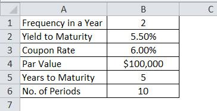

In the rapidly evolving field of quantitative finance, the integration of quantitative research techniques with algorithmic trading represents a crucial advancement. Algorithmic trading, which uses computer algorithms to automatically execute trading strategies, benefits immensely from the precision and systematization offered by quantitative research. Within this framework, sensitivity analysis has emerged as a vital tool for enhancing trading strategies. 

Sensitivity analysis involves systematically varying input parameters to assess their impact on the outputs of a model. This method provides traders with insights into which components of their trading strategies are most influential in determining performance outcomes. By doing so, it highlights the importance of understanding, developing, and fine-tuning trading algorithms in order to ensure robustness and reliability.



The significance of sensitivity analysis lies in its ability to dissect the robustness of trading models under various scenarios. By evaluating how changes in parameters such as market conditions, entry and exit points, or risk thresholds affect strategy performance, traders can optimize their models. This process enables the identification of potential weak spots within a strategy, such as overfitting, and allows for their correction.

Moreover, sensitivity analysis facilitates the development of trading strategies that are more resilient to market fluctuations and unforeseen events. By evaluating a range of potential outcomes through robust testing methodologies, traders can better prepare for adverse conditions and reduce the risks of deploying fragile strategies in dynamic environments.

In summary, sensitivity analysis not only enhances the robustness of algorithmic trading strategies but also ensures their adaptability to changing market conditions. Through this analytical framework, traders can make informed adjustments that improve the dependability and performance of their strategies in real-world trading scenarios.

## Table of Contents

## Understanding Sensitivity Analysis

Sensitivity analysis is a critical component of algorithmic trading, allowing traders to understand how changes in input parameters affect the outcomes of trading models. The process involves systematically altering variables such as entry and exit points, position sizes, and stop-loss levels to evaluate their effects on trading performance. This approach helps in determining which parameters have the most significant influence on a strategy’s success, enabling traders to fine-tune their algorithms for better performance.

In [algorithmic trading](/wiki/algorithmic-trading), sensitivity analysis serves as a foundation for enhancing the robustness and adaptability of strategies. By examining the impact of varying input parameters, traders can detect potential vulnerabilities in their models and make necessary adjustments to prevent overfitting, which is the risk of a model being too tailored to historical data and thus failing under new conditions. A model that performs exceptionally well in historical testing but poorly in live trading is often overfitted.

For instance, a trader might use sensitivity analysis to explore different stop-loss levels. By adjusting this parameter and analyzing the resultant performance, the trader can identify a stop-loss point that maintains profitability while minimizing risk. The objective is to ensure that the strategy remains effective across different market scenarios, highlighting which parameters are crucial for sustaining performance.

A practical method for conducting sensitivity analysis is through simulations. Traders can utilize computational tools to conduct a series of test runs with varied parameters, observing how changes affect the overall strategy. Here is a basic example in Python, demonstrating how one might conduct such an analysis on a trading algorithm:

```python
import numpy as np

def trading_strategy(entry_threshold, exit_threshold, data):
    # Simplified trading algorithm based on entry and exit points
    # Returns profit or loss
    profit = 0
    for price in data:
        if price > entry_threshold:
            profit += price - exit_threshold
    return profit

# Sensitivity analysis over a range of thresholds
entry_points = np.arange(100, 200, 10)
exit_points = np.arange(90, 190, 10)
historical_data = np.random.randint(80, 220, size=100)  # Sample price data

# Evaluating strategy performance across parameter space
results = []
for entry in entry_points:
    for exit in exit_points:
        performance = trading_strategy(entry, exit, historical_data)
        results.append((entry, exit, performance))

# Output the best-performing parameter set
best_parameters = max(results, key=lambda x: x[2])
print(f"Best Parameters: Entry={best_parameters[0]}, Exit={best_parameters[1]}, Profit={best_parameters[2]}")
```

The overarching goal of sensitivity analysis in trading is to distinguish strategies that maintain their effectiveness under various conditions from those prone to failure when markets shift. By integrating sensitivity analysis into the development process, traders increase the likelihood of implementing strategies that are not only profitable but also resilient to the unpredictable nature of financial markets.

## Tools and Techniques for Sensitivity Analysis

Sensitivity analysis in algorithmic trading employs several key techniques to evaluate and enhance trading strategies. Among these, Monte Carlo simulations, parameter optimization, noise testing, and out-of-sample testing are prominent.

Monte Carlo simulations are used for assessing trading strategy outcomes by simulating a broad spectrum of potential market scenarios. The method involves generating a large number of random samples to analyze the probability distribution of returns over a specified period. By inputting various market conditions and random events, traders can evaluate how their strategies might perform under different circumstances. This approach provides insight into the potential risks and rewards, allowing for more informed decision-making. Mathematically, Monte Carlo simulations involve evaluating the expected returns $E(R)$ over $N$ scenarios:

$$

E(R) = \frac{1}{N} \sum_{i=1}^{N} R_i 
$$

where $R_i$ represents the return from each simulation scenario.

Parameter optimization is aimed at determining the parameter values within a trading model that yield the most robust performance. This process involves systematically adjusting parameters like entry points, [exit](/wiki/exit-strategy) points, and stop-loss levels to identify configurations that maximize returns while minimizing risks. Techniques such as grid search or more advanced optimization algorithms (e.g., genetic algorithms) are employed to explore the parameter space efficiently. For instance, a simple grid search in Python might look like:

```python
import numpy as np

def optimize_strategy(parameters, data):
    best_score = -np.inf
    best_params = None
    for param_set in parameters:
        score = evaluate_strategy(param_set, data)
        if score > best_score:
            best_score = score
            best_params = param_set
    return best_params, best_score
```

Noise testing is crucial for ensuring the resilience of trading strategies against data variability, thereby avoiding overfitting. By introducing random noise into historical data, traders can observe whether their strategies maintain stable performance. This approach helps in identifying strategies that may be overly tailored to specific market conditions and, thus, prone to failure when presented with new data.

Out-of-sample testing plays a critical role in validating the performance of a trading strategy on unseen data. After developing a model with historical data, traders test it against different data sets to assess its generalizability. This step is essential to determine if the trading strategy will be robust in live market scenarios, enabling the detection of overfitting before deploying the strategy for real-time trading.

Incorporating these techniques in sensitivity analysis facilitates a comprehensive understanding of trading strategies' behavior, leading to the development of robust, adaptable, and resilient trading models.

## Implementing Sensitivity Analysis with Build Alpha

Build Alpha is a sophisticated platform designed to assist traders in executing sensitivity analysis for algorithmic trading strategies, allowing for a comprehensive evaluation of potential algorithmic weaknesses. By enabling strategy testing under simulated market scenarios, the platform aids in identifying and addressing vulnerabilities, enhancing the overall robustness of trading models.

Robustness tests in Build Alpha are a pivotal feature, ensuring that trading strategies perform consistently across various subsets of data. This functionality is essential for confirming that a strategy’s performance is not merely a result of specific market conditions but is reliable across diverse scenarios. These tests help in validating the resilience of the strategies, ensuring they are not overly optimized for particular historical data but instead have adaptability to future, unseen data.

Furthermore, Build Alpha provides a suite of advanced statistical tools for analyzing key metrics such as drawdowns, risk, and potential profitability. This capacity allows traders to dissect the financial health of their strategies. Analyzing drawdowns—periods in which the trading model is losing value—can highlight the risk exposure and help develop strategies to mitigate such risks. Similarly, by evaluating risk metrics, traders can adjust their strategies to align with their risk tolerance levels and investment objectives.

The advantage of using Build Alpha extends to the optimization of trading algorithms. It equips traders with the necessary tools to refine their models, making them more reliable and responsive to market changes. By continuously testing and optimizing strategies, traders can adjust their parameters to enhance performance, thereby reducing the risk of deploying fragile trading strategies in live markets.

In sum, Build Alpha serves as a critical resource for traders aiming to incorporate sensitivity analysis into their algorithmic trading strategy development. Its comprehensive tools not only improve the reliability of trading models but also contribute to more informed decision-making, ultimately supporting more stable and profitable trading outcomes.

## Real-world Applications and Benefits

Sensitivity analysis in algorithmic trading serves as a critical approach to minimizing the risks associated with executing vulnerable trading strategies in fluctuating market environments. By thoroughly exploring input parameters, traders gain the ability to modify strategies in response to varying market conditions, thereby reducing potential financial losses.

Sensitivity analysis provides a structured framework for assessing how changes in parameters like entry and exit points, position sizing, or market [volatility](/wiki/volatility-trading-strategies) impact trading strategy performance. This examination highlights strategy vulnerabilities, offering traders the insights needed to refine strategies for improved resilience against unpredictable market movements. For example, altering stop-loss levels based on sensitivity tests can help reduce drawdowns, enhancing the overall performance of a trading strategy.

Numerous case studies have demonstrated the practicality of systematic sensitivity testing in live trading scenarios. Through these studies, it has been observed that regular sensitivity analyses lead to significant improvements in strategy performance. For instance, examining the influence of variable market conditions on a trading model's outcomes helps identify weaknesses, allowing traders to make necessary adjustments before launching in live markets. This proactive approach is crucial for mitigating drawdowns, thereby preserving capital and ensuring sustainable trading operations.

Regularly conducting sensitivity analysis aids in constructing robust trading portfolios that are more adept at navigating economic fluctuations. By equipping traders with comprehensive insights into the robustness of their trading algorithms, sensitivity analysis fosters the development of more reliable and adaptive strategies. This analytical method ultimately contributes to more informed decision-making and enhances the stability and profitability of trading endeavors. 

Through systematic evaluation and refinement of strategies, sensitivity analysis plays an indispensable role in advancing the practice of algorithmic trading, ensuring that traders are better prepared to face ongoing market challenges.

## Conclusion

Sensitivity analysis serves as a crucial component in the toolkit of algorithmic trading, contributing significantly to the robustness and efficiency of trading strategies. By allowing traders to identify critical parameters within their models, sensitivity analysis plays a pivotal role in minimizing the risk of overfitting, thereby enhancing the strategy's resilience against market volatility. Overfitting occurs when a model captures noise instead of the underlying signal, leading to poor performance in new, unseen data. By systematically varying model parameters and assessing their impact, traders can distinguish between genuine predictive capabilities and random chance, reducing the likelihood of overfitting and building strategies that endure in various market conditions.

Although sensitivity analysis does not guarantee trading success, it significantly boosts the probability of favorable outcomes by pinpointing and rectifying potential weaknesses in trading strategies. By understanding which parameters exert the most influence, traders can make informed adjustments, thereby optimizing performance. This foresight is invaluable, as it enables strategies to be more adaptive to unexpected market shifts.

Platforms like Build Alpha offer extensive resources and support for traders seeking deeper insights into sensitivity analysis. These platforms provide simulation environments where strategies can be tested under various conditions, offering a robust framework for refinement and optimization. By utilizing such platforms, traders can leverage advanced statistical and computational tools to analyze their strategies comprehensively.

Incorporating sensitivity analysis into strategy development ultimately fosters improved decision-making and more stable trading outcomes. By equipping traders with the ability to preemptively identify and address potential pitfalls, sensitivity analysis enhances the robustness and reliability of trading portfolios, paving the way for more consistent performance in the ever-evolving financial markets.

## References & Further Reading

Bergstra, J., Bardenet, R., Bengio, Y., & Kégl, B. (2011). Algorithms for Hyper-Parameter Optimization. Advances in Neural Information Processing Systems. This paper discusses various algorithms for optimizing hyper-parameters in [machine learning](/wiki/machine-learning) models, essential for enhancing the performance of trading algorithms by efficiently searching the parameter space.

Lopez de Prado, M. (2018). Advances in Financial Machine Learning. This book provides insights into applying machine learning techniques within the financial industry, highlighting methods to improve algorithmic trading strategies through rigorous quantitative research.

Aronson, D. (2007). Evidence-Based Technical Analysis: Applying the Scientific Method and Statistical Inference to Trading Signals. Aronson's work emphasizes using scientific methodology and statistical inference to analyze and enhance trading signals, which is fundamental in developing robust algorithmic trading strategies.

Jansen, S. (2020). Machine Learning for Algorithmic Trading. This book explores machine learning applications specific to algorithmic trading, providing practical examples and strategies to implement data-driven trading systems.

Chan, E. P. (2008). Quantitative Trading: How to Build Your Own Algorithmic Trading Business. Chan outlines the process of establishing an algorithmic trading business, covering various quantitative strategies and the importance of [backtesting](/wiki/backtesting) and sensitivity analysis in strategy development.

