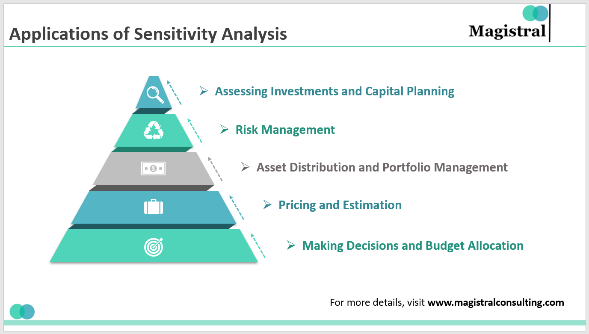

## Table of Contents

## What is sensitivity analysis?

Sensitivity analysis is a way to see how changes in different factors can affect the outcome of a model or a project. It helps people understand which parts of their plans are most important and where they need to be careful. For example, if you are planning a budget, sensitivity analysis can show you how changes in costs or income might affect your overall financial plan.

This kind of analysis is useful in many areas, like business, engineering, and science. By doing sensitivity analysis, you can find out which variables have the biggest impact on your results. This helps you make better decisions and prepare for different possible situations. It's like testing your plan to see how it holds up when things change.

## Why is sensitivity analysis important in decision-making processes?

Sensitivity analysis is important in decision-making because it helps people see how their choices might change if things don't go as planned. Imagine you're deciding whether to start a new business. You might have a plan based on certain costs and sales. But what if costs go up or sales go down? Sensitivity analysis shows you how these changes could affect your business. This way, you can make a better decision by knowing which parts of your plan are most important and need to be watched closely.

It also helps in managing risk. By understanding which factors have the biggest impact on your outcomes, you can focus on those areas and prepare for different scenarios. For example, if you're planning a project, sensitivity analysis can show you that delays in one part of the project could really hurt your timeline. Knowing this, you can take steps to prevent those delays or have a backup plan ready. This makes your decision-making process more robust and helps you be ready for whatever might happen.

## Can you explain the basic steps involved in conducting a sensitivity analysis?

To conduct a sensitivity analysis, you first need to identify the key variables in your model or plan. These are the things that could change and affect your outcome, like costs, sales, or time. Once you know what these variables are, you can decide on a range of values for each one. For example, if you're looking at costs, you might want to see what happens if costs go up by 10%, 20%, or 30%. You then change these variables one at a time and see how your results change. This helps you understand which variables have the biggest impact on your outcome.

After you've changed the variables and seen how they affect your results, the next step is to analyze the data. Look at how sensitive your model is to changes in each variable. You might find that some variables have a big effect, while others don't matter as much. This information is really helpful for decision-making because it shows you where to focus your attention. You can then use this knowledge to make your plan stronger, by preparing for the variables that could cause the biggest changes. This way, you're ready for different scenarios and can make better decisions.

## What are some common methods used to perform sensitivity analysis?

One common method for sensitivity analysis is the one-at-a-time (OAT) approach. In this method, you change one variable at a time and see how it affects the outcome. For example, if you're looking at a budget, you might increase the cost of one item and see how it changes your total expenses. This is a simple way to understand the impact of each variable, but it doesn't show how variables might affect each other.

Another method is the Monte Carlo simulation. This method uses random numbers to change variables many times and see how the outcomes vary. Imagine you're planning a project and you want to know how delays might affect the timeline. The Monte Carlo simulation would run the project many times with different delay scenarios to show you the range of possible outcomes. This helps you see not just the average impact, but also the best and worst cases.

A third method is the use of tornado diagrams. These diagrams show the impact of each variable on the outcome in a visual way. The variables are listed on the left side of the diagram, and the length of the bars shows how much each variable changes the outcome. This makes it easy to see which variables are most important. For example, if you're looking at a business plan, a tornado diagram could show you that sales [volume](/wiki/volume-trading-strategy) has a bigger impact on profits than the cost of goods sold.

## How does sensitivity analysis help in risk assessment?

Sensitivity analysis helps in risk assessment by showing how changes in different factors can affect the outcome of a plan or project. Imagine you're planning a big event and you want to know how things like weather or attendance might affect your budget. By doing sensitivity analysis, you can see which of these factors could cause the biggest problems. This helps you understand where the risks are and what you need to watch out for. For example, if the analysis shows that bad weather could really hurt your event, you might decide to have a backup plan for indoor activities.

Once you know which factors are most important, you can take steps to manage those risks better. Sensitivity analysis doesn't just show you the risks; it also helps you prepare for them. If you find out that a delay in one part of your project could cause big problems, you can focus on that part and make sure it stays on track. By understanding how sensitive your plan is to different changes, you can make smarter decisions and be ready for whatever might happen. This makes your plan stronger and helps you handle risks more confidently.

## In what ways can sensitivity analysis be applied in financial modeling?

Sensitivity analysis is very helpful in financial modeling because it shows how changes in things like interest rates, sales, or costs can affect your financial plan. Imagine you're making a budget for your business. You want to know what happens if the price of materials goes up or if fewer people buy your product. By doing sensitivity analysis, you can see how these changes might impact your profits. This helps you understand which parts of your financial plan are most important and where you need to be careful. For example, if the analysis shows that a small increase in costs could really hurt your bottom line, you might look for ways to keep those costs down.

In another way, sensitivity analysis can help you make better decisions about investments. Let's say you're thinking about starting a new project and you need to know how different scenarios could affect your return on investment. By changing variables like the project's timeline or the expected revenue, you can see how sensitive your investment is to these changes. This information is really useful for planning because it shows you the best and worst cases. Knowing this, you can decide if the project is worth the risk and how to prepare for different outcomes. Sensitivity analysis makes your financial models more reliable and helps you be ready for whatever might happen.

## How can sensitivity analysis be used to improve the robustness of engineering designs?

Sensitivity analysis helps make engineering designs stronger by showing how changes in different parts of the design can affect how well it works. Imagine you're designing a bridge. You want to know what happens if the wind is stronger than expected or if the materials you use are not as strong as you thought. By doing sensitivity analysis, you can see which parts of your design are most important and need to be watched closely. For example, if the analysis shows that a small change in the thickness of the bridge's supports could make a big difference, you might decide to make those supports thicker to be safe.

This kind of analysis also helps engineers prepare for different situations. If you find out that a certain part of your design is very sensitive to changes, you can focus on making that part better. For instance, if the analysis shows that the temperature can affect how your design works, you might choose materials that can handle a wider range of temperatures. By understanding how sensitive your design is to different changes, you can make it more reliable and ready for whatever might happen. This makes your engineering designs stronger and helps you handle risks better.

## What are the challenges and limitations of sensitivity analysis in complex systems?

Sensitivity analysis can be tricky when dealing with complex systems because there are often many variables that can change and affect each other in ways that are hard to predict. In a big system like a power grid or a financial market, it's tough to figure out how all the parts work together. If you change one thing, it might cause a chain reaction that affects other parts of the system in unexpected ways. This makes it hard to know which variables to focus on and how to test them properly. Also, running sensitivity analysis on a complex system can take a lot of time and computer power, especially if you're using methods like Monte Carlo simulations that need to run many different scenarios.

Another challenge is that sensitivity analysis often assumes that variables change one at a time, but in real life, many things can change at once. This means the results of the analysis might not show the full picture of how the system could behave. For example, in a weather system, temperature, humidity, and wind can all change together, and these changes can interact in complex ways. If you only change one variable at a time, you might miss important interactions between variables. This limitation can make it harder to use sensitivity analysis to make good decisions in very complex situations, where understanding all the possible interactions is key to managing risks and making the system more robust.

## How does sensitivity analysis integrate with other analytical tools like Monte Carlo simulations?

Sensitivity analysis and Monte Carlo simulations work together to help people understand how changes in different parts of a plan or system can affect the outcome. Sensitivity analysis looks at how changing one thing at a time can impact the results. For example, if you're planning a budget, sensitivity analysis can show you how a change in costs or sales might affect your profits. Monte Carlo simulations take this a step further by changing many variables at once and running the model many times with different random values. This helps you see not just the average impact, but also the range of possible outcomes, like the best and worst cases.

By using both tools together, you get a more complete picture of how your plan or system might behave under different conditions. Sensitivity analysis helps you identify which variables are most important and need to be watched closely. Once you know this, you can use Monte Carlo simulations to see how these key variables might interact with each other and affect the outcome in different scenarios. This combination makes your analysis more thorough and helps you make better decisions by preparing for a wider range of possibilities.

## Can you discuss an advanced application of sensitivity analysis in climate modeling?

In climate modeling, sensitivity analysis helps scientists understand how changes in different parts of the climate system can affect the weather and the planet's temperature. Imagine you're trying to figure out how much the Earth's temperature might go up if we keep putting more carbon dioxide into the air. By doing sensitivity analysis, you can see how sensitive the climate is to changes in things like greenhouse gases, ocean currents, or the amount of ice at the poles. This helps scientists figure out which parts of the climate system are most important and need to be studied more closely. For example, if the analysis shows that a small increase in carbon dioxide could cause a big change in temperature, scientists might focus more on finding ways to reduce those emissions.

Using sensitivity analysis in climate modeling also helps scientists prepare for different future scenarios. They can use it to see how different policies or changes in human behavior might affect the climate. For instance, if you want to know what would happen if we all started using more renewable energy, sensitivity analysis can show you how this change might affect the climate over time. By understanding how sensitive the climate is to different changes, scientists can make better predictions and help policymakers make smarter decisions about how to protect the planet. This makes climate models more reliable and helps us be ready for whatever might happen to our planet in the future.

## What role does sensitivity analysis play in optimizing operations research problems?

Sensitivity analysis helps in operations research by showing how changes in different parts of a problem can affect the solution. Imagine you're trying to figure out the best way to schedule workers at a factory. You want to know what happens if the cost of hiring more workers goes up or if the demand for your product changes. By doing sensitivity analysis, you can see which parts of your plan are most important and need to be watched closely. For example, if the analysis shows that a small change in worker costs could really mess up your schedule, you might look for ways to keep those costs steady or find other ways to solve the problem.

In another way, sensitivity analysis helps you prepare for different situations in operations research. If you find out that a certain part of your problem is very sensitive to changes, you can focus on making that part better. For instance, if the analysis shows that the time it takes to make a product can affect your overall plan a lot, you might work on ways to speed up production. By understanding how sensitive your plan is to different changes, you can make it more reliable and ready for whatever might happen. This makes your operations research solutions stronger and helps you handle risks better.

## How can sensitivity analysis be adapted for use in machine learning model interpretability?

Sensitivity analysis can help make machine learning models easier to understand by showing how changes in the data affect the model's predictions. Imagine you're using a model to predict if someone will buy a product based on their age, income, and past purchases. By doing sensitivity analysis, you can see which of these factors has the biggest impact on the model's decision. For example, if the analysis shows that income is the most important [factor](/wiki/factor-investing), you can focus on making sure the model's predictions about income are accurate. This helps you understand why the model makes certain predictions and makes it easier to trust the model's results.

In another way, sensitivity analysis can help you improve machine learning models by finding out where they might be making mistakes. If you find that the model is very sensitive to small changes in certain data, like if a small change in age can flip the model's prediction, you might need to adjust the model to make it more stable. By understanding how sensitive the model is to different parts of the data, you can make it more reliable and easier to explain to others. This makes your machine learning models stronger and helps you use them more confidently in real-world situations.

## What are the tools and techniques for sensitivity analysis?

Sensitivity analysis in [algorithmic trading](/wiki/algorithmic-trading) employs several key techniques to evaluate and enhance trading strategies. Among these, Monte Carlo simulations, parameter optimization, noise testing, and out-of-sample testing are prominent.

Monte Carlo simulations are used for assessing trading strategy outcomes by simulating a broad spectrum of potential market scenarios. The method involves generating a large number of random samples to analyze the probability distribution of returns over a specified period. By inputting various market conditions and random events, traders can evaluate how their strategies might perform under different circumstances. This approach provides insight into the potential risks and rewards, allowing for more informed decision-making. Mathematically, Monte Carlo simulations involve evaluating the expected returns $E(R)$ over $N$ scenarios:

$$

E(R) = \frac{1}{N} \sum_{i=1}^{N} R_i 
$$

where $R_i$ represents the return from each simulation scenario.

Parameter optimization is aimed at determining the parameter values within a trading model that yield the most robust performance. This process involves systematically adjusting parameters like entry points, [exit](/wiki/exit-strategy) points, and stop-loss levels to identify configurations that maximize returns while minimizing risks. Techniques such as grid search or more advanced optimization algorithms (e.g., genetic algorithms) are employed to explore the parameter space efficiently. For instance, a simple grid search in Python might look like:

```python
import numpy as np

def optimize_strategy(parameters, data):
    best_score = -np.inf
    best_params = None
    for param_set in parameters:
        score = evaluate_strategy(param_set, data)
        if score > best_score:
            best_score = score
            best_params = param_set
    return best_params, best_score
```

Noise testing is crucial for ensuring the resilience of trading strategies against data variability, thereby avoiding overfitting. By introducing random noise into historical data, traders can observe whether their strategies maintain stable performance. This approach helps in identifying strategies that may be overly tailored to specific market conditions and, thus, prone to failure when presented with new data.

Out-of-sample testing plays a critical role in validating the performance of a trading strategy on unseen data. After developing a model with historical data, traders test it against different data sets to assess its generalizability. This step is essential to determine if the trading strategy will be robust in live market scenarios, enabling the detection of overfitting before deploying the strategy for real-time trading.

Incorporating these techniques in sensitivity analysis facilitates a comprehensive understanding of trading strategies' behavior, leading to the development of robust, adaptable, and resilient trading models.

## References & Further Reading

Bergstra, J., Bardenet, R., Bengio, Y., & Kégl, B. (2011). Algorithms for Hyper-Parameter Optimization. Advances in Neural Information Processing Systems. This paper discusses various algorithms for optimizing hyper-parameters in [machine learning](/wiki/machine-learning) models, essential for enhancing the performance of trading algorithms by efficiently searching the parameter space.

Lopez de Prado, M. (2018). Advances in Financial Machine Learning. This book provides insights into applying machine learning techniques within the financial industry, highlighting methods to improve algorithmic trading strategies through rigorous quantitative research.

Aronson, D. (2007). Evidence-Based Technical Analysis: Applying the Scientific Method and Statistical Inference to Trading Signals. Aronson's work emphasizes using scientific methodology and statistical inference to analyze and enhance trading signals, which is fundamental in developing robust algorithmic trading strategies.

Jansen, S. (2020). Machine Learning for Algorithmic Trading. This book explores machine learning applications specific to algorithmic trading, providing practical examples and strategies to implement data-driven trading systems.

Chan, E. P. (2008). Quantitative Trading: How to Build Your Own Algorithmic Trading Business. Chan outlines the process of establishing an algorithmic trading business, covering various quantitative strategies and the importance of [backtesting](/wiki/backtesting) and sensitivity analysis in strategy development.

