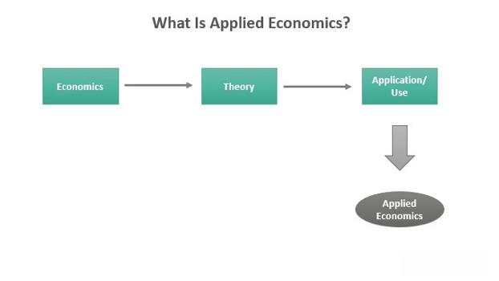

## Table of Contents

## What is applied economics?

Applied economics is the use of economic theories and methods to solve real-world problems. It involves taking the ideas and models from economics and applying them to practical situations, like helping businesses make better decisions or advising governments on policy.

For example, an applied economist might study how a new tax law could affect people's spending habits. They use data and economic models to predict what might happen and suggest the best actions to take. This makes applied economics very important for making informed decisions in many areas of life, from running a company to shaping public policy.

## How does applied economics differ from theoretical economics?

Applied economics and theoretical economics are two sides of the same coin, but they focus on different things. Theoretical economics is all about building models and theories to understand how the economy works. It's like trying to figure out the rules of a game by thinking about it deeply. Economists who work on theory spend a lot of time creating equations and models that explain things like how people make choices or how markets function.

On the other hand, applied economics takes those theories and uses them to solve real-world problems. It's like using the rules of the game to actually play it. Applied economists look at data from the real world, use the theories to understand what's happening, and then suggest solutions. For example, they might use economic theories to figure out the best way to reduce unemployment or to help a company decide where to build a new factory.

So, while theoretical economics is about understanding the big ideas and principles, applied economics is about using those ideas to make a difference in the real world. Both are important, but they serve different purposes: one helps us understand the economy, and the other helps us improve it.

## What are the main areas of focus in applied economics?

Applied economics covers a lot of different areas, but it mainly focuses on using economic theories to help with real-world problems. One big area is policy analysis, where economists study how new laws or policies might affect the economy. For example, they might look at how a new tax could change people's spending or how a new regulation could affect businesses. This helps governments make better decisions.

Another important area is business economics, where economists help companies make smart choices. They might use economic models to figure out the best price for a product or the best place to open a new store. This can help businesses grow and be more profitable. Applied economists also work in fields like health economics, where they study how to make healthcare better and more affordable, or in environmental economics, where they look at ways to protect the environment while keeping the economy strong.

Overall, applied economics is about using economic ideas to solve practical problems in many different areas. Whether it's helping a government make good policies, a business make smart decisions, or finding ways to improve healthcare and protect the environment, applied economists use their skills to make a positive impact on the world.

## What are some common tools and methods used in applied economics?

Applied economists use many tools and methods to study real-world problems. One common tool is statistical analysis, which helps them look at data to find patterns and make predictions. They use software like Stata or R to do this work. Another important tool is econometric modeling, which involves using math to create models that can explain how different things in the economy are related. These models help economists understand what might happen if something changes, like if a new law is passed.

Another method they use is cost-benefit analysis, which is a way to figure out if something is worth doing by comparing what it costs to the benefits it brings. For example, they might use this to see if building a new road would be good for the economy. Applied economists also often do surveys and experiments to gather information directly from people. This can help them understand things like how people might react to a new policy or how they make spending decisions.

Overall, these tools and methods help applied economists make sense of complex economic problems and come up with practical solutions. By using data, math, and direct research, they can provide valuable insights to businesses, governments, and other organizations looking to make informed decisions.

## How is data analysis important in applied economics?

Data analysis is really important in applied economics because it helps economists understand what's going on in the real world. They use data to see patterns and trends that they might not notice otherwise. For example, if they want to know how a new tax might affect people's spending, they can look at data from similar situations in the past. This helps them make better predictions and give good advice to businesses or governments.

Also, data analysis lets applied economists test their ideas. They can use numbers to check if their theories about the economy are right. If they think a policy will help the economy grow, they can look at data to see if it actually works. This makes their advice more reliable and useful. By using data, applied economists can solve real problems and help make the world a better place.

## Can you explain the role of econometrics in applied economics?

Econometrics is a big part of applied economics. It's like a bridge between the math of economics and the real world. Econometricians use numbers and data to test if the theories economists come up with are true. They do this by making models that can show how different things in the economy are connected. For example, they might use econometrics to see if raising the minimum wage really does help workers without causing too many problems for businesses.

This tool is really important because it helps applied economists make better decisions. By looking at data, they can see what's actually happening, not just what they think might happen. This makes their advice more reliable. For instance, if a government wants to know if a new policy will help the economy, econometricians can use data to give a clear answer. This way, decisions are based on facts, not just guesses, which can lead to better results for everyone.

## What are some real-world applications of applied economics?

Applied economics is used in many ways to help solve real-world problems. For example, governments use it to make better policies. When a government wants to change a law or start a new program, like raising the minimum wage or building a new highway, applied economists study the data to see what might happen. They look at how these changes could affect things like jobs, prices, and people's lives. This helps the government make choices that can help the economy grow and improve people's lives.

Businesses also use applied economics to make smart decisions. For instance, a company might want to know the best price to set for a new product. Applied economists can use data and models to figure out what price will bring in the most money without losing too many customers. They can also help a business decide where to open a new store by studying the local economy and figuring out where people are likely to spend their money. This way, businesses can grow and be more successful.

In other areas like healthcare and the environment, applied economics is just as important. In healthcare, economists study how to make care better and more affordable. They might look at how different ways of paying for healthcare affect how many people can get it and how good it is. In environmental economics, they study how to protect the environment without hurting the economy. They might look at the costs and benefits of things like pollution controls or renewable energy projects. By using economic ideas and data, applied economists help make the world a better place in many different ways.

## How do policy makers use applied economics in decision making?

Policy makers use applied economics to make smart decisions about laws and programs. They look at data and use economic models to see what might happen if they change something, like taxes or healthcare rules. For example, if they want to raise the minimum wage, they study how this could affect jobs and prices. By understanding these effects, they can make choices that help the economy grow and make life better for people.

Applied economics also helps policy makers see the big picture. They use tools like cost-benefit analysis to figure out if a new policy is worth it. This means they compare what it will cost to the good things it will do. If the benefits are bigger than the costs, it's a good idea. This helps them avoid wasting money and focus on what really helps. By using applied economics, policy makers can make choices that are based on facts, not just guesses, which leads to better results for everyone.

## What are the challenges faced in applying economic theories to real-world scenarios?

Applying economic theories to real-world scenarios can be tricky because the world is more complicated than the models economists use. These models often make things simpler to understand big ideas, but real life has a lot of details and surprises that don't fit neatly into the models. For example, people don't always act the way the theories say they should. They might make choices based on feelings or habits, not just what's best for their wallets. Also, things like politics, culture, and unexpected events can change how economic policies work in practice.

Another challenge is getting good data. To use economic theories in the real world, you need a lot of information about what's happening. But sometimes, the data is hard to find or not very accurate. This makes it tough to predict what will happen if you change a policy or start a new program. Without good data, it's like trying to solve a puzzle with missing pieces. Even when you have the data, figuring out what it means can be hard because there are so many things that can affect the economy at the same time.

## How can applied economics contribute to sustainable development?

Applied economics can help with sustainable development by figuring out how to use resources in a smart way. Economists look at how we can grow the economy without hurting the environment. They study things like how to use less energy or how to make farming better without using up all the land. By using data and models, they can suggest ways to make sure we have enough resources for the future. This helps countries plan how to grow without causing problems like pollution or running out of natural resources.

Another way applied economics helps with sustainable development is by looking at how to make life better for everyone. Economists study how to make sure that growth helps poor people too, not just the rich ones. They look at how to create jobs, improve healthcare, and make sure everyone has enough to eat. By using cost-benefit analysis, they can figure out which projects or policies will do the most good for the most people. This way, sustainable development isn't just about the environment, but also about making sure all people have a good life.

## What advanced techniques are used in applied economics research?

In applied economics research, one advanced technique is called machine learning. This is a way of using computers to find patterns in big sets of data. Economists use machine learning to predict things like how people will spend their money or how a new policy might affect the economy. It's like teaching a computer to learn from examples, so it can make good guesses about the future. This helps economists make better decisions because they can see trends that might be hard to notice otherwise.

Another technique is called experimental economics. This involves setting up experiments where people make choices in a controlled setting. Economists use these experiments to test their theories and see how people really behave. For example, they might give people money to spend in a fake store to see how they react to different prices. This helps economists understand how policies might work in real life. By using experiments, they can get a better idea of what will happen when they try to solve real-world problems.

A third technique is called structural modeling. This is a way of building detailed math models that show how different parts of the economy work together. Economists use these models to see how changes in one area, like taxes, might affect other areas, like jobs or prices. Structural models are really helpful because they can show the big picture of how the economy works. By using these models, economists can figure out the best ways to help the economy grow and solve problems.

## How does applied economics adapt to emerging global economic trends?

Applied economics adapts to emerging global economic trends by constantly updating its methods and models to reflect new realities. As the world changes, economists look at new data and trends to see how they can use economic theories to solve new problems. For example, if there's a new technology that changes how people work, like remote working, economists study how this affects jobs and the economy. They use data to understand these changes and then figure out the best ways to help businesses and governments adapt. This means they might change their models or use new tools like machine learning to make better predictions about what will happen next.

Another way applied economics adapts is by focusing on new areas that become important. For instance, as climate change becomes a bigger issue, economists start studying how to grow the economy without hurting the environment. They look at things like renewable energy and sustainable farming to see how these can help. By using their skills to study these new areas, economists can give good advice on how to deal with global trends. This helps make sure that economic growth is good for everyone and doesn't cause problems in the future.

## References & Further Reading

[1]: Bergstra, J., Bardenet, R., Bengio, Y., & Kégl, B. (2011). ["Algorithms for Hyper-Parameter Optimization."](https://dl.acm.org/doi/10.5555/2986459.2986743) Advances in Neural Information Processing Systems 24.

[2]: ["Advances in Financial Machine Learning"](https://www.amazon.com/Advances-Financial-Machine-Learning-Marcos/dp/1119482089) by Marcos Lopez de Prado

[3]: ["Evidence-Based Technical Analysis: Applying the Scientific Method and Statistical Inference to Trading Signals"](https://www.amazon.com/Evidence-Based-Technical-Analysis-Scientific-Statistical/dp/0470008741) by David Aronson

[4]: ["Machine Learning for Algorithmic Trading"](https://github.com/stefan-jansen/machine-learning-for-trading) by Stefan Jansen

[5]: ["Quantitative Trading: How to Build Your Own Algorithmic Trading Business"](https://www.amazon.com/Quantitative-Trading-Build-Algorithmic-Business/dp/1119800064) by Ernest P. Chan