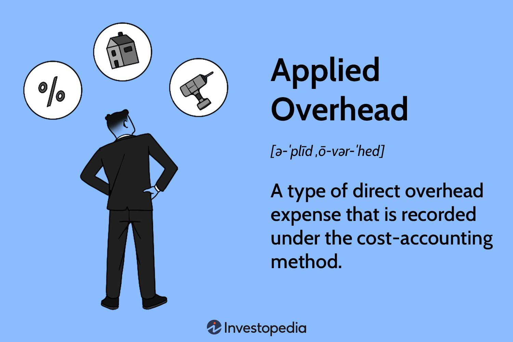

## Table of Contents

## What is applied overhead?

Applied overhead is the amount of indirect costs that a business assigns to its products or services. These indirect costs, like rent, utilities, and salaries for support staff, are not directly tied to making a specific product but are necessary for the business to operate. To figure out how much overhead to apply, businesses use a rate, often based on direct labor hours or machine hours. This helps them spread the overhead costs across all their products fairly.

For example, if a company has total overhead costs of $100,000 and uses 50,000 direct labor hours in a year, they might set an overhead rate of $2 per direct labor hour. If a product takes 10 hours to make, the applied overhead for that product would be $20. This method helps businesses understand the true cost of making each product, which is important for setting prices and making profits.

## Why is it important to apply overhead in accounting?

Applying overhead in accounting is important because it helps businesses figure out the true cost of making their products. When a company makes something, it's not just the materials and direct labor that cost money. There are also other costs like rent, utilities, and salaries for people who don't work directly on the product. These costs are called overhead. By applying overhead to each product, a business can see how much it really costs to make each item. This helps them set prices that cover all their costs and make a profit.

Another reason applying overhead is important is that it helps with budgeting and planning. When a business knows how much overhead goes into each product, they can plan better for the future. They can see if they need to cut costs or if they can afford to expand. It also helps them compare the costs of making different products, so they can focus on the ones that are more profitable. Without applying overhead, a business might think some products are making money when they're actually losing money because they're not accounting for all the costs involved.

## How is applied overhead different from actual overhead?

Applied overhead and actual overhead are two different things in accounting. Applied overhead is the amount of indirect costs that a business guesses will go into making a product. They use a rate, like how many hours it takes to make the product, to figure this out. It's like an estimate or a guess before they actually make the product.

Actual overhead, on the other hand, is the real amount of indirect costs that a business spends. This is what they find out after they've made the product and added up all the bills. So, applied overhead is what they think they'll spend, and actual overhead is what they actually spend. Sometimes these numbers are different, and businesses need to adjust their records to make sure everything adds up correctly.

## What are the common methods used to apply overhead?

One common method to apply overhead is using a predetermined overhead rate. This method involves figuring out a rate before the year starts, usually based on how much overhead the business expects to spend and how many hours they expect to work. For example, if a business thinks it will spend $100,000 on overhead and work 50,000 hours, the rate would be $2 per hour. When they make a product, they multiply the hours it takes by this rate to find out how much overhead to apply to that product.

Another method is activity-based costing (ABC). This method looks at different activities that cause overhead costs, like setting up machines or inspecting products. The business figures out how much each activity costs and then applies that cost to products based on how much they use that activity. For example, if setting up a machine costs $500 and a product needs the machine set up twice, the overhead applied for that part of the process would be $1,000. This method can be more accurate because it looks at the specific activities that cause costs, but it can also be more complicated to set up and use.

## Can you explain the process of applying overhead using the predetermined overhead rate?

Applying overhead using a predetermined overhead rate starts with figuring out what the rate should be. A business looks at how much they expect to spend on overhead costs like rent, utilities, and salaries for the whole year. They also guess how many hours they'll work or how many units they'll make. For example, if they think they'll spend $100,000 on overhead and work 50,000 hours, they divide $100,000 by 50,000 to get a rate of $2 per hour. This rate is set before the year starts, so it's called a predetermined rate.

Once the rate is set, the business uses it to apply overhead to each product they make. If a product takes 10 hours to make, they multiply those 10 hours by the $2 rate to find out the overhead for that product, which would be $20. They do this for every product they make during the year. At the end of the year, they compare the total overhead they applied to products with the actual overhead they spent. If there's a difference, they make adjustments to their records to make sure everything is correct.

## What is the formula for calculating the predetermined overhead rate?

The formula for calculating the predetermined overhead rate is simple. You take the total estimated overhead costs for the year and divide it by the total estimated activity base for the year. The activity base could be direct labor hours, machine hours, or even the number of units produced, depending on what makes sense for your business. For example, if you think you'll spend $100,000 on overhead and you'll work 50,000 hours, the rate would be $100,000 divided by 50,000 hours, which equals $2 per hour.

Once you have the predetermined overhead rate, you use it to figure out how much overhead to apply to each product. If a product takes 10 hours to make, you multiply those 10 hours by the $2 rate to get $20 in overhead for that product. You do this for every product you make during the year. At the end of the year, you compare the total overhead you applied to products with the actual overhead you spent. If there's a difference, you adjust your records to make sure everything balances out.

## How does the choice of allocation base affect the application of overhead?

The choice of allocation base is really important when you're figuring out how to apply overhead. The allocation base is what you use to spread out the overhead costs across your products. Common choices are direct labor hours, machine hours, or the number of units made. If you pick direct labor hours, you're saying that the more time people spend making a product, the more overhead it should get. But if you use machine hours, you're saying that the more time a machine runs, the more overhead should be applied. So, the choice you make can change how much overhead each product gets.

If you choose the wrong allocation base, it can make your costs seem wrong. For example, if you use direct labor hours but a lot of your overhead comes from running machines, your costs might not be spread out right. This can make some products seem more expensive than they really are, and others might seem cheaper. Picking the right allocation base helps make sure that the overhead costs are shared fairly among all your products. This way, you can set prices that cover all your costs and make a good profit.

## What are the potential issues with underapplied or overapplied overhead?

When a business has underapplied or overapplied overhead, it can cause problems. Underapplied overhead happens when the actual overhead costs are more than what was applied to the products. This means the business might have thought they were making more money than they really were because they didn't account for all the costs. Overapplied overhead is the opposite, where the business applied more overhead to the products than they actually spent. This can make it look like they made less money than they really did because they thought their costs were higher.

These issues can mess up a business's financial reports and make it hard to know if they're really making a profit. If overhead is underapplied, the business might need to raise prices or cut costs to make up for the difference. If it's overapplied, they might need to lower prices or find other ways to use the extra money. Either way, it's important to fix these problems quickly so the business can keep track of its costs and profits accurately.

## How can a business adjust for underapplied or overapplied overhead at the end of a period?

At the end of a period, a business can adjust for underapplied or overapplied overhead by making changes to their financial records. If overhead is underapplied, meaning the actual overhead costs were higher than what was applied to the products, the business needs to add the difference to the cost of goods sold (COGS). This makes the COGS higher, which means the business's profit for the period will be lower. On the other hand, if overhead is overapplied, where the applied overhead was more than the actual costs, the business subtracts the difference from the COGS. This makes the COGS lower, which means the profit for the period will be higher.

These adjustments help the business's financial statements reflect the true costs and profits accurately. If a business doesn't make these adjustments, their financial reports could be wrong, and they might make bad decisions based on those numbers. For example, if they don't adjust for underapplied overhead, they might think they're making more money than they really are, which could lead to problems down the road. By fixing these issues at the end of the period, the business can keep its financial records straight and make better decisions about pricing, costs, and profits.

## What are some advanced techniques for refining the application of overhead?

One advanced technique for refining the application of overhead is called activity-based costing (ABC). This method looks at the specific activities that cause overhead costs, like setting up machines or inspecting products. Instead of using a general overhead rate, ABC figures out how much each activity costs and then applies those costs to products based on how much they use each activity. For example, if setting up a machine costs $500 and a product needs the machine set up twice, the overhead applied for that part of the process would be $1,000. This can make the overhead costs more accurate because it looks at what actually causes the costs, but it can also be more complicated to set up and use.

Another technique is using multiple overhead rates instead of just one. Instead of applying all overhead with one rate, a business can use different rates for different parts of the business. For example, they might use one rate for the assembly department and another for the finishing department. This can help spread the overhead costs more fairly across different products because different parts of the business might have different overhead costs. It can make the costing more accurate but also adds more work to keep track of the different rates and apply them correctly.

## How does technology impact the application of overhead in modern businesses?

Technology has changed how businesses figure out and apply overhead costs. With computer systems and software, businesses can keep track of their costs more easily and accurately. They can use special programs to break down their overhead costs into smaller parts and see exactly where the money is going. This helps them make better decisions about how to apply these costs to their products. For example, they can use real-time data to see how much electricity or machine time each product uses, and then apply the right amount of overhead based on that information.

Also, technology lets businesses use more advanced methods like activity-based costing. With the right software, they can track all the different activities that cause overhead costs, like setting up machines or doing quality checks. This makes it easier to figure out how much each activity costs and apply those costs to products more accurately. Technology can also help businesses see if their overhead costs are going up or down over time, so they can make changes to keep their costs under control and their profits up.

## Can you provide a detailed example of applying overhead in a manufacturing setting?

Let's imagine a small factory that makes wooden chairs. The factory owner knows that besides the wood and the workers who make the chairs, there are other costs like rent for the factory, electricity, and the salary of the person who keeps track of the orders. These are the overhead costs. To figure out how much overhead to add to each chair, the owner decides to use direct labor hours as the way to spread out the costs. At the start of the year, the owner thinks they will spend $50,000 on overhead and that the workers will put in 10,000 hours making chairs. So, the owner calculates the overhead rate as $50,000 divided by 10,000 hours, which comes out to $5 per hour.

Now, when the workers make a chair, it takes them 2 hours. So, for each chair, the owner applies $5 per hour for 2 hours, which means $10 in overhead costs are added to the cost of making that chair. At the end of the year, the owner finds out that they actually spent $52,000 on overhead, and the workers put in 9,800 hours. The applied overhead for the year, based on the $5 per hour rate, would be $5 per hour times 9,800 hours, which equals $49,000. Since the actual overhead was $52,000, the overhead was underapplied by $3,000. The owner then adds this $3,000 to the cost of goods sold to make sure the financial records show the true costs for the year.

## What is the understanding of overhead costs?

Overhead costs represent the expenses a business incurs that are not directly attributable to the creation of products or delivery of services. These essential costs ensure the smooth operation of a company and encompass items like utilities, rent, and salaries for administrative staff. Overhead costs are typically categorized into two main types: direct and indirect overhead.

Direct overhead costs, although not part of the direct materials or labor, can be directly linked to a specific cost object, such as a department or project. Examples include a project manager's salary allocated to a particular job or specific utility expenses for a single department.

Indirect overhead costs, on the other hand, cannot be directly associated with a specific product, job, or department. These costs are necessary for maintaining overall business operations and often include expenses such as general utilities, company-wide administrative salaries, and insurance. Differentiating these costs is fundamental for proper financial reporting and budgeting.

To understand overhead costs deeply, businesses develop pricing strategies that align with their expenditure, ensuring they adequately cover their overhead costs while remaining profitable. Calculating overhead as part of the total cost of production is critical in setting competitive yet profitable pricing strategies. One common formula used to calculate the overhead rate is:

$$
\text{Overhead Rate} = \frac{\text{Total Indirect Costs}}{\text{Total Direct Costs or Allocation Base}}
$$

Here, the allocation base might be direct labor hours, direct labor costs, or machine hours, depending on the most relevant cost driver for the specific industry or business.

Accurate assessment and management of overhead costs can significantly impact a company's financial health, aiding in strategic pricing, identifying cost-saving opportunities, and enhancing operational efficiency. Through precise classification and allocation of overhead costs, businesses can ensure they maintain appropriate pricing strategies that not only cover these costs but also contribute to overall profitability.

## What is the Concept of Applied Overhead?

Applied overhead involves the assignment of overhead costs specifically to particular production jobs, products, or departments, rather than distributing these costs across the board in a generalized manner. This targeted allocation is achieved through the use of predetermined rates, which are applied based on selected cost drivers. Common cost drivers include machine hours or labor hours, whereby the overhead costs are linked to the actual usage or consumption of production resources.

The process begins with the calculation of a predetermined overhead rate, an estimate based on expected overhead costs and anticipated levels of activity. For example, if the estimated total overhead costs for a production facility are $500,000 and expected machine hours for the period are 25,000, the predetermined overhead rate would calculate as:

$$
\text{Predetermined Overhead Rate} = \frac{\text{Estimated Overhead Costs}}{\text{Estimated Activity Base}} = \frac{\$500,000}{25,000 \text{ machine hours}} = \$20 \text{ per machine hour}
$$

Once the predetermined rate is established, it is used to apply overhead to individual jobs or products. If a specific job utilizes 1,000 machine hours, the applied overhead for that job would be:

$$
\text{Applied Overhead} = \text{Predetermined Overhead Rate} \times \text{Actual Machine Hours Used} = \$20 \times 1,000 = \$20,000
$$

Choosing appropriate cost drivers is critical. Cost drivers should ideally be factors that correlate closely with overhead costs. The choice of an unsuitable cost driver can result in significant inaccuracies, affecting the reliability of financial statements and potentially leading to suboptimal pricing and profitability outcomes.

It's important to distinguish applied overhead from general overhead. Applied overhead is specifically attributed to production activities, enhancing the precision of assigning costs to specific operations directly linked to the production process. Conversely, general overhead typically consists of indirect costs—such as administrative expenses—that cannot be directly assigned to a specific job or product due to their more generally supportive nature.

The effective application of applied overhead ensures that financial statements more accurately reflect the true costs associated with production, thereby supporting better financial planning and operational decision-making. This method provides businesses with granular insights into where and how overhead resources are consumed, creating opportunities for optimization and cost control.

## What are the methodologies for applying overhead?

Businesses employ a variety of methodologies to allocate overhead costs effectively, with two predominant systems being job costing and process costing. These methods provide the framework needed to assign indirect expenses to products or services accurately, ensuring comprehensive cost management.

Job costing involves assigning overhead based on specific jobs or batches. This approach is commonly used by industries where goods or services are produced to specific customer orders. The overhead in job costing is applied using cost drivers, such as machine hours or labor hours. An organization can calculate the overhead rate using the formula:

$$
\text{Overhead Rate} = \frac{\text{Total Overhead Costs}}{\text{Total Direct Labor Hours}}
$$

For instance, if a company has a total overhead cost of $100,000 and 5,000 direct labor hours, the overhead rate would be $20 per labor hour. This means for every labor hour spent on a job, $20 of overhead costs will be allocated to that job.

Process costing, on the other hand, is tailored for industries where production occurs in a continuous flow, like chemicals or food manufacturing. This method averages overhead costs over a large number of units, typically corresponding to a production period. Instead of individual jobs, the total production process is used to allocate costs evenly across all units produced.

Accurately allocating overhead is critical for both financial reporting and budgeting purposes. Discrepancies between estimated and actual overhead costs can significantly impact profit margins and financial statements. For precise financial reporting, businesses must regularly review—and adjust if necessary—the overhead allocation rates. This periodic assessment ensures that the rates reflect the current cost structure and operational dynamics.

Adjustments are often made at the end of an accounting period, once actual overhead costs become available. Organizations can use variance analysis to explore differences between applied overhead and actual overhead costs, employing formulas such as:

$$
\text{Overhead Variance} = \text{Actual Overhead} - \text{Applied Overhead}
$$

A positive variance indicates that the applied overhead was less than the actual overhead incurred, leading to potential under-applied costs. Conversely, a negative variance signifies over-applied overhead, where applied costs exceeded actual expenditures. Regular reviews and adjustments help maintain cost accuracy in both short-term operations and long-term financial planning. 

Incorporating these systematic methodologies enhances the ability of businesses to make informed decisions, manage costs meticulously, and maintain robust financial practices. Proper overhead allocation not only reflects accurate production costs but also supports a business’s competitive positioning through sound financial insights.

## What is the application of overhead in business according to the case study?

In examining the application of overhead costs, let's consider a manufacturing firm that implements an overhead rate of $40 per machine hour. Suppose the company operates for 10,000 machine hours in a given fiscal period. Utilizing the applied overhead rate, the firm allocates $400,000 as its overhead cost for that period. This calculation is straightforward:  

$$
\text{Applied Overhead} = \text{Overhead Rate} \times \text{Machine Hours Used}
$$

$$
\text{Applied Overhead} = \$40 \times 10,000 = \$400,000
$$

A critical aspect of this case study is the analysis of discrepancies between the applied overhead and the actual overhead incurred. Discrepancies can arise due to several factors, such as variations in machine efficiency, unexpected maintenance needs, or fluctuating costs of utilities and materials. Identifying and understanding these variances is essential for the firm to fine-tune its budgeting and production processes.

By conducting variance analysis, the firm can adjust its future overhead rates or budget allocations to better align with actual operational costs. This involves comparing the forecasted overhead costs with the actual expenses to determine whether any overapplied or underapplied overhead exists. For instance, if the actual overhead costs for the period amount to $420,000, there is an underapplied overhead of $20,000. Conversely, if the actual costs are $380,000, there is an overapplied overhead of $20,000.

Understanding these variances is crucial for managerial accounting as it helps in optimizing resource allocation and improving cost management strategies. Real-world application of such practices demonstrates the practical importance of accurately applied overhead in maintaining the financial efficiency and profitability of a business. This kind of proactive financial management allows firms to remain competitive by ensuring that cost structures are realistic and closely aligned with production activities.

## References & Further Reading

[1]: Drury, C. (2018). "Management and Cost Accounting (10th Edition)." Cengage Learning EMEA. 

[2]: Kaplan, R. S., & Atkinson, A. A. (2014). "Advanced Management Accounting (3rd edition)." Pearson Publishing.

[3]: Christie, W. G., & Schulz, R. (1994). ["Why Do NASDAQ Market Makers Avoid Odd-Eighth Quotes?"](https://www.jstor.org/stable/2329272) The Journal of Finance, 49(5), 1813-1840. 

[4]: ["Cost Accounting: A Managerial Emphasis (16th Edition)"](https://www.amazon.com/Horngrens-Cost-Accounting-Managerial-Emphasis/dp/0134475585) by Charles T. Horngren, Srikant M. Datar, and Madhav V. Rajan.

[5]: Harris, L. (2003). "Trading and Exchanges: Market Microstructure for Practitioners." Oxford University Press.

[6]: Robert Pindyck and Daniel Rubinfeld. (2017). "Microeconomics (9th Edition)." Pearson Education Limited. 

[7]: ["Algorithmic and High-Frequency Trading"](https://www.amazon.com/Algorithmic-High-Frequency-Trading-Mathematics-Finance/dp/1107091144) by Álvaro Cartea, Sebastian Jaimungal, and José Penalva.