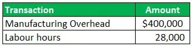

Understanding the different types of costs involved in production and operations is crucial for businesses navigating the complexities of financial management. Among these expenses, overhead costs often present challenges for companies striving to optimize budgeting and financial planning strategies. Overhead costs are the expenses incurred to support the production process but are not directly tied to output. These costs can include utilities, rent, administrative salaries, and other necessary operational expenses.

The focus of this article is on accounting practices related to overhead costs, specifically the concept of applied overhead, and its relevance in algorithmic trading. Applied overhead represents overhead costs allocated to specific jobs, products, or departments using predetermined rates based on relevant cost drivers like machine hours or labor. This approach is essential in ensuring the accurate reflection of production costs in financial statements. Inaccurate overhead cost allocation can result in distorted profit margins and misguided strategic decisions.



Additionally, understanding and applying overhead costs are increasingly important in the context of algorithmic trading. In this domain, overhead considerations such as transaction costs, technology investments, and staffing expenses for trading desks can significantly impact trading strategies and profitability. By effectively managing these costs, traders can accurately assess the financial performance of their algorithms and optimize trading strategies accordingly.

Today, mastering the nuances of overhead cost management helps businesses and investors make informed decisions, leading to improved financial efficiency. This article will explore the methods for applying these costs and their relationship with modern trading strategies, helping businesses enhance their strategic financial planning and maintain a competitive edge in the market.

## Table of Contents

## Understanding Overhead Costs

Overhead costs represent the expenses a business incurs that are not directly attributable to the creation of products or delivery of services. These essential costs ensure the smooth operation of a company and encompass items like utilities, rent, and salaries for administrative staff. Overhead costs are typically categorized into two main types: direct and indirect overhead.

Direct overhead costs, although not part of the direct materials or labor, can be directly linked to a specific cost object, such as a department or project. Examples include a project manager's salary allocated to a particular job or specific utility expenses for a single department.

Indirect overhead costs, on the other hand, cannot be directly associated with a specific product, job, or department. These costs are necessary for maintaining overall business operations and often include expenses such as general utilities, company-wide administrative salaries, and insurance. Differentiating these costs is fundamental for proper financial reporting and budgeting.

To understand overhead costs deeply, businesses develop pricing strategies that align with their expenditure, ensuring they adequately cover their overhead costs while remaining profitable. Calculating overhead as part of the total cost of production is critical in setting competitive yet profitable pricing strategies. One common formula used to calculate the overhead rate is:

$$
\text{Overhead Rate} = \frac{\text{Total Indirect Costs}}{\text{Total Direct Costs or Allocation Base}}
$$

Here, the allocation base might be direct labor hours, direct labor costs, or machine hours, depending on the most relevant cost driver for the specific industry or business.

Accurate assessment and management of overhead costs can significantly impact a company's financial health, aiding in strategic pricing, identifying cost-saving opportunities, and enhancing operational efficiency. Through precise classification and allocation of overhead costs, businesses can ensure they maintain appropriate pricing strategies that not only cover these costs but also contribute to overall profitability.

## The Concept of Applied Overhead

Applied overhead involves the assignment of overhead costs specifically to particular production jobs, products, or departments, rather than distributing these costs across the board in a generalized manner. This targeted allocation is achieved through the use of predetermined rates, which are applied based on selected cost drivers. Common cost drivers include machine hours or labor hours, whereby the overhead costs are linked to the actual usage or consumption of production resources.

The process begins with the calculation of a predetermined overhead rate, an estimate based on expected overhead costs and anticipated levels of activity. For example, if the estimated total overhead costs for a production facility are $500,000 and expected machine hours for the period are 25,000, the predetermined overhead rate would calculate as:

$$
\text{Predetermined Overhead Rate} = \frac{\text{Estimated Overhead Costs}}{\text{Estimated Activity Base}} = \frac{\$500,000}{25,000 \text{ machine hours}} = \$20 \text{ per machine hour}
$$

Once the predetermined rate is established, it is used to apply overhead to individual jobs or products. If a specific job utilizes 1,000 machine hours, the applied overhead for that job would be:

$$
\text{Applied Overhead} = \text{Predetermined Overhead Rate} \times \text{Actual Machine Hours Used} = \$20 \times 1,000 = \$20,000
$$

Choosing appropriate cost drivers is critical. Cost drivers should ideally be factors that correlate closely with overhead costs. The choice of an unsuitable cost driver can result in significant inaccuracies, affecting the reliability of financial statements and potentially leading to suboptimal pricing and profitability outcomes.

It's important to distinguish applied overhead from general overhead. Applied overhead is specifically attributed to production activities, enhancing the precision of assigning costs to specific operations directly linked to the production process. Conversely, general overhead typically consists of indirect costs—such as administrative expenses—that cannot be directly assigned to a specific job or product due to their more generally supportive nature.

The effective application of applied overhead ensures that financial statements more accurately reflect the true costs associated with production, thereby supporting better financial planning and operational decision-making. This method provides businesses with granular insights into where and how overhead resources are consumed, creating opportunities for optimization and cost control.

## Methodologies for Applying Overhead

Businesses employ a variety of methodologies to allocate overhead costs effectively, with two predominant systems being job costing and process costing. These methods provide the framework needed to assign indirect expenses to products or services accurately, ensuring comprehensive cost management.

Job costing involves assigning overhead based on specific jobs or batches. This approach is commonly used by industries where goods or services are produced to specific customer orders. The overhead in job costing is applied using cost drivers, such as machine hours or labor hours. An organization can calculate the overhead rate using the formula:

$$
\text{Overhead Rate} = \frac{\text{Total Overhead Costs}}{\text{Total Direct Labor Hours}}
$$

For instance, if a company has a total overhead cost of $100,000 and 5,000 direct labor hours, the overhead rate would be $20 per labor hour. This means for every labor hour spent on a job, $20 of overhead costs will be allocated to that job.

Process costing, on the other hand, is tailored for industries where production occurs in a continuous flow, like chemicals or food manufacturing. This method averages overhead costs over a large number of units, typically corresponding to a production period. Instead of individual jobs, the total production process is used to allocate costs evenly across all units produced.

Accurately allocating overhead is critical for both financial reporting and budgeting purposes. Discrepancies between estimated and actual overhead costs can significantly impact profit margins and financial statements. For precise financial reporting, businesses must regularly review—and adjust if necessary—the overhead allocation rates. This periodic assessment ensures that the rates reflect the current cost structure and operational dynamics.

Adjustments are often made at the end of an accounting period, once actual overhead costs become available. Organizations can use variance analysis to explore differences between applied overhead and actual overhead costs, employing formulas such as:

$$
\text{Overhead Variance} = \text{Actual Overhead} - \text{Applied Overhead}
$$

A positive variance indicates that the applied overhead was less than the actual overhead incurred, leading to potential under-applied costs. Conversely, a negative variance signifies over-applied overhead, where applied costs exceeded actual expenditures. Regular reviews and adjustments help maintain cost accuracy in both short-term operations and long-term financial planning. 

Incorporating these systematic methodologies enhances the ability of businesses to make informed decisions, manage costs meticulously, and maintain robust financial practices. Proper overhead allocation not only reflects accurate production costs but also supports a business’s competitive positioning through sound financial insights.

## Applied Overhead in Algorithmic Trading

In [algorithmic trading](/wiki/algorithmic-trading), an understanding of overhead costs is crucial as these costs can significantly impact the profitability and efficacy of trading strategies. Overhead in algorithmic trading encompasses a range of expenses including transaction costs, technological investments, and staffing costs associated with managing trading desks.

Transaction costs represent a critical component of overhead in this context. These costs include brokerage fees, exchange fees, and slippage, which can cumulatively weigh heavily on trading returns. Algorithmic traders often execute a large number of transactions, making it essential to minimize these costs to ensure profitability. A robust understanding of these costs allows traders to fine-tune algorithms to optimize transaction timing and [volume](/wiki/volume-trading-strategy), potentially enhancing returns.

Technological investments are another significant aspect of overhead for algorithmic traders. This involves expenditures on high-speed networks, server infrastructure, and specialized software that enable the rapid execution of trades. The competitiveness of algorithmic trading heavily depends on the ability to process vast amounts of data quickly and execute trades in milliseconds. Allocating overhead precisely to these technological assets allows trading firms to assess their return on investment accurately, ensuring resources are allocated efficiently to support competitive trading operations.

Staffing costs must also be considered in the overhead applied to algorithmic trading. These include the salaries and benefits of quantitative analysts, data scientists, and IT support staff who develop, maintain, and support trading algorithms. By accurately assigning these costs, firms can better evaluate the economic value added by individual employees and teams, optimizing human resource allocation in the process.

A precise computation and application of these overhead costs allow traders to assess the true profitability of their trading algorithms. Integrating comprehensive cost management practices into algorithmic trading enhances the effectiveness and efficiency of trading strategies by highlighting areas where cost improvements can be made without sacrificing strategic advantage.

To facilitate this, Python scripts can assist in tracking and allocating overhead costs accurately. For example:

```python
# Example Python code to track transaction costs
def calculate_total_costs(trades, transaction_fee_per_trade):
    total_costs = sum(trade['volume'] * trade['price'] * transaction_fee_per_trade for trade in trades)
    return total_costs

trades = [
    {'volume': 100, 'price': 50},
    {'volume': 200, 'price': 60},
    {'volume': 150, 'price': 55}
]

transaction_fee_per_trade = 0.001  # 0.1% of the trade amount
total_transaction_costs = calculate_total_costs(trades, transaction_fee_per_trade)
print(f"Total Transaction Costs: ${total_transaction_costs}")
```

In the above code, we calculate total transaction costs based on individual trades and a predefined transaction fee rate. This approach can be expanded with additional factors to encapsulate other overhead components, offering a comprehensive overview of the costs involved in algorithmic trading. By ensuring that all overhead costs are meticulously tracked and accounted for, trading firms can refine their strategies to optimize profit margins effectively.

## Case Study: Application of Overhead in Business

In examining the application of overhead costs, let's consider a manufacturing firm that implements an overhead rate of $40 per machine hour. Suppose the company operates for 10,000 machine hours in a given fiscal period. Utilizing the applied overhead rate, the firm allocates $400,000 as its overhead cost for that period. This calculation is straightforward:  

$$
\text{Applied Overhead} = \text{Overhead Rate} \times \text{Machine Hours Used}
$$

$$
\text{Applied Overhead} = \$40 \times 10,000 = \$400,000
$$

A critical aspect of this case study is the analysis of discrepancies between the applied overhead and the actual overhead incurred. Discrepancies can arise due to several factors, such as variations in machine efficiency, unexpected maintenance needs, or fluctuating costs of utilities and materials. Identifying and understanding these variances is essential for the firm to fine-tune its budgeting and production processes.

By conducting variance analysis, the firm can adjust its future overhead rates or budget allocations to better align with actual operational costs. This involves comparing the forecasted overhead costs with the actual expenses to determine whether any overapplied or underapplied overhead exists. For instance, if the actual overhead costs for the period amount to $420,000, there is an underapplied overhead of $20,000. Conversely, if the actual costs are $380,000, there is an overapplied overhead of $20,000.

Understanding these variances is crucial for managerial accounting as it helps in optimizing resource allocation and improving cost management strategies. Real-world application of such practices demonstrates the practical importance of accurately applied overhead in maintaining the financial efficiency and profitability of a business. This kind of proactive financial management allows firms to remain competitive by ensuring that cost structures are realistic and closely aligned with production activities.

## Conclusion

Effective overhead cost management plays a crucial role in ensuring the financial health and operational efficiency of a business. By effectively managing these costs, firms are better positioned to not only budget accurately but also make strategic decisions that enhance their overall competitive positioning.

Applied overhead processes offer a systematic approach to the allocation of indirect costs across various business departments or product lines. This structured method allows businesses to estimate and assign costs such as rent, utilities, and administrative salaries, which are not directly attributable to production but are essential for business operations. A well-implemented system for applied overhead ensures that financial statements capture the true cost of production, leading to more accurate pricing strategies and profitability assessments.

The utility of understanding and managing applied overhead spans both traditional fields, like manufacturing, and newer domains, such as algorithmic trading. In traditional sectors, effectively allocating overhead helps in refining processes and improving resource utilization. For instance, the ability to adjust for variances between applied and actual overhead costs allows companies to refine future budgets and adapt their operations to be more financially efficient.

In algorithmic trading, where the accuracy and speed of transactions are pivotal, recognizing the impacts of applied overhead—from transaction costs to technology investments—can significantly influence profitability and strategy formulation. Accurate cost management means traders can evaluate the actual profitability of their strategies and adjust for overhead costs accordingly, optimizing their trading operations.

By mastering these accounting practices, businesses can significantly enhance their strategic financial planning. This competence in managing applied overhead will not only improve their current financial performance but will also equip them with the flexibility and foresight needed to maintain a competitive edge in an ever-evolving marketplace.

## References & Further Reading

[1]: Drury, C. (2018). "Management and Cost Accounting (10th Edition)." Cengage Learning EMEA. 

[2]: Kaplan, R. S., & Atkinson, A. A. (2014). "Advanced Management Accounting (3rd edition)." Pearson Publishing.

[3]: Christie, W. G., & Schulz, R. (1994). ["Why Do NASDAQ Market Makers Avoid Odd-Eighth Quotes?"](https://www.jstor.org/stable/2329272) The Journal of Finance, 49(5), 1813-1840. 

[4]: ["Cost Accounting: A Managerial Emphasis (16th Edition)"](https://www.amazon.com/Horngrens-Cost-Accounting-Managerial-Emphasis/dp/0134475585) by Charles T. Horngren, Srikant M. Datar, and Madhav V. Rajan.

[5]: Harris, L. (2003). "Trading and Exchanges: Market Microstructure for Practitioners." Oxford University Press.

[6]: Robert Pindyck and Daniel Rubinfeld. (2017). "Microeconomics (9th Edition)." Pearson Education Limited. 

[7]: ["Algorithmic and High-Frequency Trading"](https://www.amazon.com/Algorithmic-High-Frequency-Trading-Mathematics-Finance/dp/1107091144) by Álvaro Cartea, Sebastian Jaimungal, and José Penalva.