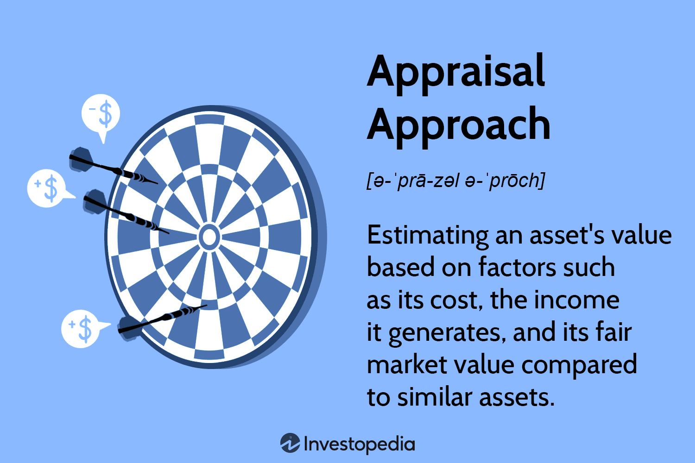

## Table of Contents

## What is an appraisal approach?

An appraisal approach is a method used to figure out the value of something, like a house or a piece of jewelry. It's important because it helps people know how much their things are worth, especially when they want to sell them, buy insurance, or get a loan. There are different ways to do an appraisal, but they all aim to give a fair and accurate price.

One common appraisal approach is the market comparison method. This involves looking at similar items that have been sold recently and using those prices to estimate the value of the item being appraised. For example, if you want to know the value of your house, an appraiser might look at the sale prices of similar houses in your neighborhood. This method is useful because it reflects what people are actually willing to pay in the current market.

Another approach is the cost method, which calculates the value based on how much it would cost to replace the item or build it from scratch. This is often used for unique items or new buildings. For instance, if you have a custom-made piece of furniture, an appraiser might figure out its value by adding up the costs of the materials and labor needed to make it again. Each appraisal approach has its own strengths and is chosen based on what's being valued and why.

## What are the different types of appraisal approaches?

There are several types of appraisal approaches, and each one helps to find out how much something is worth in different ways. The first one is the market comparison approach. This method looks at the prices of similar items that have been sold recently. For example, if you want to know how much your house is worth, an appraiser might check the prices of other houses in your neighborhood that are similar to yours. This way, the value is based on what people are actually paying in the market.

Another type is the cost approach. This method figures out the value by calculating how much it would cost to replace the item or build it new. It's often used for unique items or new buildings. For instance, if you have a special piece of jewelry, an appraiser might add up the costs of the materials and the work needed to make it again. This helps to understand the value based on what it would take to create the item from scratch.

The third type is the income approach, which is mostly used for properties that make money, like rental buildings or businesses. This method looks at how much money the property can bring in over time. For example, if you own an apartment building, an appraiser might look at the rent you collect and use that to estimate the building's value. This approach focuses on the future income the property can generate, which is helpful for investors.

## How does the cost approach work in appraisals?

The cost approach in appraisals works by figuring out how much it would cost to replace something new or build it from scratch. It's like asking, "If this thing didn't exist, how much would it cost to make it right now?" For example, if you have a house, an appraiser would calculate the cost of the land and then add the cost of building the house all over again, using today's prices for materials and labor. This approach is really useful for new buildings or unique items that don't have a lot of similar things to compare them to.

After figuring out the replacement cost, the appraiser then looks at how much the item has worn out or gotten old. This is called depreciation. If your house is 10 years old, it might not be worth as much as a brand new house because it's not in perfect condition anymore. The appraiser subtracts this depreciation from the replacement cost to get the final value. So, the cost approach gives you a value that's based on what it would take to create the item new, minus how much it has worn down over time.

## What is the sales comparison approach and how is it used?

The sales comparison approach is a way to figure out how much something is worth by looking at what similar things have sold for recently. Imagine you want to know the value of your house. An appraiser would find other houses in your neighborhood that are a lot like yours—same size, same number of rooms, and built around the same time. Then, they look at the prices those houses sold for and use that information to guess how much your house might be worth.

This method is really helpful because it shows what people are actually willing to pay for things that are similar to what you're trying to value. It's like checking the price tags on other items in a store to see what yours might cost. Appraisers make adjustments if the houses they compare aren't exactly the same as yours. For example, if your house has a swimming pool and the others don't, they might add a bit to the value to account for that. This way, the sales comparison approach gives a fair and realistic estimate based on real market prices.

## Can you explain the income approach to appraisal?

The income approach to appraisal is a way to figure out how much something is worth by looking at the money it can make. This method is mostly used for things like rental buildings or businesses that bring in money over time. Imagine you own an apartment building. An appraiser would look at how much rent you get from the tenants every month and then use that to guess how much the whole building is worth. They do this by figuring out the total income the property can make in the future and then deciding what that income is worth right now.

To use the income approach, appraisers first add up all the money the property makes, like rent or business profits. Then, they take away the costs of running the property, like repairs or taxes. What's left is called the net income. After that, they use something called a capitalization rate, which is like a percentage that shows how much return someone would expect from investing in the property. By dividing the net income by this rate, they can find out the value of the property. This approach is really helpful for investors because it shows them how much money they might make from owning the property.

## What factors influence the choice of appraisal approach?

The choice of appraisal approach depends on what you're trying to value and why you need to know its worth. If you're looking at a house and want to know how much it might sell for, the sales comparison approach is a good choice. This method looks at what similar houses in the area have sold for recently, which gives a good idea of what buyers are willing to pay. It's useful when there are lots of similar properties to compare. On the other hand, if you're dealing with a unique item, like a custom piece of jewelry, the cost approach might be better. This method figures out the value by calculating how much it would cost to make the item new, which is helpful when there aren't many similar items to compare.

Another [factor](/wiki/factor-investing) that influences the choice of appraisal approach is the purpose of the appraisal. If you're trying to get a loan using your property as collateral, lenders often prefer the cost approach because it shows what it would cost to replace the property if it were destroyed. But if you're an investor looking at a rental property, the income approach is more useful. This method looks at how much money the property can make over time, which is important for figuring out if it's a good investment. Each approach has its strengths, and the best one to use depends on what you need the appraisal for and what kind of property or item you're valuing.

## How do appraisers determine the highest and best use of a property?

Appraisers figure out the highest and best use of a property by thinking about what would make the most money from it. They look at what the property is used for now and then think about other ways it could be used. They consider things like what's allowed by the local laws, if there's a need for that use in the area, and if it would be possible to actually do it. For example, if a piece of land is currently a parking lot but could be turned into a shopping center, the appraiser would check if building a shopping center is allowed, if people would shop there, and if it's possible to build it.

After thinking about all these things, the appraiser picks the use that would be the most profitable and practical. This doesn't always mean changing what the property is used for right now. Sometimes, the best use might be to keep doing what it's doing, especially if changing it would cost a lot of money or not make much more money. The highest and best use helps set the value of the property because it shows what it could be worth if used in the best way possible.

## What role do market conditions play in the appraisal process?

Market conditions are really important when appraisers figure out how much something is worth. They look at things like how many people want to buy or rent in the area, what other similar things are selling for, and if the economy is doing well or not. If lots of people want to buy houses in a neighborhood, the value of houses there might go up because there's more demand. On the other hand, if the economy is bad and fewer people are buying, the value might go down. Appraisers use this information to make sure their estimates are fair and match what's happening in the real world.

These market conditions can also change how appraisers choose their approach. For example, if there are a lot of similar properties being sold, the sales comparison approach works well because it uses those recent sales to find a value. But if the market is slow and there aren't many sales, appraisers might use the cost approach instead, figuring out how much it would cost to build the property new. Understanding market conditions helps appraisers give a good and accurate value that reflects what's going on around the property.

## How are depreciation and obsolescence considered in property appraisals?

In property appraisals, depreciation is about figuring out how much a property has lost value over time because it's gotten older or worn out. Appraisers look at things like the age of the building, how well it's been taken care of, and any damage it might have. They subtract this depreciation from the cost of building the property new to find out what it's worth now. For example, if a house is 20 years old, it might not be worth as much as a brand new one because it's not in perfect condition anymore.

Obsolescence is another factor that can lower a property's value. It happens when something about the property is out of date or not useful anymore. There are two kinds: functional obsolescence, which is about the design or features of the property itself, and economic obsolescence, which comes from things outside the property, like changes in the neighborhood or the economy. If a house has an old-fashioned layout that people don't want anymore, or if a new highway makes the area less quiet, these things can make the property less valuable. Appraisers take both depreciation and obsolescence into account to make sure their valuation is accurate and reflects the real condition and usefulness of the property.

## What advanced techniques are used in the appraisal of unique or complex properties?

When appraising unique or complex properties, appraisers often use advanced techniques to get a fair value. One technique is called the discounted cash flow analysis, which is used a lot for commercial properties or businesses. This method looks at all the money the property might make in the future and figures out what that money is worth right now. Appraisers do this by using a discount rate, which is like a percentage that shows how much risk there is in the investment. This way, they can see if the property is a good investment based on how much money it will bring in over time.

Another advanced technique is the use of computer models and simulations. These can help appraisers understand how different things might affect the value of a property. For example, they might use a model to see how changes in the economy or new developments in the area could change the property's worth. This is really helpful for complex properties because it lets appraisers look at many different situations and come up with a value that's as accurate as possible. By using these advanced techniques, appraisers can make sure they're giving a good estimate, even for properties that are hard to value.

## How do appraisers handle the valuation of intangible assets?

Appraisers handle the valuation of intangible assets by looking at things that can't be touched but still have value, like patents, trademarks, or brand names. They use methods that focus on what these assets can do for a business, like bringing in money or saving costs. One common way is the income approach, where appraisers figure out how much money the intangible asset can make over time. For example, if a company owns a patent that lets them sell a special product, the appraiser would look at how much profit that product makes and use that to find out the patent's value.

Another method is the market approach, where appraisers look at what similar intangible assets have sold for in the past. If a company wants to know the value of its brand, they might see what other companies paid for similar brands. This helps give a fair price based on what people are willing to pay. Sometimes, appraisers also use the cost approach, which looks at how much it would cost to create the intangible asset from scratch. For example, if a company has a unique software program, the appraiser might add up the costs of developing it again to find its value. Each method helps appraisers come up with a good estimate for intangible assets, even though they're not physical things.

## What are the current trends and future directions in appraisal methodologies?

Current trends in appraisal methodologies are focusing more on using technology to make appraisals faster and more accurate. One big trend is the use of data analytics and [artificial intelligence](/wiki/ai-artificial-intelligence). Appraisers are using big data to look at lots of information about properties and markets, which helps them make better guesses about values. They're also using AI to help with things like figuring out how much a property has worn out over time or what it might be worth in the future. Another trend is the use of drones and 3D imaging to check out properties without having to go there in person. This is really helpful for appraising big or hard-to-reach places, and it saves time and money.

Looking to the future, appraisal methodologies will likely keep changing as technology gets better. One direction might be more use of blockchain and smart contracts, which could make appraisals more transparent and easier to trust. Blockchain could keep a clear record of all the data used in an appraisal, so everyone can see how the value was figured out. Another future direction could be more personalized appraisals, where appraisers use data to come up with values that are just right for each specific property. As technology keeps growing, appraisers will have more tools to do their job well, making sure they give fair and accurate values for all kinds of properties.

## What is the understanding of valuation in finance?

Valuation is a fundamental process in finance, encompassing the assessment of the economic value of a company or asset. It is pivotal for guiding various financial activities such as reporting, mergers, acquisitions, and strategic planning. The primary aim is to arrive at an estimation that reflects the intrinsic value of an entity or asset, which serves as a benchmark for investors, managers, and regulators.

Different methodologies in valuation provide diverse perspectives, with each approach tailored to specific requirements and contexts. The most common valuation techniques include Discounted Cash Flow (DCF) analysis, Comparable Company Analysis (CCA), and Precedent Transactions Analysis. 

1. **Discounted Cash Flow (DCF) Analysis**: This method estimates the value of an investment based on its expected future cash flows. By discounting these cash flows to their present value using an appropriate discount rate, the DCF method provides an intrinsic value estimate. The formula is given by:
$$
   \text{DCF} = \sum_{t=1}^{n} \frac{CF_t}{(1 + r)^t}

$$

   where $CF_t$ represents the cash flow in year $t$, $r$ is the discount rate, and $n$ is the number of periods.

2. **Comparable Company Analysis (CCA)**: This approach involves evaluating valuation metrics of similar companies in the industry. Key metrics such as Price-to-Earnings (P/E) ratio, Enterprise Value-to-EBITDA, and others provide a relative value indication. Analysts use these multiples to derive an estimate for the target company.

3. **Precedent Transactions Analysis**: This method looks at historical transactions of similar companies in the same industry. It helps determine valuation benchmarks based on what investors have historically paid for comparable assets under similar market conditions.

Valuation forms the backbone of financial decision-making, deeply influencing the structuring and negotiation of mergers and acquisitions. Accurate valuations can drive optimal pricing strategies, enhance investment decisions, and ensure regulatory compliance. The challenge lies in choosing the most suitable methodology and accurately projecting the inputs required for these analyses. 

Therefore, professionals need to combine analytical rigor with an understanding of market dynamics to ensure valuation outcomes that are reflective of true economic value. This requires ongoing refinement of techniques and assumptions to adapt to ever-changing financial landscapes.

## What are the appraisal methods used in valuation?

Appraisal is a crucial technique in determining the value of various assets, especially in contexts like real estate, art, and alternative investments. Understanding the different approaches to appraisal can provide more accurate and detailed insights into asset valuation, catering to the specificity of asset types and valuation objectives.

There are three primary approaches to real estate appraisal:

1. **Sales Comparison Approach**: This method estimates the value of a property by comparing it with similar properties that have recently been sold. The underlying principle is the idea of substitutability; that is, an informed buyer will not pay more for a property than the cost of acquiring a similar one. Adjustments are made to account for differences between the properties, such as location, size, and age. This method is most effective in active markets with numerous comparable sales and is widely used due to its grounded logic in market data.

2. **Cost Approach**: This appraisal method is based on the cost to replace or reproduce the property, minus depreciation. It is particularly useful for new properties or in situations where the subject property has unique characteristics that are not easily compared in the market. The formula used in the cost approach can be expressed as:
$$
   \text{Value} = \text{Cost of Reproduction or Replacement} - \text{Depreciation} + \text{Land Value}

$$
   Here, depreciation accounts for physical wear and tear, functional obsolescence, and external factors affecting property value.

3. **Income Approach**: Often used for income-generating properties, this method calculates value based on the present value of future cash flows the property is expected to generate. Two common techniques under this approach include the Direct Capitalization Method and the Discounted Cash Flow (DCF) Method. The direct capitalization can be expressed as:
$$
   \text{Value} = \frac{\text{Net Operating Income (NOI)}}{\text{Capitalization Rate}}

$$
   whereas in DCF, expected future cash flows are discounted back to their present value using a discount rate. This method is particularly applicable for commercial real estate and investments where income potential is the primary valuation driver.

Each of these methods brings distinct advantages and limitations. The sales comparison approach provides a market-based perspective, the cost approach focuses on inherent property characteristics, and the income approach correlates directly with financial performance. Together, these methods enable appraisers to tailor their valuation to the specific context and purpose of the assessment, ensuring a comprehensive understanding of an asset's worth.

## What is Algorithmic Trading: An Overview and its Importance?

Algorithmic trading, often referred to as algo trading, is the use of computers to implement trading strategies based on a set of predefined rules. These complex algorithms are designed to execute trades with speed and precision, leveraging vast amounts of market data to identify opportunities that might otherwise be invisible to human traders.

The primary advantage of [algorithmic trading](/wiki/algorithmic-trading) lies in its ability to process large volumes of data efficiently. By utilizing computational models, algo trading systems can quickly analyze market conditions and execute trades within milliseconds. This rapid processing capability allows traders to capitalize on fleeting market opportunities that could be missed by manual trading efforts.

In addition to speed, algorithmic trading significantly enhances trade accuracy. Human traders are susceptible to emotional biases, which can lead to irrational decision-making and inconsistent results. Algo trading systems, on the other hand, operate devoid of emotions, following the logic outlined in their programming. This characteristic minimizes human bias and increases the reliability of trade executions.

Algorithmic trading strategies encompass a wide range of approaches, including statistical [arbitrage](/wiki/arbitrage), market-making, and trend-following. Each strategy relies on specific signals derived from quantitative models. For instance, pairs trading indicates potential arbitrage opportunities by observing the price correlation between two related assets. When these assets deviate from their historical correlation, the algorithm identifies this as a trading signal.

The formulaic nature of algorithmic trading can be represented mathematically. For example, a simple model might employ moving averages to determine the best time to buy or sell a security. The basic moving average crossover strategy is defined by:

$$
\text{Signal} = \begin{cases} 
\text{Buy,} & \text{if } \text{Short-term MA crosses above Long-term MA} \\
\text{Sell,} & \text{if } \text{Short-term MA crosses below Long-term MA} 
\end{cases}
$$

Within a Python environment, a simplified snippet for a moving average crossover strategy might look like this:

```python
import numpy as np

def moving_average_crossover(prices, short_window, long_window):
    signals = np.zeros(len(prices))
    short_ma = prices.rolling(window=short_window, min_periods=1).mean()
    long_ma = prices.rolling(window=long_window, min_periods=1).mean()

    signals[short_ma > long_ma] = 1  # Buy signal
    signals[short_ma < long_ma] = -1 # Sell signal
    return signals

# Example usage
# Assuming `prices` is a Pandas Series object with closing prices
signals = moving_average_crossover(prices, short_window=50, long_window=200)
```

Algorithmic trading is indispensable in modern financial markets, providing significant benefits through improved efficiency and precision. As technology continues to advance, the sophistication of these algorithms will evolve, further solidifying their role in shaping trading landscapes across the industry.

## What are the valuation techniques used in algo trading?

Valuation techniques are crucial in shaping the efficiency and effectiveness of algorithmic trading strategies. These techniques provide a qualitative and quantitative foundation that enhances decision-making processes within trading algorithms. Two prevalent models that enrich the precision of trade execution are the Discounted Cash Flow (DCF) model and the Earnings Multiplier model.

The Discounted Cash Flow (DCF) model is a widely used valuation method that estimates an asset's value based on its expected future cash flows. The principle behind DCF is to evaluate the present value of future earnings by applying a discount rate. The DCF formula is expressed as:

$$

DCF = \sum_{t=1}^{n} \frac{CF_{t}}{(1 + r)^{t}} 
$$

where $CF_{t}$ represents the cash flow at time $t$, $r$ is the discount rate, and $n$ is the number of time periods. This model is highly effective in algorithmic trading as it allows algorithms to process potential asset values quickly and dynamically adjust trading strategies amid fluctuating market conditions.

The Earnings Multiplier model, another critical valuation technique, evaluates an asset based on its current or projected earnings, utilizing a price-to-earnings (P/E) ratio to derive value estimates. The formula is straightforward:

$$

Value = Earnings \times P/E \, Ratio 
$$

In algorithmic trading, integrating the Earnings Multiplier model enables trading algorithms to assess the relative value of stocks efficiently, identifying overvalued or undervalued assets compared to market norms.

Both DCF and Earnings Multiplier models offer comprehensive insights for algorithmic trading. By keeping track of these foundational metrics, algorithms can be programmed to execute trades with precision, optimizing outcomes by strategically considering both short-term and long-term market conditions. Additionally, these valuation techniques feed into [machine learning](/wiki/machine-learning) models, allowing algorithms to refine their predictions over time based on historical and real-time data.

Python, a popular programming language for developing trading algorithms, can be employed to implement these valuation techniques effectively. Below is a simple example of how a DCF model might be programmed in Python:

```python
def calculate_dcf(cash_flows, discount_rate):
    dcf_value = 0
    for t, cash_flow in enumerate(cash_flows, start=1):
        dcf_value += cash_flow / ((1 + discount_rate) ** t)
    return dcf_value

# Example usage
future_cash_flows = [1000, 1500, 2000]  # Projected cash flows of a stock
discount_rate = 0.08  # 8% discount rate
present_value = calculate_dcf(future_cash_flows, discount_rate)
```

Through these models and their integration into algorithmic trading platforms, traders can optimize strategic decisions, aligning them closely with comprehensive valuation insights. This not only enhances trade execution precision but also aids in building resilient and adaptable trading strategies.

## References & Further Reading

For those interested in expanding their understanding of financial analysis, valuation methods, and algorithmic trading strategies, a diverse array of resources is available. Starting with financial analysis, [books](/wiki/algo-trading-books) such as "Financial Statement Analysis" by K. R. Subramanyam and John J. Wild provide a foundational understanding of how to assess financial health and performance. Additionally, "Valuation: Measuring and Managing the Value of Companies" by McKinsey & Company, offers in-depth insights into the valuation of businesses, including various methodologies and real-world applications.

For a more applied perspective on valuation methods, "Investment Valuation: Tools and Techniques for Determining the Value of Any Asset" by Aswath Damodaran is a comprehensive resource that encompasses both theory and practice. It covers a range of methods like Discounted Cash Flow (DCF) and Relative Valuation, with formulas and case studies that enhance practical understanding.

Algorithmic trading is another domain rich with learning opportunities. "Algorithmic Trading: Winning Strategies and Their Rationale" by Ernest P. Chan is a highly recommended book that guides readers through constructing and analyzing trading algorithms. This book is particularly suitable for those with a basic understanding of trading who wish to apply quantitative and automated strategies. Additionally, "Python for Finance: Analyze Big Financial Data" by Yves Hilpisch illustrates how to leverage Python to manipulate financial data and develop trading strategies, complete with code examples and practical applications.

Engaging with industry experts through webinars and workshops can sharpen practical expertise and provide advanced insights. Platforms such as Coursera, Udemy, and edX offer online courses led by professionals experienced in financial markets and algorithmic trading. These courses often include video lectures, practical exercises, and real-time interaction with instructors, which can significantly enrich learning experiences. For hands-on learning, attending workshops or seminars by professional financial associations or at conferences is highly beneficial. These events provide networking opportunities and exposure to the latest industry trends and innovations, facilitating a deeper understanding of complex financial concepts.

By exploring these resources and actively engaging with educational opportunities, individuals can significantly enhance their knowledge and skillset in financial analysis, valuation, and algorithmic trading.

