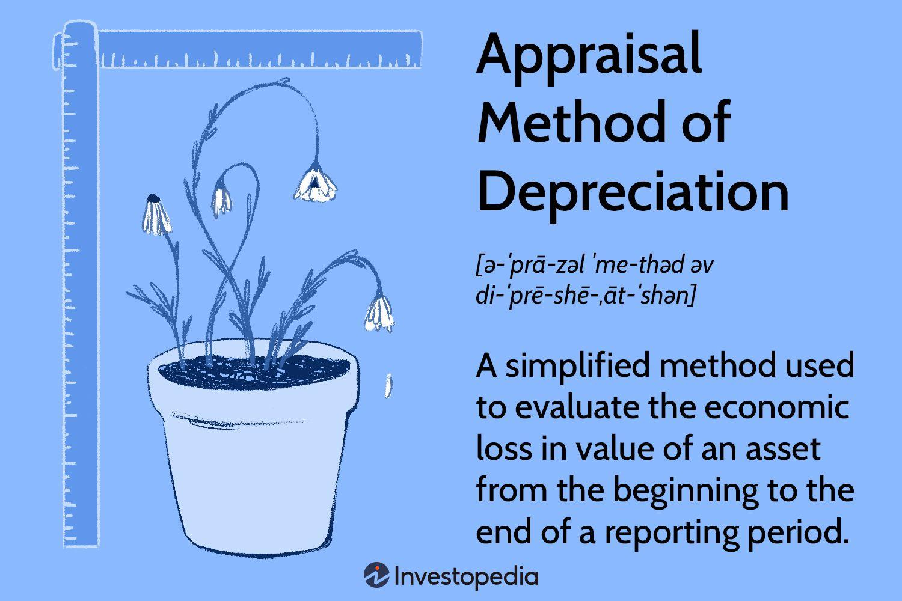

## Table of Contents

## What is the Appraisal Depreciation Method?

The Appraisal Depreciation Method is a way to figure out how much a property is worth by looking at how much it has worn out or become outdated over time. It starts with finding out how much it would cost to replace the property today, and then takes away the value lost due to age, wear and tear, and other factors that make it less valuable. This method is often used for buildings and other structures that can't be moved.

To use this method, an appraiser first estimates the cost to build the same property new, using current prices for materials and labor. Then, they look at the property's age and condition to figure out how much value it has lost. This includes thinking about physical wear and tear, like a roof that needs replacing, and also things like outdated design or technology. The final value is the replacement cost minus the total depreciation, giving a good idea of what the property is worth now.

## How does the Appraisal Depreciation Method differ from other depreciation methods?

The Appraisal Depreciation Method is different from other depreciation methods because it focuses on figuring out a property's current value by looking at how much it has worn out or become outdated. Other methods, like the Straight-Line Depreciation Method, spread out the cost of an asset evenly over its useful life. For example, if a machine costs $10,000 and is expected to last 10 years, you would subtract $1,000 from its value each year. The Appraisal Depreciation Method, on the other hand, might show that the machine loses value faster in the beginning because it gets used a lot, or slower if it's well taken care of.

Another common method is the Declining Balance Depreciation Method, which also spreads out the cost but does it faster in the early years. This method applies a fixed rate to the declining book value of the asset each year. For instance, using a double declining balance method, you might depreciate the machine at 20% of its remaining value each year. Unlike these methods, the Appraisal Depreciation Method doesn't use a fixed schedule. Instead, it relies on the appraiser's judgment to assess the actual condition and market value of the property at any given time, making it more flexible but also more subjective.

## What are the key components involved in calculating depreciation using this method?

The first key component in calculating depreciation using the Appraisal Depreciation Method is figuring out the replacement cost. This means finding out how much it would cost to build the same property new, using today's prices for materials and labor. This gives you a starting point for the property's value before any depreciation is taken into account.

The second key component is assessing the depreciation itself. This involves looking at the property's age, condition, and any other factors that might make it less valuable over time. Depreciation can be broken down into physical wear and tear, like a roof that needs replacing, and functional obsolescence, like outdated design or technology. The appraiser adds up all these factors to come up with a total amount of depreciation, which is then subtracted from the replacement cost to find the property's current value.

In summary, the Appraisal Depreciation Method combines the replacement cost with a detailed assessment of depreciation to give a realistic picture of a property's current worth. This method is more flexible than other depreciation methods because it relies on the appraiser's judgment and can account for the unique conditions of each property.

## Can you explain the process of applying the Appraisal Depreciation Method step-by-step?

To apply the Appraisal Depreciation Method, you start by figuring out the replacement cost of the property. This means you need to find out how much it would cost to build the same property from scratch using today's prices for materials and labor. This gives you a starting point for the property's value before any depreciation is considered. Imagine you're building a new house that's exactly the same as the one you're appraising. How much would it cost to do that right now?

Next, you assess the depreciation of the property. This involves looking at the property's age, its condition, and any other factors that might make it less valuable over time. You need to consider physical wear and tear, like a roof that needs replacing, and also think about functional obsolescence, such as outdated design or technology. You add up all these factors to come up with a total amount of depreciation. Once you have that, you subtract the total depreciation from the replacement cost to find out the property's current value. So, if the replacement cost is $200,000 and the depreciation is $50,000, the current value of the property would be $150,000.

## What types of assets are typically appraised using this method?

The Appraisal Depreciation Method is often used to figure out the value of buildings and other structures that can't be moved. This includes houses, apartment buildings, office buildings, and factories. These types of properties can lose value over time because of things like wear and tear, outdated designs, or changes in the neighborhood. By using this method, an appraiser can get a good idea of what these properties are worth right now, not just what they cost when they were new.

This method is also used for big pieces of equipment that are attached to buildings, like elevators, heating systems, or air conditioning units. These items can wear out or become outdated, which makes them less valuable. The Appraisal Depreciation Method helps appraisers figure out how much these items are worth today, taking into account their age and condition. This way, the value of the whole property can be more accurately assessed.

## How does the condition and age of an asset affect its depreciation under this method?

The condition and age of an asset play a big role in how much it depreciates using the Appraisal Depreciation Method. When an appraiser looks at a property, they check how old it is and how well it's been taken care of. If a house is old and needs a lot of repairs, like a leaky roof or broken windows, it will lose more value because of physical wear and tear. On the other hand, if a building is new and in good shape, it won't lose as much value right away.

Besides physical condition, the age of an asset can also make it less valuable if it has outdated features. For example, an old factory might have old machinery that's not as efficient as newer models, which makes the whole property less valuable. The appraiser takes all these factors into account to figure out how much the asset has depreciated. By doing this, they can give a fair estimate of what the property is worth today, considering both its age and how well it's been maintained.

## What are the advantages of using the Appraisal Depreciation Method over other methods?

The Appraisal Depreciation Method has some big advantages over other ways of figuring out how much a property is worth. One big plus is that it looks at the actual condition of the property right now. This means it can give a more accurate value because it takes into account things like wear and tear or outdated features. Other methods, like the Straight-Line Depreciation Method, just spread out the cost evenly over time, which might not show the real value if the property gets old or damaged faster than expected.

Another advantage is that the Appraisal Depreciation Method is flexible. It lets the appraiser use their judgment to figure out how much the property has lost in value. This is different from methods like the Declining Balance Depreciation Method, which use a fixed rate to calculate depreciation. With the Appraisal Depreciation Method, the appraiser can look at the unique situation of each property, making the valuation more tailored and realistic. This can be really helpful for properties that have special features or have been affected by things like changes in the neighborhood.

## Are there any specific industries where the Appraisal Depreciation Method is more commonly used?

The Appraisal Depreciation Method is often used in the real estate industry. This is because it helps figure out the current value of buildings like houses, apartments, offices, and factories. These types of properties can lose value over time due to things like wear and tear or outdated designs. By using this method, real estate appraisers can give a more accurate estimate of what these properties are worth right now, not just what they cost when they were new.

This method is also commonly used in the construction industry. Big pieces of equipment that are attached to buildings, like elevators or heating systems, can wear out or become outdated. The Appraisal Depreciation Method helps appraisers figure out how much these items are worth today, taking into account their age and condition. This way, the overall value of the property can be more accurately assessed, which is important for construction companies managing their assets.

## How does one determine the useful life of an asset when using the Appraisal Depreciation Method?

When using the Appraisal Depreciation Method, figuring out the useful life of an asset is important because it helps you understand how much the asset will lose value over time. The useful life is how long the asset is expected to last before it needs to be replaced or becomes too outdated to use. To determine this, an appraiser looks at the type of asset, how it's been used, and how well it's been taken care of. For example, a house might have a useful life of 50 years if it's well-maintained, but if it's not taken care of, that could be shorter.

The appraiser also considers industry standards and data from similar properties to estimate the useful life. They might look at how long similar buildings or equipment have lasted in the past. This helps them make a more accurate guess about how long the asset will be useful. By understanding the useful life, the appraiser can better calculate the depreciation and come up with a fair value for the asset today.

## What are the potential challenges or limitations one might face when applying this method?

One challenge with the Appraisal Depreciation Method is that it can be pretty subjective. Since it relies on the appraiser's judgment to figure out how much an asset has worn out or become outdated, different appraisers might come up with different values for the same property. This can make it hard to get a consistent estimate of what the property is worth. Also, gathering all the information needed to assess the condition and age of an asset can take a lot of time and effort, which might make the process more expensive.

Another limitation is that this method might not work well for assets that don't lose value in a predictable way. For example, if a building is in a neighborhood that's getting better, its value might actually go up over time, even if it's getting older. The Appraisal Depreciation Method might not account for these kinds of changes in the market. It's also not the best choice for assets that are easy to move or replace, like furniture or small equipment, because it's designed more for big, fixed structures like buildings.

## How can the accuracy of depreciation estimates be improved when using the Appraisal Depreciation Method?

To make depreciation estimates more accurate with the Appraisal Depreciation Method, it's important to gather as much detailed information as possible about the property. This means looking closely at the building's age, condition, and any repairs or updates that have been done. Appraisers should also use data from similar properties to help them understand how much value the asset might have lost over time. By talking to experts in the field and using up-to-date industry standards, appraisers can make better guesses about how long the asset will last and how much it has worn out.

Another way to improve accuracy is to reduce how much the appraiser's personal judgment affects the estimate. This can be done by using clear guidelines and checklists to make sure all important factors are considered in the same way every time. Appraisers can also use technology, like special software or databases, to help them keep track of all the information and make calculations more precise. By doing these things, the Appraisal Depreciation Method can give a more reliable estimate of what the property is worth right now.

## Can you provide a case study or example where the Appraisal Depreciation Method was effectively used?

Imagine a small business owner named Sarah who owns an old factory building. She wants to know how much it's worth now because she's thinking about selling it. Sarah hires an appraiser who uses the Appraisal Depreciation Method to figure out the value. First, the appraiser looks at how much it would cost to build a new factory just like Sarah's today. They find out it would cost $1 million. Then, they check the factory's age and condition. The building is 30 years old and needs some repairs, like fixing the roof and updating the heating system. The appraiser calculates that the total depreciation, including physical wear and tear and outdated features, is $300,000. So, the current value of Sarah's factory, according to the Appraisal Depreciation Method, is $700,000.

In another example, a real estate company is looking to buy an apartment building to add to their portfolio. They need to know its current value to make a smart investment decision. The appraiser they hire uses the Appraisal Depreciation Method. They start by estimating the cost to build a similar apartment building today, which comes out to $5 million. Then, they assess the building's condition. It's 20 years old and has been well-maintained, but some of the apartments have outdated kitchens and bathrooms. After considering these factors, the appraiser calculates the depreciation at $1 million. Therefore, the current value of the apartment building, using the Appraisal Depreciation Method, is $4 million. This helps the real estate company decide if the investment is worth it.

## How was depreciation successfully integrated into trading algorithms according to the case study?

In this case study, we examine how a sophisticated trading model successfully incorporated appraisal depreciation insights to optimize [algorithmic trading](/wiki/algorithmic-trading) strategies. The trading model, developed by a fictitious firm named "Quantum Trades", highlights the integration of real-time depreciation data into its trading algorithms and the resultant effects on trade execution and profit maximization.

### Framework for Integration

Quantum Trades embarked on utilizing appraisal depreciation data to enhance its predictive analytics. The firm focused on high-value, depreciable assets listed on the stock market. The initial step involved deploying the Appraisal Depreciation Model (ADM), which provided periodic reassessments of asset values based on economic factors, market trends, and the asset's usage impact over time. The ADM formula was expressed as:

$$
\text{Depreciated Value} = \text{Initial Appraisal Value} - \left( \frac{\text{Cost of Asset} \times \text{Appraisal Depreciation Rate}}{\text{Years of Economic Use}} \right)
$$

Subsequently, the firm integrated this model with its trading algorithms using Python libraries. The algorithms were designed to adjust parameters such as buying/selling pressure, stop-loss limits, and asset reallocation strategies based on the latest depreciation-adjusted valuations.

A Python snippet used for integrating depreciation insights is as follows:

```python
def adjust_trading_parameters(depreciated_value, market_data):
    buy_signal_strength = market_data['momentum'] * depreciated_value / market_data['current_value']
    sell_threshold = depreciated_value * 0.95  # Set a stop-loss threshold based on depreciated value
    return buy_signal_strength, sell_threshold

depreciated_value = calculate_depreciated_value(initial_value, annual_rate, years)
buy_signal, sell_signal = adjust_trading_parameters(depreciated_value, market_data)
```

### Outcomes

The incorporation of real-time depreciation data led to improved accuracy in predicting asset value changes, thereby enhancing the adaptive capabilities of the trading algorithms. Quantum Trades observed:

- **Enhanced Profit Margins**: By factoring in depreciation data, the firm's algorithms identified undervalued assets, thus increasing profitability by an estimated 12% over six months.
- **Improved Risk Management**: The recognition of asset devaluation trends helped in avoiding investments in rapidly depreciating assets, reducing potential losses by 8%.

### Lessons Learned

Through this integration, several key lessons emerged:

1. **Dynamic Asset Evaluation**: Incorporating appraisal depreciation data requires continuous updating and refinement of assumptions based on current market conditions.
2. **Data Quality and Frequency**: High-quality, frequently updated depreciation assessments are crucial. Any delay or inaccuracy in calculation can lead to suboptimal trading decisions.
3. **Interdisciplinary Approach**: Collaboration between financial analysts, data scientists, and software engineers proved vital in designing and implementing the integrated framework.

### Impact on Trade Execution

The integration optimized trade timing and decision-making, particularly for assets with high [volatility](/wiki/volatility-trading-strategies). Quantum Trades achieved faster execution times due to better-aligned algorithmic predictions with actual asset values. The case study underscores the potential for significant profit maximization by leveraging detailed financial metrics such as depreciation in algorithmic trading.

In conclusion, the successful integration of depreciation insights at Quantum Trades illustrates a valuable advancement in algorithmic trading, emphasizing that traditional financial metrics, such as depreciation, can significantly enhance modern trading strategies.

## References & Further Reading

[1]: Bergstra, J., Bardenet, R., Bengio, Y., & Kégl, B. (2011). ["Algorithms for Hyper-Parameter Optimization."](https://dl.acm.org/doi/10.5555/2986459.2986743) Advances in Neural Information Processing Systems 24.

[2]: ["Advances in Financial Machine Learning"](https://www.amazon.com/Advances-Financial-Machine-Learning-Marcos/dp/1119482089) by Marcos Lopez de Prado

[3]: ["Evidence-Based Technical Analysis: Applying the Scientific Method and Statistical Inference to Trading Signals"](https://www.amazon.com/Evidence-Based-Technical-Analysis-Scientific-Statistical/dp/0470008741) by David Aronson

[4]: ["Machine Learning for Algorithmic Trading"](https://github.com/stefan-jansen/machine-learning-for-trading) by Stefan Jansen

[5]: ["Quantitative Trading: How to Build Your Own Algorithmic Trading Business"](https://www.amazon.com/Quantitative-Trading-Build-Algorithmic-Business/dp/1119800064) by Ernest P. Chan