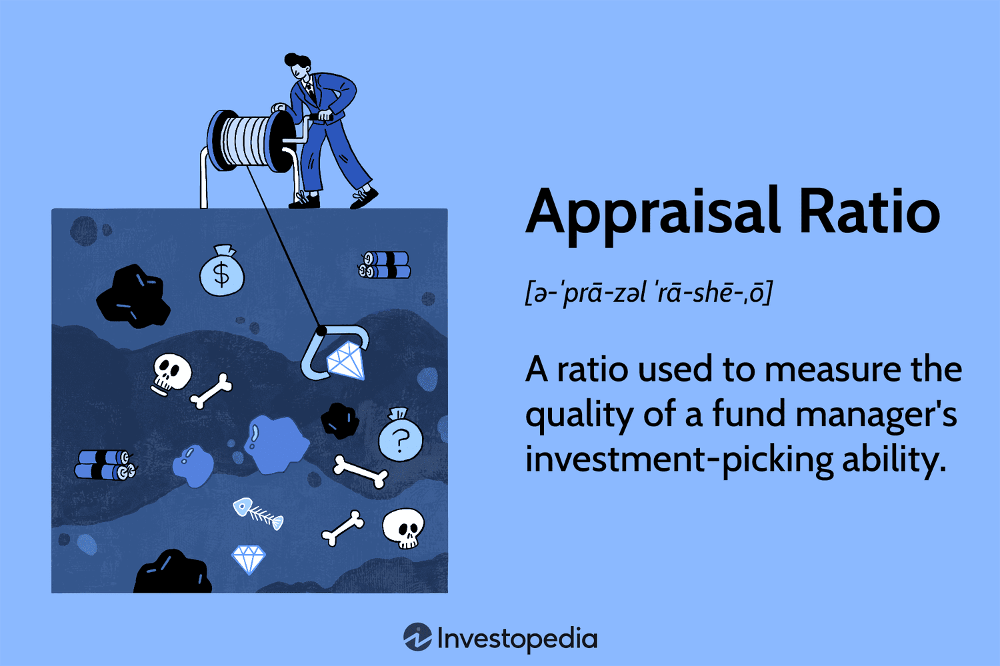

## Table of Contents

## What is an Appraisal Ratio?

An appraisal ratio is a way to measure how well an investment is doing compared to the risk involved. It helps investors see if the extra risk they are taking is worth the extra return they might get. The most common appraisal ratio is the Sharpe Ratio, which looks at the difference between the return of an investment and the risk-free rate, then divides that by the standard deviation of the investment's returns. This tells investors how much extra return they are getting for each unit of risk.

Another important appraisal ratio is the Treynor Ratio, which is similar to the Sharpe Ratio but uses beta instead of standard deviation to measure risk. Beta shows how much an investment's price moves compared to the overall market. The Treynor Ratio helps investors understand how well an investment is doing in relation to market risk. Both ratios are useful tools for investors to make smarter choices about where to put their money, by balancing the potential rewards against the risks.

## Why is the Appraisal Ratio important in finance?

The Appraisal Ratio is important in finance because it helps investors see if the risk they are taking is worth the return they are getting. Imagine you are deciding between two investments. One is safer but gives you less money back, and the other is riskier but could give you more money. The Appraisal Ratio, like the Sharpe Ratio or the Treynor Ratio, helps you figure out which one is a better deal by showing you how much extra return you get for the extra risk.

Using the Appraisal Ratio, investors can make smarter choices about where to put their money. It's like a tool that helps you compare different investments easily. If one investment has a higher Appraisal Ratio, it means you are getting more reward for the risk you are taking compared to another investment. This can guide you to choose investments that fit your comfort with risk and your goals for making money.

## How is the Appraisal Ratio calculated?

The Appraisal Ratio, like the Sharpe Ratio, is calculated by taking the difference between the return of an investment and the risk-free rate, then dividing that difference by the standard deviation of the investment's returns. The risk-free rate is what you could earn from a very safe investment, like a government bond. The standard deviation shows how much the investment's returns go up and down. So, the Sharpe Ratio tells you how much extra return you get for each bit of risk you take.

Another common Appraisal Ratio is the Treynor Ratio. This one is similar but uses beta instead of standard deviation to measure risk. Beta shows how much an investment's price moves compared to the whole market. To calculate the Treynor Ratio, you take the difference between the investment's return and the risk-free rate, then divide that by the investment's beta. This tells you how much extra return you get for the market risk you are taking. Both ratios help investors see if the risk they are taking is worth the reward they might get.

## What are the key components needed to compute the Appraisal Ratio?

To compute the Appraisal Ratio, you need to know three main things: the return of the investment, the risk-free rate, and a measure of risk. The return of the investment is how much money you make from it over a certain time. The risk-free rate is what you could earn from a very safe investment, like a government bond. The measure of risk can be either the standard deviation of the investment's returns or the investment's beta, depending on whether you are using the Sharpe Ratio or the Treynor Ratio.

For the Sharpe Ratio, you use the standard deviation as the measure of risk. Standard deviation tells you how much the investment's returns go up and down. To calculate the Sharpe Ratio, you subtract the risk-free rate from the investment's return and then divide that by the standard deviation. For the Treynor Ratio, you use beta as the measure of risk. Beta shows how much an investment's price moves compared to the whole market. To calculate the Treynor Ratio, you subtract the risk-free rate from the investment's return and then divide that by the beta. Both ratios help you see if the risk you are taking is worth the extra return you might get.

## Can you provide a simple example of calculating the Appraisal Ratio?

Let's say you invested in a stock that gave you a return of 10% over the last year. The risk-free rate, which is what you could earn from a safe government bond, was 2% during that time. To find out if your stock was worth the risk, you can use the Sharpe Ratio. The Sharpe Ratio uses the standard deviation of the stock's returns to measure risk. Let's say the standard deviation of your stock's returns was 15%. To calculate the Sharpe Ratio, you subtract the risk-free rate from your stock's return and then divide by the standard deviation. So, it's (10% - 2%) / 15% = 0.53. This means for every unit of risk you took, you got an extra 0.53% return.

Now, let's look at the Treynor Ratio, which uses beta instead of standard deviation to measure risk. Suppose your stock's beta was 1.2, meaning it moves 20% more than the market. Using the same return and risk-free rate, you subtract the risk-free rate from your stock's return and then divide by the beta. So, it's (10% - 2%) / 1.2 = 6.67. This tells you that for every unit of market risk you took, you got an extra 6.67% return. Both ratios help you see if the risk you took was worth the extra return you got from your investment.

## What does a high Appraisal Ratio indicate about an investment?

A high Appraisal Ratio, like the Sharpe Ratio or the Treynor Ratio, means that an investment is giving you a lot of extra return for the risk you are taking. It's like getting a good deal where you are rewarded more for the risk you are willing to take. If you see a high Sharpe Ratio, it tells you that the investment's return is much better than what you could get from a safe investment, like a government bond, when you consider how much the investment's value goes up and down.

Similarly, a high Treynor Ratio shows that the investment is doing well compared to how it moves with the market. This means you are getting a bigger reward for the market risk you are taking. Both ratios help you understand if an investment is worth the risk, and a high ratio is a good sign that the investment is performing well for the level of risk involved.

## What does a low Appraisal Ratio suggest about an investment's performance?

A low Appraisal Ratio means that an investment is not giving you much extra return for the risk you are taking. It's like getting a bad deal where the reward you get is not worth the risk. If you see a low Sharpe Ratio, it tells you that the investment's return is not much better than what you could get from a safe investment, like a government bond, when you consider how much the investment's value goes up and down.

Similarly, a low Treynor Ratio shows that the investment is not doing well compared to how it moves with the market. This means you are not getting a good reward for the market risk you are taking. Both ratios help you understand if an investment is worth the risk, and a low ratio is a sign that the investment is not performing well for the level of risk involved.

## How does the Appraisal Ratio differ from other financial ratios like the Sharpe Ratio?

The Appraisal Ratio is a broad term that includes different ratios used to measure how well an investment is doing compared to the risk involved. One common type of Appraisal Ratio is the Sharpe Ratio, which looks at the difference between the return of an investment and the risk-free rate, then divides that by the standard deviation of the investment's returns. This tells investors how much extra return they are getting for each unit of risk. So, the Sharpe Ratio is a specific kind of Appraisal Ratio that uses standard deviation to measure risk.

Another type of Appraisal Ratio is the Treynor Ratio, which is similar to the Sharpe Ratio but uses beta instead of standard deviation to measure risk. Beta shows how much an investment's price moves compared to the overall market. The Treynor Ratio helps investors understand how well an investment is doing in relation to market risk. Both the Sharpe Ratio and the Treynor Ratio are types of Appraisal Ratios, but they use different ways to measure risk, making them useful for different kinds of investment analysis.

## What are the common limitations of using the Appraisal Ratio?

One big problem with using the Appraisal Ratio is that it depends a lot on how you measure risk. For example, the Sharpe Ratio uses standard deviation to measure risk, but this might not be the best way to understand all types of risk. Standard deviation looks at how much an investment's returns go up and down, but it doesn't tell you about other risks, like the chance that the investment might lose a lot of money at once. Also, the Appraisal Ratio assumes that returns follow a normal pattern, which is not always true in real life. This can make the ratio less useful if the investment's returns are not normal.

Another issue is that the Appraisal Ratio can be hard to compare across different kinds of investments. For example, the Sharpe Ratio might be good for comparing stocks or funds, but it might not work well for comparing a stock to a bond or a real estate investment. The Treynor Ratio, which uses beta, works best for investments that move with the market, so it might not be the best choice for investments that don't follow the market closely. Because of these limitations, it's important to use the Appraisal Ratio along with other tools to get a full picture of an investment's risk and reward.

## How can the Appraisal Ratio be misinterpreted or misused?

One way the Appraisal Ratio can be misused is by relying on it too much without looking at other important things. For example, the Sharpe Ratio uses standard deviation to measure risk, but this only tells part of the story. It doesn't show other risks, like the chance of losing a lot of money all at once. If someone only looks at the Sharpe Ratio, they might think an investment is safe when it's not. Also, the Appraisal Ratio assumes that returns follow a normal pattern, which isn't always true. If returns are not normal, the ratio might give a wrong idea about how good or bad an investment is.

Another way the Appraisal Ratio can be misinterpreted is by comparing it across different types of investments. The Sharpe Ratio might be good for comparing stocks or funds, but it might not work well for comparing a stock to a bond or a real estate investment. The Treynor Ratio, which uses beta, is best for investments that move with the market, so it might not be the best choice for investments that don't follow the market closely. If someone uses these ratios to compare very different kinds of investments, they might make bad choices because the ratios are not meant for that. It's important to use the Appraisal Ratio along with other tools to get a full picture of an investment's risk and reward.

## What advanced techniques can be used to refine the Appraisal Ratio calculation?

One advanced technique to refine the Appraisal Ratio calculation is to use a more detailed measure of risk instead of just standard deviation or beta. For example, you can use something called Value at Risk (VaR), which looks at the worst loss you might face over a certain time with a certain chance. This can give a better idea of the risk involved, especially for investments that might lose a lot of money at once. Another way is to use Conditional Value at Risk (CVaR), which looks at the average loss if the loss is worse than the VaR. These methods can help you see the risk in a more complete way, making the Appraisal Ratio more useful.

Another technique is to use different time periods to calculate the Appraisal Ratio. Instead of just looking at one year, you can look at different lengths of time, like three months, six months, or even five years. This can help you see how the investment does over different times and in different market conditions. Also, you can use something called rolling windows, where you keep moving the time period you look at. This can give you a better idea of how the investment's risk and return change over time, making the Appraisal Ratio more accurate and helpful for making decisions.

## How does the Appraisal Ratio fit into a comprehensive investment analysis strategy?

The Appraisal Ratio, like the Sharpe Ratio or the Treynor Ratio, is a helpful tool in a big plan for looking at investments. It helps you see if the risk you are taking is worth the extra return you might get. But it's not the only thing you should look at. You need to use it with other tools to get a full picture of an investment. For example, you might also look at things like how much the investment could lose in a bad time, how it fits with your other investments, and what the future might hold for the company or the market.

Using the Appraisal Ratio along with other ways to measure risk and reward can help you make smarter choices about where to put your money. It's like having a map that shows you different paths to take. The Appraisal Ratio is one part of the map, but you need to look at the whole map to decide the best way to go. By combining the Appraisal Ratio with other tools, you can better understand if an investment is a good fit for your goals and how much risk you are okay with taking.

## What is the Appraisal Ratio?

The appraisal ratio is a financial metric used to evaluate the effectiveness of a fund manager's ability to select investments that outperform the market. It is calculated by comparing the alpha of a portfolio to its unsystematic risk. Alpha represents the excess return of an investment relative to a benchmark index or market return. It is often seen as an indicator of a portfolio manager's skill in achieving returns above the standard market performance.

Mathematically, the appraisal ratio is expressed as:

$$
\text{Appraisal Ratio} = \frac{\alpha}{\text{Unsystematic Risk}}
$$

Where:
- $\alpha$ is the portfolio's alpha, representing the active return generated by the manager, beyond a set benchmark.
- Unsystematic Risk is the portion of total risk unique to a specific portfolio, as opposed to systematic risk, which affects the entire market.

This ratio effectively indicates how many units of active return a manager generates for each unit of unsystematic risk undertaken. A higher appraisal ratio suggests that the fund manager is not only producing higher returns but is also doing so efficiently relative to the risk specific to the portfolio, signaling a potentially more skillful management.

In practical investment analysis, a robust appraisal ratio could highlight the fund manager's expertise in stock selection and portfolio construction. However, while a higher ratio generally implies better performance, it is also important to consider other metrics and external factors, such as changes in economic conditions or shifts in market [volatility](/wiki/volatility-trading-strategies), which might impact both alpha and unsystematic risk.

## How do you calculate the appraisal ratio?

The appraisal ratio is calculated by dividing the alpha of a portfolio by its unsystematic risk. This ratio provides insights into how effectively a fund manager has managed to deliver excess returns given their specific investment choices.

### Alpha

Alpha ($\alpha$) is a measure of the excess return of a portfolio compared to a benchmark index. It represents the additional value generated by the fund manager's investment strategies beyond what could be achieved through a passive investment. For instance, an alpha of 1.5 means the portfolio has outperformed its benchmark by 1.5%.

Mathematically, alpha can be expressed as:

$$
\alpha = R_p - (R_f + \beta \times (R_m - R_f))
$$

where:
- $R_p$ is the return of the portfolio,
- $R_f$ is the risk-free rate,
- $\beta$ is the beta of the portfolio, indicating its sensitivity to market movements,
- $R_m$ is the return of the market.

### Unsystematic Risk

Unsystematic risk refers to the variance in returns that is unique to a particular portfolio and not due to overall market movements. Also known as specific risk or idiosyncratic risk, it captures the impact of factors such as company performance anomalies, sector-specific events, and other non-market wide occurrences.

### Calculation Formula

The appraisal ratio ($AR$) is computed using the formula:

$$
AR = \frac{\alpha}{\sigma_{\text{unsystematic}}}
$$

where:
- $\alpha$ is the alpha of the portfolio, as calculated above,
- $\sigma_{\text{unsystematic}}$ is the standard deviation of the unsystematic risk of the portfolio.

By utilizing the appraisal ratio, investors can discern the proficiency of fund managers in achieving excess returns considering their unique risk exposure. This is particularly valuable when assessing active management in portfolios where unsystematic factors play a significant role.

## What is the difference between the Appraisal Ratio and other financial ratios?

The appraisal ratio is a critical measure in evaluating investment performance, particularly when compared to other financial ratios like the Sharpe ratio, Sortino ratio, and Treynor ratio. Each ratio serves a unique purpose in performance measurement, providing different insights into risk-adjusted returns.

The Sharpe ratio is widely used to understand the return generated per unit of total risk, calculated as the difference between the portfolio return and the risk-free rate divided by the portfolio's standard deviation of returns. Mathematically, it is expressed as:

$$
\text{Sharpe Ratio} = \frac{R_p - R_f}{\sigma_p}
$$

where $R_p$ is the portfolio return, $R_f$ is the risk-free return, and $\sigma_p$ is the portfolio's standard deviation.

In contrast, the appraisal ratio focuses specifically on unsystematic risk by comparing a portfolio's alpha, the excess return relative to a benchmark, to its unsystematic risk. This distinction makes the appraisal ratio particularly relevant for assessing a fund manager's security selection ability, as it isolates active management benefit rather than overall volatility exposure.

Furthermore, the Sortino ratio, similar to the Sharpe ratio, emphasizes downside risk. It uses the standard deviation of negative asset returns, known as downside deviation, providing a more nuanced take on return relative to negative risk events:

$$
\text{Sortino Ratio} = \frac{R_p - R_f}{\sigma_D}
$$

where $\sigma_D$ is the downside deviation.

The Treynor ratio considers the systematic risk (beta) as opposed to total volatility, calculating returns per unit of market risk. Defined as:

$$
\text{Treynor Ratio} = \frac{R_p - R_f}{\beta_p}
$$

it evaluates the return generated above the risk-free rate relative to market risk.

In comparing the appraisal ratio with these other metrics, the distinctive focus on unsystematic risk gives it a unique advantage in examining fund manager performance, especially for actively managed portfolios. It allows investors to discern how effectively managers generate alpha relative to the unique risk they undertake, offering a sharper lens on individual asset selection capabilities.

## References & Further Reading

[1]: Bodnar, T., & Schmid, W. (2008). ["A test for the weights in the global minimum variance portfolio"](https://www.scirp.org/reference/referencespapers?referenceid=3609657). Journal of Applied Econometrics, 23(4), 667-694.

[2]: Grinold, R. C., & Kahn, R. N. (1995). ["Active Portfolio Management: A Quantitative Approach for Producing Superior Returns and Controlling Risk"](https://www.amazon.com/Active-Portfolio-Management-Quantitative-Controlling/dp/0070248826). McGraw-Hill.

[3]: Treynor, J. L. (1965). ["How to Rate Management of Investment Funds"](https://onlinelibrary.wiley.com/doi/10.1002/9781119196679.ch10). Harvard Business Review, 43(1), 63-75.

[4]: 
Elton, E. J., Gruber, M. J., Brown, S. J., & Goetzmann, W. N. (2009). ["Modern Portfolio Theory and Investment Analysis"](https://[books](/wiki/algo-trading-books).google.com/books/about/Modern_Portfolio_Theory_and_Investment_A.html?id=181CEAAAQBAJ). John Wiley & Sons.

[5]: Sharpe, W. F. (1966). ["Mutual Fund Performance"](https://www.jstor.org/stable/2351741). Journal of Business, 39(1), 119-138.