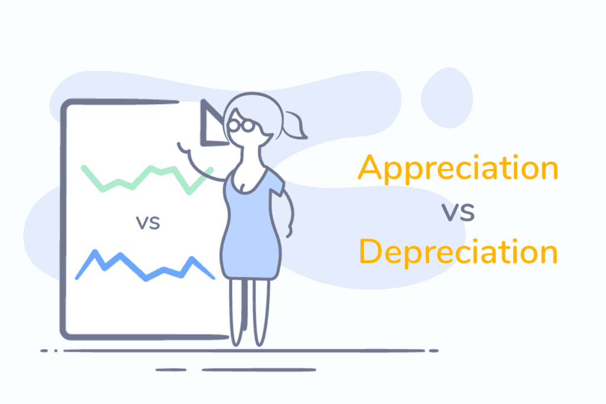

## Table of Contents

## What is appreciation?

Appreciation is when you notice and value something or someone. It's like saying "thank you" or "I like this" because you feel happy or grateful about it. When you appreciate something, you are paying attention to it and showing that it matters to you. This can be about a person, a thing, or even a moment.

Appreciation can make people feel good. When someone knows they are appreciated, they often feel happier and more valued. It can also make relationships stronger. For example, if you tell your friend you appreciate them, they might feel closer to you. Appreciation can also be about enjoying the little things in life, like a beautiful sunset or a tasty meal.

## What is depreciation?

Depreciation is when something loses value over time. It's like when you buy a new toy, and after a while, it's not worth as much as when you first got it. This happens a lot with things like cars, computers, and other stuff that people use every day. The value goes down because the item gets older, gets used a lot, or because new and better versions come out.

In business, depreciation is important because it helps companies figure out how much their stuff is worth and how much they can claim back on taxes. They use different ways to calculate it, like saying the value goes down a little bit each year. This helps them keep track of their money and plan for the future. It's a way to spread out the cost of something over the time they use it.

## Can you give examples of assets that appreciate?

Some things can actually go up in value over time. These are called appreciating assets. One common example is real estate. If you buy a house or a piece of land, it might be worth more money later on. This can happen because more people want to live in that area, or because the neighborhood gets better. People often buy real estate hoping it will appreciate, so they can sell it for more than they paid.

Another example of something that can appreciate is art. Paintings, sculptures, and other artworks can become more valuable as time goes by. This often happens because the artist becomes more famous, or because people start to like their work more. Sometimes, art that wasn't very popular at first can become really valuable years later. That's why some people collect art as an investment.

Stocks can also appreciate. When you buy a stock, you're buying a little piece of a company. If the company does well, the value of the stock can go up. This means you could sell the stock for more money than you paid for it. But stocks can also go down in value, so they can be risky. Still, many people invest in stocks hoping they will appreciate over time.

## Can you give examples of assets that depreciate?

Cars are a good example of something that depreciates. When you buy a new car, it starts losing value right away. As soon as you drive it off the lot, it's worth less than what you paid for it. This happens because cars get used a lot, they can get damaged, and new models come out every year. People usually expect to pay less for a used car than a new one, so the value of your car goes down over time.

Another example of a depreciating asset is electronics, like computers and smartphones. When you buy a new laptop or phone, it's worth a lot. But after a few years, it's not worth as much. This is because technology changes fast, and new models with better features come out all the time. Also, electronics can break or become outdated, so people don't want to pay as much for them after a while.

Machinery and equipment used in businesses also depreciate. For example, a factory might buy a new machine to make things. Over time, the machine gets older and wears out, so it's not worth as much as when it was new. Companies have to think about this when they buy new equipment, because they know it will lose value over time.

## How does inflation affect appreciation and depreciation?

Inflation is when the prices of things go up over time. This can affect how much things are worth, like when we talk about appreciation and depreciation. If you have something that appreciates, like a house, inflation can make it seem like it's going up in value even more. That's because the money you could get for selling your house would be worth more in a world where everything costs more. But, if inflation is really high, it might not feel like your house is worth as much because the money you get for it won't buy as many things as before.

On the other hand, inflation can make depreciation seem worse. If you have something that loses value over time, like a car, inflation means the money you could get for selling it won't go as far. For example, if you bought a car for $20,000 and it's now worth $15,000, that $15,000 might not buy as much as it used to because of inflation. So, even though the car's value went down by $5,000, the real loss might feel bigger because everything else costs more too.

## What are the methods used to calculate depreciation?

There are a few main ways to figure out how much something loses value over time. One way is called the straight-line method. This is when you take the cost of the thing and subtract what you think it will be worth at the end, then divide that by how many years you'll use it. For example, if you buy a machine for $10,000 and think it will be worth $2,000 after 4 years, you'd say it loses $2,000 in value each year. This method is easy to understand and use because it's the same amount every year.

Another way is called the declining balance method. This one says that the thing loses more value at the start and less as time goes on. You start with a bigger amount of depreciation and then take a smaller amount each year after that. It's like saying the machine loses 20% of its value each year, but you calculate that 20% on the smaller amount left each time. This can be good for things that wear out faster at first, like some types of equipment.

The last common method is called the units of production method. This one looks at how much you use the thing instead of just time. If you have a machine that makes 100,000 items and you think it will be worth nothing after that, you'd figure out how much it loses in value for each item it makes. So if you make 25,000 items in a year, the machine would lose a quarter of its value that year. This method is good for things where how much you use them matters more than how old they are.

## How can appreciation impact personal wealth?

Appreciation can help people get richer over time. If you buy something that goes up in value, like a house or a piece of art, you can sell it later for more money than you paid for it. This means you make a profit, which adds to your wealth. For example, if you buy a house for $200,000 and it goes up to $250,000, you've made $50,000 just by owning it. This extra money can be used to buy other things, save for the future, or invest in more things that might appreciate.

But, it's not always easy to know which things will go up in value. Sometimes, things you think will appreciate might not, or they might take a long time to do so. It's important to do your homework and think carefully before buying something hoping it will make you richer. Also, it's good to have a mix of different types of investments because not everything will go up at the same time. By spreading out your money, you can help make sure that appreciation helps your wealth grow in a steady way.

## What role does depreciation play in business accounting?

Depreciation is important in business accounting because it helps companies keep track of how much their stuff, like machines or computers, is worth over time. When a company buys something expensive, it doesn't count the whole cost right away. Instead, it spreads out the cost over the years it uses the thing. This is called depreciation. By doing this, the company can show a more accurate picture of its money and how much it's spending each year.

This also helps with taxes. When a company shows depreciation on its taxes, it can lower how much it has to pay. This is because the government lets businesses take some of the cost of their stuff off their taxes each year. So, understanding and using depreciation correctly can save the company money and help it plan better for the future.

## How do economic factors influence appreciation and depreciation rates?

Economic factors can really change how fast things go up or down in value. For example, if the economy is doing well, more people might have money to buy houses. This can make houses go up in value faster because there are more buyers. On the other hand, if the economy is not doing well, people might not want to spend as much money. This can make things like cars and electronics lose value faster because fewer people are buying them.

Another big [factor](/wiki/factor-investing) is interest rates. When interest rates are low, it's cheaper to borrow money to buy things like houses or cars. This can make these things go up in value because more people can afford to buy them. But if interest rates go up, borrowing money gets more expensive, and fewer people might buy big things. This can make these things lose value faster because there's less demand. So, the economy and interest rates can have a big impact on whether things appreciate or depreciate and how fast it happens.

## What are the tax implications of appreciation and depreciation?

When something you own goes up in value, like a house or a stock, that's called appreciation. If you sell it for more than you paid, you might have to pay taxes on the extra money you made. This is called capital gains tax. The tax rate can be different depending on how long you owned the thing before selling it. If you owned it for a long time, the tax might be lower. But if you owned it for a short time, the tax might be higher. So, it's good to think about taxes when you're planning to sell something that has gone up in value.

On the other hand, when something loses value over time, like a car or a machine, that's called depreciation. Businesses can use depreciation to lower their taxes. They can take the cost of the thing and spread it out over the years they use it. This means they can subtract a little bit of the cost from their income each year, which can lower how much tax they have to pay. This is called a tax deduction. So, understanding depreciation can help businesses save money on taxes and plan better for the future.

## How can investors use appreciation and depreciation to their advantage?

Investors can use appreciation to make money by buying things that go up in value over time, like houses or stocks. If they buy a house and it goes up in value, they can sell it later for more money than they paid. This extra money, called a profit, can help them get richer. But, it's important to do research and pick things that are likely to go up in value. Not everything will appreciate, so investors need to be smart and patient. By spreading their money across different types of investments, they can help make sure that some things will go up in value even if others don't.

Depreciation can also be used to an investor's advantage, especially in business. When a company buys something like a machine or a computer, it can spread out the cost over the years it uses it. This is called depreciation, and it can lower the company's taxes. By taking a little bit of the cost off their income each year, the company pays less in taxes. This can save them money and help them plan better for the future. Investors who own parts of these companies can benefit from this because it can make the company more profitable, which can make the value of their investment go up.

## What advanced strategies exist for managing appreciation and depreciation in a portfolio?

Investors can use advanced strategies to manage how their investments go up or down in value. One way is to use something called "tax-loss harvesting." This means selling investments that have gone down in value to get a tax break. By doing this, investors can use the losses to lower their taxes on the money they made from other investments. Another strategy is "rebalancing," where investors change their mix of investments to keep the right balance. If some investments have gone up a lot, they might sell some to buy others that haven't gone up as much. This can help keep the portfolio growing steadily and not too risky.

Another strategy is to use "diversification" across different types of investments. This means not putting all your money in one type of thing, like just stocks or just real estate. By spreading the money around, investors can make sure that if one type of investment goes down in value, others might go up. This can help protect their money and make sure they still make some profit. Also, some investors use "hedging" to protect against big drops in value. They might buy things like options or other financial tools that go up in value if their main investments go down. This can help limit how much money they lose if the market takes a big hit.

## What is the Role of Depreciation in Economics?

Depreciation plays a critical role in economics by influencing asset management and shaping financial strategies, especially concerning physical goods and technological assets. The concept of depreciation refers to the systematic reduction in the recorded cost of an asset over its useful life. This process acknowledges the wearing out or obsolescence of the asset and is crucial for aligning asset valuation with its actual utility and market value over time.

In financial planning and accounting, understanding depreciation is essential. Depreciation methods such as straight-line, double-declining balance, and units of production allow companies to allocate the cost of an asset over its expected life. Here's a basic example using the straight-line method for depreciation:

$$
\text{Depreciation Expense} = \frac{\text{Cost of the Asset} - \text{Salvage Value}}{\text{Useful Life of the Asset}}
$$

By implementing such methods, businesses can ensure accurate financial statements, aiding stakeholders in making informed decisions. Furthermore, depreciation influences taxable income as it is an expense that can reduce the taxable income of a business, thereby impacting its cash flow and overall financial health.

Effective management of depreciation is key to maximizing asset profitability throughout its lifecycle. By accurately estimating an asset’s useful life and its salvage value, organizations can minimize tax liabilities and optimize resource allocation. For instance, in technology sectors, where rapid innovation leads to quicker obsolescence, managing depreciation effectively can significantly impact a company's competitive edge and financial sustainability.

Incorporating depreciation strategies into asset management plans enables businesses to optimize resource usage and investment strategies. This proactive approach ensures that companies can plan for asset replacement, budget prudently, and maintain a balanced financial outlook, ensuring sustained profitability and economic viability.

## References & Further Reading

[1]: Bergstra, J., Bardenet, R., Bengio, Y., & Kégl, B. (2011). ["Algorithms for Hyper-Parameter Optimization."](https://dl.acm.org/doi/10.5555/2986459.2986743) Advances in Neural Information Processing Systems 24.

[2]: ["Advances in Financial Machine Learning"](https://www.amazon.com/Advances-Financial-Machine-Learning-Marcos/dp/1119482089) by Marcos Lopez de Prado

[3]: ["Evidence-Based Technical Analysis: Applying the Scientific Method and Statistical Inference to Trading Signals"](https://www.amazon.com/Evidence-Based-Technical-Analysis-Scientific-Statistical/dp/0470008741) by David Aronson

[4]: ["Machine Learning for Algorithmic Trading"](https://github.com/stefan-jansen/machine-learning-for-trading) by Stefan Jansen

[5]: ["Quantitative Trading: How to Build Your Own Algorithmic Trading Business"](https://github.com/LucindaYa/quant-resources/blob/master/Quantitative%20Trading%20How%20to%20Build%20Your%20Own%20Algorithmic%20Trading%20Business.pdf) by Ernest P. Chan